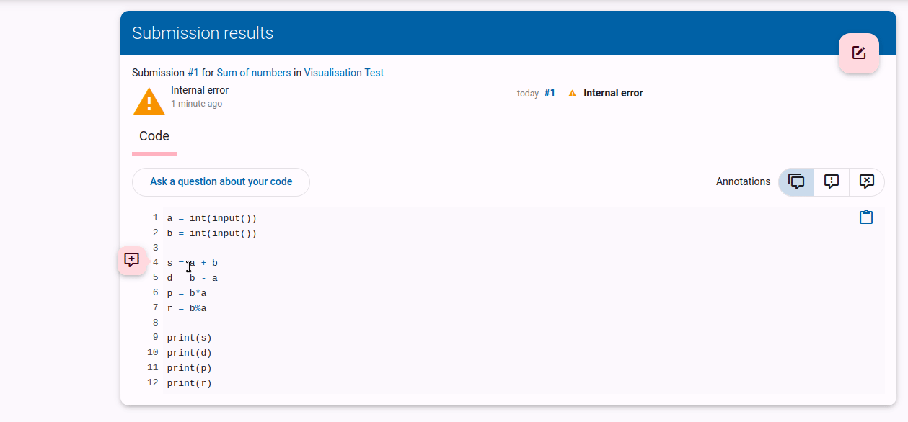
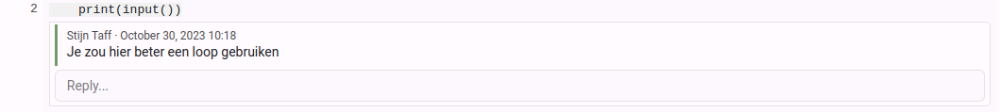
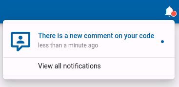
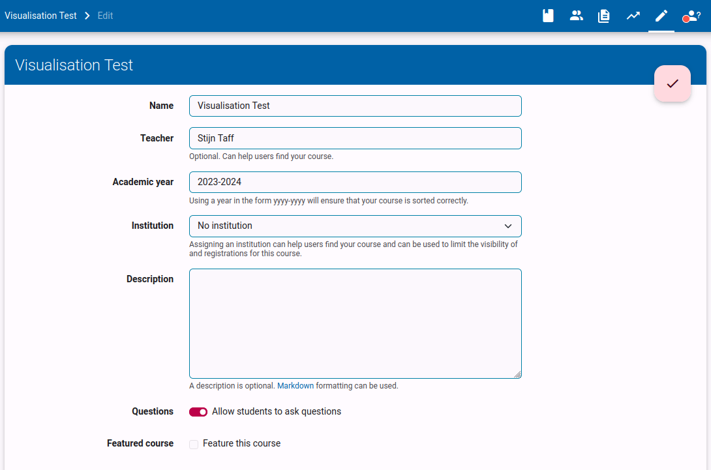
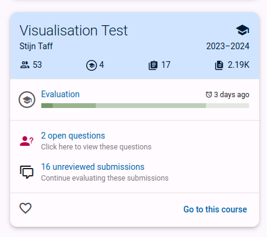
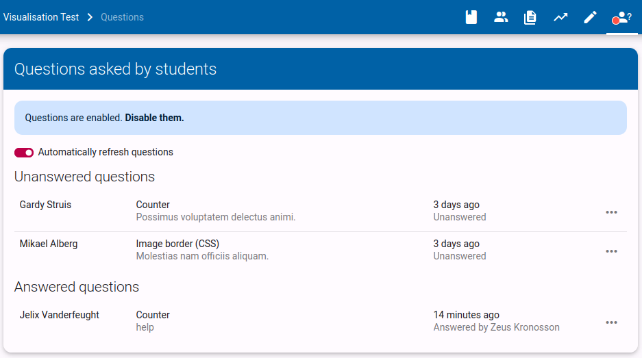
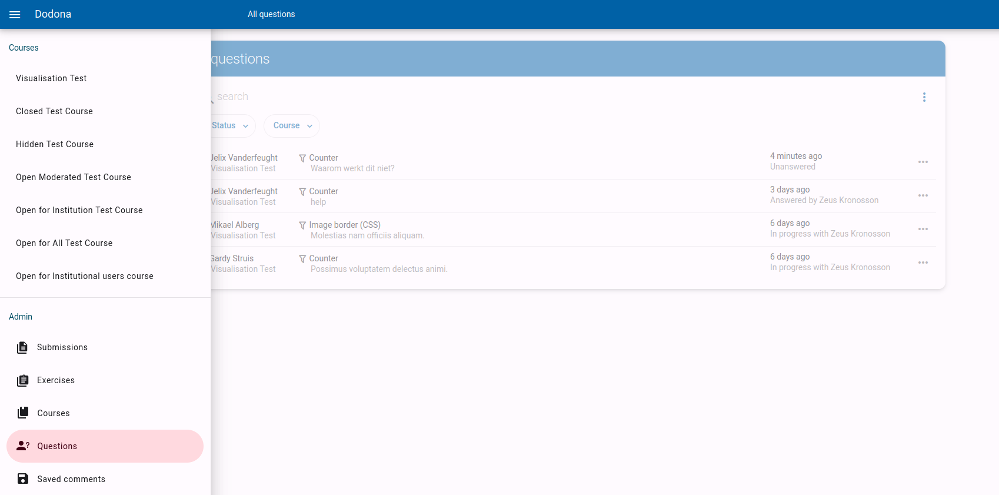
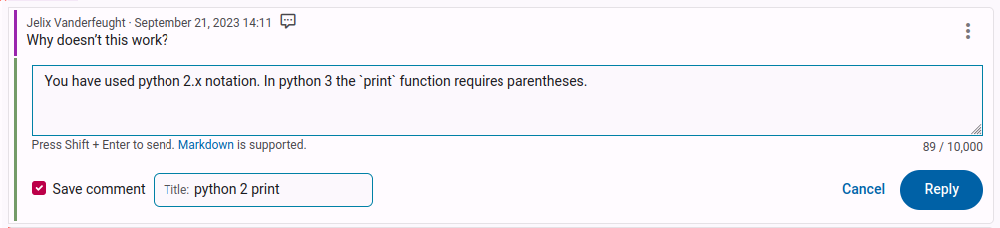
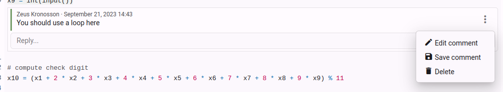
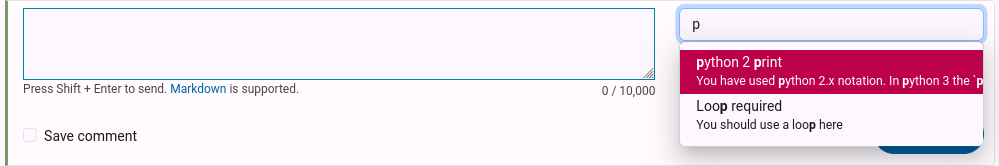

# Questions and comments

[[toc]]

## How can I ask a question about my code? <Badge type="tip" text="student" />

::: tip Note
This feature is only available if your teacher has enabled it.
:::

After you have submitted your solution, you can ask a question in three ways. At the top of the submitted code, you can ask a general question by clicking on `Ask a question about your code`. In addition, you can click on the pink circle to the left of the line number to ask a question about a specific line of code. You can also select a piece of code and then ask questions about it using the same button.

Type the question you want to ask the teacher in the text box. You can use Markdown to add extra formatting to your text. Finally, click on `Ask question`.

::: tip Markdown support

You can add extra formatting with Markdown by:

- asterisks (\*) around words to make it italic. \*italic text\* will be displayed as *italic text*.
- double asterisks (\**) around words to make it bold. \*\*bold text\*\* will be displayed as **bold text**.
- backticks (\`) around a piece of code. \`Variables\` will be displayed as `Variables`.

Here you can view [all the possibilities of Markdown](/en/references/exercise-description/#markdown).
:::

You can also respond to an existing question from yourself or to a comment from a teacher. To do this, click on `Reply` below the question or comment. Type your response in the text box and click on `Reply`.

## How do I know if my question has been answered? <Badge type="tip" text="student" />

When a teacher answers your question, you will receive a notification in Dodona. This notification will redirect you to the page where you asked the question.

## How can I enable/disable student questions? <Badge type="tip" text="teacher" />

Use the pencil in the top navigation bar of your course to go to the `Edit` page. Here you can enable or disable student questions by checking or unchecking the box `Allow students to ask questions`.

Don't forget to save your changes by clicking on the pink checkmark at the top right of the page.

## How do I know if there are any open questions? <Badge type="tip" text="teacher" />

If there are open questions within a course, you will see a notification in the course card on your homepage.

You will also see a notification in the top navigation bar of your course. Click on the notification to go to the page where you can see all the open questions.

If you want to see al open question across all your courses, you can go to the `Questions` page in the navigation sidebar of Dodona.

## How can I reply to a question from a student? <Badge type="tip" text="teacher" />

You can choose to type a reply to the question by clicking the input field. While typing, the question will be marked as in progress, to notify other teachers someone is already working on it.
Finishing the reply will mark the question as answered and send the student a notification.

You can also directly mark a question as answered. This is often useful if you know the student has already solved the question in another way. For example, if the student has submitted another solution where the problem is fixed, or if you have replied to the question outside of Dodona.

> Note: comments support Markdown formatting, so you can use bold, italics, lists, ... You can check out all Markdown features in [this reference](/en/references/exercise-description/#markdown).

## How can I comment on a students' submission? <Badge type="tip" text="teacher" />

As a teacher, you can also comment on the code of your students. This can be useful to give feedback on their solution, or to point out a mistake.

> If you want to go through the submissions of all your students and provide feedback, it can be useful to [create an evaluation](/en/guides/teachers/grading).

You can either use the `Add global comment` button to add a general comment about the submission, or you can select a piece of code and click the `Add comment` button to add a comment about that specific piece of code.

> Note: comments support Markdown formatting, so you can use bold, italics, lists, ... You can check out all Markdown features in [this reference](/en/references/exercise-description/#markdown).

## How can I save and reuse comments? <Badge type="tip" text="teacher" />

Students often make the same mistakes, or have similar questions. To avoid having to write the same comment over and over again, you can reuse comments.

While writing or editing a comment, you can check `Save comment`. This will allow you to add a title for this comment, which should help you find the comment for future use.

You can also save an existing comment by clicking `Save comment` in the comment menu.

Once you have saved one or more comments, you get a search field when writing new comments. Select the desired comment from the list to reuse it. You can still edit the comment before posting it.

## Why can't I find my saved comments? <Badge type="tip" text="teacher" />

Saved comments are scoped by course and by exercise. This way we are sure we only suggest relevant comments and the number of saved comments remains manageable.

Unfortunately, this means that you can't reuse comments from one exercise in another exercise. This will probably be changed in the future to give teachers more flexibility.

You can find an overview of all your saved comments for a certain exercise by clicking the link underneath the search field.

