# Questions and comments

[[toc]]

## How can I ask a question about my code? <Badge type="tip" text="student" />

::: tip Note
This feature is only available if your teacher has enabled it.
:::

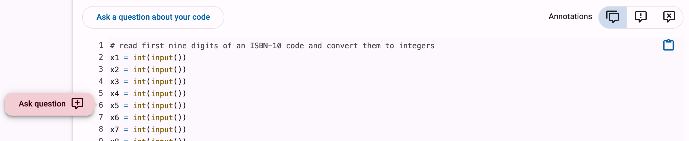
After you have submitted your solution, you can ask a question in three ways. At the top of the submitted code, you can ask a general question by clicking on `Ask a question about your code`. In addition, you can click on the pink circle to the left of the line number to ask a question about a specific line of code. You can also select a piece of code and then ask questions about it using the same button.

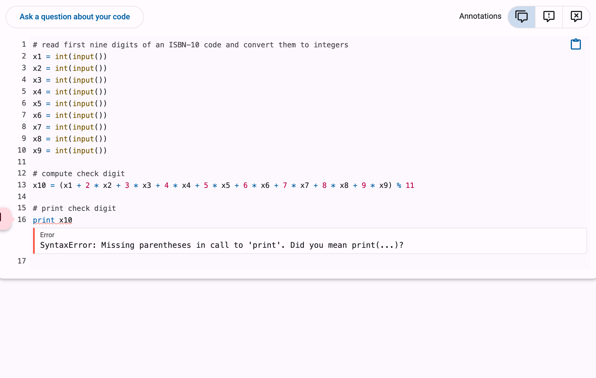

Type the question you want to ask the teacher in the text box. You can use Markdown to add extra formatting to your text. Finally, click on `Ask question`.

::: tip Markdown support

You can add extra formatting with Markdown by:

- asterisks (\*) around words to make it italic. \*italic text\* will be displayed as *italic text*.
- double asterisks (\**) around words to make it bold. \*\*bold text\*\* will be displayed as **bold text**.
- backticks (\`) around a piece of code. \`Variables\` will be displayed as `Variables`.

Here you can view [all the possibilities of Markdown](/en/references/exercise-description/#markdown).
:::

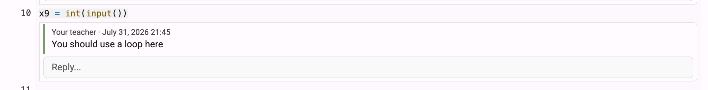

You can also respond to an existing question from yourself or to a comment from a teacher. To do this, click on `Reply` below the question or comment. Type your response in the text box and click on `Reply`.

## How do I know if my question has been answered? <Badge type="tip" text="student" />

When a teacher answers your question, you will receive a notification in Dodona. This notification will redirect you to the page where you asked the question.

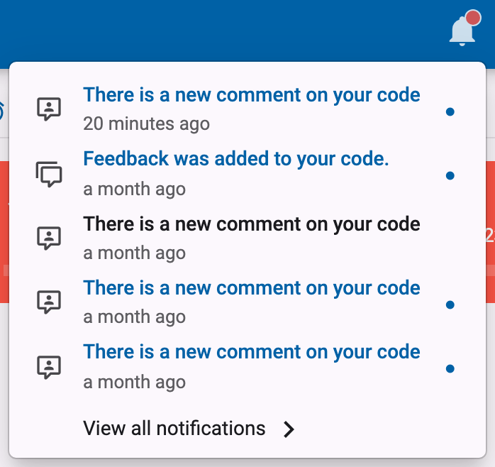

## How can I enable/disable student questions? <Badge type="tip" text="teacher" />

Use the pencil in the top navigation bar of your course to go to the `Edit` page. Here you can enable or disable student questions by checking or unchecking the box `Allow students to ask questions`.

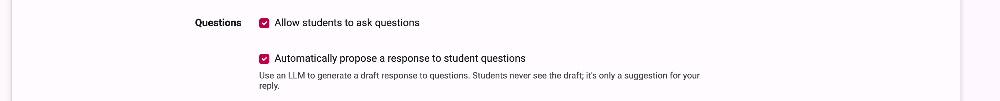

Don't forget to save your changes by clicking the `Save` button at the bottom of the page.

## How do I know if there are any open questions? <Badge type="tip" text="teacher" />

If there are open questions within a course, you will see a notification in the course card on your homepage.

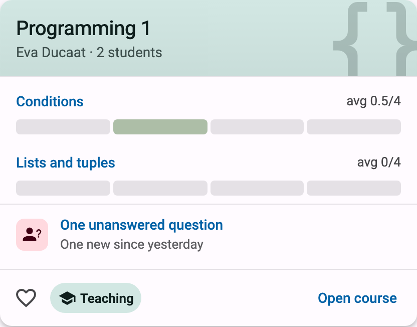

You will also see a notification in the top navigation bar of your course. Click on the notification to go to the page where you can see all the open questions.

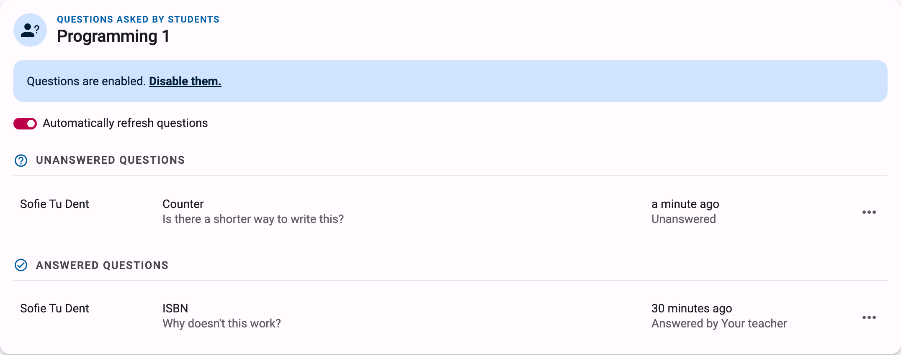

If you want to see all open questions across all your courses, you can go to the `Questions` page in the navigation sidebar of Dodona.

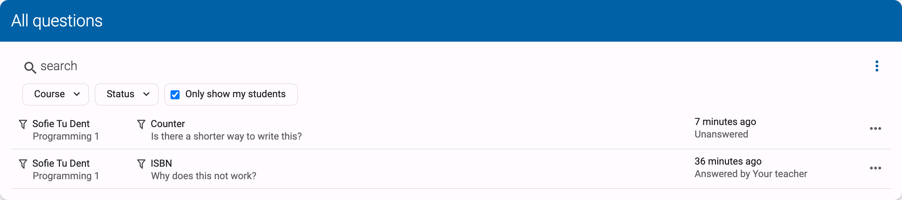

## How can I reply to a question from a student? <Badge type="tip" text="teacher" />

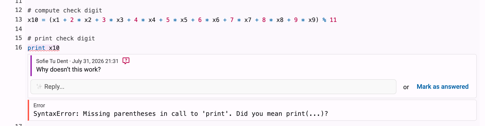

You can choose to type a reply to the question by clicking the input field. While typing, the question will be marked as in progress, to notify other teachers someone is already working on it.
Finishing the reply will mark the question as answered and send the student a notification.

You can also directly mark a question as answered. This is often useful if you know the student has already solved the question in another way. For example, if the student has submitted another solution where the problem is fixed, or if you have replied to the question outside of Dodona.

> Note: comments support Markdown formatting, so you can use bold, italics, lists, ... You can check out all Markdown features in [this reference](/en/references/exercise-description/#markdown).

## How do AI draft answers work? <Badge type="tip" text="teacher" />

When a student asks a question about their code, Dodona can automatically generate a draft answer using a large language model. This gives you a head start when replying: instead of starting from a blank text box, you start from a suggestion that you can edit, replace or delete.

If a draft is available and no teacher has replied to the question yet, the reply box is prefilled with the draft. It is clearly marked as a suggestion: above the text box you see a sparkle icon with the label `Suggested answer`, and hovering over the icon shows the note `This is a draft comment generated by generative AI.` The draft is just that — a draft. You can freely edit it, or clear it and write your own answer. Nothing is sent to the student until you post the reply yourself.

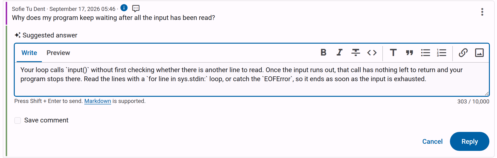

Next to the label you can rate the suggestion with the thumbs up (`Good answer`) or thumbs down (`Bad answer`) buttons. After rating, an optional text field appears where you can explain your rating. This feedback helps us evaluate the quality of the generated drafts, so we really appreciate it.

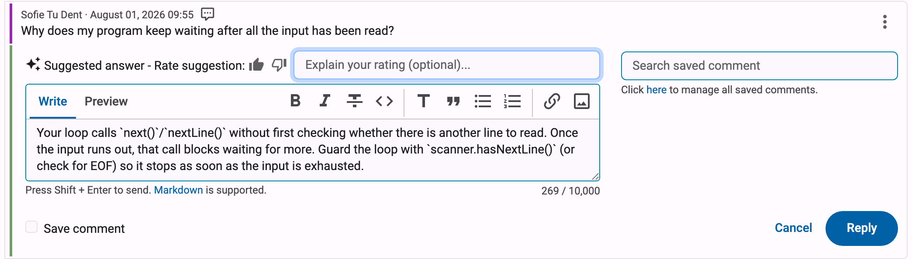

::: info Privacy
To generate a draft, Dodona sends the question, the student's submitted code, the exercise description, the programming language and the failed automatic test results to an external AI provider. The student's name and other account details are not included. Students never see the generated draft: it only appears in your reply form, and only the text you actually post is shown to the student.
:::

## How do I enable or disable AI draft answers? <Badge type="tip" text="teacher" />

Use the pencil in the top navigation bar of your course to go to the `Edit` page. In the `Questions` section, check or uncheck the box `Automatically propose a response to student questions`. Don't forget to save your changes by clicking the `Save` button at the bottom of the page.

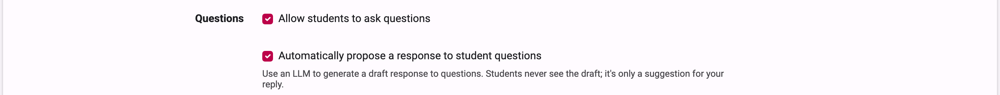

Draft answers are enabled by default, but drafts are only generated when student questions are enabled for the course. You can find more information about these settings in the guide on [course properties](/en/guides/teachers/creating-a-course/#course-properties).

## How can I comment on a student's submission? <Badge type="tip" text="teacher" />

As a teacher, you can also comment on the code of your students. This can be useful to give feedback on their solution, or to point out a mistake.

> If you want to go through the submissions of all your students and provide feedback, it can be useful to [create an evaluation](/en/guides/teachers/grading).

You can either use the `Add global comment` button to add a general comment about the submission, or you can select a piece of code and click the `Add comment` button to add a comment about that specific piece of code.

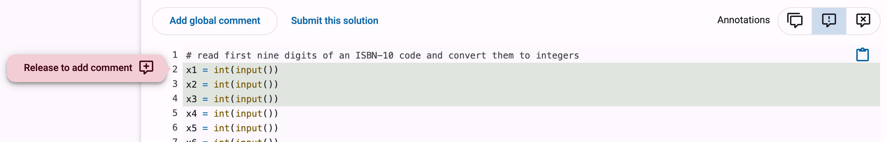

> Note: comments support Markdown formatting, so you can use bold, italics, lists, ... You can check out all Markdown features in [this reference](/en/references/exercise-description/#markdown).

## How can I save and reuse comments? <Badge type="tip" text="teacher" />

Students often make the same mistakes, or have similar questions. To avoid having to write the same comment over and over again, you can reuse comments.

While writing or editing a comment, you can check `Save comment`. This will allow you to add a title for this comment, which should help you find the comment for future use.

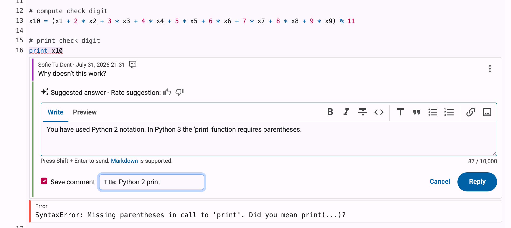

You can also save an existing comment by clicking `Save comment` in the comment menu.

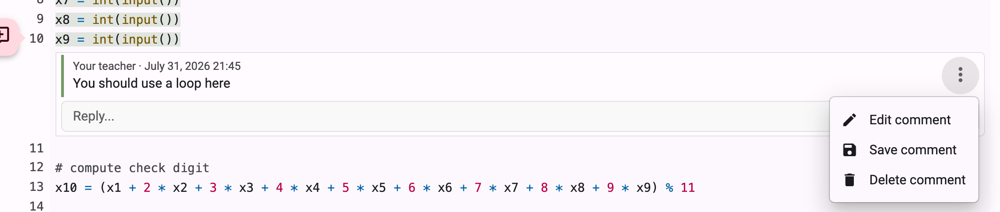

Once you have saved one or more comments, you get a search field when writing new comments. Select the desired comment from the list to reuse it. You can still edit the comment before posting it.

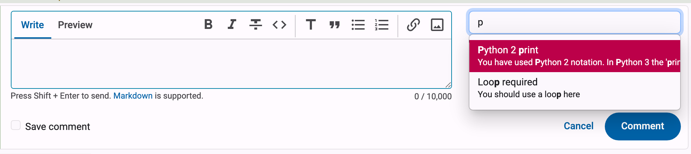

## Why can't I find my saved comments? <Badge type="tip" text="teacher" />

Saved comments are scoped by course and by exercise by default. This way we are sure we only suggest relevant comments and the number of saved comments remains manageable.

If you want to reuse a comment across your whole course, or even across multiple courses, you can edit the saved comment and remove the course and/or exercise limitations. This way the comment will be suggested in all exercises of all your courses.
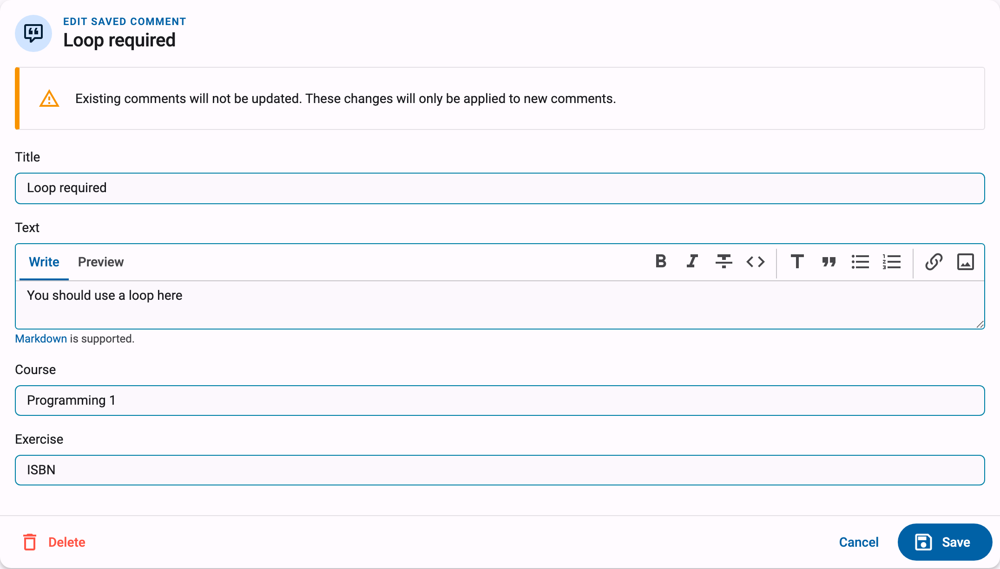

To edit a saved comment, click on the saved comment icon on an annotation which reuses the comment. This will open the saved comment and clicking the pencil icon will allow you to edit the comment.
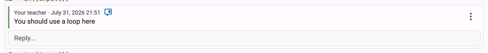

You can find an overview of all your saved comments for a certain exercise by clicking the link underneath the search field. Or by clicking on 'saved comments' in the sidebar menu.
From here you can also edit or delete saved comments.
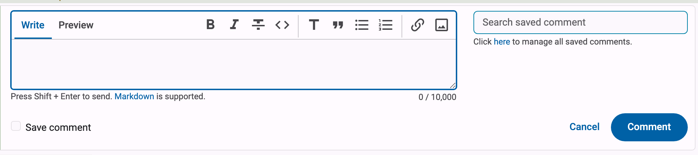
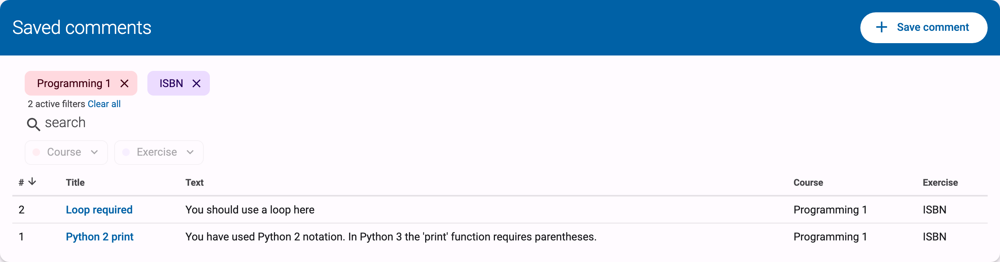
