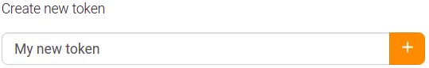
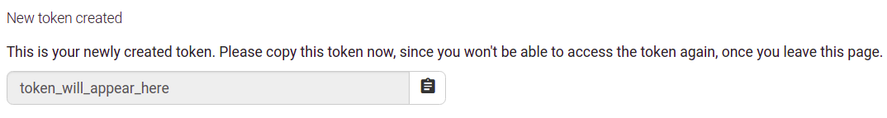

# FAQ: API tokens

[[toc]]

## What is an API token?

An API token is a unique identifier that allows external applications to interact with your account on a platform without needing your password. It acts as an authentication key that these applications can use to perform actions on your behalf. For example, you can use an API token to authorise the [Dodona plugin for JetBrains IDEs](/en/guides/general/pycharm-plugin/) to access your Dodona account. The token is designed to hide your password, thus increasing the security of your account.

## How do I create an API token?

Follow the steps below to create an API token on Dodona:

1. **Go to your profile page**: Navigate to your profile page by clicking on the appropriate link in the drop down menu. You can also go directly to [dodona.ugent.be/profile](https://dodona.ugent.be/en/profile).
  

2. **Generate a new token**: Once you're on your profile page, scroll to the middle of the page and click the '+' button to generate a new token. You will need to enter a description for your token (e.g. "pycharm"). This description will help you identify the purpose of the token in the future.
  

3. **Copy the token**: Once the token is generated, copy and paste it into the authentication dialog of the application you want to authorise, e.g. the PyCharm plugin or the VS Code extension.
  

::: tip
Please note that for security reasons you will not be able to view the tokens on Dodona after creation. However, you can see a list of all your active tokens. You can delete a token at any time and it will stop working immediately.
:::
