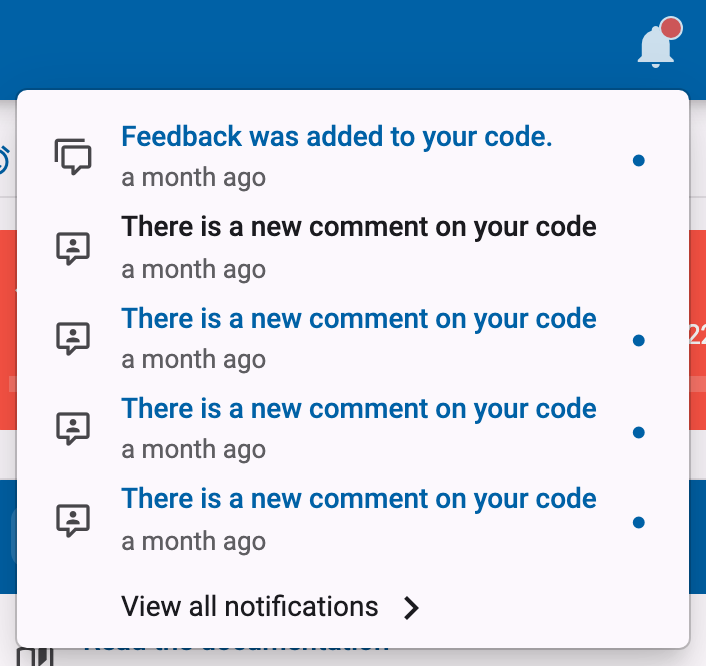
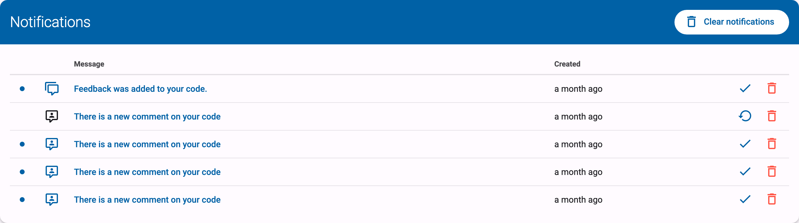
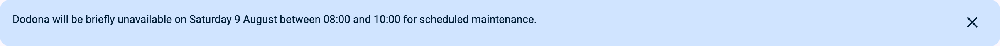

# Notifications

[[toc]]

## When do I receive notifications? <Badge type="tip" text="student" />

Dodona notifies you when something needs your attention:

- when a teacher comments on your code or replies to one of your [questions](../annotations/#how-can-i-ask-a-question-about-my-code), you receive the notification `There is a new comment on your code`;
- when a teacher releases the feedback of an evaluation (for example a graded task, test, or exam) you took part in, you receive the notification `Feedback was added to your code.`.

As soon as you have received at least one notification, a bell icon appears in the navigation bar at the top of the page. A coloured dot on the bell indicates that you have unread notifications. Click the bell to see your most recent notifications; clicking a notification takes you straight to the relevant page. Via `View all notifications` at the bottom of this list, you can open the full overview of your notifications.

## How do I mark notifications as read or delete them? <Badge type="tip" text="student" />

A notification is automatically marked as read when you visit the page it links to. You can also manage your notifications by hand on the notifications page, which you reach via the bell icon in the navigation bar and `View all notifications`. There you can mark each notification as read or unread (`Mark as read`/`Mark as unread`), delete individual notifications, or delete all of them at once with the `Clear notifications` button.

## What is the announcement banner at the top of the page?

Occasionally, the Dodona team shows an announcement banner at the top of every page, for example to announce new features or planned maintenance. These announcements are created by the Dodona team itself and can be targeted at a specific group of users (for example only students or only teachers), so it is perfectly normal to see a banner that someone else doesn't see. If you are logged in, you can dismiss an announcement by clicking the cross (`Dismiss announcement`) on the right side of the banner; it will then no longer be shown to you.

