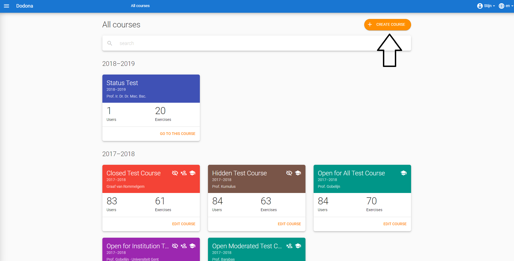
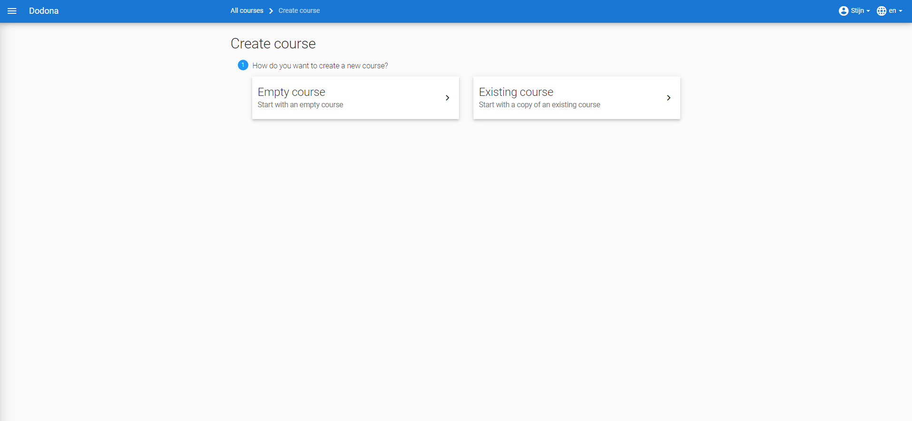
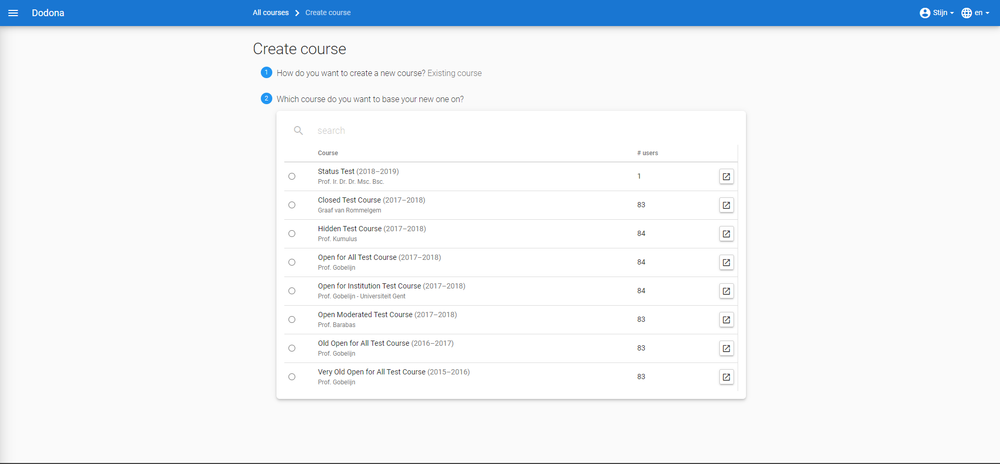
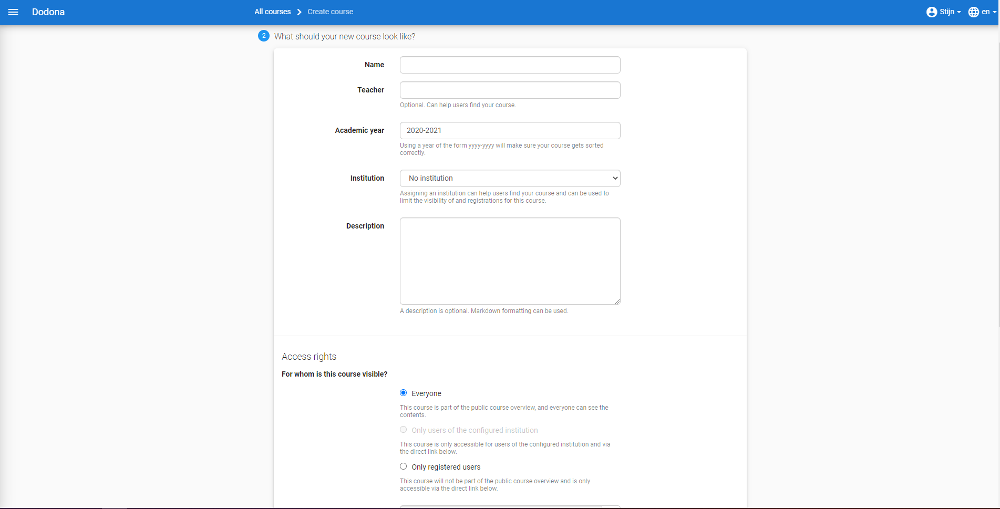
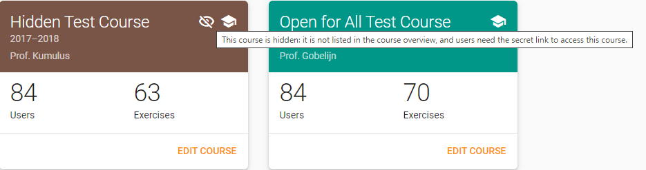

A course is [set up](#setup-learning-trail) as a [learning trail](#learning-trail) with [exercises](/en/guides/for-students#exercise) bundled in **exercise series**. The sequence of series implies a possible order in which the exercises can be [solved](/en/guides/for-students#solution).

A [teacher](/en/user-management#teacher) can [create](#create-course) [courses](#course) without restrictions and will automatically be assigned the role of [course admin](#course-admin) for the created courses. As a course admin, he can [appoint](#appoint-course-admin) other [course users](#course-users) to become course admins aswell to help manage the course. However, he cannot manage courses for which he isn't a course admin.

A [course admin](#course-admin) [lays out](#lay-out-learning-trail) a [learning trail](#learning-trail) for a [course](#course) with [exercise series](#exercise-series). Each series can be [given](#exercise-series-deadline) a [deadline](#deadline) that denotes up to which moment [submitted](/en/guides/for-students#submit-solution) [solutions](/en/guides/for-students#solution) are considered when grading the exercises. [Course users](#course-users) can however keep submitting solutions to exercises after the deadline and receive automated feedback.

# Create course

As a [teacher](/en/user-management#teacher) you can create a new [course](#course) by clicking the button `CREATE COURSE` in the upper right corner of the [course overview](#course-overview).

There are two options to choose from when creating a new course. Either you start from a pre-existing course, or you create an entirely new one.

Press `Dodona` in the [navigation bar](/en/guides/for-students#navigation-bar) to cancel the creation of the [course](#course).

If you start from an existing course, you must first select it in the table. Use the search bar to filter the displayed courses and find the course of your liking. Click the radio button in the left column to proceed.

Now you must choose which elements from the existing [course](#course) you wish to copy. The series structure is always copied. You can then choose whether you also want to copy the exercises, deadlines and course admins from the original course. Finally, some other options are possible.

`Make the copied series hidden`: this is very useful when you want to make a series visible every week without having to manually make them invisible first.

## Setting course properties

With either choice of course creation, you must choose some course specific properties. When copying, these are pre-filled in with the original values. The following properties can be set.

`Name`

> A name for the [course](#course).
> Different courses can have the same name. However, it is advised to make names as unique as possible.

`Teachers`

> The names of the [teachers](/en/user-management#teacher) of the [course](#course). If there are multiple teachers, use commas to separate their names.

`Academic year`

> The academic year in which this [course](#course) is offered. Use the format `yyyy-yyyy` to ensure that the course is sorted correctly on the [starting page](/en/guides/for-students#startingpage) and in the [course overview](#course-overview).

`Visibility`

> The visibility determines whether [unregistered](/en/guides/for-students#course-register) users can see the course. This property has the following possible values:

>
> 
> `Visible`
>
>
> > All users see the [course](#course) in the [course overview](#course-overview). They can also navigate to the [course page](/en/guides/for-students#course-page) and [register](/en/guides/for-students#course-register) if they want to.
>
> `Hidden`
>
> > Only [course admins](#course-admins) see the [course](#course) in the [course overview](#course-overview) and on their [starting page](/en/guides/for-students#starting-page). An icon is displayed to point out the fact that other users cannot see this course there. This icon can also be found on the [course page](/en/guides/for-students#course-page) itself. Only [registered](/en/guides/for-students#course-register) users can navigate to that page. Other users can only register if they use the [registration link](#registration-link).
> >
> > 

`Registration procedure`

> The registration procedure deterimines whether and how users can [register](/en/guides/for-students#course-register] for the [course](#course). This property can have the following values:
>
> `Open`
>
> > Any user can [register](/en/guides/for-students#course-register) for this [course](#course) without explicit approval of a [course admin](#course-admin).
>
> `Moderated`
>
> > Users can [submit](/en/guides/for-students#submit-registration-request) a [registration request](/en/guides/for-students#registration-request) for the [course](#course) but are only [registered](/en/guides/for-students#course-register) when a [course admin](#course-admin) [approves](#approve-registration-request) their registration request.
>
> `Closed`
>
> > Users can no longer [register](/en/guides/for-students#course-register) for this [course](#course).
>
> ::: tip Important
>
> When you change the registration procedure, existing [registrations](/en/guides/for-students#course-registeren) and [registration-requests](/en/guides/for-students#registration-request) for the [course](#course) remain valid. You will have to manually edit the [registration status](#registration-status) of [course users](#course-users).
> :::