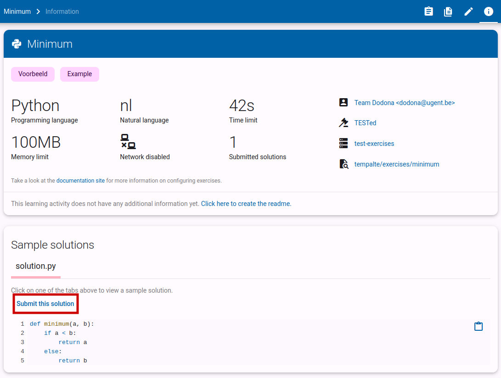
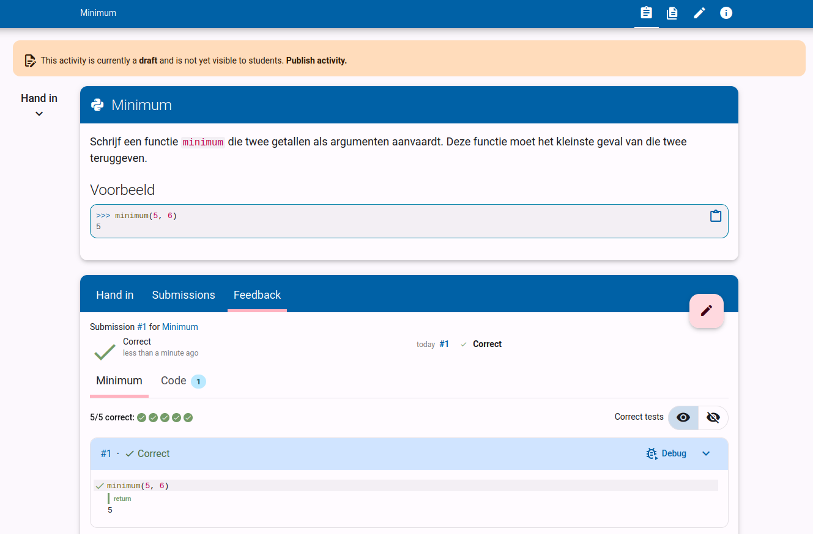

# Creating Exercises: Writing the Assignment and Test Suite

If you used the _template repository_ in the previous step of the guide, your repository already contains an exercise (_EchoFunction_).
Now, we will add another exercise ourselves.
The existing exercise can, of course, serve as an example.

::: info Creating Files and Folders
1. Select the folder where you want to create the file or folder.
2. Use the icons at the top to create a file or folder. You can also right-click on the folder and choose `New File...` or `New Folder...`.
3. Type the name of the file (including the extension) or folder. Preferably, choose a name without spaces.
4. Confirm with <kbd>Enter</kbd>.
   :::

<!--@include: ../../examples/_common.md-->

## 5. Saving Changes

Now that the exercise is ready, we need to save the changes to the repository (that means _committing_ the changes in the repo).
Do this as follows:

1. Click on the _Source Control_ icon on the left.
2. At the top of the list of changes, click the `+` button to stage all files (_Stage All Changes_).
3. Enter a _commit message_ at the top. Describe what you have done, such as "Add my first exercise".
4. Click the `Commit & Push` button. If you get a pop-up, choose `Sync (Push & Pull)`.

If everything went well, this window should now be empty.

## 6. Testing the Exercise

The exercise you just created can be found in [your exercise repository](https://dodona.be/nl/repositories/) on Dodona.
Your new exercise is now available as a _concept_ on Dodona.

Before you can publish an exercise (removing it from concept status), Dodona checks whether three conditions are met:

- The exercise must have a valid configuration file.
- The exercise must have a name and description.
- You must submit at least one correct solution.

If you followed this guide, the first two conditions are already met.
You only need to submit a correct solution, which we have already created.
To do this, click on the info icon in the top menu bar:

Next, select the sample solution you want to submit (in this case, there is only one: `solution.py`), then click the _Submit this solution_ button.
This will open the exercise page with the sample solution preloaded.
All you need to do is click submit.

Once the solution is marked as correct, you will be able to publish the exercise by clicking _Publish this exercise_.
Your exercise is now ready to use on Dodona!

::: tip
Let someone else try your exercise. This often helps you discover gaps in the test suite and refine the exercise further.
:::
