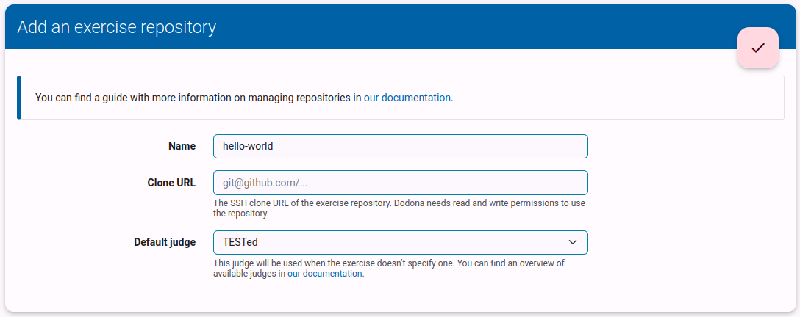
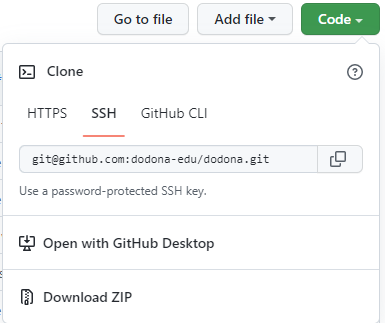
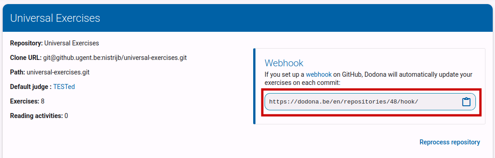
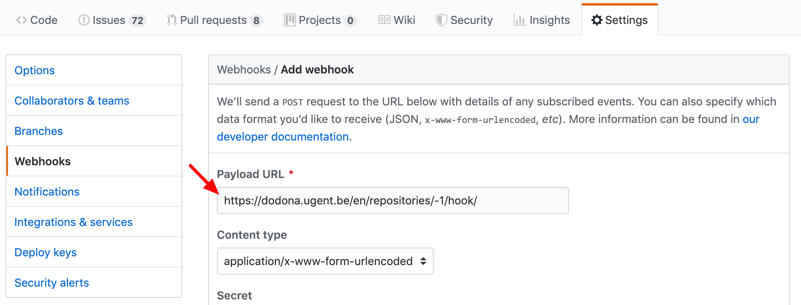
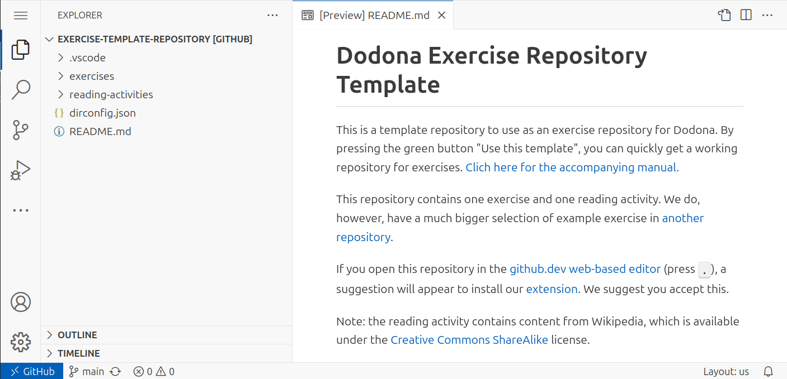

# Creating Exercises: Installation and Configuration

In this chapter, we will go over and configure all the programs and tools needed to create an exercise.

::: info Working Online  
Note that in this guide, we choose to use _VS Code for the Web_, a version of VS Code that runs in the browser.  
In the future, we will also provide a guide for working locally.  
:::

## Browser

Since you are reading this guide, you probably already have a browser installed.  
However, make sure you are using a recent version of Chrome, Firefox, or Safari—these are the three browsers supported by Dodona.

## Teacher Permissions on Dodona

Regular accounts on Dodona do not have sufficient permissions to create exercises.  
You can request teacher permissions for your account via [this form](https://dodona.ugent.be/en/rights_requests/new).

## Forking the Repository

Dodona uses Git repositories to manage exercises and other teaching materials.  
A repository can contain multiple exercises and must follow a specific structure to be readable by Dodona.  
To get started quickly, we will use a template repository that already has the correct structure.

### GitHub Account

We use GitHub to store the repository.  
First, you need a GitHub account.  
Go to <https://github.com/signup> to create one, or use your existing account if you already have one.

### Forking the Repository

Next, you need to create your personal copy of the template:

1. Go to <https://github.com/dodona-edu/exercise-template-repository>.
2. Click the `Use this template` button.
3. Select the first option: `Create a new repository`.  
   
4. Fill in the details for the new repository:
    1. Choose a name for your repository.
    2. Set the repository's visibility. _Public_ means everyone can access the exercises, so we recommend _Private_.
    3. Click `Create repository`.  
       

Now you have a repository where you will store your exercises.  
Keep this page open—you will need it later.

### Granting Dodona Access to Your Repository

Before adding your new repository to Dodona, you need to grant Dodona read and write access to it.

The easiest way to do this (on github.com) is to give the user [dodona-server](https://github.com/dodona-server) access to your repository:

1. Go to the `Settings` tab of your repository.
2. In the left-hand menu, click `Collaborators` (this should be near the top).
3. Click the green `Add people` button.
4. Type _dodona-server_ in the search field and select the correct user (recognizable by the blue Dodona logo).
5. Click the green button `Add dodona-server to this repository`.

GitHub will then send an invitation that the Dodona team needs to accept.  
Once the invitation is accepted, you can proceed to the next steps.

::: warning Manual Approval  
A member of the Dodona team must manually accept the invitation on GitHub.  
This may take some time, so please be patient.  
:::

### Adding the Repository to Dodona

Once you have teacher permissions on Dodona, you can add your repository to the platform.  
To do this, go to <https://dodona.ugent.be/en/repositories/> and click the light pink button with a plus sign (`+`).

Then, fill in the repository details:

1. **Name**: Choose a unique name for the repository on Dodona. This will be used to find it later.
2. **Clone URL**:  
   
    1. Go to the repository you created earlier on GitHub.
    2. Click the green `Code` button.
    3. Under the _Clone_ heading, you will see three tabs. Click the `SSH` tab.
    4. Copy the URL that appears, either manually or by clicking the button next to it.
    5. Paste this URL into the _Clone URL_ field on Dodona.
3. **Default Judge**: Select "TESTed".
4. Click the pink checkmark button at the top.

::: tip No Worries  
If you see a warning like the one below when copying the URL, you can safely ignore it.

This message simply means that you have not added SSH keys to your account, which are not required for Dodona.  
For more information about SSH, see GitHub's [_About SSH_](https://docs.github.com/en/authentication/connecting-to-github-with-ssh/about-ssh) guide.  
:::

### Setting Up a Webhook

Dodona will now fetch and process your repository.  
Since this needs to happen every time you update an exercise, Dodona must be notified when changes occur.  
We do this by setting up a _webhook_—a unique URL that ensures Dodona reprocesses your repository whenever changes are made.  
This URL should be visible after adding your repository to Dodona.

Next, you need to add this URL to GitHub:

1. Go to your repository on GitHub.
2. Click the `Settings` tab.
3. In the sidebar, select `Webhooks` (this should be about halfway down the menu).
4. Click the `Add webhook` button at the top left.
5. Paste the Dodona URL into the **Payload URL** field.
6. Click the green `Add webhook` button at the bottom.

Your repository is now ready for writing exercises.  
In the next part of this guide, we will create an actual exercise.

Dodona supports different types of exercises.  
In this guide, we will create a function-based exercise, but there are also guides for other types of exercises.

## Using VS Code

In this guide, we use the web version of VS Code.  
To open it:

1. Go to the page of your repository on GitHub (if it's still open, even better).
2. Press <kbd>.</kbd> on your keyboard (on AZERTY keyboards, this is <kbd>Shift</kbd> + <kbd>.</kbd>).
3. After launching, wait for a moment, and a notification will appear in the bottom-right corner about installing recommended extensions.  
   Accept this suggestion.

In the left column, you can see the contents of your repository.  
The template includes separate folders for exercises (_exercises_) and reading activities (_reading-activities_).  
At the top of the column, there are buttons to create your own files or folders.  
