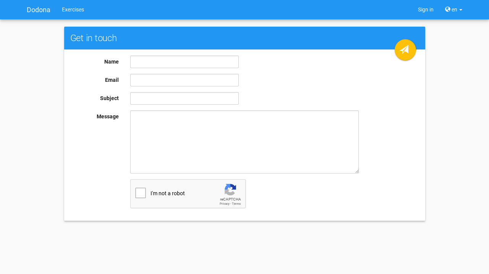

# Dodona voor studenten

Als student kan je [registreren](/nl/guides/for-students/courses/#registreren-voor-een-cursus) voor één of meer [cursussen](). Elke cursus bevat een reeks [oefeningen](/nl/guides/for-students/exercises/#navigeren-naar-een-oefening) die gegroepeerd zijn in [oefeningenreeksen](). Voor elke oefening kan je herhaald [oplossingen](/nl/guides/for-students/exercises/#navigeren-naar-een-oplossing) [indienen](/nl/guides/for-students/exercises/#indienen-van-een-oplossing) die automatisch worden beoordeeld en van [feedback](/nl/guides/for-students/exercises/#interpreteren-van-feedback) voorzien. Deze acties vereisen echter dat je over een [gebruikersaccount](/nl/guides/for-students/login-and-settings/#aanmelden) beschikt en dat je [aangemeld](/nl/guides/for-students/login-and-settings/#aanmelden) bent op Dodona.

## Nederlandse handleidingen voor studenten

* [Aanmelden & gebruikersinstellingen](/nl/guides/for-students/login-and-settings/)
* [Oefeningen handleiding](/nl/guides/for-students/exercises/)
* [Cursus handleiding](/nl/guides/for-students/courses/)

## Contact opnemen

Als je met vragen zit over de werking van Dodona of als er interessante ideeën bij je opborrelen over hoe we het platform zouden kunnen verbeteren of uitbreiden, neem dan gerust contact met ons op. Alle commentaren en suggesties zijn meer dan welkom. Navigeer daarvoor naar de **contactpagina** door in de **voettekst** (onderaan elke pagina) op Contact te drukken.

Vul de gegevens in het paneel Contacteer ons aan en druk daarna op de verzendknop in de rechterbovenhoek van het paneel.

<!-- ---
    title: Starting with Dodona as a student
    description: "Tutorial: starting with Dodona as a student"
    ---

    # Dodona for students

    As a student, you can [register]() for one or more courses. Every course has [exercises]() that are grouped in [series](). For each [exercise]() an arbitrary amount of [solutions]() can be [submitted](). These submissions will automatically be judged and annotated with [feedback](). All the actions mentioned require you to have an [account]() and that you are [logged in]() on Dodona.

    ## Get in touch

    If you have any questions about the way Dodona works or any interesting ideas that you want to share about the extension or enhancement of the platform, don't hesitate to contact us. Any comments and/or suggestions are more than welcome. Contacting us can be done by navigating to the **contact page** by clicking on the Contact button in the **footer** (at the bottom of every page).

    

    Fill the information in the panel Get in touch and when you are ready press on the send button in the upper right corner of the panel.
-->