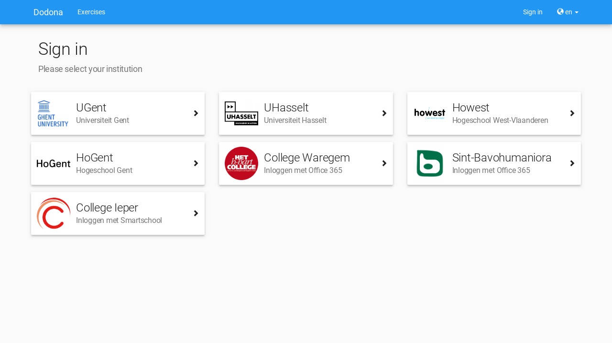
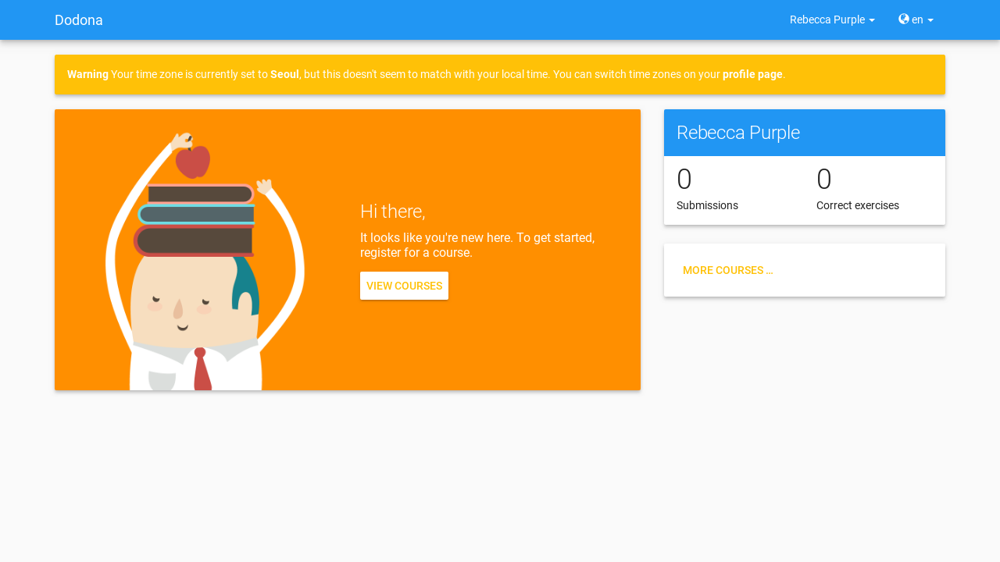

## Selecting a language

In Dodona, you have two **languages** to choose from, Dutch and English. To change your language use the **language menu** on the right side of the **navigation bar** (which can be found at the top of each page).

If you select a [language]() while you are logged in, it will be set as your preferred language in your [user settings]().

::: details Note

The language used for fixed components of Dodona (menubar, course structure, notifications, ...) are shown is fully controlled by the platform. These components are always shown in the selected [language]().

The name and description of a [course]() are fixed, as are names and descriptions of  [exercise series]() within a course. These components do not depend on the selected  [language](). The language of these components falls entirely under the control of the course administrators that created the course.

The name and description of an [exercise]() depend on the selected [language](). If a translation of the name and description was provided in the selected language when creating the exercise, theses components of the exercise will also be displayed in that language.

The language of feedback on a submitted solution for an exercise is completely under the control of the judge with which the exercise is associated. The judge can make the language of this feedback depend on the language selected at the time the solution is submitted.
:::

## Sign-in

To be able to sign-in you need a user account on Dodona. In the associated user profile, you can set your personal preferences on your user profile to personalize your experience. All the actions you perform &mdash; like registering for a course or submitting a solution &mdash; are linked with your user account.

::: tip Important

Sign-in on Dodona can be done by selecting your educational institution on the login page. As a High School student, you can also use your Smartschool, Office 365, or G Suite account provided by your school.

:::

Press on Sign in  on the right side of the navigation bar or navigate to the homepage and press on Sign in that can be found in the center of the homepage.

::: tip

You can only log in if you aren't already logged in. You can see that you are logged out if you can see the Sign in button on the right side of the [navigation bar](). If you are logged in, the name of your account can be seen at the same place. This is the [user menu]().
:::

Select your educational or research institution on the login page. If you are a High School student you can select the Smartschool, Office 365, or G Suite options. After selecting your preferred login, follow the specified log in procedure.

::: tip Important

A few educational or research institutions explicitly ask for your permission to send some personal data to Dodona. Mostly you only need to give these permissions once per computer you use to log in. Dodona uses the personal data only for the internal management of your user profile and never exchanges this information with third parties.
:::

::: details Note

The authentication of user accounts from external educational or research institutions, Dodona supports both [SAML](https://en.wikipedia.org/wiki/Security_Assertion_Markup_Language) and [OAuth](https://en.wikipedia.org/wiki/OAuth). Ask an IT administrator or teacher from your educational or research institution to contact us if you would like to give access to all the user accounts of your institution to Dodona. This service is free.
:::

If this is the first time you log in on Dodona, a new user account will automatically be created using the personal data sent by your external educational or research institution. In the user profile of this user account, you can set personal preferences for the language and time zone used by Dodona.

::: tip Important

If you have user accounts from different educational or research institutions, each one will correspond to a separate user account on Dodona.
:::

::: tip

If you want to change to another user account than the one you are currently logged in with, then you need to log out and log in with the other user account.
:::

If you are logged in the **user menu** with your user name will be visible on the right side of the navigation bar. The user menu is at the place where the Sign in button was before you logged in.

When logged in the homepage will change to a personalized page with an overview of all the courses for which you are registered, their exercise series with a deadline, and your progress on submitting solutions for the exercises. This makes it easy to recognize if you are logged in or not.

::: tip

You can navigate to your homepage or to the neutral homepage (if you aren't logged in) from any page by clicking on the Dodona button on the left side of the navigation bar.

:::

If this is your first time you log in on Dodona you won't be registered in any courses and you won't have any submitted solutions. Because of this your homepage will seem a bit empty.

## Setting your personal preferences

Choose My profile in the [user menu]() on the right side of the [navigation bar](#selecteren-van-de-taal) to navigate to your **profilepage**.

On your profile page, you can see your **personal data** (first name, family name, user name, and e-mail address) and a few **personal preferences** that together form your profile page. Dodona uses the user profile to personalize your user experience.

Press on the edit button on the upper right corner of your profile page to edit your user profile. You can't edit your personal data. It gets automatically changed based on the personal data sent to Dodona by the external educational or research institution that was used during the login.

In your user profile, you can set the timezone that should be used for all the time indications on the platform (for example the time at which your solution was submitted or the deadline for a series of exercises).

::: tip

If the timezone of your user profile doesn't match with the local timezone as the timezone detected by your browser, then you will get a notification indicating that all time indications on the platform do not correspond to the local timezone.

You can only remove this notification by setting the timezone in your user profile to the local timezone. Notice that the notification contains a link that will directly send you to your profile page.
:::