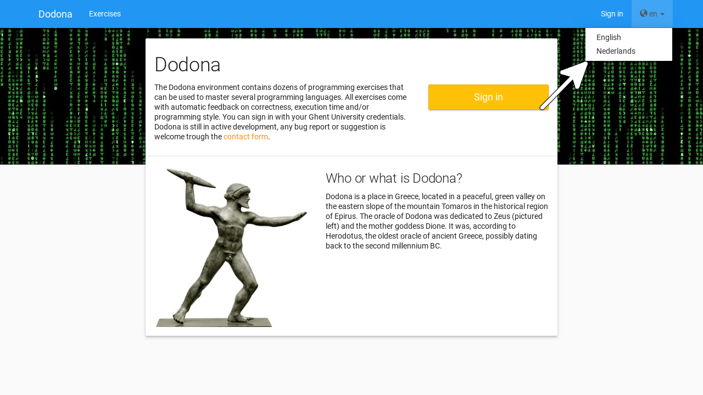

## Selecting a language

In Dodona, you have two **languages** to choose from, Dutch and English. To change your language use the **language menu** on the right side of the **navigation bar** (which can be found at the top of each page).

If you select a [language]() while you are logged in it will be set as your preferred language in your [user settings]().

::: details Note

The language in which fixed components of Dodona (menubar, course structure, notifications, ...) are shown is fully controlled by the platform. These components are always shown in the selected [language]().

De name and description of a [course]() are fixed, as are names and descriptions of  [exercise series]() within a course. These components do not depend on the selected  [language](). The language of these components falls entirely under the control of the course administrators that created the course.

The name and description of an [exercise]() depend on the selected [language](). If a translation of the name and description was provided in the selected language when creating the exercise, theses components of the exercise will also be displayed in that language.

The language of feedback on a submitted solution for an exercise is completely under the control of the judge with which the exercise is associated. The judge can make the language of this feedback depend on the language selected at the time the solution is submitted.
:::

## Sign-in

Sign-in on Dodona can be done by selecting your educational institution on the login page. Alternatively, you can use your Smartschool, Office 365, or G Suite account of your school. Dodona receives your name, e-mail, and the name of your school from the login system you chose to use. We can now identify you and automatically create a Dodona-account on the first time you sign-in. Your password is never sent to us.

You can set your preferences on your user profile that is associated with your Dodona account to personalize your experience. All the actions you perform &mdash; like registering for a course or submitting a solution &mdash; are linked with your user account.