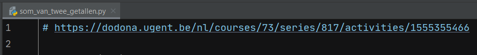
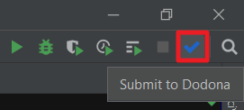

# Dodona PyCharm plugin

If you're programming in an IDE from JetBrains, e.g. [PyCharm](https://www.jetbrains.com/pycharm/), you can make use of the Dodona plugin to easily submit your solutions.

## 1. Create an API token
Before installing the plugin, you need to create an API token on the Dodona website. Using such token, PyCharm can submit solution on your behalf without needing your password. To create an API token, follow [this guide](/en/guides/creating-an-api-token). Keep the created token nearby because you'll need it in a few minutes when you use the plugin for the first time.

## 2. Install the plugin

You can install the plugin directly from PyCharm. Open the `File` menu and click `Settings...`.

In the `Plugins` menu, select the `Marketplace` tab and search for **Dodona**. Finally, click `Install` and `Restart`.

You can also install the plugin directly from the JetBrains website. Surf to [https://plugins.jetbrains.com/plugin/11166-dodona](https://plugins.jetbrains.com/plugin/11166-dodona), click on the blue `Install to IDE` button and select `PyCharm`.

## 3. Start a new exercise

Of course, PyCharm must know for which exercise it has to submit your solution. The easiest way to do this is by right clicking an existing project or folder in PyCharm. In the `New` menu, choose `Dodona Exercise`.

When creating your first exercise, PyCharm will ask for you API token. Paste the API token you just made in the first step.

Next, you should see a list of your Dodona courses. Pick the right course, exercise series and exercise. PyCharm will now automatically create a new file in which you can write your solution.

The first line of the newly created file will contain the link the selected exercise as a comment. PyCharm uses this line to submit to the correct exercise, so don't remove it. If you hold `ctrl` (or `cmd` on a mac) while clicking the URL, the exercise description will open in a new browser window.

## 4. Submit your solution

Once you've solved the exercise, it's easy to submit your solution. In the top right corner, you should see a blue check mark. Clicking this button will submit your code to Dodona and trigger an automatic test.

After a few seconds, you should see a popup in the bottom right corner containing the result of your submission. If you click the `More details` link, the result should open in a new browser version. If you're ready to submit again, simply click on the blue check mark. You can submit as many times as you want.

