# Courses on Dodona

On this page, you will find all the information you need to register and unsubscribe from a course as a student, navigate to a course, and interpret the submission status.

## What is a Course?

A course on Dodona is a learning path with [exercises](../exercises/#navigating-to-an-exercise) that are bundled into exercise series. If you are registered for a course, you can submit [solutions](../exercises/#submitting-a-solution) for the exercises within the course.

## Registering for a Course

To submit solutions for exercises in a course, you must be registered for that course.

### How to Find a Course

First, you need to find the course you want to register for. You can do this by clicking on `Browse all courses on Dodona` on your homepage.

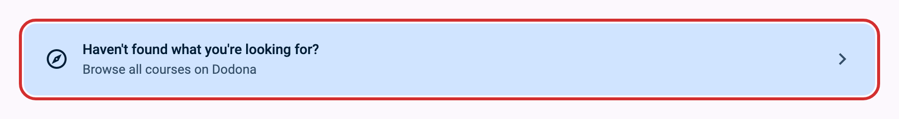

This will take you to an [overview of all courses](https://dodona.be/en/courses/). You will see one or more tabs where you can use the search bar to find the right course based on a course name, instructor name, educational institution name, or academic year.

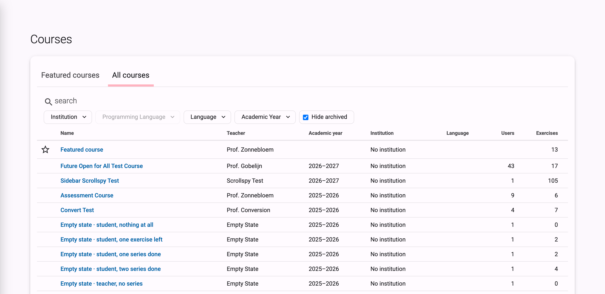

### How to Register

When you navigate to the course you searched for and are not yet registered, you will see a panel at the top of the course page indicating whether and how you can register for the course. There are three possibilities depending on how the course is configured:

- The course uses an **open registration procedure**, which means anyone can register for the course without explicit approval from a course administrator. Click the `Register` button to register for the course.

  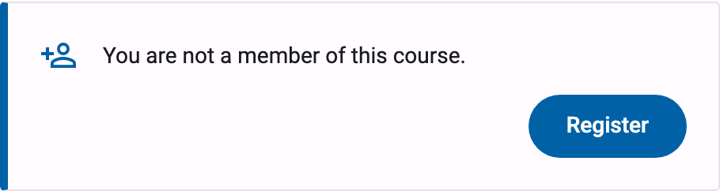

- The course uses a **moderated registration procedure**, which means you can submit a **registration request** that must then be approved or rejected by a course administrator. Only when your registration request is approved will you be effectively registered for the course. Click the ` Request registration` button to submit a registration request for the course.

  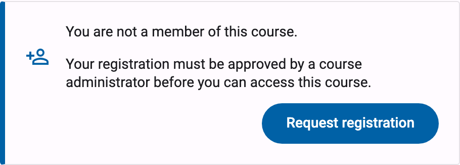

  As long as your registration request has not been approved or rejected by a course administrator, the message `Your registration is pending` will appear in the panel at the top of the course page, and the course will be listed in the `Pending` panel in the right column of your homepage.

  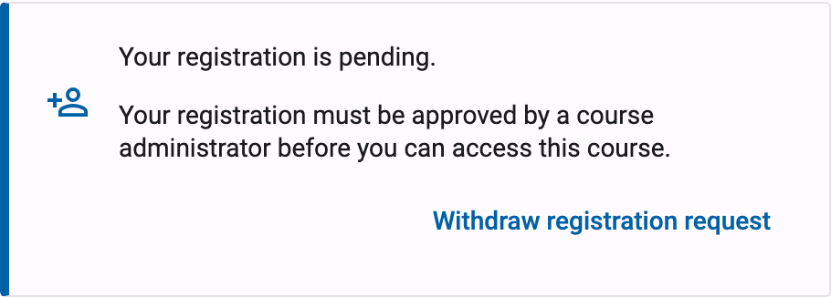

- The course uses a **closed registration procedure**, which means you cannot submit a registration request for the course. The instructor does not allow self-registration.

  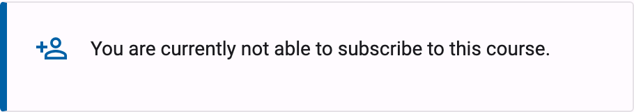

After you have registered, the course will be displayed on your personalized homepage.

In addition to the option to navigate to a course yourself and complete the registration procedure on the course page, it is also possible that you will receive a registration link from a course administrator (e.g., via email from an instructor). By clicking on the registration link, the registration procedure for a specific course will be initiated, and you will not need to navigate to the course yourself.

## Course Components

A course consists of various components. At the top of the course page, you will see the description of a course. Below that, under the heading `Learning path`, you can see the different exercise series of the course, each consisting of one or more exercises. In larger courses, these series can be grouped into [sections](#sections). On the right, [a sidebar](#the-course-sidebar) gives an overview of all series in the course.

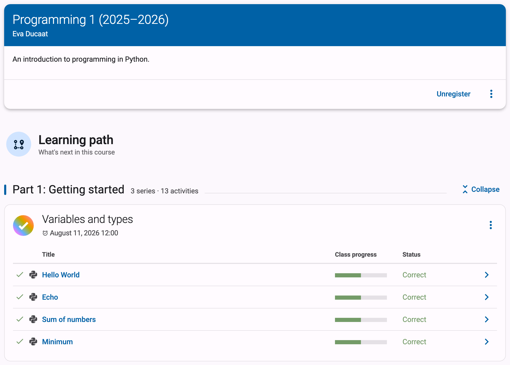

::: tip Tip

When working within a course, the name of the course appears next to `Dodona` on the left side of the navigation bar. By clicking on the course name in the navigation bar, you will navigate back to the course page.

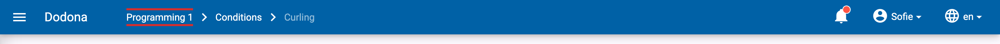
:::

### Exercise Series

An exercise series consists of a description, a number of exercises, and possibly a **deadline** set by the course administrator. If a deadline is set, it will be displayed under the name of the exercise series. When displaying the deadline, the time zone from your [user profile](../login-and-settings/#setting-your-personal-preferences) is taken into account. A deadline that has not yet expired is displayed in gray; once it has expired, it turns red, unless your last submission before the deadline was correct, in which case it turns green.

If a series has a deadline, only submitted solutions from before that time will be considered. After the deadline, you can still submit, but they may not count towards any evaluation. More details can be found in the section on [submission status](#submission-status).

Under the name of an exercise series, there is optionally a description, followed by a list of all exercises in the series. The list shows your submission status for each exercise and possibly the progress of the group. Before each exercise in the list, there is also an icon corresponding to your submission status for the exercise.

::: tip Same Exercise in Multiple Courses/Exercise Series
The same exercise can appear in multiple courses. Your submission status for the exercise will not be transferred. You must submit the exercise separately within each course.

The same exercise can also appear in multiple exercise series of the same course. Here, your submitted solutions will be considered for all occurrences of the exercise. Depending on the set deadlines of the series, the submission status may differ. In a series with a deadline, only solutions submitted before the deadline will be counted.
:::

In the menu of an exercise series, you will find the following options:

- `Show all learning activity descriptions`: Displays an overview where the names and descriptions of all exercises from the exercise series are neatly listed. Under each description, you will also see your [submission status](#submission-status) for the exercise. If you click on the submission status, you will navigate to the solution used to determine the submission status (if you have effectively submitted a solution based on which the submission status could be determined).

- `Export my submissions`: Downloads a ZIP file containing the submission for each exercise in the exercise series that was used to determine your [submission status](#submission-status) for the exercise (if you have effectively submitted a solution based on which the submission status could be determined).

### Sections

In larger courses, the course administrator can group exercise series into **sections**, for example one section per chapter or per part of the course. A section is displayed on the course page as a header above its series, together with the number of series and learning activities it contains. You can fold a section closed with the `Collapse` button next to its header, which is useful to keep the overview in a long course; click `Expand` to open it again.

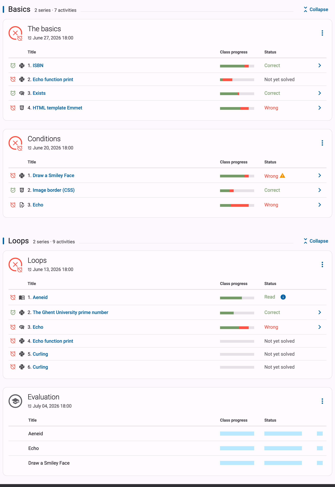

### The Course Sidebar

On larger screens, the right side of the course page shows a sidebar listing all exercise series of the course, grouped under their section names. Click the name of a series or section in the sidebar to jump to it on the page; while you scroll, the sidebar highlights the series you are currently looking at. In courses with many sections, the sidebar only keeps the section you are reading expanded.

If you are registered for the course, the sidebar also shows a progress bar for each series, with one coloured segment per exercise indicating whether you solved it, attempted it, or have not started it yet. Hover over the progress bar to see the details; the tooltip on the counter next to it reads, for example, `2 of 10 activities solved`. Optional series do not show a progress bar.

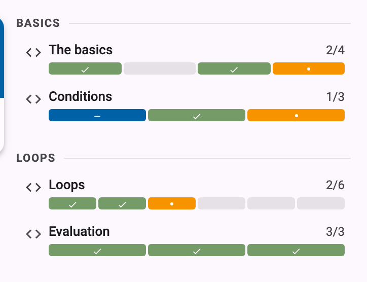

### Submission Status

Your submission status for an exercise from an exercise series is determined **based on the solution you last submitted in the course for the exercise**. If a deadline was set for the exercise series, this is the last submitted solution before the deadline. The status of an individual submission (`Correct`, `Wrong`, `Runtime Error`, ...) is a different concept; those statuses are explained in [Understanding Feedback](../feedback/#submission-statuses). In the exercise series, you will also see an **icon** corresponding to your submission status for the exercise before each exercise. If you click on your submission status for an exercise in an exercise series, you will navigate to the solution used to determine the submission status (if you have effectively submitted a solution based on which the submission status could be determined).

Possible displays of your submission status if no deadline is set or before the deadline expires:

| Submission Status | Icon                                                                     | Displayed if you                                     |
| --- |---------------------------------------------------------------------------|-------------------------------------------------------|
| `not solved` |                                                                             | have not submitted a solution                          |
| `incorrect` |             | the last solution you submitted was incorrect          |
| `correct` |             | the last solution you submitted was correct            |

Possible displays of your submission status after the deadline has expired:

| Submission Status | Icon | Displayed if you                                       |
| --- | --- |--------------------------------------------------------|
| `correct` (deadline met) |  | the last submitted solution before the deadline is correct |
| `deadline missed` |  | have not submitted any solutions before the deadline |
| `deadline missed` |  | your last submitted solution before the deadline is not correct |
| `correct` (after the deadline) | | you did not have a correct solution before the deadline, but your latest submission is correct |

The last row above is marked with a small info icon (ⓘ) next to the status instead of a deadline icon: it links to the correct solution you submitted, and its tooltip explains that it came in after the deadline.

::: tip Last Submitted Solution Before Deadline Counts

If you submit a solution for an exercise from an exercise series **before the deadline expires**, your submission status for the exercise can still change because that submission status is always based on your last submitted solution before the deadline. It is your responsibility to ensure that your last submitted solution before the deadline is also your most correct solution. You can optionally select a previous solution and resubmit it.

Dodona displays a **warning symbol** next to your submission status for an exercise in an exercise series if your last submitted solution for the exercise before the deadline of the exercise series has a status that is worse than the status of a solution for the exercise that you submitted before. You can optionally select a previous solution and resubmit it.

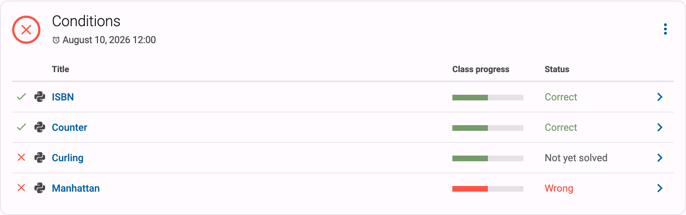

If you submit a solution for an exercise from an exercise series **after the deadline expires**, your submission status for the exercise in the exercise series will never change as a result. Your submission status for an exercise in an exercise series is determined based on your last submitted solution before the deadline.
:::

## Favourite Courses

On your homepage, each course you are registered for is shown as a course card. At the bottom of such a card, you will find a heart icon with which you can mark the course as a favourite (`Favorite`). Your favourite courses appear in a separate `Favorites` row at the top of your homepage, above the other courses, giving you quick access to the courses you work in most often. This row is always shown, regardless of the academic year you selected, so it is also a handy way to keep a course from a previous academic year close at hand. Click the heart icon again (`Unfavorite`) to remove a course from your favourites.

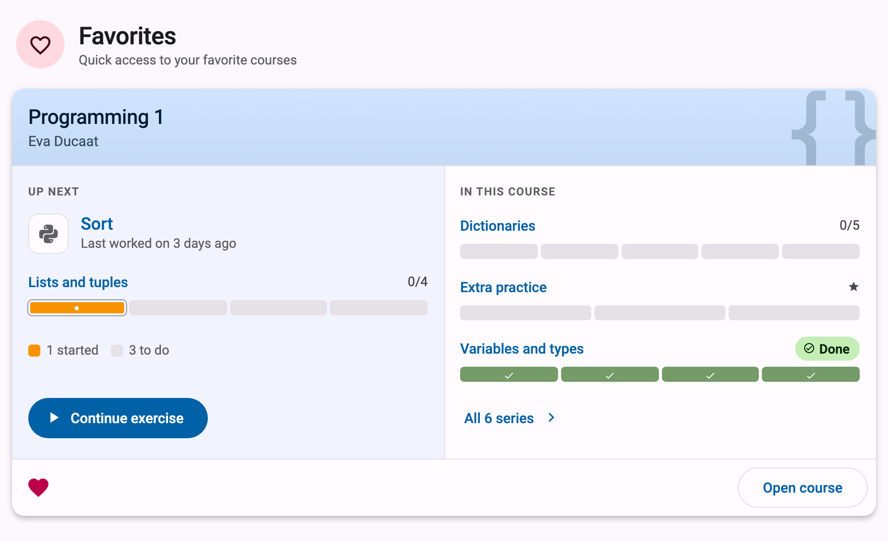

## Course Deadlines in Your Calendar

Dodona can provide the deadlines of a course as a calendar feed (iCalendar) that you can add to your own calendar application. On the course page, click the three dots at the bottom of the card with the course description and choose `Add course to calendar`.

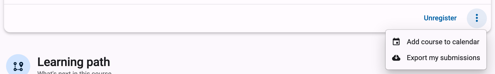

This link opens in your default calendar application (such as Apple Calendar or Outlook), which then subscribes to the feed. Alternatively, you can copy the link address and add it to your calendar application manually; in Google Calendar, for example, you can add a calendar via `From URL`. The feed contains an event for each exercise series with a deadline that is visible to you, with a link back to that series on Dodona. Because your calendar application subscribes to the feed, new or changed deadlines appear in your calendar automatically.

## Archived Courses

Courses from past academic years are archived on Dodona after a while. An archived course becomes read-only: you can no longer register for it or submit new solutions, but all your previous work remains available. You can still browse the exercises, review your submissions, and consult the feedback you received.

When you open an archived course, a banner at the top of the page reminds you of this: `This course is archived`. The course card on your homepage shows a similar message. Archived courses are also hidden by default in the [overview of all courses](#how-to-find-a-course); disable the `Hide archived` filter there to include them in the results.

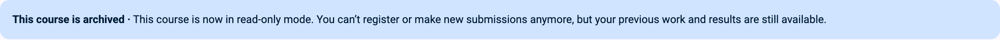

## Unsubscribing from a Course

If you navigate to a course for which you are [registered](#registering-for-a-course) or for which you still have a registration request open, you will see a `Unregister` button (or `Withdraw registration request`) below the course description on the course page, which you can use to unsubscribe from the course.

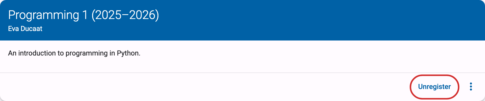

This will remove the course card from the left side of your homepage, and the course will no longer be listed on your [profile page](../login-and-settings/#setting-your-personal-preferences). If the course was listed under `Courses` in the hamburger menu on the left side of the navigation bar, the course will also be removed from that list. If the course was listed in the `Pending` panel in the right column of your homepage, the course will also be removed from that list.
