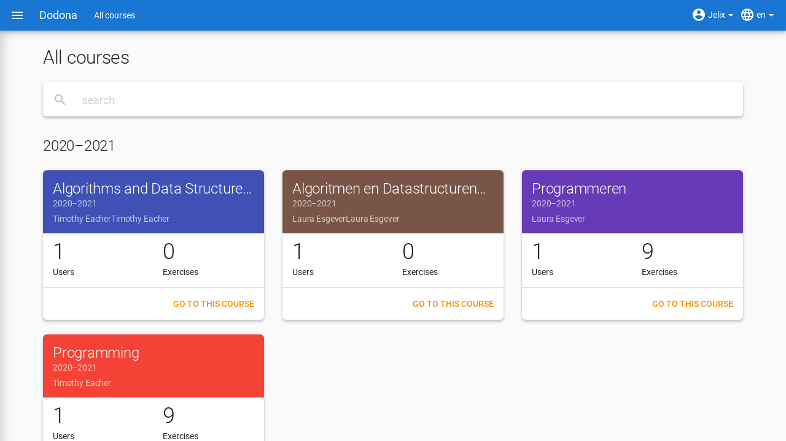
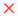

# Courses on Dodona

On this page, you will find all the information you need to register and unsubscribe from a course as a student, navigate to a course, and interpret the submission status.

## What is a Course?

A course on Dodona is a learning path with [exercises](../exercises/#navigating-to-an-exercise) that are bundled into exercise series. If you are registered for a course, you can submit [solutions](../exercises/#submitting-a-solution) for the exercises within the course.

## Registering for a Course

To submit solutions for exercises in a course, you must be registered for that course.

### How to Find a Course

First, you need to find the course you want to register for. You can do this by clicking on `More courses...` or `Explore courses` on your homepage.

This will take you to an [overview of all courses](https://dodona.be/en/courses/). You will see one or more tabs where you can use the search bar to find the right course based on a course name, instructor name, educational institution name, or academic year.

### How to Register

When you navigate to the course you searched for and are not yet registered, you will see a panel at the top of the course page indicating whether and how you can register for the course. There are three possibilities depending on how the course is configured:

- The course uses an **open registration procedure**, which means anyone can register for the course without explicit approval from a course administrator. Click the `Register` button to register for the course.

  

- The course uses a **moderated registration procedure**, which means you can submit a **registration request** that must then be approved or rejected by a course administrator. Only when your registration request is approved will you be effectively registered for the course. Click the ` Request registration` button to submit a registration request for the course.

  

  As long as your registration request has not been approved or rejected by a course administrator, the message `Your registration is pending` will appear in the panel at the top of the course page, and the course will be listed in the `Pending` panel in the right column of your homepage.

  

- The course uses a **closed registration procedure**, which means you cannot submit a registration request for the course. The instructor does not allow self-registration.

  

After you have registered, the course will be displayed on your personalized homepage.

In addition to the option to navigate to a course yourself and complete the registration procedure on the course page, it is also possible that you will receive a registration link from a course administrator (e.g., via email from an instructor). By clicking on the registration link, the registration procedure for a specific course will be initiated, and you will not need to navigate to the course yourself.

## Course Components

A course consists of various components. At the top of the course page, you will see the description of a course. Below that, you can see different exercise series, each consisting of one or more exercises.

::: tip Tip

When working within a course, the name of the course appears next to `Dodona` on the left side of the navigation bar. By clicking on the course name in the navigation bar, you will navigate back to the course page.

:::

### Exercise Series

An exercise series consists of a description, a number of exercises, and possibly a **deadline** set by the course administrator. If a deadline is set, it will be displayed under the name of the exercise series. When displaying the deadline, the time zone from your [user profile](../login-and-settings/#setting-your-personal-preferences) is taken into account. Deadlines are displayed in green if they have not yet expired and in red if they have already expired.

If a series has a deadline, only submitted solutions from before that time will be considered. After the deadline, you can still submit, but they may not count towards any evaluation. More details can be found in the section on [submission status](#submissionstatus).

Under the name of an exercise series, there is optionally a description, followed by a list of all exercises in the series. The list shows your submission status for each exercise and possibly the progress of the group. Before each exercise in the list, there is also an icon corresponding to your submission status for the exercise.

::: tip Same Exercise in Multiple Courses/Exercise Series
The same exercise can appear in multiple courses. Your submission status for the exercise will not be transferred. You must submit the exercise separately within each course.

The same exercise can also appear in multiple exercise series of the same course. Here, your submitted solutions will be considered for all occurrences of the exercise. Depending on the set deadlines of the series, the submission status may differ. In a series with a deadline, only solutions submitted before the deadline will be counted.
:::

In the menu of an exercise series, you will find the following options:

- `Show all learning activity descriptions`: Displays an overview where the names and descriptions of all exercises from the exercise series are neatly listed. Under each description, you will also see your [submission status](#submissionstatus) for the exercise. If you click on the submission status, you will navigate to the solution used to determine the submission status (if you have effectively submitted a solution based on which the submission status could be determined).

- `Export my submissions`: Downloads a ZIP file containing the submission for each exercise in the exercise series that was used to determine your [submission status](#submission-status) for the exercise (if you have effectively submitted a solution based on which the submission status could be determined).

### Submission Status

Your submission status for an exercise from an exercise series is determined **based on the solution you last submitted in the course for the exercise**. If a deadline was set for the exercise series, this is the last submitted solution before the deadline. In the exercise series, you will also see an **icon** corresponding to your submission status for the exercise before each exercise. If you click on your submission status for an exercise in an exercise series, you will navigate to the solution used to determine the submission status (if you have effectively submitted a solution based on which the submission status could be determined).

Possible displays of your submission status if no deadline is set or before the deadline expires:

| Submission Status | Icon                                                                                                                                                 | Displayed if you                                                      |
  | --- |------------------------------------------------------------------------------------------------------------------------------------------------------|-----------------------------------------------------------------------|
| `not solved` |                                                                                                                                                      | have not submitted a solution (before the deadline)                   |
| `incorrect` |                                                                                   | the last solution you submitted was incorrect                         |
| `correct` |   | the last solution you submitted was correct   before the deadline |

Possible displays of your submission status after the deadline has expired:

| Submission Status | Icon | Displayed if you                                       |
  | --- | --- |--------------------------------------------------------|
| `correct` (green) |  | the last submitted solution before the deadline is correct |
| `deadline missed` (red) |  | have not submitted any solutions                       |
| `deadline missed` (red) |  | your last submitted solution is not correct            |
| `deadline missed` (red) |  | submitted a correct solution after the deadline    |

::: tip Last Submitted Solution Before Deadline Counts

If you submit a solution for an exercise from an exercise series **before the deadline expires**, your submission status for the exercise can still change because that submission status is always based on your last submitted solution before the deadline. It is your responsibility to ensure that your last submitted solution before the deadline is also your most correct solution. You can optionally select a previous solution and resubmit it.

Dodona displays a **warning symbol** next to your submission status for an exercise in an exercise series and in the list of recent submissions on your homepage if your last submitted solution for the exercise before the deadline of the exercise series has a status that is worse than the status of a solution for the exercise that you submitted before. You can optionally select a previous solution and resubmit it.

If you submit a solution for an exercise from an exercise series **after the deadline expires**, your submission status for the exercise in the exercise series will never change as a result. Your submission status for an exercise in an exercise series is determined based on your last submitted solution before the deadline.
:::

## Unsubscribing from a Course

If you navigate to a course for which you are [registered](#registering-for-a-course) or for which you still have a registration request open, you will see a `Unregister` button (or `Withdraw registration request`) below the course description on the course page, which you can use to unsubscribe from the course.

This will remove the course card from the left side of your homepage, and the course will no longer be listed on your [profile page](../login-and-settings/#setting-your-personal-preferences). If the course was listed under `Courses` in the hamburger menu on the left side of the navigation bar, the course will also be removed from that list. If the course was listed in the `Pending` panel in the right column of your homepage, the course will also be removed from that list.