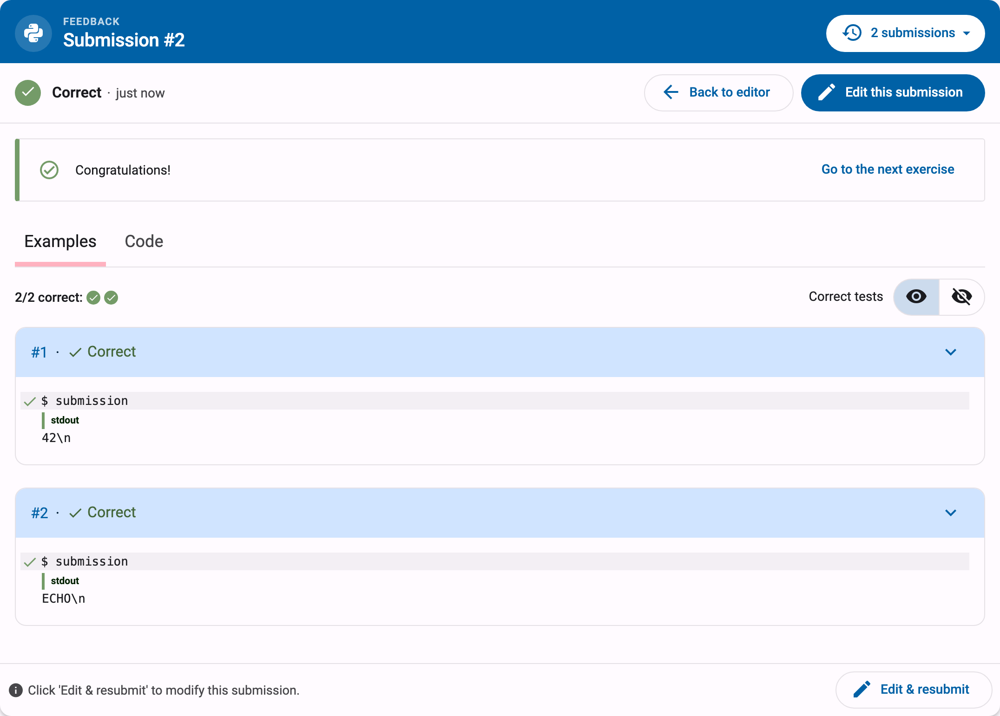
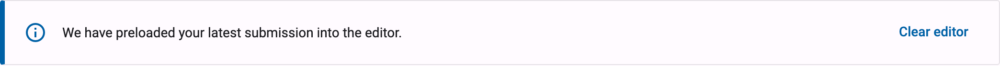
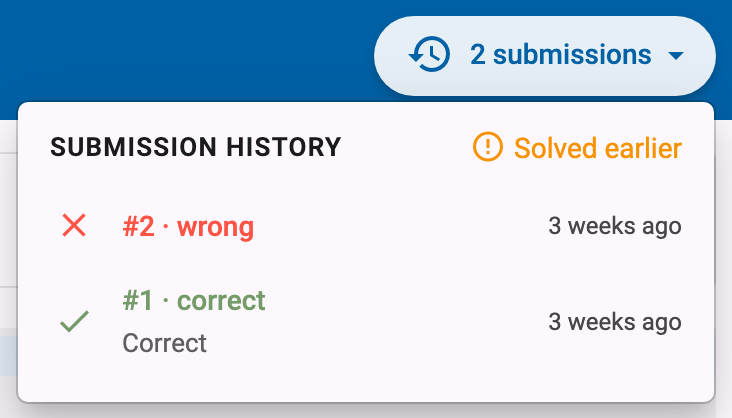

# Solving Exercises
All the information you need to navigate to exercises or solutions, submit solutions, and ask questions about your code as a student. What the feedback on a submission means is explained in detail in [Understanding Feedback](../feedback/).

## Navigating to an Exercise

Exercises on Dodona can either be part of a course or standalone.

- Exercises that belong to a course can be found by visiting the course page.
  
- Exercises that do not belong to a course can be found by visiting the [activity overview](https://dodona.be/en/activities/), which contains a list of all exercises.

::: tip Tip
On your homepage, you can find a list of the five most recent exercises you submitted solutions for across all courses. This way, you can quickly select an exercise you recently worked on by clicking on the exercise name.

:::

At the top of each exercise page, there is a panel with the name and description of the exercise. The display of these components depends on the selected language. If a translation of the name and description is provided in the selected language when creating the exercise, these components will also be displayed in that language.

::: tip

When performing an action on an exercise, the name of the exercise appears next to `Dodona` on the left side of the navigation bar, possibly preceded by the course name and the name of the exercise series from which you selected the exercise. By clicking on the exercise name in the navigation bar, you will navigate to the exercise page. By clicking on the exercise series name in the navigation bar, you will navigate to the exercise series on the course page. By clicking on the course name in the navigation bar, you will navigate to the course page.

:::

## Submitting a Solution

Below the panel with the exercise description, you will find the *hand-in panel*. Its header shows the name of the exercise and, in the top-right corner, a button with your number of submissions for this exercise (for example `1 submission`). The *code editor* is always visible in this panel: place the source code of your solution in the editor and click the `Submit` button at the bottom right to submit it. As the bar at the bottom of the panel reminds you: **you can submit as many times as you like, and only your latest submission will be taken into account**. Automatic feedback will be provided by the judge for each submission, which you can use to correct or further refine your solution.

For Python exercises, the `To sandbox` button next to the submit button opens [the Python sandbox](../scratchpad/), where you can run and debug your code in the browser before submitting it.

::: tip Deadlines
When the deadline of the exercise series is less than five minutes away, an alert appears above the editor with the exact deadline. Once the deadline has passed, the alert warns you that you can still submit, but that your submissions may no longer be taken into account.
:::

::: tip Use an IDE

Although you can program directly in the editor on Dodona, we do not recommend solving all exercises there. Instead, we advise using an [Integrated Development Environment](https://en.wikipedia.org/wiki/Integrated_development_environment) (IDE). IDEs provide more support during the writing, execution, testing, and debugging of source code. This way, you learn to apply your programming skills generically to solve problems other than just the exercises on Dodona.

Additionally, there is a plugin available for JetBrains IDEs such as [IntelliJ](https://www.jetbrains.com/idea/), [PyCharm](https://www.jetbrains.com/pycharm/), and [WebStorm](https://www.jetbrains.com/webstorm/specials/webstorm/webstorm.html). There is also an extension available for [**Visual Studio Code**](https://code.visualstudio.com/). Programmers using these IDEs can submit their solutions directly to Dodona using these tools. Without the tool, you would need to copy and paste the code into the editor on Dodona and click the submit button. Instructions can be found [here for PyCharm](/en/faq/ide-plugins/#how-do-i-install-the-pycharm-plugin) and [here for VS Code](/en/faq/ide-plugins/#how-do-i-install-the-vs-code-extension).
:::

After you click `Submit`, your solution is placed in a queue and evaluated by the judge; the submit button shows the progress (`Handing in…`, `Evaluating…`). This usually takes only a few seconds. As soon as the judge has finished, the detailed [feedback](../feedback/) appears in the hand-in panel itself, in place of the editor. A bar at the top of the panel shows the status of the submission (for example `Correct` or `Wrong`) with a short summary and the time of submission.

Judging continues while you look at something else. If you open an earlier submission from the submission history, or click `Edit & resubmit`, while your latest solution is still being judged, the panel keeps showing what you opened. A `New result!` message then appears at the top of the hand-in panel with the status of your new submission; click `View result` in that message to open its feedback. The message disappears once you open the result or hand in a new solution.

From the feedback you can go straight back to improving your code: click `Edit this submission` (or `Edit & resubmit` at the bottom of the panel) to load the code of the submission you are viewing back into the editor. If you had unsubmitted changes in the editor, the `Back to editor` button returns to the editor exactly as you left it.

When you return to an exercise you have submitted for before, the editor automatically contains the code of your latest submission. An info message above the editor, `We have preloaded your latest submission into the editor.`, tells you this happened. Prefer to start over? The button next to that message restores the exercise's initial code (`Restore the initial code`) or, if the exercise has none, empties the editor (`Clear editor`).

## Navigating to a Submission

You can navigate to your submitted solutions on Dodona in several ways. For each method, the submissions will be grouped differently by Dodona. Here are the two main methods:

- You can view all your submissions for a single exercise in the *submission history* of that exercise: click the button with your number of submissions (for example `2 submissions`) in the top-right corner of the hand-in panel. The submissions are listed in reverse chronological order (most recent at the top), with for each submission its number, status, a brief summary of the [feedback](../feedback/), and the submission time. Before each submission, there is also an [icon](../feedback/#submission-statuses) corresponding to its status. Click a submission to view its feedback in the hand-in panel.

- You can view all the solutions you have ever submitted by clicking on `My submissions` in the user menu in the navigation bar.

A submissions overview contains the submission number, submission time, status, and a brief summary of the feedback for each solution. Before each solution, there is also an [icon](../feedback/#submission-statuses) corresponding to the solution's status. The solutions are always listed in reverse chronological order (most recent at the top).

You can select a solution by clicking on the arrow to the right of the solution in a solutions overview. This will navigate you to the feedback page with detailed feedback about the solution. The same page is displayed when you click on the submission number.

## Reading Your Results

Whether you view the feedback in the hand-in panel or on the feedback page of a submission, it always contains the same detailed **feedback** about your solution. At the top, it shows the **status** the judge assigned to your solution (for example `Correct` or `Wrong`) and a brief summary of the result. Below that, the judge reports in detail on all tests your solution was subjected to, and the `Code` tab shows your source code with any comments the judge added.

The meaning of each status and the way the detailed feedback is structured are explained in [Understanding Feedback](../feedback/).

## Asking Questions
::: tip Note
This feature is only available if your teacher has enabled it.
:::

After you have submitted your solution, you can ask a question in three ways. At the top of the submitted code, you can ask a general question by clicking on `Ask a question about your code`. In addition, you can click on the pink circle to the left of the line number to ask a question about a specific line of code. You can also select a piece of code and then ask questions about it using the same button.

Type the question you want to ask the teacher in the text box. You can use Markdown to add extra formatting to your text. Finally, click on `Ask question`.

::: tip Markdown support

You can add extra formatting with Markdown by:

- asterisks (\*) around words to make it italic. \*italic text\* will be displayed as *italic text*.
- double asterisks (\**) around words to make it bold. \*\*bold text\*\* will be displayed as **bold text**.
- backticks (\`) around a piece of code. \`Variables\` will be displayed as `Variables`.

Here you can view [all the possibilities of Markdown](/en/references/exercise-description/#markdown).
:::

You can also respond to an existing question from yourself or to a comment from a teacher. To do this, click on `Reply` below the question or comment. Type your response in the text box and click on `Reply`.
