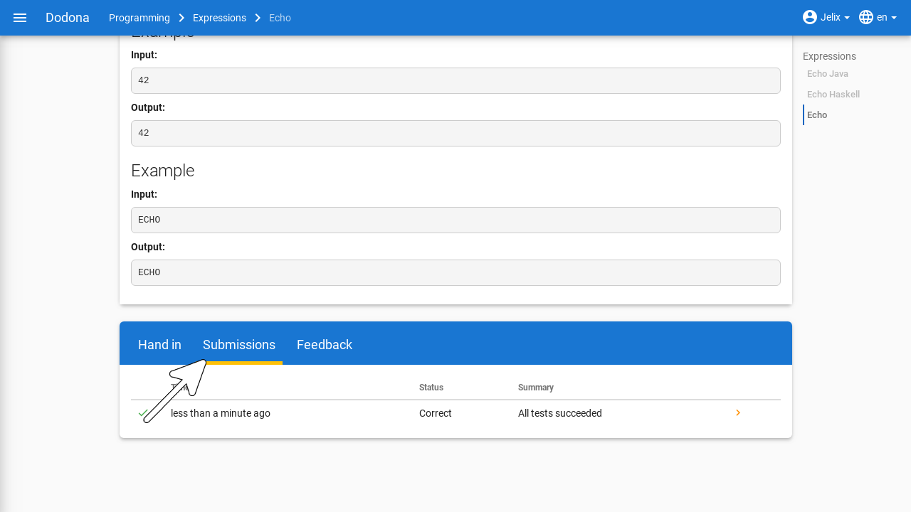
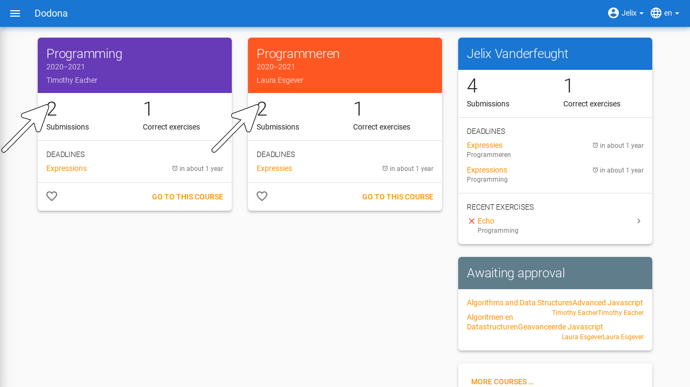
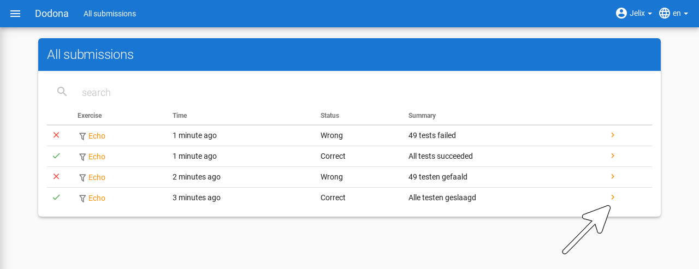

::: warning Sorry
For now, this page is only available in Dutch. Sorry!
:::

# Oefeningen oplossen
> Alle informatie zodat je als student kan navigeren naar oefeningen of oplossingen, oplossingen kan indienen en feedback kan interpreteren.

**Inhoudsopgave**
[[toc]]

## Navigeren naar een oefening

Oefeningen op Dodona kunnen ofwel voorkomen in een cursus, ofwel daarbuiten.

- Oefeningen die tot een cursus behoren, kan je vinden door de pagina van een cursus te bezoeken.
    
- Oefeningen die niet tot een cursus behoren, kan je vinden door het [activiteitenoverzicht](https://dodona.ugent.be/nl/activities/) te bezoeken dat een lijst bevat van alle oefeningen.

::: tip Tip
Op je startpagina kan je een lijst vinden van de vijf laatste oefeningen waar je het laatst oplossingen voor ingediend hebt over alle cursussen heen. Zo kan je op een snelle manier een oefening waar je recent op hebt gewerkt selecteren door op de naam van de oefening te klikken.

:::

Op elke oefeningenpagina staat bovenaan een paneel met de naam en de beschrijving van de oefening. De weergave van deze componenten is afhankelijk van de geselecteerde taal. Als bij het opstellen van de oefening een vertaling voorzien werd van de naam en de beschrijving in de geselecteerde taal, dan zullen deze componenten van de oefening ook in die taal weergegeven worden.

::: tip

Als je een actie aan het uitvoeren bent op een oefening dan verschijnt de naam van de oefening naast `Dodona` aan de linkerkant van de navigatiebalk, eventueel voorafgegaan door de naam van de cursus en de naam van de oefeningenreeks waaruit je de oefening geselecteerd hebt. Door in de navigatiebalk op de naam van de oefening te klikken, navigeer je naar de oefeningpagina. Door in de navigatiebalk op de naam van de oefeningenreeks te klikken, navigeer je naar de oefeningenreeks op de cursuspagina. Door in de navigatiebalk op de naam van de cursus te klikken, navigeer je naar de cursuspagina.

:::

## Indienen van een oplossing

Op een oefeningpagina staat onder het paneel met de beschrijving van de oefening een tweede paneel waarmee je een oplossing kunt indienen voor de oefening. Klik hiervoor op de tab `Indienen`, als deze tab niet geselecteerd was, en plaats de broncode van je oplossing in de *code editor*. Klik daarna op de indienknop in de rechterbovenhoek van het paneel om je oplossing in te dienen. **Je mag zoveel indienen als je wil. Er wordt enkel rekening gehouden met het resultaat van jouw laatste oplossing**. Bij elke oplossing wordt [automatische feedback](#interpreteren-van-feedback) door de judge gegeven die je kan gebruiken om je oplossing te corrigeren of verder te verfijnen.

::: tip Gebruik een IDE

Alhoewel je perfect kan programmeren in de editor op Dodona zelf, raden we niet aan om alle oefeningen hierin op te lossen. In plaats daarvan adviseren we om een [Integrated Development Environment](https://nl.wikipedia.org/wiki/Integrated_development_environment) (IDE) te gebruiken. IDE's geven namelijk meer ondersteuning tijdens het schrijven, uitvoeren, testen en debuggen van broncode. Op die manier leer je je programmeervaardigheden generiek in te zetten om andere problemen aan te pakken dan enkel de oefeningen uit Dodona.

Bovendien zijn is er een plugin voorzien voor de JetBrains IDE's zoals [IntelliJ](https://www.jetbrains.com/idea/), [PyCharm](https://www.jetbrains.com/pycharm/), en [WebStorm](https://www.jetbrains.com/webstorm/specials/webstorm/webstorm.html). Ook voor [**Visual Studio Code**](https://code.visualstudio.com/) is een extensie voorzien. Programmeurs die met die IDE's werken kunnen hun oplossingen rechtstreeks in Dodona indienen met behulp van die tool. Zonder die tool moet je code kopiëren en plakken in het indieningstekstvak op Dodona en op de oranje cirkel te klikken. Instructies vind je [hier voor PyCharm](../../pycharm-plugin/) en [hier voor VS Code](../../vs-code-extension/).
:::

Na het indienen van een oplossing wordt automatisch de tab `Oplossingen` geselecteerd. Deze tab bevat een overzicht van alle oplossingen die je in de cursus hebt ingediend voor de oefening. Deze oplossingen worden in het overzicht opgelijst in omgekeerde chronologische volgorde (meest recente bovenaan), waardoor de oplossing die je net hebt ingediend helemaal bovenaan staat. Het overzicht bevat voor elke oplossing het tijdstip van indienen, de status en een korte samenvatting van de [feedback](#interpreteren-van-feedback). In het overzicht zie je vóór elke oplossing ook een [icoontje](../courses/#indienstatus) dat overeenkomt met de status van de oplossing.

Na het indienen wordt je oplossing in een wachtrij geplaatst. Zolang een oplossing in de wachtrij staat heeft ze de status `In de wachtrij...`. Van zodra het platform klaar is om een oplossing te beoordelen, wordt de eerst ingediende oplossing uit de wachtrij uitgevoerd en beoordeeld door het systeem. Tijdens het beoordelen heeft een oplossing de status `Aan het uitvoeren...`. Meestal duurt dit maar enkele seconden.

Zodra de judge klaar is met het beoordelen van je oplossing krijgt ze haar finale status en wordt de feedbackpagina met gedetailleerde [feedback](#interpreteren-van-feedback) over de oplossing automatisch weergegeven in een nieuwe tab `Feedback`.

## Navigeren naar een oplossing

Je kan op Dodona op verschillende manieren naar je ingediende oplossingen navigeren. Voor elke manier zullen de oplossingen door Dodona op een andere manier gegroepeerd worden. Hieronder volgen de drie belangrijkste manieren:

- Je kan al jouw oplossingen van één oefening bekijken door op de `Oplossingen` tab op de relevante oefeningenpagina te klikken.

- Je kan al jouw oplossingen binnen een cursus bekijken door op de `Ingediende oplossingen` van de relevante cursus kaart te klikken.

- Je kan alle oplossingen die je ooit hebt ingediend zien door in het gebruikersmenu in de navigatiebalk op `Mijn oplossingen` te klikken.

Een oplossingenoverzicht bevat voor elke oplossing het tijdstip van indienen, de status en een korte samenvatting van de feedback. Vóór elke oplossing staat ook nog een [icoontje](../courses/#indienstatus) dat overeenkomt met de status van de oplossing. In het overzicht worden je oplossingen altijd opgelijst in omgekeerde chronologische volgorde (meest recente bovenaan).

Je kunt een oplossing selecteren door in een oplossingenoverzicht op het pijltje te klikken aan rechterkant van de oplossing. Hierdoor navigeer je naar de feedbackpagina met de gedetailleerde feedback over de oplossing.

## Interpreteren van feedback

Op de feedbackpagina staat gedetailleerde **feedback** over een oplossing die je ingediend hebt voor een oefening. Zo snel mogelijk na het indienen wordt de oplossing automatisch beoordeeld door een judge die aan de oefening gekoppeld is. Als motivatie van zijn beoordeling voorziet de judge gedetailleerde feedback over de oplossing.

Aan de bovenkant van de feedbackpagina staan de volgende gegevens over de oplossing:

- `Opgave`: De **naam** van de oefening waarvoor de oplossing werd ingediend. Klik op de naam om naar de oefeningpagina te navigeren.

- `Cursus`: De **naam van de cursus** waarbinnen de oplossing werd ingediend. Klik op de naam om naar de cursuspagina te navigeren. Dit informatieveld ontbreekt als de oplossing niet binnen de context van een cursus werd ingediend.

- `Ingediend`: Het **tijdstip** waarop de oplossing werd ingediend. Dit tijdstip wordt op een gebruiksvriendelijke manier weergegeven, bijvoorbeeld *ongeveer 2 uur geleden*. Als je de cursor boven het tijdstip plaatst dan krijg je de gedetailleerde weergave van het tijdstip te zien.

- `Status`: De **status** die Dodona of de judge aan de oplossing heeft toegekend. Met elke status correspondeert een **icoontje** dat in elke oplijsting van de oplossing wordt weergegeven. Betekenis van de mogelijke statussen die aan de oplossing kunnen toegekend worden:

    | status               | icoontje             | betekenis            |
    |----------------------|----------------------|----------------------|
    | `In de wachtrij…` |  | oplossing staat in de wachtrij |
    | `Aan het uitvoeren...` |  | oplossing wordt momenteel beoordeeld door de judge |
    | `Correct` |  | oplossing wordt momenteel beoordeeld door de judge |
    | `Fout` |  | logische fout opgeworpen tijdens het uitvoeren van minstens één test |
    | `Uitvoeringsfout` |  | onverwachte fout opgeworpen tijdens het uitvoeren van minstens één test |
    | `Timeout` |  | tijdslimiet vastgelegd voor de oefening werd overschreden tijdens het testen; kan wijzen op slechte performantie of een oneindige lus. |
    | `Geheugenfout` |  | geheugenlimiet vastgelegd voor de oefening werd overschreden tijdens het uitvoeren van minstens één test |
    | `Compilatiefout` |  | oplossing bevat grammaticale fouten |
    | `Interne fout` |  | judge is gecrasht tijdens het beoordelen van de oplossing; oorzaak van fout ligt dus niet bij de oplossing maar bij het falen van de judge |

    Hoe lager de status in bovenstaande tabel wordt opgelijst, hoe zwaarder het soort fout dat ermee correspondeert.

* `Samenvatting`: Korte samenvatting van het resultaat die de judge aan de oplossing heeft toegekend.

Onder de korte samenvatting staat meer gedetailleerde feedback die de judge kan uitgesplitst hebben over meerdere *tabs*. Naast de naam van een tab kan aan de rechterkant een *badge* staan met daarin een getal. Het getal geeft aan hoeveel fouten de judge gevonden heeft bij het uitvoeren van de testen waarover hij rapporteert onder de tab. 

De laatste tab heeft altijd de naam `Code` en bevat de broncode van de oplossing. Op bepaalde plaatsen in de broncode kan de judge opmerkingen toegevoegd hebben (bijvoorbeeld over de programmeerstijl) die ook kunnen motiveren waarom hij een bepaalde status aan de oplossing toegekend heeft.

::: tip Tip

In de tab `Code` op de feedbackpagina kan je de broncode van de oplossing niet wijzigen. Je moet hiervoor op de bewerkknop klikken in de rechterbovenhoek van de feedbackpagina. De broncode van de oplossing waar je op dat moment naar kijkt wordt dan ingeladen in de in de editor. Daar kan je de broncode bewerken en daarna eventueel opnieuw indienen.
:::

Per tab rapporteert de judge over individuele **testen** waaraan hij de broncode onderworpen heeft. Daarbij worden gerelateerde testen gegroepeerd in een **testgeval** en worden testgevallen die van elkaar afhankelijk zijn gegroepeerd in een **context**.

Visueel worden alle testgevallen van een context met elkaar verbonden via een dunne verticale lijn aan de linkerkant. De kleur van die lijn geeft aan of de judge de volledige context beoordeelt als geslaagd (groene lijn) of als niet geslaagd (rode lijn).

Aan de rechterkant van de dunne verticale lijn worden de testgevallen van de context onder elkaar weergegeven. De beschrijving van een testgeval wordt weergegeven binnen een rechthoek met lichtgrijze achtergrondkleur die over de volledige breedte loopt. In de rechterbovenhoek van die rechthoek staat een gekleurd symbool dat aangeeft of de judge het volledige testgeval beoordeelt als geslaagd (groen vinkje) of als niet geslaagd (rood kruisje).

Als de judge binnen een testgeval rapporteert over individuele testen, dan worden die opgelijst onder de rechthoek met lichtgrijze achtergrond waarin de beschrijving van het testgeval staat. Om visueel onderscheid te maken met de weergave van het testgeval, wordt elke test weergegeven met een kleine marge links en rechts. De weergave van een test bestaat zelf uit de volgende optionele componenten die onder elkaar worden weergegeven:

-   Een beschrijving van de uitgevoerde test. Deze beschrijving wordt weergegeven binnen een rechthoek met dezelfde lichtgrijze achtergrondkleur als bij de beschrijving van een testgeval.

-   Een tekstuele vergelijking tussen een verwachte waarde en een waarde die gegenereerd werd aan de hand van de oplossing. Als minstens één van beide waarden uit meerdere regels bestaat, dan worden de overeenkomstige regels tegenover elkaar uitgelijnd. Identieke overeenkomstige regels worden weergegeven met een transparante achtergrondkleur. Als overeenkomstige regels van elkaar verschillen dan worden ze weergegeven met een lichtgekleurde achtergrondkleur (groen voor de verwachte waarde en rood voor de gegenereerde waarde). Individuele karakters die verschillen binnen overeenkomstige regels worden weergegeven met een donkerder achtergrondkleur (groen voor de verwachte waarde en rood voor de gegenereerde waarde).

-   Algemene feedback over de uitgevoerde test. Voor deze feedback heeft de judge alle vrijheid wat betreft de vormgeving, waardoor hij zowel tekstuele als grafische feedback kan aanleveren.
    

    

## Vragen stellen

Nadat je je oplossing hebt ingediend, kan je op drie manieren een vraag stellen. Bovenaan de ingediende code kan je een algemene vraag stellen door op `Stel een vraag over je code` te klikken. Daarnaast kan je links van het regelnummer op de roze cirkel klikken een vraag stellen bij een specifieke regel code. Je kan ook een stuk code selecteren en dan hierover vragen stellen via diezelfde knop.

Typ in het tekstvak de vraag die je aan de lesgever wil stellen. Je kan Markdown gebruiken om je tekst extra opmaak te geven. Klik als laatste op `Vraag stellen`.

::: tip Ondersteuning voor Markdown

Je kan met Markdown extra opmaak toevoegen door:

- asterisken (\*) rond woorden te zetten om het schuin weer te geven. \*schuine tekst\* wordt bijvoorbeeld weergegeven als *schuine tekst*.
- twee asterisken (\**) rond woorden te zetten om het in het vet weer te geven. \*\*vette tekst\*\* wordt bijvoorbeeld weergegeven als **vette tekst**.
- backticks (\`) rond een stukje code te zetten. \`Variabelen\` wordt bijvoorbeeld weergegeven als `Variabelen`.

Bekijk hier [alle mogelijkheden van Markdown](../../../references/exercise-description/#markdown).
:::

Daarnaast kan je ook reageren op een bestaande vraag van jezelf of op een opmerking van een lesgever. Klik hiervoor op `Reageer` onder de vraag of opmerking. Typ je reactie in het tekstvak en klik op `Reageer`.