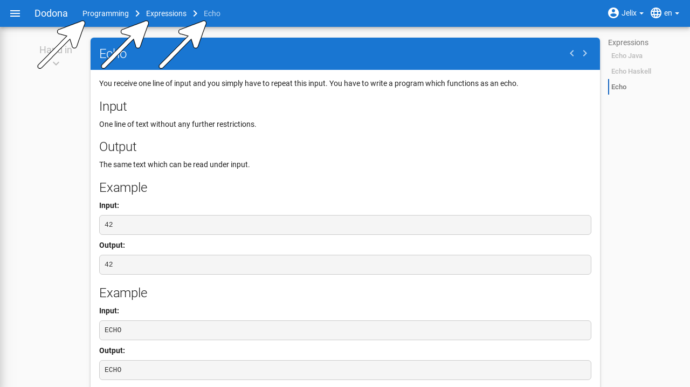
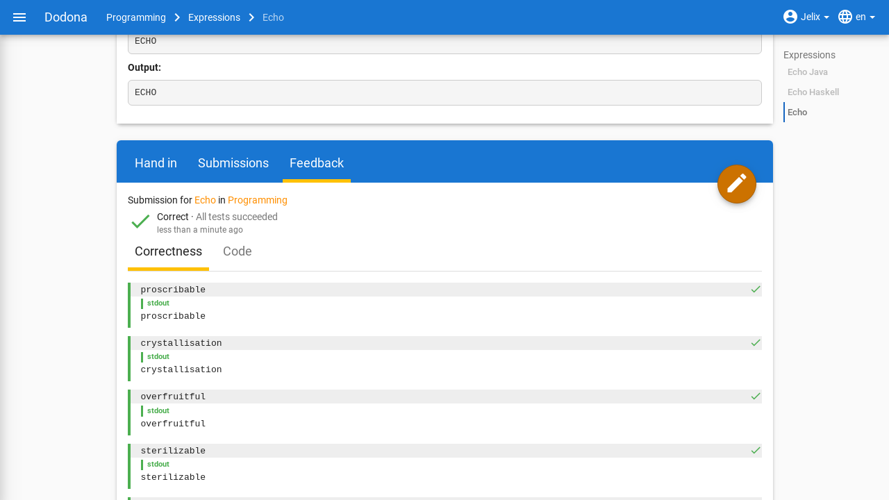
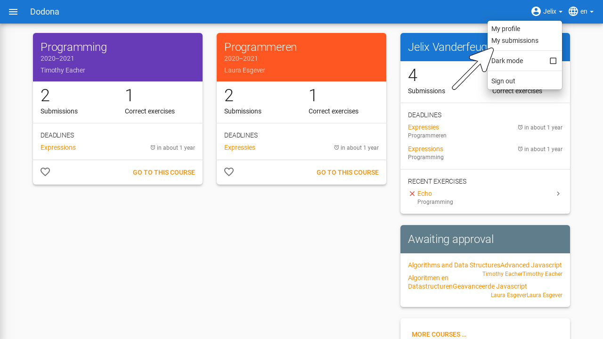
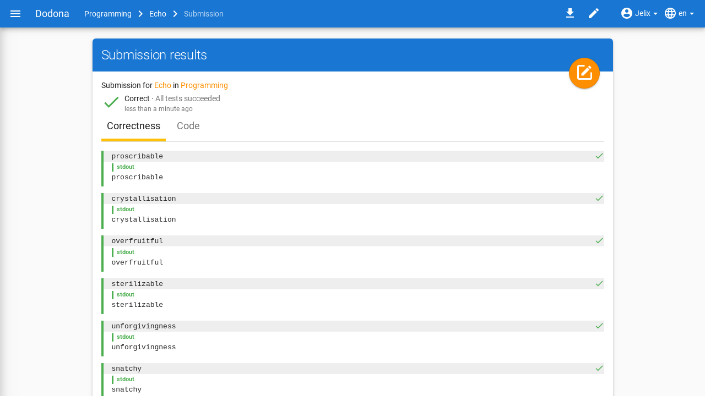
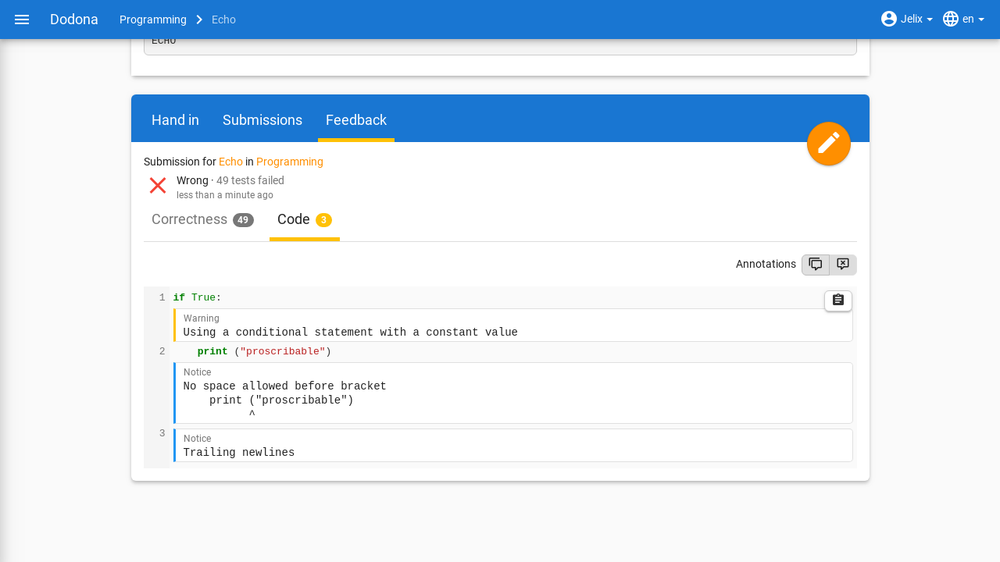

# Solving Exercises
All the information you need to navigate to exercises or solutions, submit solutions, and interpret feedback as a student.

## Navigating to an Exercise

Exercises on Dodona can either be part of a course or standalone.

- Exercises that belong to a course can be found by visiting the course page.
  
- Exercises that do not belong to a course can be found by visiting the [activity overview](https://dodona.be/en/activities/), which contains a list of all exercises.

::: tip Tip
On your homepage, you can find a list of the five most recent exercises you submitted solutions for across all courses. This way, you can quickly select an exercise you recently worked on by clicking on the exercise name.

:::

At the top of each exercise page, there is a panel with the name and description of the exercise. The display of these components depends on the selected language. If a translation of the name and description is provided in the selected language when creating the exercise, these components will also be displayed in that language.

::: tip

When performing an action on an exercise, the name of the exercise appears next to `Dodona` on the left side of the navigation bar, possibly preceded by the course name and the name of the exercise series from which you selected the exercise. By clicking on the exercise name in the navigation bar, you will navigate to the exercise page. By clicking on the exercise series name in the navigation bar, you will navigate to the exercise series on the course page. By clicking on the course name in the navigation bar, you will navigate to the course page.

:::

## Submitting a Solution

On an exercise page, below the panel with the exercise description, there is a second panel where you can submit a solution for the exercise. Click on the `Hand in` tab if it is not already selected, and place the source code of your solution in the *code editor*. Then click the submit button in the upper right corner of the panel to submit your solution. **You can submit as many times as you want. Only the result of your last submission will be considered**. Automatic feedback will be provided by the judge for each submission, which you can use to correct or further refine your solution.

::: tip Use an IDE

Although you can program directly in the editor on Dodona, we do not recommend solving all exercises there. Instead, we advise using an [Integrated Development Environment](https://en.wikipedia.org/wiki/Integrated_development_environment) (IDE). IDEs provide more support during the writing, execution, testing, and debugging of source code. This way, you learn to apply your programming skills generically to solve problems other than just the exercises on Dodona.

Additionally, there is a plugin available for JetBrains IDEs such as [IntelliJ](https://www.jetbrains.com/idea/), [PyCharm](https://www.jetbrains.com/pycharm/), and [WebStorm](https://www.jetbrains.com/webstorm/specials/webstorm/webstorm.html). There is also an extension available for [**Visual Studio Code**](https://code.visualstudio.com/). Programmers using these IDEs can submit their solutions directly to Dodona using these tools. Without the tool, you would need to copy and paste the code into the submission text box on Dodona and click the orange circle. Instructions can be found [here for PyCharm](/en/faq/ide-plugins/#how-do-i-install-the-PyCharm-plugin) and [here for VS Code](/en/faq/ide-plugins/#how-do-i-install-the-VS-Code-extension).
:::

After submitting a solution, the `Submissions` tab is automatically selected. This tab contains an overview of all the solutions you have submitted for the exercise within the course. These solutions are listed in reverse chronological order (most recent at the top), so the solution you just submitted will be at the very top. The overview includes the submission time, status, and a brief summary of the [feedback](#interpreting-feedback) for each solution. Before each solution, there is also an [icon](../courses/#submission-status) corresponding to the solution's status.

After submission, your solution is placed in a queue. While a solution is in the queue, it has the status `Queued...`. As soon as the platform is ready to evaluate a solution, the first submitted solution from the queue is executed and evaluated by the system. During evaluation, a solution has the status `Running...`. This usually takes only a few seconds.

Once the judge has finished evaluating your solution, it receives its final status, and the feedback page with detailed [feedback](#interpreting-feedback) about the solution is automatically displayed in a new tab called `Feedback`.

## Navigating to a Submission

You can navigate to your submitted solutions on Dodona in several ways. For each method, the submissions will be grouped differently by Dodona. Here are the three main methods:

- You can view all your submissions for a single exercise by clicking on the `Submissions` tab on the relevant exercise page.

- You can view all the solutions you have ever submitted by clicking on `My Solutions` in the user menu in the navigation bar.

A submissions overview contains the submission number, submission time, status, and a brief summary of the feedback for each solution. Before each solution, there is also an [icon](../courses/#submission-status) corresponding to the solution's status. The solutions are always listed in reverse chronological order (most recent at the top).

You can select a solution by clicking on the arrow to the right of the solution in a solutions overview. This will navigate you to the feedback page with detailed feedback about the solution. The same page is displayed when you click on the submission number.

## Interpreting Feedback

The feedback page contains detailed **feedback** about a solution you submitted for an exercise. As soon as possible after submission, the solution is automatically evaluated by a judge associated with the exercise. The judge provides detailed feedback on the correctness of the submission, which you can use to correct or further refine your solution.

At the top of the feedback page, the following information about the solution is displayed:

- `Exercise`: The **name** of the exercise for which the solution was submitted. Click on the name to navigate to the exercise page.

- `Course`: The **name of the course** within which the solution was submitted. Click on the name to navigate to the course page. This information field is omitted if the solution was not submitted within the context of a course.

- `Submitted`: The **time** at which the solution was submitted. This time is displayed in a user-friendly manner, for example, *about 2 hours ago*. If you hover the cursor over the time, you will see the detailed display of the time.

- `Status`: The **status** assigned to the solution by Dodona or the judge. Each status corresponds to an **icon** that is displayed in every listing of the solution. Meaning of the possible statuses that can be assigned to the solution:

  | Status                  | Icon                                                                    | Meaning                                                                                                           |
  |-------------------------|-------------------------------------------------------------------------|-------------------------------------------------------------------------------------------------------------------|
  | `Queued…`               |                 | Solution is in the queue                                                                                          |
  | `Running...`            |                | Solution is currently being evaluated by the judge                                                                |
  | `Correct`               |                | All tests have succeeded.                                                                                         |
  | `Wrong`                 |                  | Logical error encountered during the execution of at least one test                                               |
  | `Runtime Error`         |          | Unexpected error encountered during the execution of at least one test                                            |
  | `Timeout`               |    | Time limit for the exercise was exceeded during testing; may indicate poor performance or an infinite loop.       |
  | `Memory limit exceeded` |  | Memory limit for the exercise was exceeded during the execution of at least one test                              |
  | `Compilation Error`     |      | Solution contains grammatical errors                                                                              |
  | `Internal Error`        |         | Judge crashed during the evaluation of the solution; the cause of the error lies with the judge, not the solution |

  The lower a status is listed in the table above, the more severe the type of error it corresponds to.

* `Summary`: Brief summary of the result assigned to the solution by the judge.

Below the brief summary, there is more detailed feedback that the judge may have split across multiple *tabs*. Next to the name of a tab, there may be a *badge* on the right side with a number. The number indicates how many errors the judge found while executing the tests reported under that tab.

The last tab is always named `Code` and contains the source code of the solution. In certain places in the source code, the judge may have added comments (e.g., about coding style) that may also explain why a particular status was assigned to the solution.

::: tip Tip

In the `Code` tab on the feedback page, you cannot modify the source code of the solution. You must click the edit button in the upper right corner of the feedback page. The source code of the solution you are currently viewing will then be loaded into the editor. There you can edit the source code and possibly resubmit it.
:::

For each tab, the judge reports on individual **tests** to which the source code was subjected. Related tests are grouped into a **test case**, and interdependent test cases are grouped into a **context**.

Visually, all test cases of a context are grouped in an expandable card.
The header of the card will contain `Correct` or `Wrong` depending on the judge's assessment of the entire context.
If some, but not all contexts are correct, the correct contexts will be collapsed by default, and the incorrect contexts will be expanded by default.

Within a context, the test cases of the context are displayed one below the other. The description of a test case is displayed within a rectangle with a light gray background color that spans the full width. In the upper left corner of that rectangle, there is a colored symbol indicating whether the judge considers the entire test case to be successful (green checkmark) or unsuccessful (red cross).

If the judge reports on individual tests within a test case, they are listed below the rectangle with the light gray background containing the test case description. To visually distinguish it from the test case display, each test is displayed with a small margin on the left and right. The display of a test consists of the following optional components, which are displayed one below the other:

-   A description of the executed test. This description is displayed within a rectangle with the same light gray background color as the test case description.

-   A textual comparison between an expected value and a value generated based on the solution. If at least one of the values consists of multiple lines, the corresponding lines are aligned opposite each other. Identical corresponding lines are displayed with a transparent background color. If corresponding lines differ, they are displayed with a light-colored background color (green for the expected value and red for the generated value). Individual characters that differ within corresponding lines are displayed with a darker background color (green for the expected value and red for the generated value).

-   General feedback about the executed test. For this feedback, the judge has complete freedom regarding the formatting, allowing for both textual and graphical feedback.
    

    

## Asking Questions
::: tip Note
This feature is only available if your teacher has enabled it.
:::

After you have submitted your solution, you can ask a question in three ways. At the top of the submitted code, you can ask a general question by clicking on `Ask a question about your code`. In addition, you can click on the pink circle to the left of the line number to ask a question about a specific line of code. You can also select a piece of code and then ask questions about it using the same button.

Type the question you want to ask the teacher in the text box. You can use Markdown to add extra formatting to your text. Finally, click on `Ask question`.

::: tip Markdown support

You can add extra formatting with Markdown by:

- asterisks (\*) around words to make it italic. \*italic text\* will be displayed as *italic text*.
- double asterisks (\**) around words to make it bold. \*\*bold text\*\* will be displayed as **bold text**.
- backticks (\`) around a piece of code. \`Variables\` will be displayed as `Variables`.

Here you can view [all the possibilities of Markdown](/en/references/exercise-description/#markdown).
:::

You can also respond to an existing question from yourself or to a comment from a teacher. To do this, click on `Reply` below the question or comment. Type your response in the text box and click on `Reply`.
