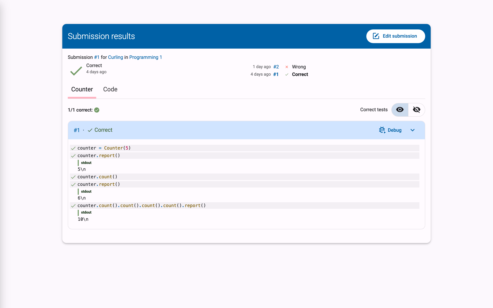
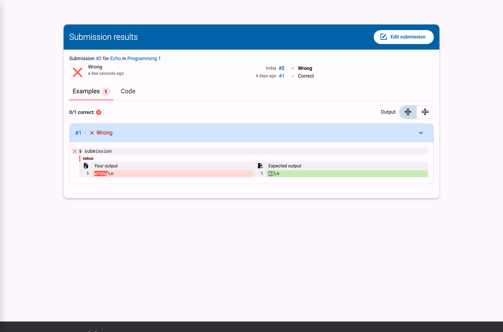
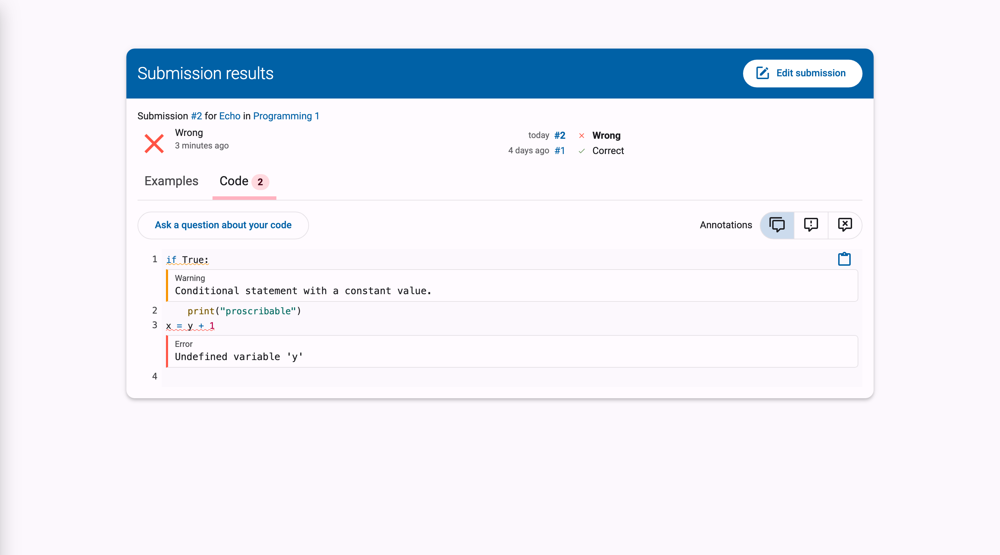
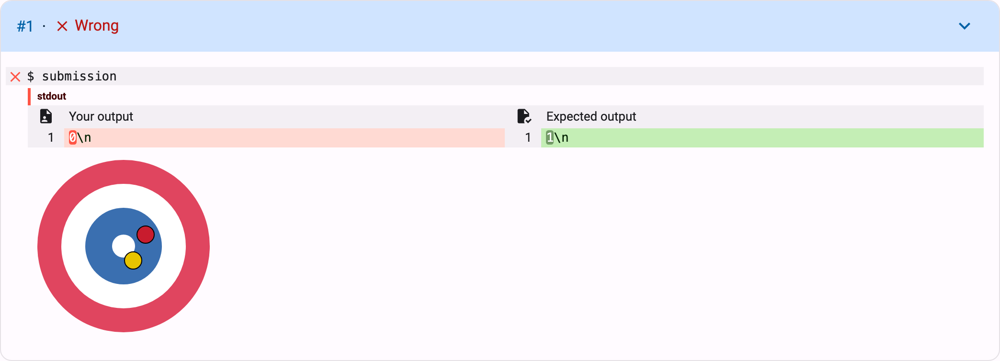

# Understanding Feedback
The feedback page contains detailed **feedback** about a solution you submitted for an exercise. As soon as possible after submission, the solution is automatically evaluated by a judge associated with the exercise. The judge provides detailed feedback on the correctness of the submission, which you can use to correct or further refine your solution. This page explains what the different submission statuses mean and how the detailed feedback of the judge is structured. How to navigate to exercises and submit solutions is covered in [Solving Exercises](../exercises/).

## The Feedback Page

At the top of the feedback page, a line reads `Submission #N for <exercise> in <course>`, linking to the exercise and course pages (the course part is omitted if the solution was not submitted within the context of a course). Below that:

- An **icon** and the **status** assigned to the solution by Dodona or the judge, together with the **time** the solution was submitted, displayed in a user-friendly manner (for example, *about 2 hours ago*; hover over it to see the detailed time). The meaning of each status is explained [below](#submission-statuses).

- A **history** list on the right, showing your other submissions for the same exercise (submission time, number, and status), so you can jump between them.

## Submission Statuses

Meaning of the possible statuses that can be assigned to a solution:

| Status                  | Icon                                                                    | Meaning                                                                                                           |
|-------------------------|-------------------------------------------------------------------------|-------------------------------------------------------------------------------------------------------------------|
| `Queued…`               |                 | Solution is in the queue                                                                                          |
| `Running...`            |                | Solution is currently being evaluated by the judge                                                                |
| `Correct`               |                | All tests have succeeded.                                                                                         |
| `Wrong`                 |                  | Logical error encountered during the execution of at least one test                                               |
| `Runtime Error`         |          | Unexpected error encountered during the execution of at least one test                                            |
| `Timeout`               |    | Time limit for the exercise was exceeded during testing; may indicate poor performance or an infinite loop.       |
| `Memory limit exceeded` |  | Memory limit for the exercise was exceeded during the execution of at least one test                              |
| `Compilation Error`     |      | Solution contains grammatical errors                                                                              |
| `Internal Error`        |         | Judge crashed during the evaluation of the solution; the cause of the error lies with the judge, not the solution |

The lower a status is listed in the table above, the more severe the type of error it corresponds to.

::: tip
Your submission status for an exercise *within a course* (correct, deadline missed, ...) is a different concept: it is based on your last submission before the deadline of the exercise series. It is explained in [Courses on Dodona](../courses/#submission-status).
:::

## Feedback Tabs

Below the status, there is more detailed feedback that the judge may have split across multiple *tabs*. Tabs are named after the judge's own test groups (there is no fixed "Correctness" tab). Next to the name of a tab, there may be a *badge* on the right side with a number. The number indicates how many errors the judge found while executing the tests reported under that tab.

The last tab is always named `Code` and contains the source code of the solution. In certain places in the source code, the judge may have added comments (e.g., about coding style) that may also explain why a particular status was assigned to the solution.

::: tip Tip

In the `Code` tab on the feedback page, you cannot modify the source code of the solution. You must click the edit button in the upper right corner of the feedback page. The source code of the solution you are currently viewing will then be loaded into the editor. There you can edit the source code and possibly resubmit it.
:::

## Tests, Test Cases, and Contexts

For each tab, the judge reports on individual **tests** to which the source code was subjected. Related tests are grouped into a **test case**, and interdependent test cases are grouped into a **context**.

Visually, all test cases of a context are grouped in an expandable card.
The header of the card will contain `Correct` or `Wrong` depending on the judge's assessment of the entire context.
If some, but not all contexts are correct, the correct contexts will be collapsed by default, and the incorrect contexts will be expanded by default.

Within a context, the test cases of the context are displayed one below the other. The description of a test case is displayed within a rectangle with a light gray background color that spans the full width. In the upper left corner of that rectangle, there is a colored symbol indicating whether the judge considers the entire test case to be successful (green checkmark) or unsuccessful (red cross).

If the judge reports on individual tests within a test case, they are listed below the rectangle with the light gray background containing the test case description. To visually distinguish it from the test case display, each test is displayed with a small margin on the left and right. The display of a test consists of the following optional components, which are displayed one below the other:

-   A description of the executed test. This description is displayed within a rectangle with the same light gray background color as the test case description.

-   A textual comparison between an expected value and a value generated based on the solution. If at least one of the values consists of multiple lines, the corresponding lines are aligned opposite each other. Identical corresponding lines are displayed with a transparent background color. If corresponding lines differ, they are displayed with a light-colored background color (green for the expected value and red for the generated value). Individual characters that differ within corresponding lines are displayed with a darker background color (green for the expected value and red for the generated value).

-   General feedback about the executed test. For this feedback, the judge has complete freedom regarding the formatting, allowing for both textual and graphical feedback.

    
