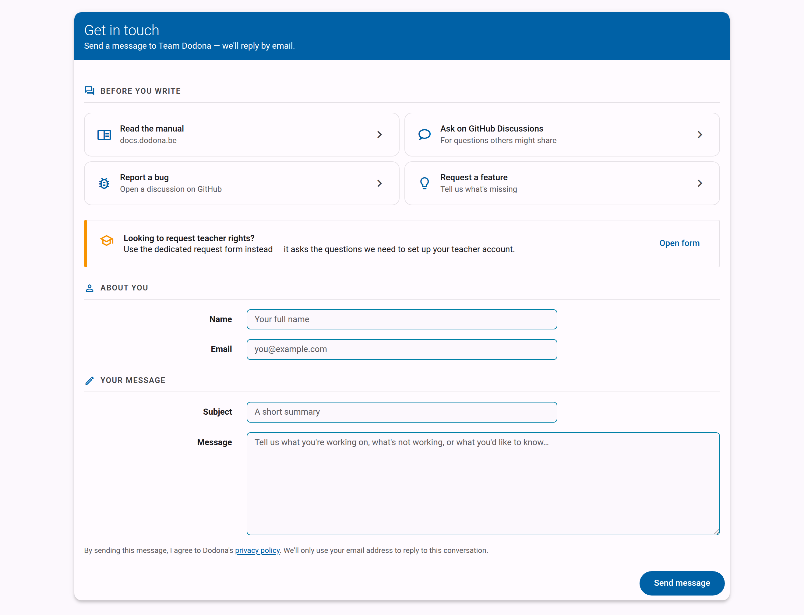

# Getting Started with Dodona as a Student
On this page, you will find all the information you need to get started with Dodona as a student.

## What is Dodona?

<!--@include: ../../_what-is-dodona.md-->

## Contact Us

If you have questions about how Dodona works or if you have interesting ideas on how we can improve or expand the platform, please feel free to contact us. All comments and suggestions are more than welcome. To do so, navigate to the [contact page](https://dodona.be/en/contact/) by clicking on `Contact` in the footer (at the bottom of every page).
Then fill in the details in the `Get in touch` panel and click the `Send message` button in the bottom right corner of the panel.

