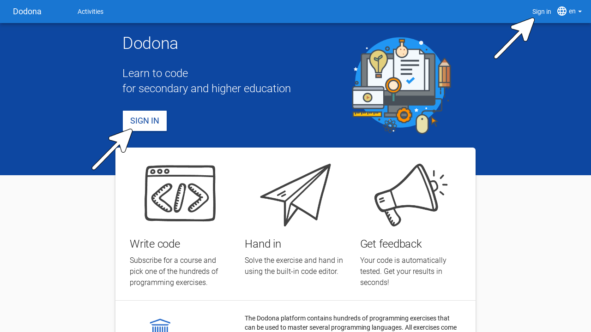
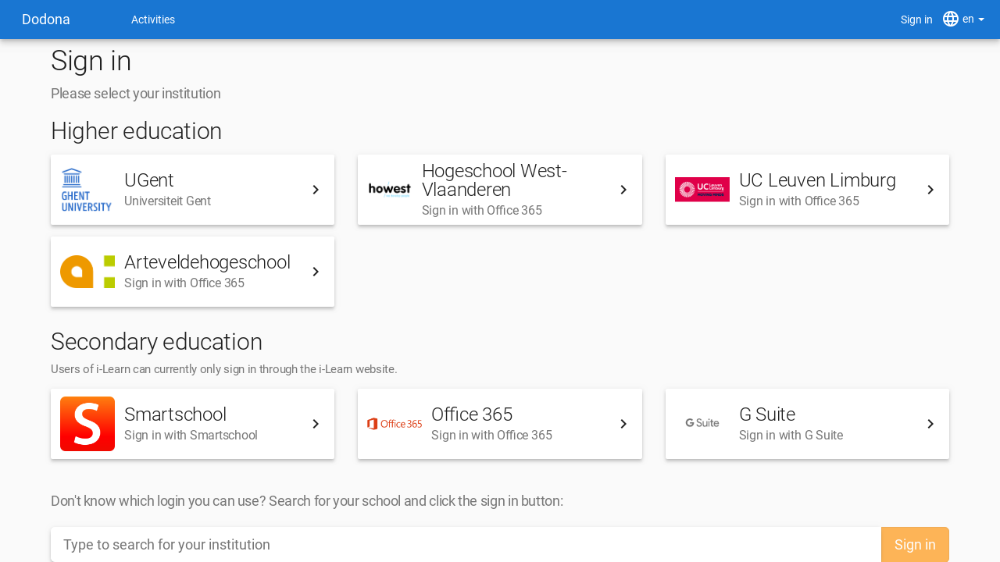
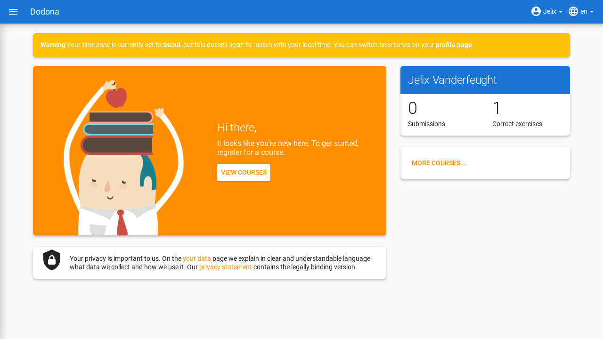

::: warning Sorry
For now, this page is only available in Dutch. Sorry!
:::

# Aanmelden & gebruikersinstellingen
> Op deze pagina vind je alle informatie zodat je als student een gebruikersaccount op Dodona kan aanmaken en die kan personaliseren.

**Inhoudsopgave**
[[toc]]

## Selecteren van de taal

Je kan Dodona gebruiken in het Nederlands of het Engels. Gebruik hiervoor het taalmenu aan de rechterkant van de navigatiebalk (bovenaan elke pagina).

Als je een taal selecteert terwijl je aangemeld bent dan wordt die ook als voorkeurstaal ingesteld in je [gebruikersprofiel](https://dodona.ugent.be/profile). Op die manier wordt bij aanmelden automatisch je voorkeurstaal geselecteerd.

::: tip Wordt alles vertaald?

De vaste componenten van Dodona (menubalken, cursusstructuur, mededelingen, ...) worden altijd weergegeven in de geselecteerde taal.

De naam en beschrijving van een [cursus](../courses/) worden weergegeven in de taal zoals de lesgever ze heeft ingegeven. Deze worden niet aangepast aan je taalvoorkeuren.

De naam en beschrijving van een [oefening](../exercises/#navigeren-naar-een-oefening) worden steeds in je voorkeurstaal weergegeven indien beschikbaar. Niet alle oefeningen zijn namelijk in beide talen beschikbaar.

:::

## Aanmelden

Om je aan te melden op dodona klik je ofwel op `Aanmelden` aan de rechterkant van de navigatiebalk, ofwel navigeer je naar de landingspagina en klik je op de knop `Aanmelden` centraal op de pagina.

Je kan je aanmelden op Dodona door je onderwijsinstelling te selecteren op de aanmeldpagina. Studenten uit het secundair kunnen inloggen met hun Smartschool, Office365 of G-Suite account. Als dit de eerste keer is dat je aanmeldt op Dodona dan wordt er automatisch een nieuwe gebruikersaccount aangemaakt op basis van de persoonsgegevens die doorgestuurd werden door je externe onderwijs- of onderzoeksinstelling.

::: warning Jouw data op Dodona

Sommige onderwijs- of onderzoeksinstellingen vragen op het einde van de aanmeldingsprocedure expliciet jouw toestemming voor het doorsturen van enkele [persoonsgegevens](https://dodona.ugent.be/nl/data/) naar Dodona. Vaak hoef je deze toestemming slechts één keer te geven op elke computer waarmee je aanmeldt. Dodona gebruikt deze persoonsgegevens enkel voor intern beheer van je gebruikersprofiel en wisselt deze informatie nooit uit met externe partijen.
:::

::: tip Foutmelding?

Als nog niemand van jouw school eerder aanmeldde op Dodona, dan kan het zijn dat niet alles loopt zoals verwacht. Om aan te melden gebruiken we namelijk de bestaande accounts van je onderwijsinstelling en koppelen we die via technieken als [SAML](https://nl.wikipedia.org/wiki/Security_Assertion_Markup_Language) en [OAuth](https://nl.wikipedia.org/wiki/OAuth). Soms loopt het hier mis omdat jouw school geen toestemming geeft voor deze koppeling. Vraag een ICT-beheerder of lesgever van je onderwijs- of onderzoeksinstelling om [contact](../getting-started/#contact-opnemen) met ons op te nemen als je graag alle gebruikersaccounts van je instelling toegang wilt geven tot Dodona. Deze dienstverlening is gratis.
:::

::: tip Meerdere accounts?

Als je beschikt over gebruikersaccounts bij verschillende externe onderwijs- of onderzoeksinstellingen, dan corresponderen deze elk met een afzonderlijke gebruikersaccount op Dodona. Gebruik dus steeds dezelfde account om aan te melden.
:::

Eenmaal je bent aangemeld, dan verandert de neutrale landingspagina in een gepersonaliseerde startpagina met een overzicht van alle [cursussen](../courses/) waarvoor je geregistreerd bent, hun oefeningenreeksen met nakende deadlines en je voortgang bij het indienen van oplossingen voor [oefeningen](../exercises/). Je kunt steeds terugkeren naar de landingspagina door op `Dodona` te klikken linksboven elke pagina.

Als dit de eerste keer is dat je aanmeldt op Dodona, dan ben je uiteraard nog voor geen enkele cursus geregistreerd en heb je nog geen enkele oplossing ingediend. Daardoor ziet je startpagina er op dit moment nog vrij kaal uit. Hoe je je kan registreren voor een cursus vind je op [deze pagina](../courses/#registreren-voor-een-cursus).

## Instellen van persoonlijke voorkeuren

Kies voor `Mijn profiel` in het gebruikersmenu aan de rechterkant van de navigatiebalk om naar je profielpagina te navigeren.

Op de profielpagina staan je persoonsgegevens (voornaam, familienaam, gebruikersnaam en e-mailadres) en enkele persoonlijke voorkeuren ([taal](#selecteren-van-de-taal) en tijdzone) die samen je gebruikersprofiel vormen.

Klik op de bewerkknop in de rechterbenedenhoek van je profielpagina om je gebruikersprofiel te bewerken. Je persoonsgegevens zoals naam en e-mailadres kan je zelf niet aanpassen. Deze worden namelijk automatisch aangepast op basis van de gegevens die tijdens het aanmelden door je externe onderwijs- of onderzoeksinstelling naar Dodona worden doorgestuurd.

Wat je wel kan aanpassen is de **tijdzone** die gebruikt wordt voor het weergeven van alle tijdsaanduidingen op het platform (bijvoorbeeld het tijdstip waarop je een oplossing hebt ingediend of de deadline voor een oefeningenreeks).

Als de tijdzone uit je gebruikersprofiel niet overeenkomt met de lokale tijdzone zoals die door je browser gedetecteerd wordt, dan krijg je bovenaan elke pagina een mededeling te zien die erop wijst dat alle tijdsaanduidingen op het platform niet overeenkomen met de lokale tijdzone.

Je kunt deze mededeling enkel weghalen door in je gebruikersprofiel de tijdzone in te stellen op de lokale tijdzone. Merk op dat de mededeling een link bevat waarmee je rechtstreeks naar je profielpagina kunt navigeren.

<!--
    ---
    title: Sign-in and user settings
    description: "Tutorial: sign-in and user settings"
    ---

    ## Selecting a language

    In Dodona, you have two **languages** to choose from, Dutch and English. To change your language use the **language menu** on the right side of the **navigation bar** (which can be found at the top of each page).

    

    If you select a [language]() while you are logged in, it will be set as your preferred language in your [user settings]().

    ::: details Note

    The language used for fixed components of Dodona (menubar, course structure, notifications, ...) are shown is fully controlled by the platform. These components are always shown in the selected [language]().

    The name and description of a [course]() are fixed, as are names and descriptions of [exercise series]() within a course. These components do not depend on the selected [language](). The language of these components falls entirely under the control of the course administrators that created the course.

    The name and description of an [exercise]() depend on the selected [language](). If a translation of the name and description was provided in the selected language when creating the exercise, theses components of the exercise will also be displayed in that language.

    The language of feedback on a submitted solution for an exercise is completely under the control of the judge with which the exercise is associated. The judge can make the language of this feedback depend on the language selected at the time the solution is submitted.
    :::

    ## Sign-in

    To be able to sign-in you need a user account on Dodona. In the associated user profile, you can set your personal preferences on your user profile to personalize your experience. All the actions you perform &mdash; like registering for a course or submitting a solution &mdash; are linked with your user account.

    ::: tip Important

    Sign-in on Dodona can be done by selecting your educational institution on the login page. As a High School student, you can also use your Smartschool, Office 365, or G Suite account provided by your school.

    :::

    Press on `Sign in` on the right side of the navigation bar or navigate to the homepage and press on `Sign in` that can be found in the center of the homepage.

    

    ::: tip

    You can only log in if you aren't already logged in. You can see that you are logged out if you can see the `Sign in` button on the right side of the [navigation bar](). If you are logged in, the name of your account can be seen at the same place. This is the [user menu]().
    :::

    Select your educational or research institution on the login page. If you are a High School student you can select the Smartschool, Office 365, or G Suite options. After selecting your preferred login, follow the specified log in procedure.

    

    ::: tip Important

    A few educational or research institutions explicitly ask for your permission to send some personal data to Dodona. Mostly you only need to give these permissions once per computer you use to log in. Dodona uses the personal data only for the internal management of your user profile and never exchanges this information with third parties.
    :::

    ::: details Note

    The authentication of user accounts from external educational or research institutions, Dodona supports both [SAML](https://en.wikipedia.org/wiki/Security_Assertion_Markup_Language) and [OAuth](https://en.wikipedia.org/wiki/OAuth). Ask an IT administrator or teacher from your educational or research institution to contact us if you would like to give access to all the user accounts of your institution to Dodona. This service is free.
    :::

    If this is the first time you log in on Dodona, a new user account will automatically be created using the personal data sent by your external educational or research institution. In the user profile of this user account, you can set personal preferences for the language and time zone used by Dodona.

    ::: tip Important

    If you have user accounts from different educational or research institutions, each one will correspond to a separate user account on Dodona.
    :::

    ::: tip

    If you want to change to another user account than the one you are currently logged in with, then you need to log out and log in with the other user account.
    :::

    If you are logged in the **user menu** with your user name will be visible on the right side of the navigation bar. The user menu is at the place where the `Sign in` button was before you logged in.

    

    When logged in the homepage will change to a personalized page with an overview of all the courses for which you are registered, their exercise series with a deadline, and your progress on submitting solutions for the exercises. This makes it easy to recognize if you are logged in or not.

    ::: tip

    You can navigate to your homepage or to the neutral homepage (if you aren't logged in) from any page by clicking on the `Dodona` button on the left side of the navigation bar.
    
    :::

    If this is your first time you log in on Dodona you won't be registered in any courses and you won't have any submitted solutions. Because of this your homepage will seem a bit empty.

    

    ## Setting your personal preferences

    Choose `My profile` in the [user menu]() on the right side of the [navigation bar](#selecteren-van-de-taal) to navigate to your **profilepage**.

    On your profile page, you can see your **personal data** (first name, family name, user name, and e-mail address) and a few **personal preferences** that together form your profile page. Dodona uses the user profile to personalize your user experience.

    

    Press on the edit button on the upper right corner of your profile page to edit your user profile. You can't edit your personal data. It gets automatically changed based on the personal data sent to Dodona by the external educational or research institution that was used during the login.

    

    In your user profile, you can set the timezone that should be used for all the time indications on the platform (for example the time at which your solution was submitted or the deadline for a series of exercises).

    

    ::: tip

    If the timezone of your user profile doesn't match with the local timezone as the timezone detected by your browser, then you will get a notification indicating that all time indications on the platform do not correspond to the local timezone.

    

    You can only remove this notification by setting the timezone in your user profile to the local timezone. Notice that the notification contains a link that will directly send you to your profile page.
    :::
-->
