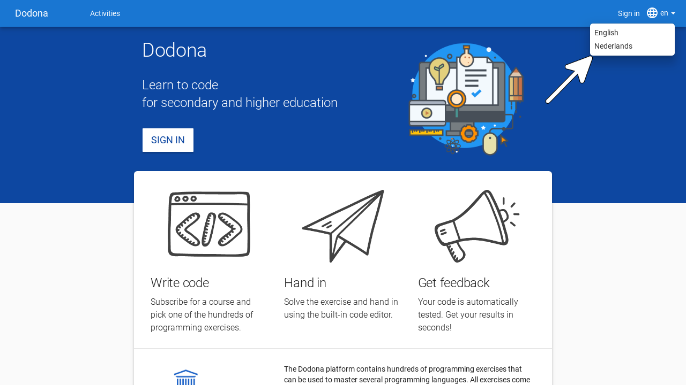
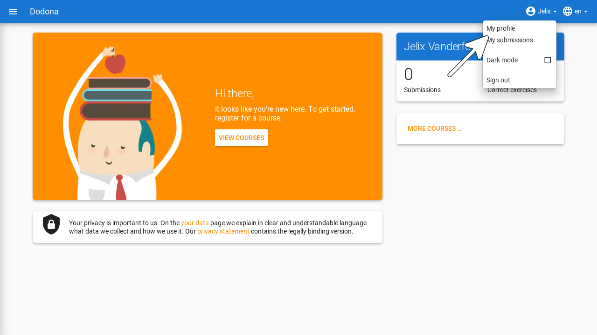
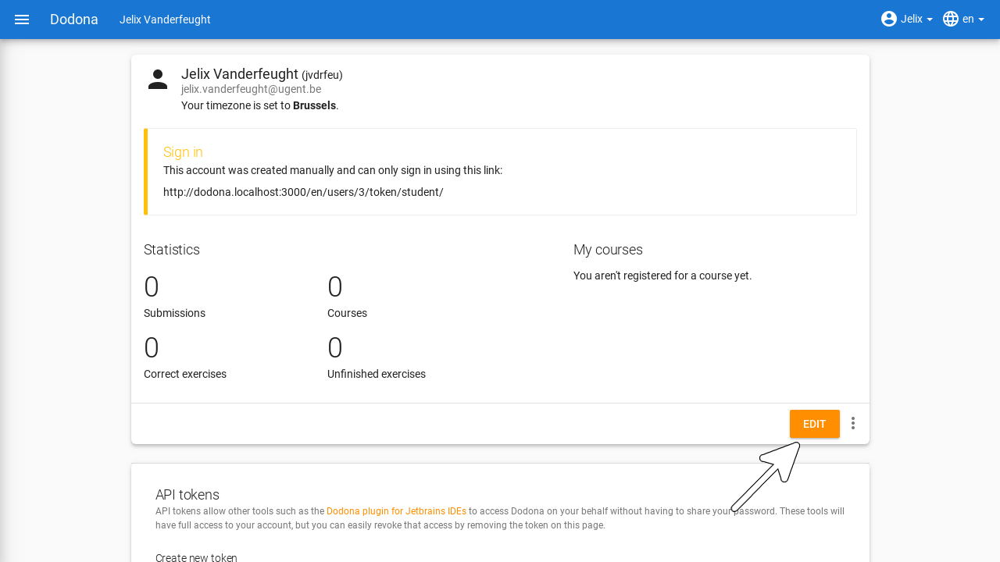
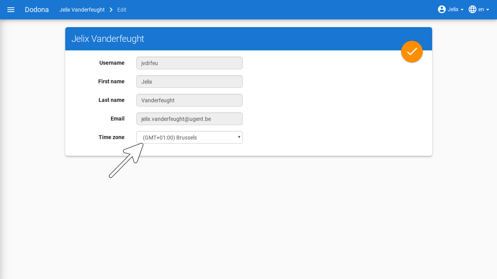

# Signing Up & User Settings
On this page, you will find all the information you need to create and personalize a user account on Dodona as a student.

## Selecting the Language

You can use Dodona in English or Dutch. Use the language menu on the right side of the navigation bar (at the top of every page) for this purpose.

If you select a language while logged in, it will also be set as your preferred language in your [user profile](https://dodona.be/profile). This way, your preferred language will be automatically selected upon login.

::: tip Is Everything Translated?

The fixed components of Dodona (menu bars, course structure, notifications, etc.) are always displayed in the selected language.

The name and description of a [course](../courses/) are displayed in the language as entered by the instructor. These are not adapted to your language preferences.

The name and description of an [exercise](../exercises/#navigating-to-an-exercise) are always displayed in your preferred language if available. Not all exercises are available in both languages.

:::

## Signing Up

To sign up for Dodona, either click on `Sign in` on the right side of the navigation bar or navigate to the landing page and click the `Sign in` button in the center of the page.

You can sign in to Dodona by selecting your educational institution on the sign-in page. Secondary school students can log in with their Smartschool, Microsoft 365, or Google Workspace account. If this is your first time signing in to Dodona, a new user account will be automatically created based on the personal information provided by your external educational or research institution.

::: warning Your Data on Dodona

Some educational or research institutions explicitly ask for your consent to share some [personal data](https://dodona.be/en/data/) with Dodona during the sign-in procedure. Often, you only need to give this consent once on each computer you use to sign up. Dodona uses this personal data solely for internal management of your user profile and never shares this information with external parties.
:::

::: tip Error Message?

If no one from your school has signed up for Dodona before, things might not go as expected. To sign up, we use the existing accounts from your educational institution and link them using techniques such as [SAML](https://en.wikipedia.org/wiki/Security_Assertion_Markup_Language) and [OAuth](https://en.wikipedia.org/wiki/OAuth). Sometimes, this process fails because your school does not grant permission for this link. Ask an ICT administrator or instructor from your educational or research institution to [contact us](../getting-started/#contact-us) if you want to give all user accounts from your institution access to Dodona.
:::

::: tip Multiple Accounts?

If you have user accounts with different educational or research institutions, each corresponds to a separate user account on Dodona. Always use the same account to sign in.
:::

Once you are logged in, the neutral landing page transforms into a personalized homepage with an overview of all [courses](../courses/) you are registered for, their exercise series with upcoming deadlines, and your progress in submitting solutions for [exercises](../exercises/). You can always return to the landing page by clicking on `Dodona` at the top left of any page.

If this is your first time signing up for Dodona, you are obviously not registered for any courses yet and have not submitted any solutions. Therefore, your homepage looks quite empty at the moment. You can find out how to register for a course on [this page](../courses/#registering-for-a-course).

## Setting Your Personal Preferences

Select `My Profile` in the user menu on the right side of the navigation bar to navigate to your profile page.

On the profile page, you will find your personal information (first name, last name, username, and email address) and some personal preferences ([language](#selecting-the-language) and time zone) that together form your user profile.

Click the edit button in the bottom right corner of your profile page to edit your user profile. You cannot modify your personal information such as your name and email address. These are automatically updated based on the data provided by your external educational or research institution when signing in.

What you can modify is the **time zone** used for displaying all time indications on the platform (e.g., the time you submitted a solution or the deadline for an exercise series).

If the time zone in your user profile does not match the local time zone detected by your browser, you will see a notification at the top of every page indicating that all time indications on the platform do not match the local time zone.

You can only remove this notification by setting the time zone in your user profile to the local time zone. Note that the notification contains a link that allows you to navigate directly to your profile page.

