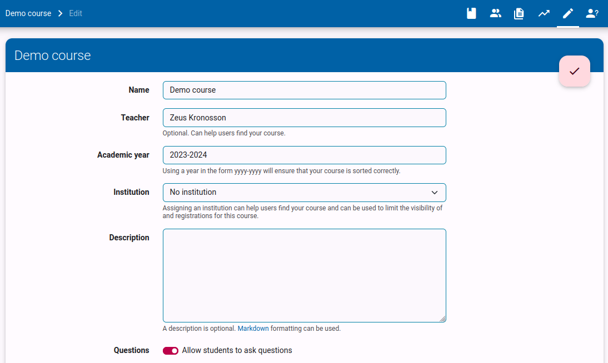
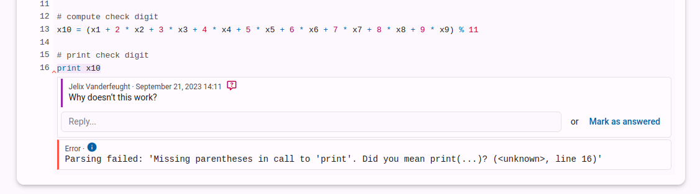
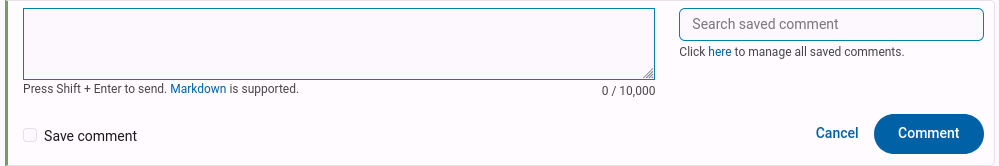
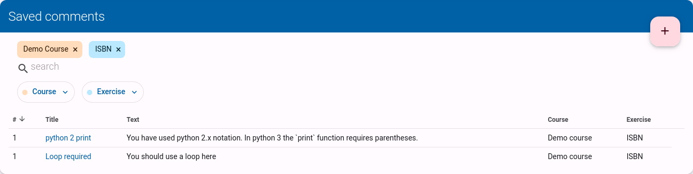
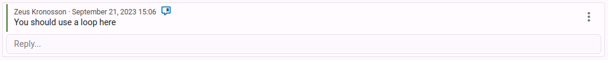
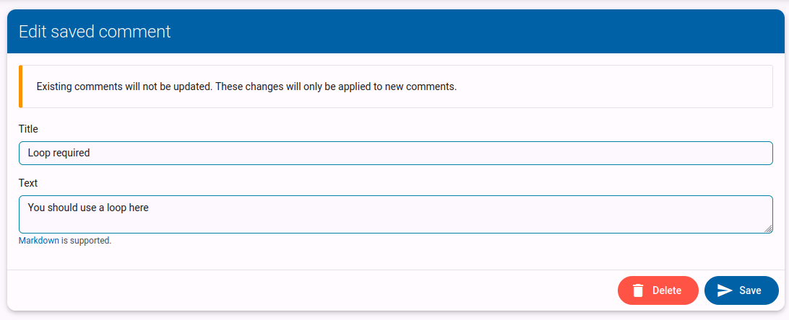

# Answering questions
> This guide is written for teachers. Students who want help asking question can find more info in [this guide](/en/guides/students/exercises/#vragen-stellen).

Dodona allows students to ask questions about exercises and solutions. If you want to disable this feature, you can do so in the course settings.

When a student asks a question in dodona, you will see a notification circle appear on the questions tab of your course.
Going to this tab will show you a list of all questions that have been asked in your course.

Clicking on the questions opens the submission that the question was asked on.

You can choose to reply to the question, which will mark the question as answered and sends the student a notification.
You can also directly mark a question as answered. This is often useful if you know the student has already solved the question in another way. Eg. the student has submitted an other solution where the problem is fixed, or you have replied to the question outside of the Dodona framework.

> Note comments support markdown formatting, so you can use bold, italics, lists, ... You can checkout all markdown features in [this reference](/en/references/exercise-description/#markdown).

# Commenting on code

As a teacher, you can also comment on the code of your students. This can be useful to give feedback on their solution, or to point out a mistake.

> If you want to go through the submissions of all your students and provide feedback, it can be useful to [create an evaluation](/en/guides/teachers/grading/).

You can either use the `Add global comment` button to add a general comment about the submission, or you can select a piece of code and click the `Add comment` button to add a comment about that specific piece of code.

> Note comments support markdown formatting, so you can use bold, italics, lists, ... You can checkout all markdown features in [this reference](/en/references/exercise-description/#markdown).

# Reusing comments
Students often make the same mistakes, or have similar questions. To avoid having to write the same comment over and over again, you can reuse comments.

While writing or editing a comment, you can check `save comment`. This will allow you to add a title for this comment, which should help you find the comment for future use. 

You can also save an existing comment by clicking `save comment` in the comment menu.

Once you have saved one ore more comments, you get a search field when writing new comments. Select the desired comment from the list to reuse it. You can still edit the comment before posting it.

# Managing saved comments

::: warning Scoping of comments
Saved comments are scoped by course and by exercise. This way we are sure we only suggest relevant comments and the number of saved comments remains manageable. This will probably be changed in the future to give teachers more flexibility.
:::

You can find an overview of all your saved comments for a certain exercise by clicking the link underneath the search field.

Clicking the `+` brings you to a page with all your unsaved comments for that exercise. You can save a comment by clicking the `save comment` button.

You can also see the details of a saved comment and all usages by clicking the saved comment title in the list.

This page can also be reached by clicking the blue `saved comment` icon on any comment that is linked to this specific comment. This icon also makes it easy to identify if a comment is saved.

On the detail page you can also edit the saved comment, or delete it by clicking the pencil button. All changes will only affect future reuses of the saved comment. If you want to edit existing comments, you will have to update them manually as well.

