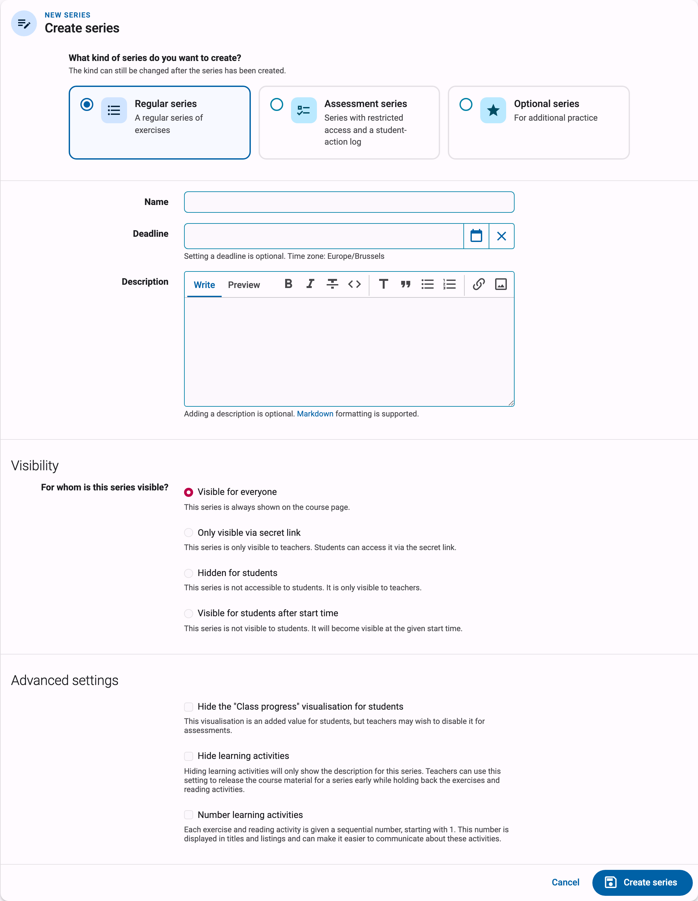
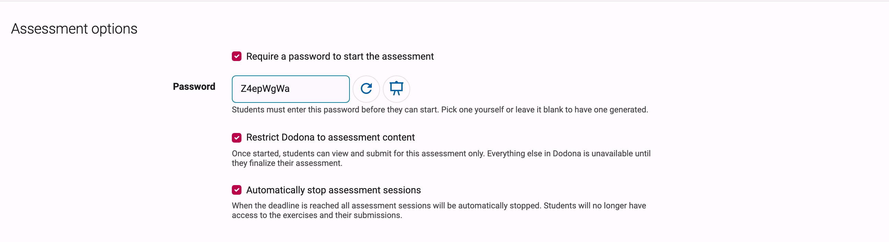
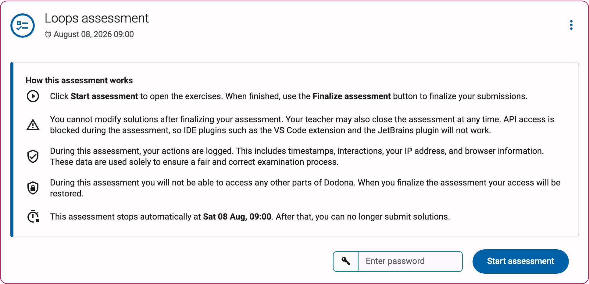
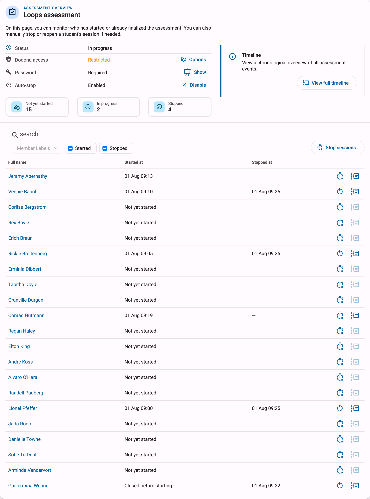
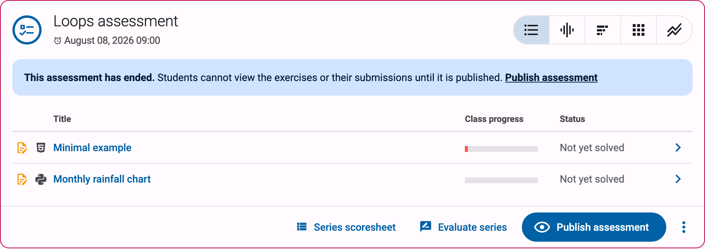
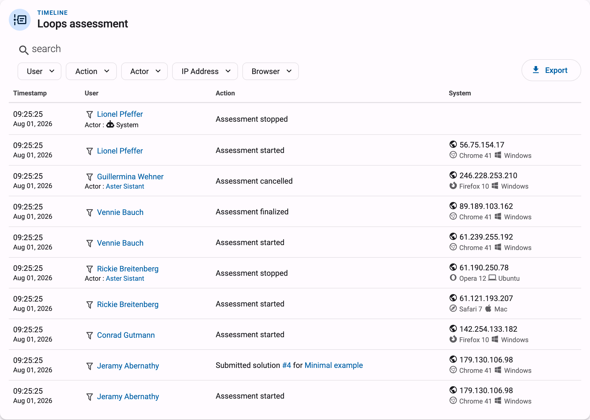

# Assessments and exams

If you want to use Dodona for a graded test or exam, you can turn a series into an **assessment series**. An assessment series behaves very differently from a regular series:

* Students must explicitly click start on the series to gain access to the exercises.
* Access is limited to the browser they start the assessment with. Signing in on a second device or browser does not give access to the assessment.
* API access is blocked during the assessment, so IDE plugins such as the VS Code extension and the JetBrains plugin will not work.
* Once they finalize their assessment, students no longer have access to the exercises and their submissions, until you publish the assessment afterwards.
* Every relevant student action is recorded in an assessment log that you can consult and export.

This guide walks through the full journey: setting up the series, what your students see, monitoring and stopping sessions while the assessment runs, publishing the results afterwards, and what exactly is logged.

::: tip Important
An assessment series controls access *within* Dodona: it does not lock down the student's computer, record their screen, or block other websites. Treat it as one layer of a supervised exam, alongside supervision in the room or the exam environment your school uses.
:::

## Creating an assessment series

An assessment series is created like any other series: navigate to your course, click `Manage series` and then `Create series`, as described in [exercise series management](../exercise-series-management/#create-an-exercise-series). At the top of the series form, choose `Assessment series` as the kind, described there as "Series with restricted access and a student-action log".

You don't have to decide upfront: the kind can still be changed after the series has been created. Choose `Change kind…` in the series action menu to convert an existing series. As long as the series has no submissions yet, it is converted in place; otherwise Dodona creates a copy of the series with the new kind, so a real assessment always starts with a clean slate. The same applies in the other direction: once an assessment has sessions or logged events, converting it produces a non-assessment copy and the original assessment stays untouched.

When you select the assessment kind, an extra `Assessment options` section appears on the form:

* `Require a password to start the assessment`: students must enter a password before they can start. See [the assessment password](#the-assessment-password) below.

* `Restrict Dodona to assessment content`: once started, students can view and submit for this assessment only. Everything else in Dodona is unavailable until they finalize their assessment. Without this option, students keep access to the rest of Dodona (other courses, past solutions, …) during the assessment, which is rarely what you want for an exam.

* `Automatically stop assessment sessions`: when the deadline is reached, all assessment sessions are automatically stopped. Students then no longer have access to the exercises and their submissions. This option requires the series to have a deadline. Sessions stopped this way show `System` as the actor in the assessment timeline.

All other properties of the form (name, deadline, description, visibility, …) work as for any series and are described in the [series settings](../series-settings/) reference. The visibility settings combine nicely with an assessment: with `Visible for students after start time`, for example, the series only appears at the moment the exam starts. Note that even a visible assessment series never shows its exercises to students until they start their session.

## The assessment password

The password is an extra safeguard on top of the visibility settings: it ensures that nobody can start the assessment before you announce the password in the exam room, and that students who are not physically present can't start it at all.

Enable it with `Require a password to start the assessment` on the series form. In the `Password` field you can pick a password yourself or leave it blank to have one generated. As a teacher you can view the password afterwards via the `Show` button in the assessment status panel on the series, and reset it from the series form if it leaked early.

The password is per series and the same for all students, so announcing it on the blackboard or projector at the start of the exam is the typical workflow.

## What your students see

Before the assessment is started, students see the series in the course with an explanation titled `How this assessment works` instead of the exercise list. It tells them how to start and finalize, warns that they cannot modify solutions after finalizing, that the teacher may close the assessment at any time, and that API access is blocked. It also contains a privacy notice: during the assessment their actions are logged, including timestamps, interactions, their IP address, and browser information, and these data are used solely to ensure a fair and correct examination process.

To begin, a student enters the password (if required) and clicks `Start assessment`. From that moment:

* The exercises become visible and the student can submit solutions, in that browser only.
* With `Restrict Dodona to assessment content` enabled, the rest of Dodona is hidden until they finish.
* A student can only participate in one assessment at a time.

When a student is finished, they click `Finalize assessment`. After confirming, their session ends: their submitted solutions are saved, and they can no longer view the exercises or make changes unless you reopen their session or publish the assessment.

::: warning A student closed their browser or switched devices?
The assessment is tied to the browser the student started it with. If a student signs out, accidentally closes their browser, or switches devices, they land on a page titled `We can't continue your assessment in this browser`. No progress is lost. The student should return to the original browser if possible; otherwise you restore their access from the assessment overview by stopping their session and then reopening it (see below). The same page also lets a student who is already finished simply finalize their assessment from the new browser.
:::

## Monitoring the assessment

During the exam, the assessment overview is your control room. You reach it via the `Assessment overview` button on the series. The page shows who has started or already finalized the assessment, and lets you manually stop or reopen a student's session if needed.

At the top you find the assessment status panel with the current phase (`Not yet started`, `In progress`, `Stopped, awaiting publication` or `Published`) and the effective settings: `Dodona access` (`Restricted` or `Unrestricted`), `Password` (`Required`, with the `Show` button, or `Not required`) and `Auto-stop` (`Enabled` or `Disabled`). Next to it, three counters show how many students are `Not yet started`, `In progress` and `Stopped`; clicking a counter filters the table below.

The table lists every student in the course with their `Started at` and `Stopped at` times. You can search by name, filter on `Member labels`, `Started` and `Stopped`, and sort the columns. Per row you can:

* `Stop session`: end the student's assessment immediately. Their work is saved, but they can no longer view the exercises or submit. For a student who has not started yet, the same button closes the assessment for them before they start, shown as `Closed before starting`; useful for students who are absent or not allowed to take part.
* `Re-open session`: undo a stop. The student can start the assessment again in a fresh browser session and continues with all previous work preserved. This is also how you restore access for a student whose browser crashed: first `Stop session`, then `Re-open session`.
* View that student's personal timeline of assessment events.

## Stopping the assessment

There are several ways an assessment session ends:

* The student finalizes their own assessment with `Finalize assessment`.
* You stop an individual session with `Stop session` on the assessment overview.
* You stop everyone at once. The `Stop sessions` button above the table on the assessment overview stops only the sessions matching the current filters, which lets you, for example, stop one class group by filtering on their label first. The `Stop assessment` button on the series itself ends all ongoing sessions, and students who haven't started yet will no longer be able to start.
* Dodona stops all sessions automatically at the deadline, if you enabled `Automatically stop assessment sessions`.

Once every session is stopped, the assessment phase changes to `Stopped, awaiting publication`. Students cannot view the exercises or their submissions at this point; the series shows them a message that their answers have been saved.

## Publishing the results

After the assessment, you decide when students can see the exercises and their submissions again. Click `Publish assessment` on the series and confirm. The assessment is then closed for everyone, and students can view the exercises and their submissions in read-only mode: they cannot submit new solutions or mark activities as read. This is the natural moment to let students review their work, for example while you discuss the solutions in class.

Published too early? `Unpublish assessment` in the series action menu makes the assessment private again.

Publishing is independent of grading. To grade the assessment, create an evaluation for the series and optionally give feedback and scores; see the [grading guide](../grading/). An evaluation works on the submissions students made during the assessment, so you can grade before or after publishing.

## The assessment timeline

Every assessment keeps a detailed log of events. From the assessment overview, `View full timeline` opens a chronological overview of all assessment events; the per-student button on each row of the table shows the same timeline filtered to one student.

The following events are recorded, each with a timestamp, the student involved, and where relevant the actor who performed the action (you, the student, or `System`):

* `Assessment started`, `Assessment finalized` (by the student), `Assessment stopped` (by a teacher or the system), `Assessment reopened`, `Assessment cancelled` (closed before the student started)
* `Submitted solution`, with a link to the submission and the exercise
* `Read reading activity`
* `Signed in during assessment` and `Signed out during assessment`

You can filter the timeline by `User`, `Action`, `Actor`, `IP address` and `Browser`. The `Export` button downloads the log as a CSV file, including the IP address and browser information for each event, so you can archive it or investigate irregularities after the exam.

## Privacy considerations

Questions your school (or your students) may ask about assessments:

* **What is logged?** The events listed above, with timestamps, the student's IP address, and browser information. Logging starts when the student starts the assessment and is limited to actions related to the assessment.
* **Are students informed?** Yes. The start screen explicitly tells students that their actions are logged, what is included, and that these data are used solely to ensure a fair and correct examination process. A student only starts the assessment after seeing this notice.
* **Who can see the log?** Only the course administrators of the course (and Dodona staff). Students cannot see the assessment timeline.
* **Is this proctoring software?** No. Dodona does not record screens, webcams, or keystrokes, and cannot prevent students from opening other applications or websites. The IP address and browser information in the log can help detect anomalies (such as a session continuing from a different network), but physical supervision remains your responsibility.

If you have questions about running an exam with Dodona that this guide doesn't answer, feel free to contact us at [support@dodona.be](mailto:support@dodona.be).
