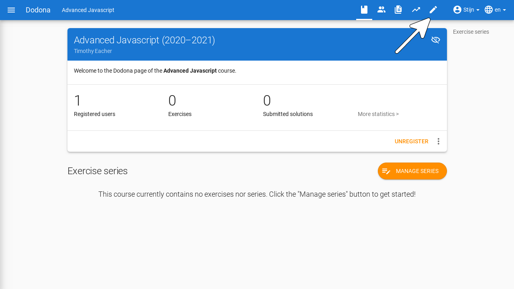
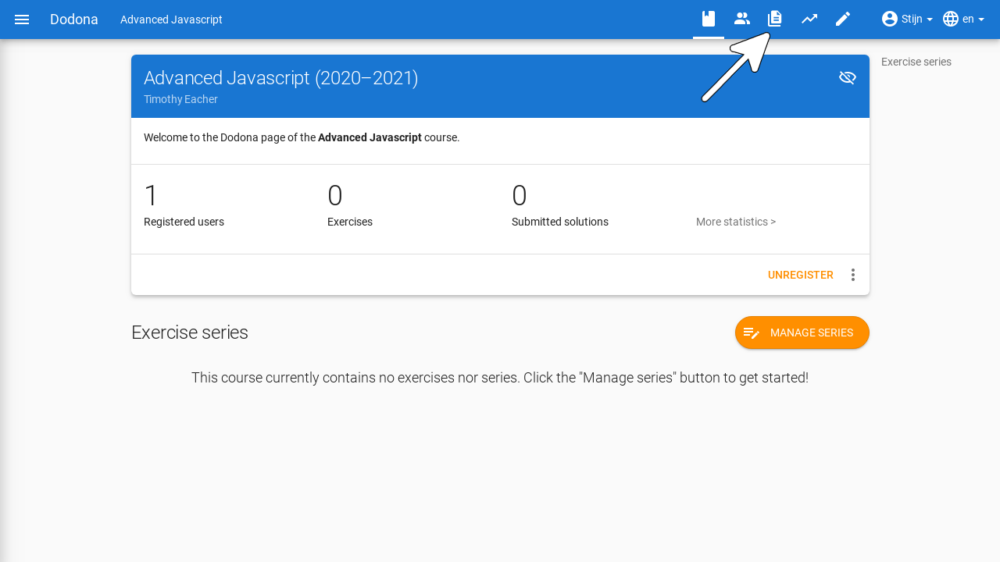
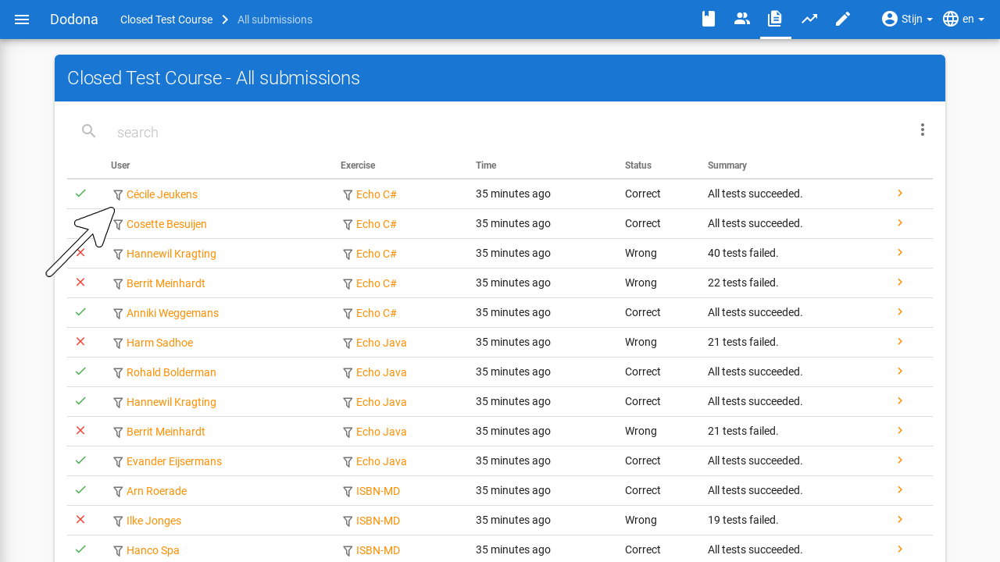
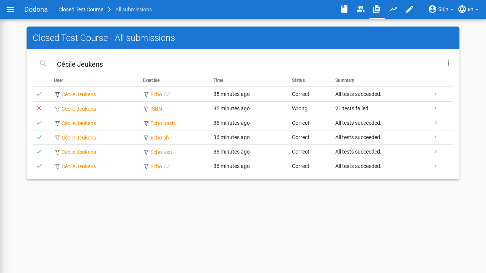

# Course Management
On this page, you will find all the information about course management on Dodona.

A course is structured as a learning path with exercises that are bundled into exercise series. The sequence of exercise series implies a possible order in which the exercises can be solved. Users can register themselves for a course. There is always at least one user who is the course administrator, for example, the user who created the course. For information on how to create a new course, you can go [here](../creating-a-course/).

## Administrative Rights

Course administrators have special rights within a course. They can modify the course as they wish and track the progress of the students enrolled in the course. The user who creates the course is automatically appointed as the course administrator. They can, in turn, appoint other additional course administrators from among the users enrolled in the course.

## Edit Course

To edit the properties of an existing course, navigate to the course page and click on the edit icon at the top.

You will be taken to a page where you can adjust the name, teacher, description, language, programming language, visibility, and registration procedure. For more details about the specific properties, you can go to [this page](../creating-a-course/#course-properties).

After making changes, click the finish button in the upper right corner of the panel to save the new course properties. Alternatively, you can also click `Update` at the bottom of the panel. Then you will automatically navigate back to the course page where the new course properties will immediately take effect.

## Building a Course

As a course administrator, you can outline a learning path for the course. The learning path is displayed on the course page under the heading `Exercise Series`. You can add exercise series to the learning path, to which you can link exercises. For more explanation about what you can do, see [managing exercise series](../exercise-series-management/).

## Managing Course Users

To get an overview of the users in a course, click on the user icon in the navigation bar at the top of the course page. For more information about the actions you can perform there, you can consult the guide on [user management](../user-management/).

## Navigating to Submissions

As a course administrator, you can track everything that happens within your course. To get an overview of all solutions submitted by the students, click on `Submitted Solutions` at the top of the course page or on the icon in the navigation bar.

The overview contains a lot of information per submission, such as the name of the user and the name of the exercise, including filters for these values. The status, timestamp, and a link to the submission are also present.

If you click on the filter icon for the name of a student or exercise, the list of submissions will be filtered to show only solutions for that specific user or exercise.

You can also access these submissions in other ways:

* An overview of the submissions for a **specific exercise** can be found by clicking on the arrow to the right of an exercise on the course page.
* An overview of the submissions for a **specific user** can be found by clicking on `Solutions` on the [course page of that user](../user-management/#tracking-students).

In the submissions overview, you will find a button `Retest solutions` at the top right. This button allows you to [retest](../exercise-series-management/#retest-solutions) all solutions in the overview.
You'll also see a button to `Detect plagiarism` next to it on the submissions overview for a specific exercise. This will export the latest submission for each student to our plagiarism detection tool [dolos](https://dolos.ugent.be/).

You can also filter for the `Most recent submissions per user` by clicking on the three dots to the right of the filter bar. Here you'll also find the option to `automatically reload submissions` every 5 seconds, which can be useful when you want to follow the progress of your students in real-time.
