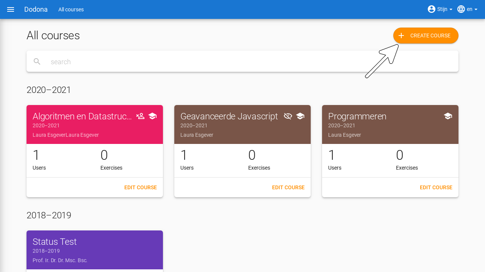
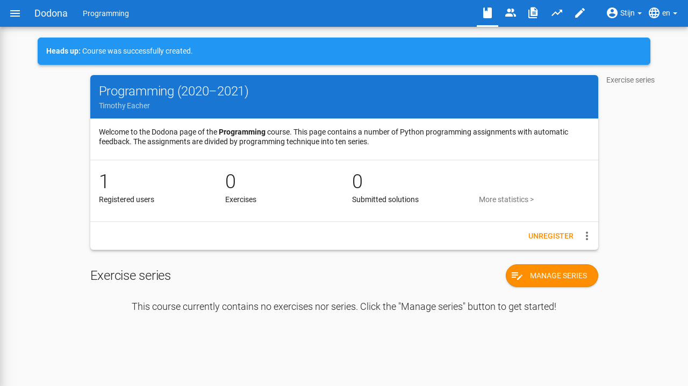

::: warning Sorry
For now, this page is only available in Dutch. Sorry!
:::

# Een cursus aanmaken

:::tip Belangrijk

Je hebt extra rechten nodig om een cursus te kunnen aanmaken. Je kan deze rechten eenvoudig aanvragen door (na inloggen) [dit formulier](https://dodona.ugent.be/nl/rights_requests/new) in te vullen. We geven je account dan zo snel mogelijk de nodige toegangsrechten.

:::

Als je de nodige rechten hebt op Dodona, dan kan je eenvoudig zelf een cursus aanmaken. Dit doe je door op de knop `CURSUS AANMAKEN` te klikken in de rechterbovenhoek van het [cursusoverzicht](https://dodona.ugent.be/nl/courses). Vanaf de landingspagina bereik je dit overzicht door te klikken op `MEER CURSUSSEN...`.

Om een nieuwe cursus aan te maken, zijn er twee opties. Ofwel vertrek je vanaf een reeds bestaande cursus en kopieer je de inhoud, ofwel maak je een volledige nieuwe cursus aan. Klik op een van de twee knoppen om je keuze te maken. Als je er voor kiest om met een lege cursus te beginnen kan je direct naar de [sectie over cursuseigenschappen](#cursuseigenschappen) gaan

## Cursus kopiëren

Als je gekozen hebt om een bestaande cursus te kopiëren, dan krijg je een lijst van alle zichtbare cursussen op Dodona te zien. Via de zoekbalk kan je filteren om snel de gewenste cursus te vinden. Via de link-knop aan de rechterkant van de tabel open je de betreffende cursus in een nieuw venster. Zo kan je snel controleren of dit de juiste cursus is. Klik het bolletje in de linkerkolom aan om je keuze te bevestigen.

Vervolgens moet je aangeven welke elementen van de cursus je wil overnemen. De reeksstructuur inclusief beschrijvingen worden altijd gekopieerd. Je kan dan nog kiezen of je de oefeningen, de deadlines en de cursusbeheerders wil overnemen. Vervolgens kan je er ook voor kiezen om de gekopieerde reeksen standaard allemaal op verborgen te zetten. Dit is zeer handig als je nog niet de volledige cursus wil vrijgeven aan je studenten.

## Cursuseigenschappen

Finaal moet je nog enkele zaken over de cursus zelf, zoals de naam en lesgever, instellen. Deze worden vooraf ingevuld met de waarden van de gekopieerde cursus indien deze optie gekozen werd. Volgende eigenschappen kunnen ingesteld worden.

* `Naam`: een naam voor de cursus. Verschillende cursussen kunnen dezelfde naam hebben, maar het is echter aangeraden om cursussen zoveel mogelijk een unieke naam te geven.

* `Lesgevers`: de naam of namen van de lesgevers van de cursus.

* `Academiejaar`: het academiejaar waarin de cursus wordt aangeboden. Gebruik het formaat `jjjj-jjjj` om ervoor te zorgen dat de cursus correct gesorteerd wordt op de startpagina en in het cursusoverzicht.

* `Onderwijsinstelling`: een onderwijsinstelling selecteren kan gebruikers helpen om je cursus te vinden en kan ook gebruikt worden om de zichtbaarheid van en registraties voor deze cursus te beperken.

* `Beschrijving`: optioneel stuk dat bovenaan de cursuspagina wordt weergegeven. Voor het opmaken van de beschrijving kan je gebruikmaken van [Markdown](https://en.wikipedia.org/wiki/Markdown). Dodona maakt voor de weergave van Markdown gebruik van [kramdown](https://kramdown.gettalong.org) waardoor heel wat uitbreidingen van de standaard Markdown ondersteund worden. Voor meer uitleg over hoe deze formattering werkt, kan je [hier](/nl/references/exercise-description/) terecht.

### Toegangsrechten

* `Voor wie is deze cursus zichtbaar`: dit bepaalt of niet-geregistreerde gebruikers de cursus kunnen zien. Voor deze eigenschap kunnen de volgende waarden ingesteld worden:

  * `Iedereen`: de cursus is voor alle gebruikers **zichtbaar** in de lijst van beschikbare cursussen. Ze kunnen ook naar de cursuspagina navigeren, alle zichtbare inhoud bekijken en zich daar eventueel voor de cursus registreren.

  * `Enkel gebruikers van de ingestelde onderwijsinstelling`: de cursus is enkel toegankelijk voor gebruikers van de ingestelde onderwijsinstelling (zie `Onderwijsinstelling` hierboven) en een directe link (zie volgend item).

  * `Enkel geregistreerde gebruikers`: alleen cursusbeheerders zien de cursus in het publieke cursusoverzicht. Er staat een icoontje bij om hen er op te wijzen dat andere gebruikers de cursus daar niet kunnen zien. Dit icoontje is ook te vinden op de cursuspagina zelf. Enkel geregistreerde gebruikers kunnen naar deze pagina navigeren. Andere gebruikers kunnen zich enkel voor de cursus registreren als ze een rechtstreekse registratielink gebruiken.

* `Toegangslink`: bij het aanmaken van een cursus wordt automatisch een toegangslink gegenereerd als afschermingsmechanisme van verborgen cursussen. Zonder deze link kunnen niet-geregistreerde gebruikers de cursuspagina van een verborgen cursus niet zien en zich daar dus ook niet registreren. Je vindt deze toegangslink op de cursus-bewerkenpagina. Klik op de kopieerknop naast de toegangslink om de toegangslink naar het klembord te kopiëren.

  

  De toegangslink heeft dus als voordeel dat gebruikers de cursus niet zelf moeten zoeken in het cursusoverzicht en dat ze meteen een verzoek krijgen om zich voor de cursus te registreren als ze dat nog niet gedaan hadden. Als cursusbeheerder krijg je de verantwoordelijkheid om de registratielink enkel te delen met niet-geregistreerde gebruikers die zich voor een verborgen cursus mogen registreren.

* `Wie kan zich registreren voor deze cursus`: deze eigenschap bepaalt of en hoe gebruikers zich voor de cursus kunnen registreren. Voor deze eigenschap kunnen de volgende waarden ingesteld worden:

  * `Iedereen`: gebruikers kunnen zich vrij voor de cursus registreren zonder expliciete goedkeuring van een cursusbeheerder. De cursus staat dus **open** voor iedereen.

  * `Enkel gebruikers van {jouw_onderwijsinstelling}`: enkel gebruikers van je eigen onderwijsinstelling kunnen zich voor deze cursus registreren.

  * `Niemand`: gebruikers kunnen zich niet zelf voor de cursus registreren. De registraties zijn dus **gesloten**.

* Standaard verloopt de goedkeuring van de registratie **automatisch**. Er is ook een optie om het registratieproces **gemodereerd** te laten verlopen. Gebruikers kunnen dan een registratieverzoek indienen voor de cursus maar zijn pas geregistreerd als een cursusbeheerder hun registratieverzoek heeft goedgekeurd.

  ::: tip Belangrijk

  Als je de registratieprocedure aanpast, dan blijven bestaande registraties voor de cursus gelden en blijven registratieverzoeken voor de cursus openstaan. Je moet zelf de bestaande registratiestatus van cursusgebruikers aanpassen.
  :::

Eenmaal alles naar wens is ingesteld klik je op de knop `CURSUS AANMAKEN` om je cursus definitief aan te maken.

Na het aanmaken van de nieuwe cursus navigeer je automatisch naar de cursuspagina, waar je kunt vaststellen dat je automatisch geregistreerd bent als cursusgebruiker en dat je aangeduid bent als cursusbeheerder.

