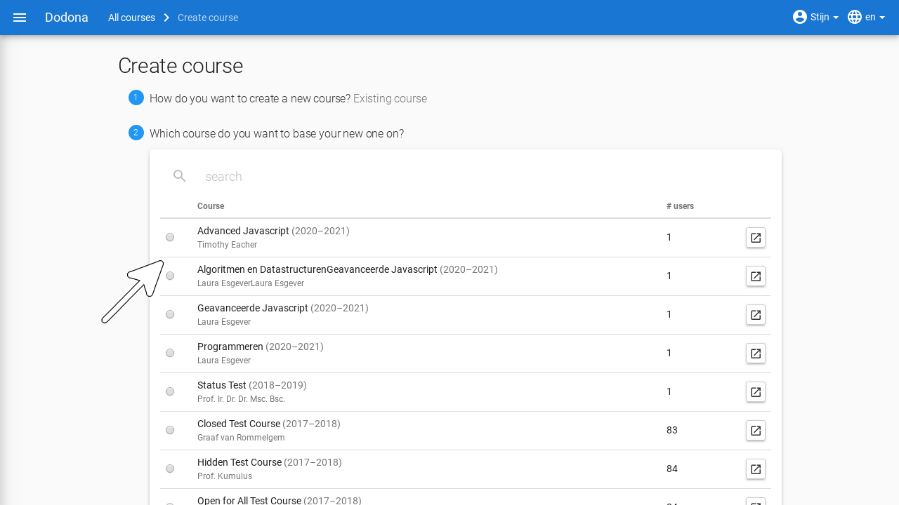
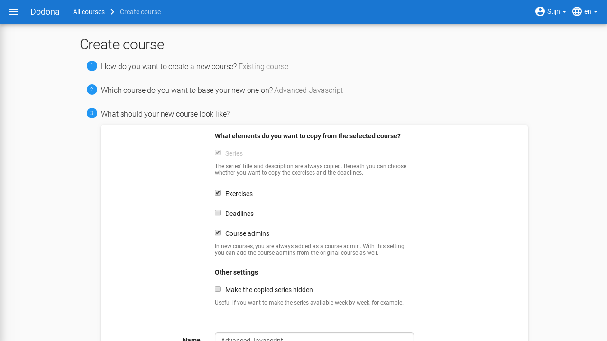
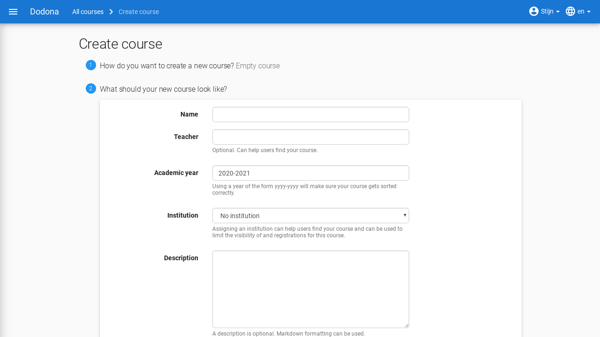

# Creating a Course

:::tip Important

You need extra rights to create a course. You can easily request these rights by filling out [this form](https://dodona.be/en/rights_requests/new) after logging in. We will grant your account the necessary access rights as soon as possible.

:::

If you have the necessary rights on Dodona, you can easily create a course yourself. You do this by clicking on the `Create course` button in the upper right corner of the [course overview](https://dodona.be/en/courses). From the landing page, you can reach this overview by clicking on `More courses...`.

To create a new course, there are two options. Either you start from an existing course and copy the content, or you create a completely new course. Click on one of the two buttons to make your choice. If you choose to start with an empty course, you can go directly to the [section on course properties](#course-properties).

## Copy Course

::: tip Quick Copy

If you want to quickly copy an existing course, follow these steps:
* Navigate to the course you want to copy.
* Click on the three vertical dots `⋮` in the bottom right corner of the top card of the course.
* Choose `Copy this course`.

:::

If you have chosen to copy an existing course, you will see a list of all visible courses on Dodona. You can filter using the search bar to quickly find the desired course. Click the link button on the right side of the table to open the respective course in a new window. This way, you can quickly check if this is the correct course. Click the circle in the left column to confirm your choice.

Next, you need to specify which elements of the course you want to copy. The series structure, including descriptions, is always copied. You can then choose whether to copy the exercises, deadlines, and course administrators. You can also choose to set all copied series to hidden by default. This is very useful if you do not want to release the entire course to your students yet.

## Course Properties

Finally, you need to set a few things about the course itself, such as the name and instructor. These are pre-filled with the values of the copied course if that option was chosen. The following properties can be set:

* `Name`: a name for the course. Different courses can have the same name, but it is advisable to give courses a unique name whenever possible.

* `Teacher`: the name or names of the instructors of the course.

* `Academic Year`: the academic year in which the course is offered.

* `Language`: the language in which the course is given. This is optional and only used to help users find courses in their preferred language.

* `Programming Language`: the programming language that is used in the course. This is optional and only used to help users find courses in their preferred programming language.

* `Description`: an optional piece that is displayed at the top of the course page. For formatting the description, you can use [Markdown](https://en.wikipedia.org/wiki/Markdown). Dodona uses [kramdown](https://kramdown.gettalong.org) for rendering Markdown, which supports many extensions of the standard Markdown. For more explanation on how this formatting works, you can go [here](/en/references/exercise-description/).

### Access Rights

* `Who can see this course`: this determines whether non-registered users can see the course. The following values can be set for this property:

  * `Only users of the configured institution`: the course is only accessible to users of the set educational institution (see `Educational Institution` above) and a direct link (see next item).

  * `Only registered users`: only registered users can see the course in the courses overview. There is an icon to indicate to course members that other users cannot see the course on the course page itself. Only registered users can navigate to this page. Other users can only register for the course if they use a direct registration link.

* `Access Link`: when creating a course, an access link is automatically generated as a shielding mechanism for hidden courses. Without this link, non-registered users cannot see the course page of a hidden course and therefore cannot register there. You can find this access link on the course edit page. Click the copy button next to the access link to copy the access link to the clipboard.

  

  The access link has the advantage that users do not have to search for the course themselves in the course overview and that they immediately receive a request to register for the course if they have not already done so. As a course administrator, you are responsible for sharing the registration link only with non-registered users who are allowed to register for a hidden course.

* `Who can register for this course`: this property determines whether and how users can register for the course. The following values can be set for this property:

  * `Only users of the configured institution`: only users of your own educational institution can register for this course.

  * `Nobody`: users cannot register themselves for the course. The registrations are therefore **closed**.

* By default, the approval of the registration is **automatic**. There is also an option to make the registration process **moderated**. Users can then submit a registration request for the course but are only registered once a course administrator has approved their registration request.

  ::: tip Important

  If you adjust the registration procedure, existing registrations for the course remain valid, and registration requests for the course remain open. You must adjust the existing registration status of course users yourself.

  :::

Once everything is set to your liking, click the `Create Course` button to finalize your course creation.

After creating the new course, you will automatically navigate to the course page, where you can see that you are automatically registered as a course user and that you are designated as a course administrator.

