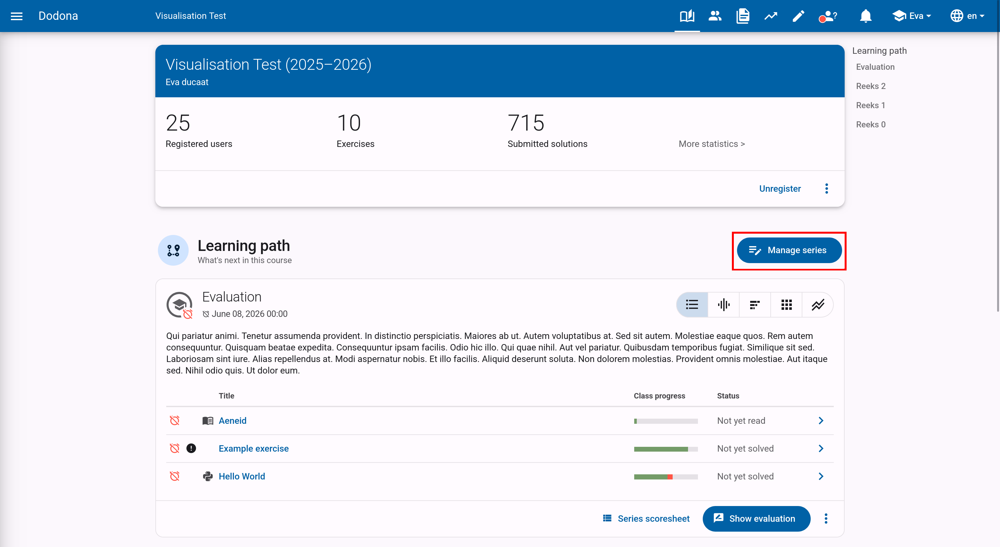
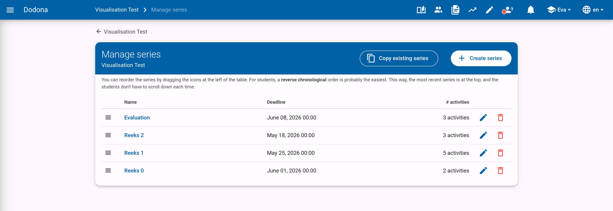
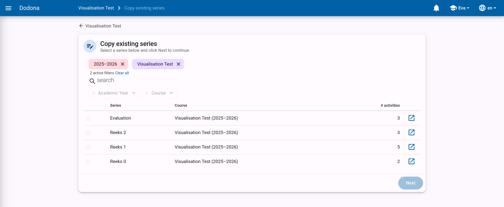
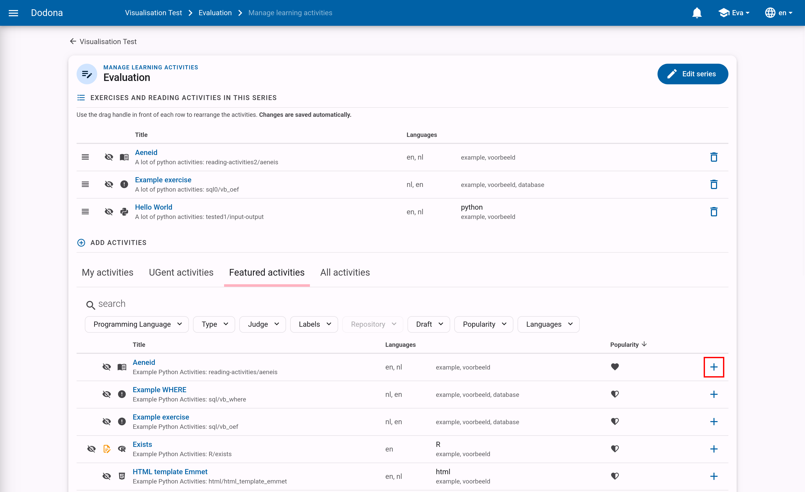
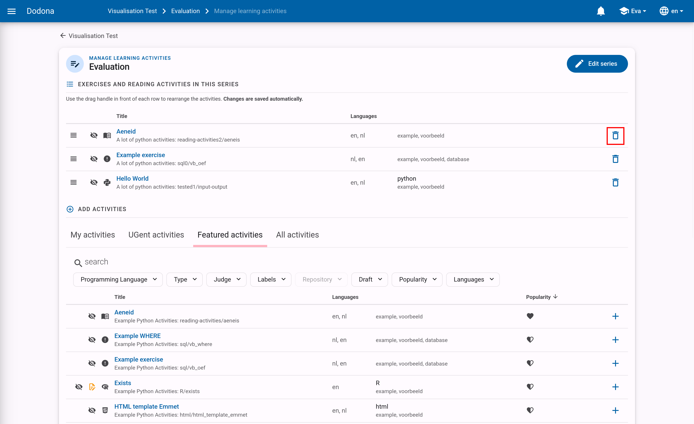
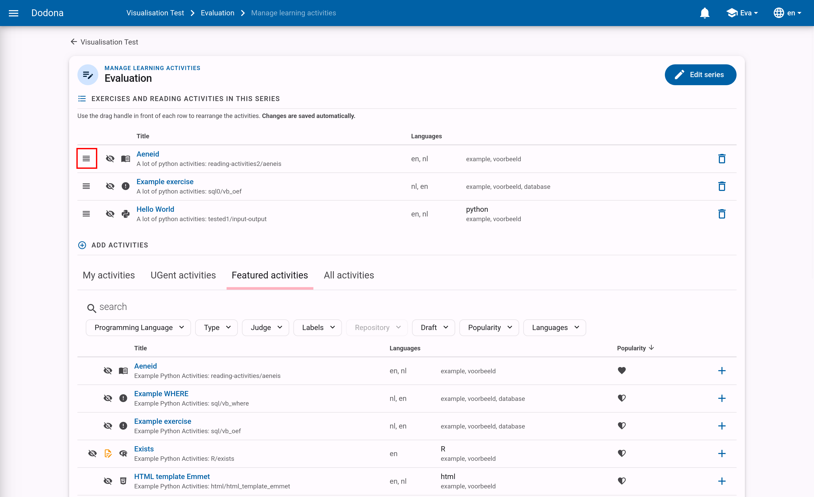
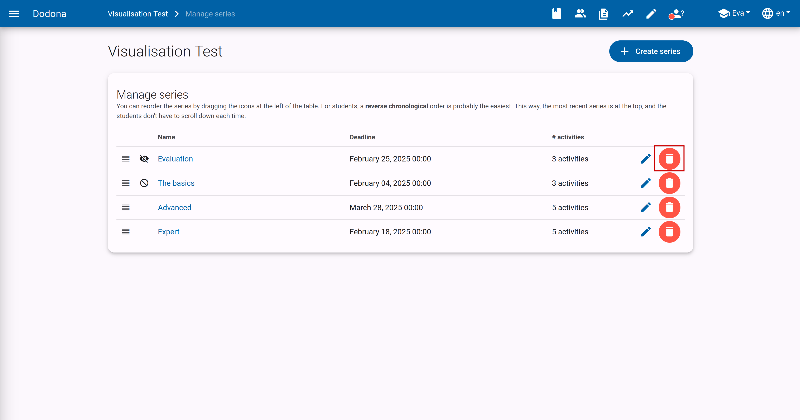
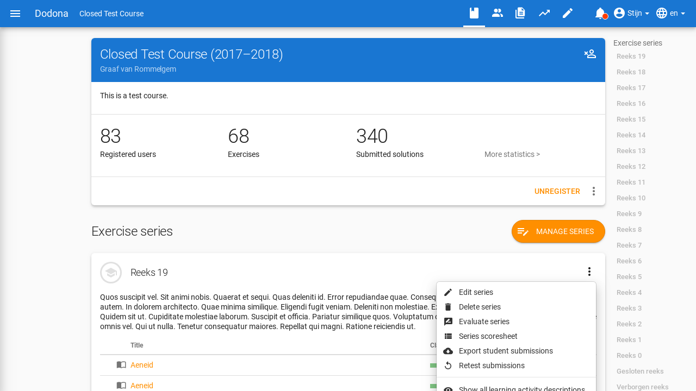
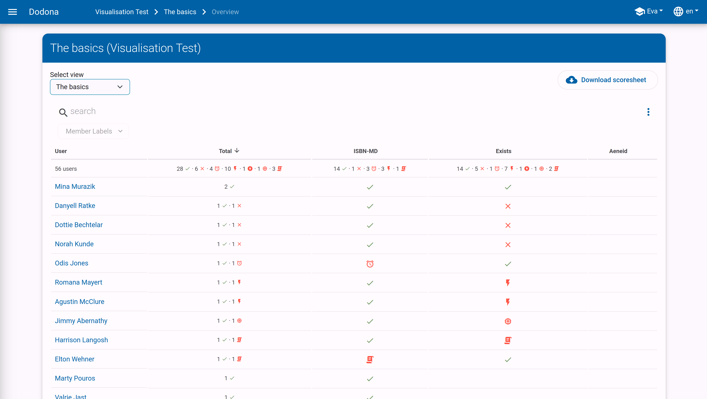

# Exercise series management

The learning path of a course consists of various exercise series, each containing different exercises.
Course administrators can create, edit, delete, and reorder these series.

## Create an exercise series

A course administrator can create an unlimited number of exercise series within your course.
To do this, first navigate to the course page and then click `Manage series`.

On this page, you will find the `Copy existing series` and `Create series` buttons in the top right corner.

When copying an existing series, you can pick the series you want to copy. This is filtered to the current course by default, but you can pick series from any course you are an admin of.

You will then be directed to a form where you can set the properties of the series. This is also the form you land on when you create a new series.

The first choice to make is what kind of series you want to create. You can either create a regular series or an optional series. The regular series has clear progress tracking. An optional series is collapsed by default for your students, and will make it clear that the exercises in it are optional.

After that, give the series a name and optionally configure a deadline, description, visibility, and some advanced settings.
All properties on this form are described in the [series settings](../series-settings/) reference.

To create the series, click the `Create series` button at the bottom of the page. The new exercise series will be added to your course.

After creating the series, you will be directed to the page for managing the exercises in a series.

## Add exercises to a series

You can access this page in two ways: automatically after creating a new series or by choosing `Manage learning activities` in the series action menu.

Here you will find the activities that already belong to this series and possible activities to add.
Click the add button (`+`) on the right side of an exercise to add it to the exercise series.

Using the search bar and filters, you can filter existing exercises by name, available translations, programming language, labels, repository, or type.

Under the heading `Exercises and reading activities in this series`, you can click the delete button on the right side of an exercise to remove it from the exercise series.

Drag the move button on the left side of the exercises to change the order of the exercises.
The order in which the exercises are listed under the heading `Exercises and reading activities in this series` is also the order in which the exercises are displayed in the exercise series.

::: tip Important

We assume here that the exercises to be linked to the exercise series are already available in Dodona.
The creation, publication, and sharing of exercises are discussed [here](/en/guides/exercises/creating-exercises/introduction).

:::

## Manage an exercise series

Of course, it is possible to delete a series from a course.
You can find this action in the series management menu or in the series action menu, similar to editing.

It can be useful to give series in a course a specific order, for example, to sort them by difficulty.
By default, they will be sorted in reverse chronological order based on when you add them.
This way, students will always find the most recent series at the top, and thus have to scroll less to find the latest exercises.
In the series management panel, you can reorder the series by dragging the hamburger icon on the left side.

## The series menu

At the bottom of the series, you will find some useful actions that course administrators can perform on the series.
The main actions are `Evaluate series` and `Series scoresheet`; other actions can be found by clicking on the three dots.

* `Evaluate series`: This action allows you to browse through the submitted solutions of this series in a structured way, for example,
  to [evaluate](/en/guides/teachers/grading) or improve them.

* `Series scoresheet`: Shows a handy overview of the submission status of all course users for all exercises in the exercise series.
  The submission status is displayed in the overview with the usual icons.

  

  Click on the name of a course user to navigate to the user's overview page.

  Click on the icon of a submission status to navigate to the solution used to determine the submission status
  (if the course user has indeed submitted a solution based on which the submission status could be determined).
  You can also filter by students who have started at least one activity and search by name or student labels in this overview.

* `Export student submissions`: This action allows you to [export](../series-export-and-retest/#export-exercise-series-submissions) the submitted solutions of students for the exercises in the series as a zip file.

* `Retest submissions`: This action [retests](../series-export-and-retest/#retest-submissions) all solutions that course users have submitted for exercises in the exercise series.
  This can be useful if, for example, you have added or modified a number of tests and want to retest the already submitted solutions.

The export and retest actions are covered in detail in [series export and retest](../series-export-and-retest/).
