# Exercise series management

The learning path of a course consists of various exercise series, each containing different exercises.
Course administrators can create, edit, delete, and reorder these series.

## Create an exercise series

A course administrator can create an unlimited number of exercise series within your course.
To do this, first navigate to the course page and then click `Manage Series`.

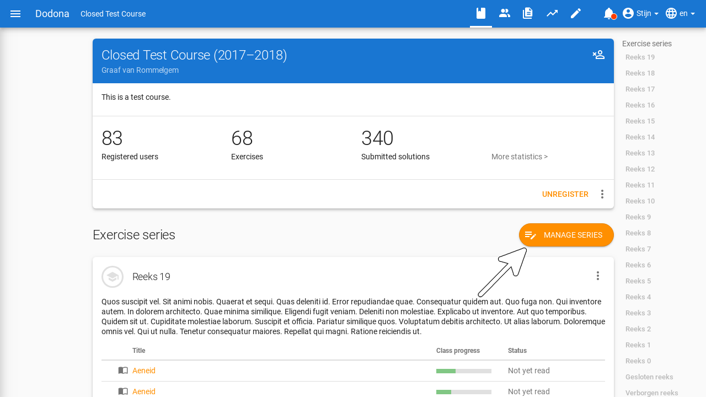

On this page, you will find the `Create Series` button in the top right corner.

You will be directed to a form where you can set the following properties of the series:

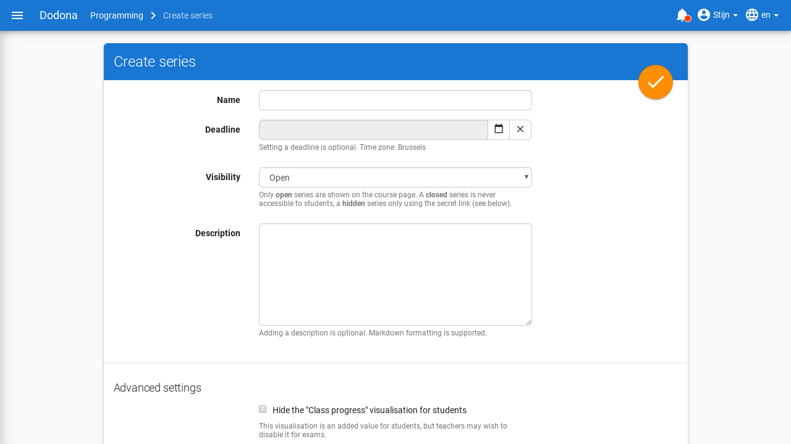

* `Name`: The name of the exercise series. 
  Within a course, different exercise series can have the same name, but it is advisable to give each exercise series a unique name.

* `Deadline`: An optional deadline that indicates until when solutions submitted for exercises in this series will be considered. 
  Students can continue to submit solutions for exercises in the series after the deadline and will still receive feedback.
  However, these submissions will not be considered in determining their submission status for the exercises in the series.

  ::: tip Important

  The submission status for students is always dynamically calculated based on the deadline.
  If the deadline is adjusted, the submission status for a particular exercise may change.
  Keep this in mind if you set the deadline to an earlier time.
  :::

  Click on the input field or the calendar button to set the date and time of the deadline. 
  Select the deadline in the time zone set in your user profile.
  Other users will see the deadline in the time zone set in their user profile.

  

  Click the delete button to remove a set deadline.

  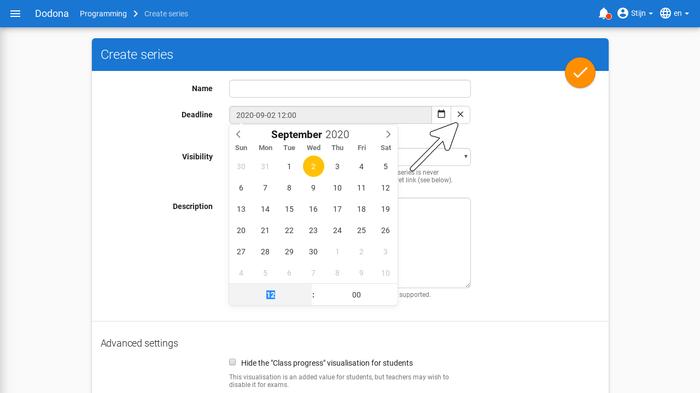

* `Description`: An optional description that users see when viewing the exercise series in the course.
  You can use [Markdown](/en/references/exercise-description/#markdown) to format the description.

* `Visibility`: This determines whether users can see the exercise series. The following values can be set for this property:

  * `Visible for everyone`: All users see the exercise series on the course page.

  * `Only vissible via secret link`: Only course administrators see the exercise series on the course page. 
    There is a clear message indicating that other users cannot see the exercise series.
    You can give users access to this series by sending them the specific secret link (see below) of this series.

  * `Hidden for students`: Only course administrators see the exercise series on the course page.
    There is a clear message indicating that other users cannot see the exercise series there.

  * `Visible for students after start time`: The exercise series is not visible to students until the start time you specify. 
    You can set the start time in the same way as the deadline.

  

* `Secret Link`: When creating a series that is only vissible via secret link, a secret link is automatically generated to provide access to this series. 
  Without this link, users cannot see this exercise series.

  You can find the secret link for an exercise series at the bottom of the edit page for that series.
  

  You can easily generate a new secret link by clicking the renew button.
  This can be useful if you accidentally shared the link with someone who should not have it.
  Note that the old link will no longer work once you generate a new one.
  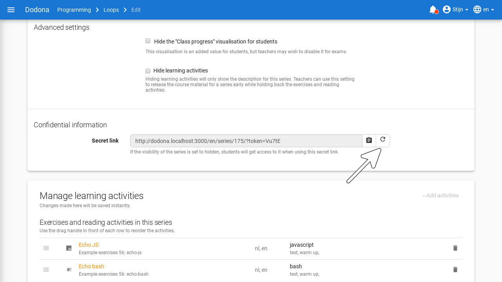

* **Advanced settings**:

  * `Hide the "Class progress" visualization for students`: For an exercise, the progress of all users in the course is shown.
    This visualization can be valuable for students, but you might want to disable it for exams.

  * `Hide learning activities`: If the learning activities are hidden, only the description of this series will be shown.
    You can use this setting to, for example, make the course material of the series available in advance without releasing the exercises and reading activities.

  * `Number learning activities`: If this setting is active, each exercise and reading activity is given a sequential number, starting with 1.
    This number is displayed in titles and listings and can make it easier to communicate about these activities.

To create the series, click the completion button in the top right corner of the `Create Series` panel. The new exercise series will be added to your course.

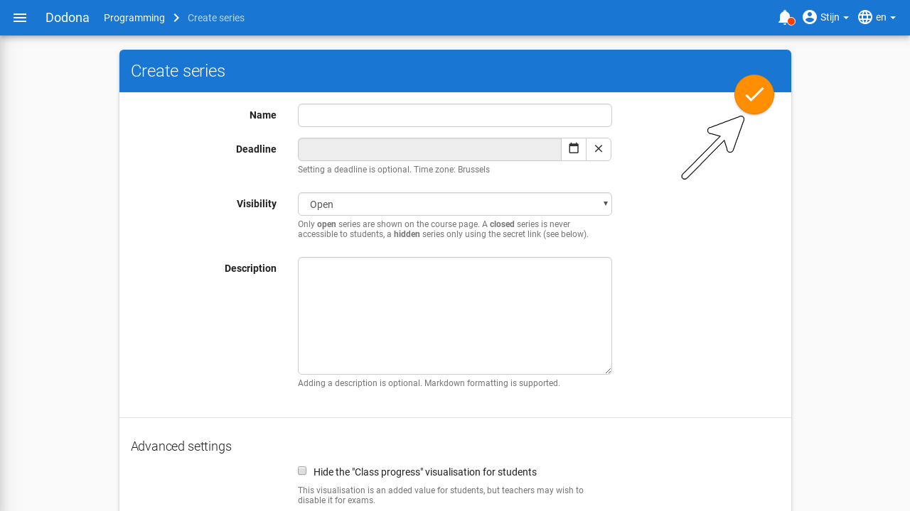

After creating the series, you will be directed to the editing page. You can now add exercises to the series.

## Edit an exercise series

On the editing page of an exercise series, you will see an extended version of the series creation panel
where you can not only set properties but also link exercises to the series.
You can access this page in three ways: automatically after creating a new series,
by clicking the edit icon of the series in the Manage series panel, or by choosing `Edit series` in the series action menu.

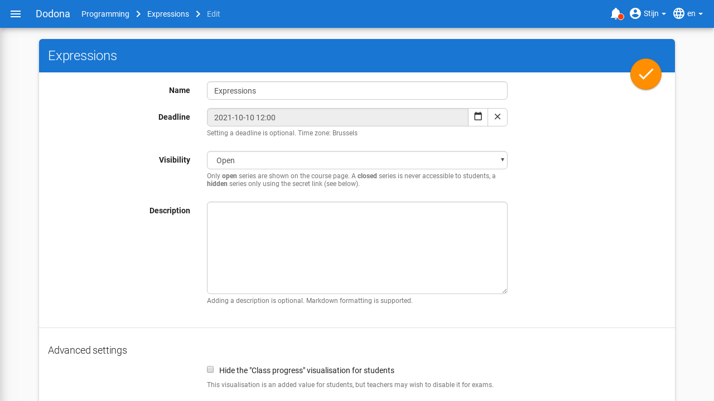

At the bottom of the page, you will find the activities that already belong to this series and possible activities to add.
Click the add button (`+`) on the right side of an exercise to add it to the exercise series.

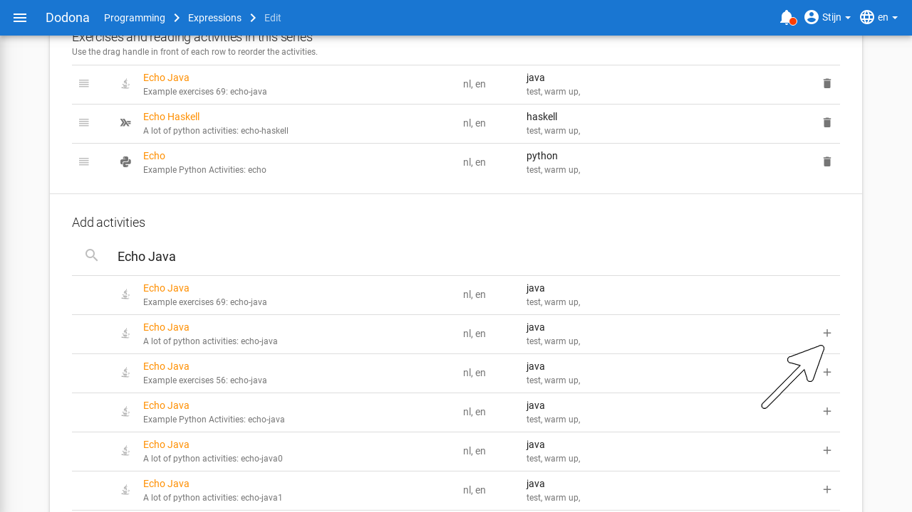

Using the search bar and filters, you can filter existing exercises by name, available translations, programming language, labels, repository, or type.

Under the heading `Exercises and reading activities in this series`, you can click the delete button on the right side of an exercise to remove it from the exercise series.

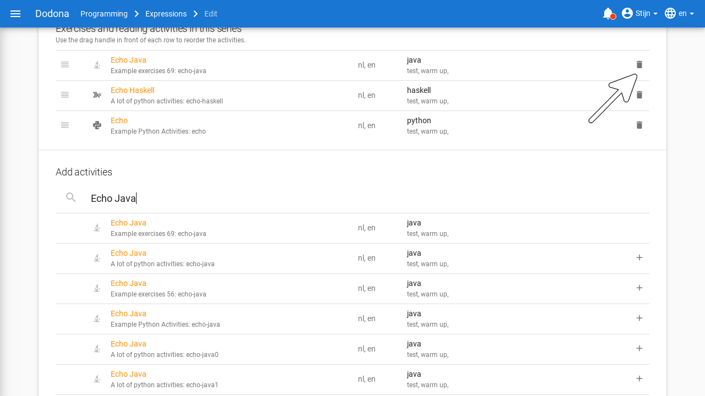

Drag the move button on the left side of the exercises to change the order of the exercises.
The order in which the exercises are listed under the heading `Exercises and reading activities in this series` is also the order in which the exercises are displayed in the exercise series.

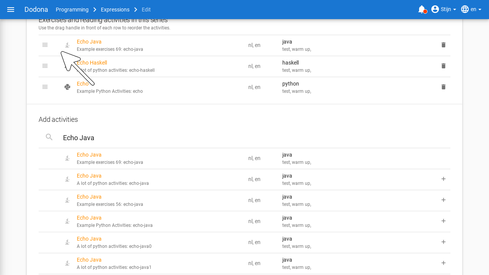

::: tip Important

We assume here that the exercises to be linked to the exercise series are already available in Dodona.
The creation, publication, and sharing of exercises are discussed [here](/en/guides/exercises/creating-exercises/introduction).

:::

Click the completion button in the top right corner of the panel to save the edits.
This only applies to the series properties.
Edits to the exercises within the series are automatically saved immediately.

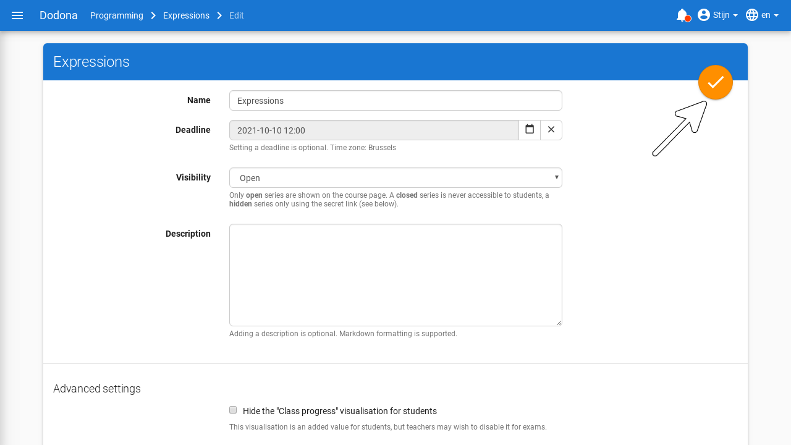

## Manage an exercise series

Of course, it is possible to delete a series from a course.
You can find this action in the series management menu or in the series action menu, similar to editing.

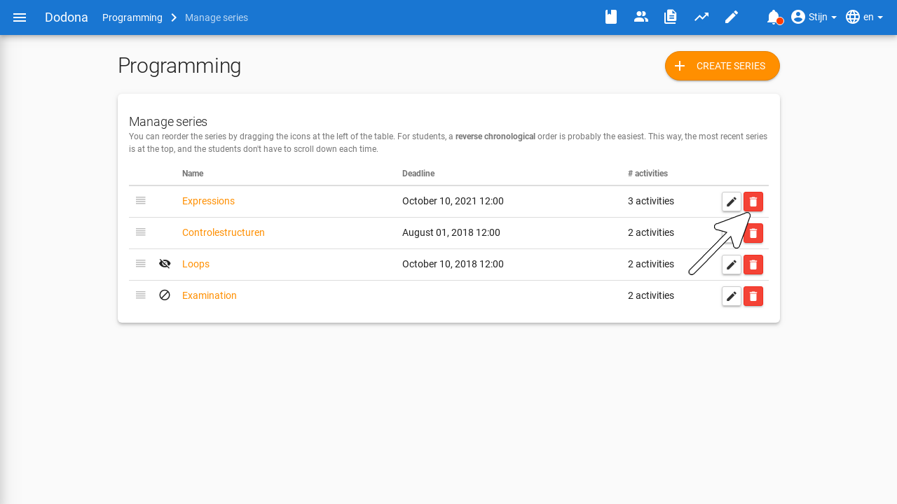

It can be useful to give series in a course a specific order, for example, to sort them by difficulty.
By default, they will be sorted in reverse chronological order based on when you add them.
This way, students will always find the most recent series at the top, and thus have to scroll less to find the latest exercises.
In the series management panel, you can reorder the series by dragging the hamburger icon on the left side.

## The series menu

At the bottom of the series, you will find some useful actions that course administrators can perform on the series.
The main actions are `Evaluate series` and `Series scoresheet`; other actions can be found by clicking on the three dots.

* `Evaluate series`: This action allows you to browse through the submitted solutions of this series in a structured way, for example,
  to [evaluate](#evaluate-exercise-series) or improve them.

* `Series scoresheet`: Shows a handy overview of the submission status of all course users for all exercises in the exercise series.
  The submission status is displayed in the overview with the usual icons.

  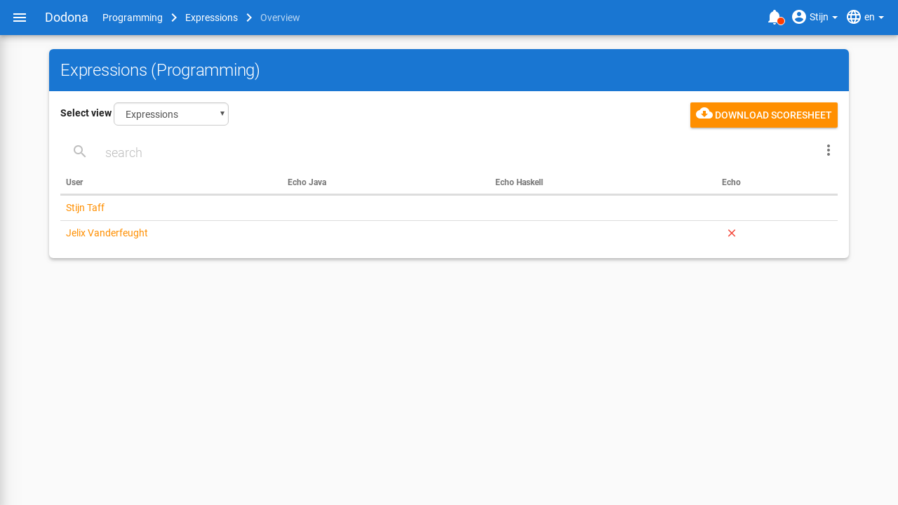
  
  Click on the name of a course user to navigate to the user's overview page.
  
  Click on the icon of a submission status to navigate to the solution used to determine the submission status
  (if the course user has indeed submitted a solution based on which the submission status could be determined).
  You can also filter by students who have started at least one activity and search by name or student labels in this overview.

* `Export student submissions`: This action allows you to [export](#export-exercise-series-solutions) the submitted solutions of students for the exercises in the series as a zip file.

* `Retest submissions`: This action retests all solutions that course users have submitted for exercises in the exercise series.
  This can be useful if, for example, you have added or modified a number of tests and want to retest the already submitted solutions.
  The following section explains how to re-evaluate a single solution.

## Retest submissions

When retesting a submission, all tests are rerun without the solution having to be resubmitted.
This way, the original submission time is preserved.
If the configuration of the exercise has been modified since the last evaluation of the solution, the status of the solution may change due to the re-evaluation.
Click the repeat button in the top right corner of the feedback page of a user's submission to re-evaluate that solution.

::: tip Important

When re-evaluating, solutions receive a lower priority in the queue than newly submitted solutions.
This way, the evaluation of solutions that users submit experiences minimal delay, but re-evaluation may take longer.

Users do not receive a notification from the platform when their solutions are re-evaluated.
If you decide to re-evaluate solutions, it is important to inform users that there may be changes to the status of solutions they submitted earlier,
as well as their submission status for exercises in the exercise series of the course.
:::

## Evaluate exercise series

Correct test results are no guarantee of good code.
Therefore, Dodona also provides support to manually evaluate the solutions and provide them with feedback and grades.
More information about this can be found in [this guide](/en/guides/teachers/grading).

## Export exercise series submissions

In the action menu of a series, you as a teacher can also choose to export the submitted code of your students as a zip file.
This can be useful if you prefer to grade on paper and want to print the code.

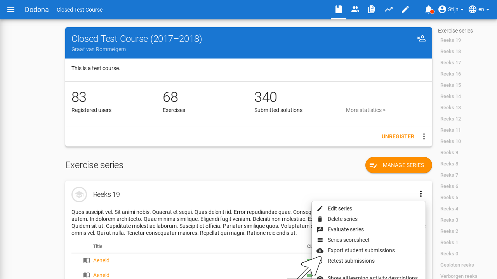

This will take you to an export page where you will first be asked to select the exercises in the series for which you want to export the submissions.

If you want to download all of them, select the checkbox in the table header. Then click `Next step` to continue.

Next, you can check various options that affect the content of the export.
You can obtain a summary csv, choose whether you want all solutions or only the latest ones, whether the deadline should be considered,
whether the files should be grouped per student or per exercise, and which students should be included.

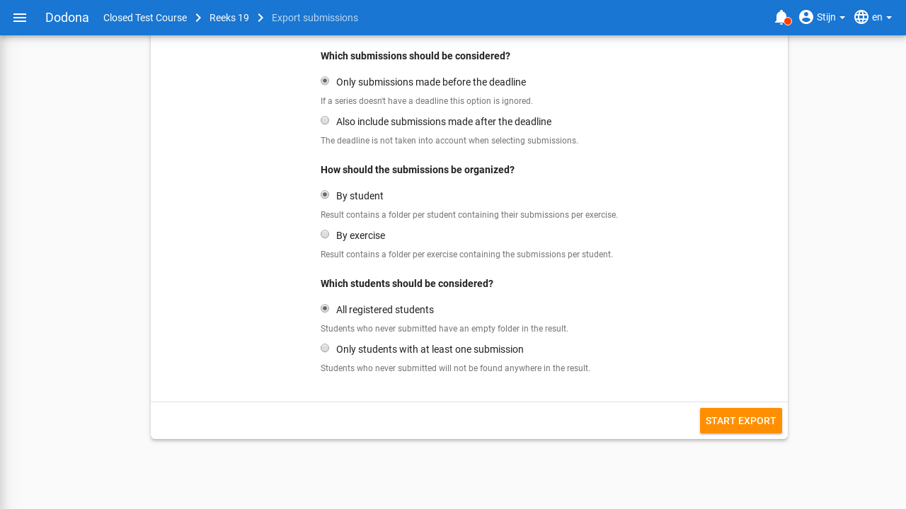

Click `Start export` to start the download. 
At that moment, all submitted solutions will be zipped, which may take a moment. Then the download will start automatically.
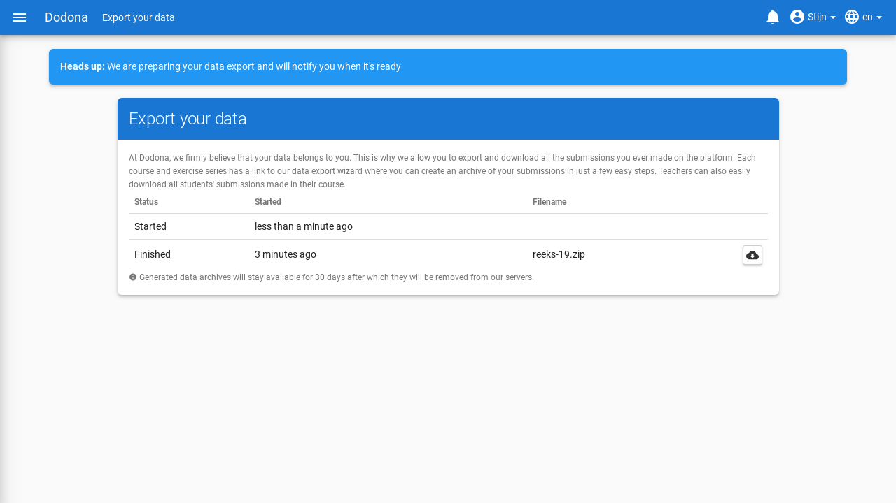
