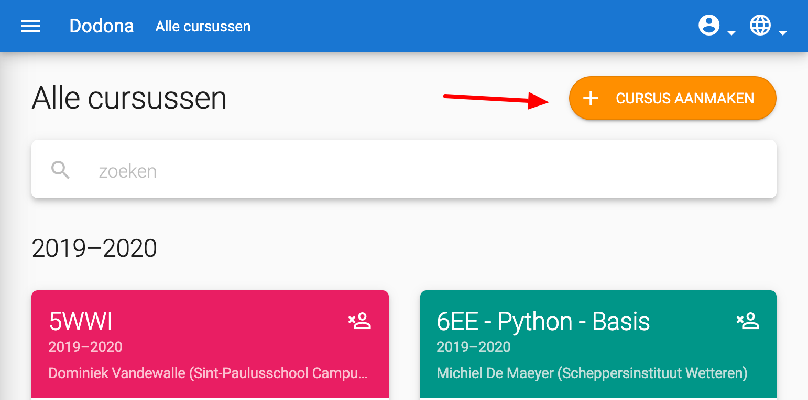
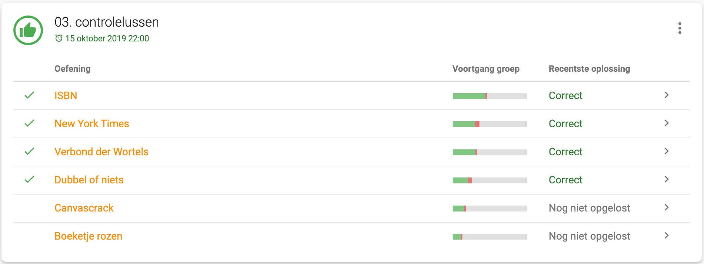

# Van start met Dodona als leerkracht

> Alle informatie om vlot van start te gaan met Dodona als leerkracht.

## Wat is Dodona?

Dodona is een online oefenplatform om te leren programmeren. De webapplicatie werd ontwikkeld aan de Universiteit Gent om practica aan grote groepen studenten te ondersteunen. Dodona focust daarom in de eerste plaats op het automatisch testen en geven van feedback op ingediende oplossingen van programmeeroefeningen. Op dit moment ondersteunt Dodona de programmeertalen Python, JavaScript, Java, C#, bash, Prolog, Haskell en R.

Op Dodona kunnen lesgevers een eigen cursus aanmaken, opgebouwd uit verschillende oefeningenreeksen. Ze kunnen hiervoor beroep doen op bestaande cursussen en oefeningen, maar kunnen er ook voor kiezen om zelf aan de slag te gaan en eigen oefeningen en lesmateriaal op te stellen. Dankzij de ingebouwde *learning analytics* en datavisualisaties is het bovendien eenvoudig om de voortgang van studenten te meten.

Dodona wordt gratis aangeboden voor educatieve doeleinden.

## Aanmelden

Aanmelden op Dodona kan via de Smartschool, Office 365 of G Suite account van je school. Dodona krijgt vervolgens je naam, emailadres, en naam van je school doorgestuurd van het gekozen loginsysteem. Op basis hiervan kunnen we je identificeren en maken we automatisch een Dodona-account aan de eerste keer dat je aanmeldt. Je wachtwoord wordt op geen enkel moment naar ons doorgestuurd.

::: tip Meerdere inlogsystemen?
Sommige scholen bieden zowel inloggen via Smartschool als via Office 365 of G Suite aan. Omdat je Dodona-account gekoppeld is aan het gebruikte inlogsysteem, zal twee verschillende Dodona-accounts hebben als je bijvoorbeeld eerst via Smartschool aanmeldt en vervolgens via Office 365.

Om problemen te voorkomen kunnen we voor jouw school de inlogmogelijkheden beperken. Contacteer ons hiervoor op <a href="mailto:dodona@ugent.be"> dodona@ugent.be</a>.
:::

Een standaard Dodona-account kan zich vrij inschrijven voor cursussen en onbeperkt oefeningen indienen. Wil je als lesgever zelf een cursus aanmaken of oefeningen opstellen, dan heb je extra rechten nodig. Contacteer ons op [dodona@ugent.be](mailto:dodona@ugent.be) of via het [contactformulier](https://dodona.ugent.be/nl/contact) en we geven je account zo snel mogelijk de nodige toegangsrechten.

## Een cursus aanmaken

Eenmaal we je lesgeversrechten hebben geactiveerd kan zelf een cursus aanmaken door op de knop `CURSUS AANMAKEN` te klikken in het [cursusoverzicht](https://dodona.ugent.be/nl/courses/).

Vervolgens kan je kiezen om te starten vanaf een lege cursus, of om de inhoud van een bestaande cursus over te nemen en aan te passen. Om inspiratie op te doen kan je een kijkje nemen in volgende bestaande cursussen:

- **[De Programmeursleerling](/nl/guides/the-coders-apprentice)**: een cursus programmeren in Python die gebaseerd is op het boek De Programmeursleerling van Pieter Spronck.
- **[Informatica](https://dodona.ugent.be/nl/courses/164/)**: een cursus programmeren in Python die gegeven wordt aan het vijfde jaar Wiskunde-Wetenschappen-Informatica van het [Sint-Paulusschool Campus College](https://www.collegewaregem.be/) in Waregem. De cursus en een groot deel van de oefeningen werd opgesteld door [Dominiek Vandewalle](mailto:dominiek.vandewalle@sgsintpaulus.eu).
- **[Programmeren](https://dodona.ugent.be/nl/courses/88/)**: een cursus programmeren in Python die gegeven wordt door prof. Peter Dawyndt aan de faculteit Wetenschappen van de Universiteit Gent.

## Een cursus opstellen

Een cursus op Dodona bestaat uit verschillende oefeningenreeksen die je kan gebruiken om oefeningen te groeperen. Om een nieuwe oefeningenreeks aan te maken, klik je op de `REEKSEN BEHEREN` knop op je cursuspagina en vervolgens op `REEKS AANMAKEN`. Je krijgt dan onderstaand formulier te zien.

Elke oefeningenreeks bestaat uit een titel en een beschrijving die je kan gebruiken om bijvoorbeeld te verwijzen naar lesmateriaal. Naast gewone tekst kan je hier ook het [Markdownformaat](/nl/references/exercise-description/#markdown) gebruiken om extra opmaak toe te voegen. Daarnaast kan je ook een eventuele deadline opgeven.

Voor elke oefeningenreeks kan je de zichtbaarheid instellen:
- **Open**: Dit is de standaard instelling. De reeks is gewoon zichtbaar op je cursuspagina.
- **Gesloten**: De reeks zal voor studenten niet zichtbaar zijn op de cursuspagina. Je kan deze instelling bijvoorbeeld gebruiken om reeksen voor te bereiden die je nog niet wil vrijgeven aan de studenten.
- **Verborgen**: De reeks zal voor studenten niet zichtbaar zijn op de cursuspagina, maar je kan ze wel toegang geven via een speciale link die je te zien krijgt na het aanmaken van de reeks.

Nadat je een reeks hebt aangemaakt, kan je oefeningen en leesactiviteiten toevoegen. Je kan hiervoor kiezen uit alle oefeningen en activiteiten die voor jou beschikbaar zijn in Dodona. Via het zoekveld kan je eenvoudig de lijst van oefeningen filteren. Hieronder zie je bijvoorbeeld dat enkel de Python oefeningen met het label "middelbaar" worden weergegeven.

Bij het selecteren van oefeningen kun je meer info over een oefening bekijken door naar de infopagina te gaan. Hier vindt je voorbeeldoplossingen, beschikbare talen, instellingen, extra uitleg en contactgegevens van de auteur.

De handleiding om zelf oefeningen op te stellen volgt binnenkort. Een eerste aanzet vind je op [deze pagina](../new-exercise-repo/).

## Je cursus gebruiken

Eenmaal je je cursus hebt opgesteld, kan je ze gebruiken in je les. Je zorgt er best voor dat je leerlingen voor de juiste cursus zijn ingeschreven door een directe link naar de cursus op bijvoorbeeld Smartschool te plaatsen. Via het gebruikersmenu van je cursus kan je opvolgen wie al ingeschreven is.

Als je in deze gebruikerslijst op de naam van een leerling klikt, dan krijg je de voortgang van die student te zien.

