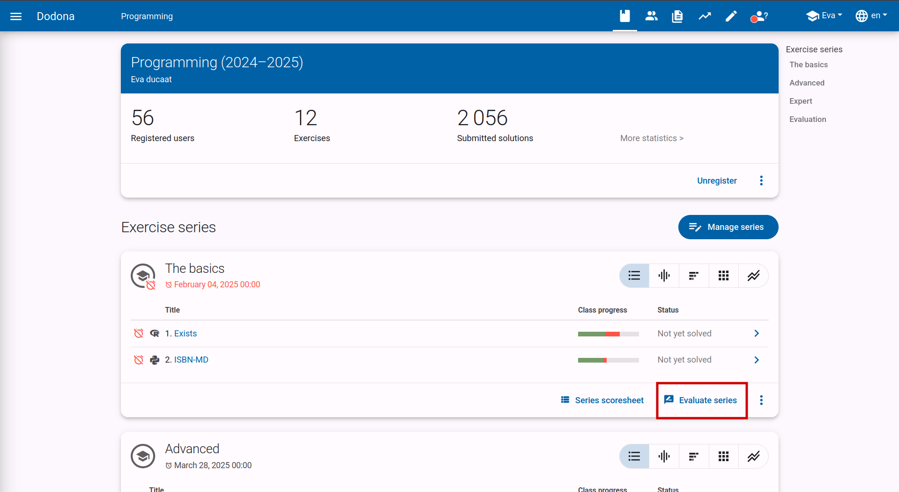
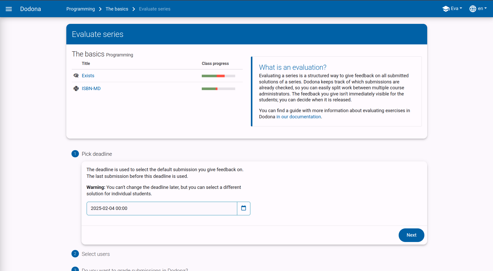
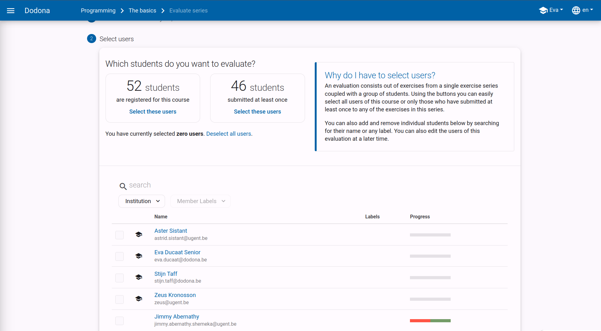
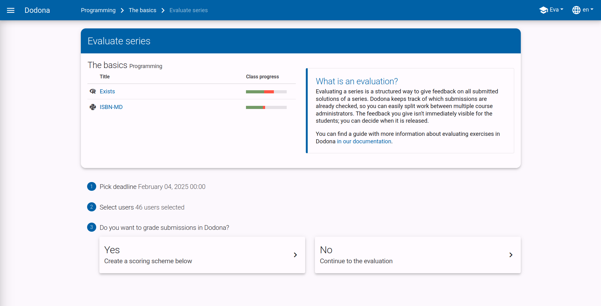
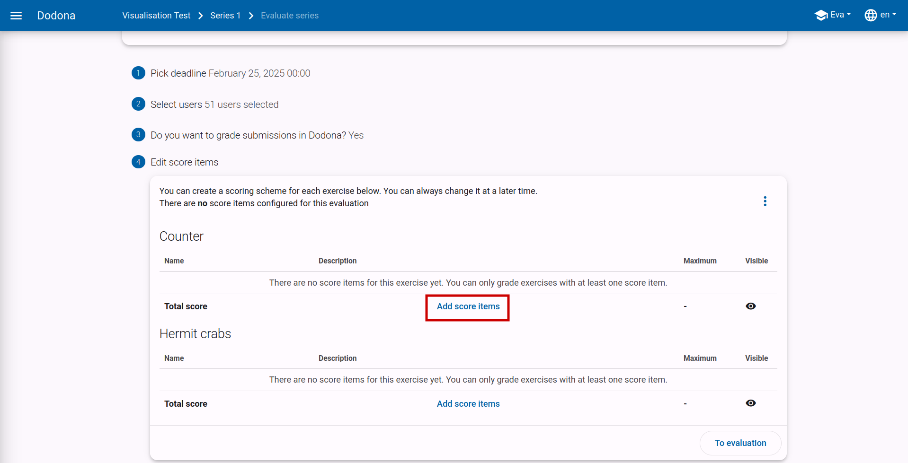
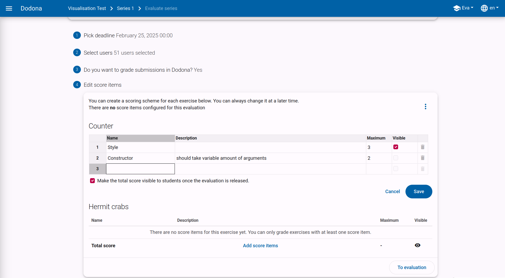
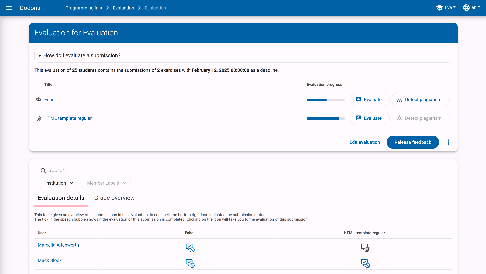
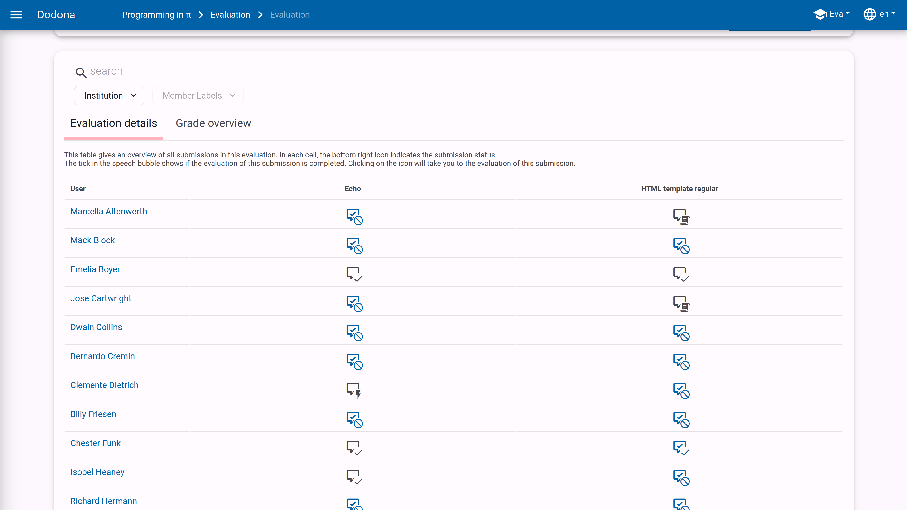
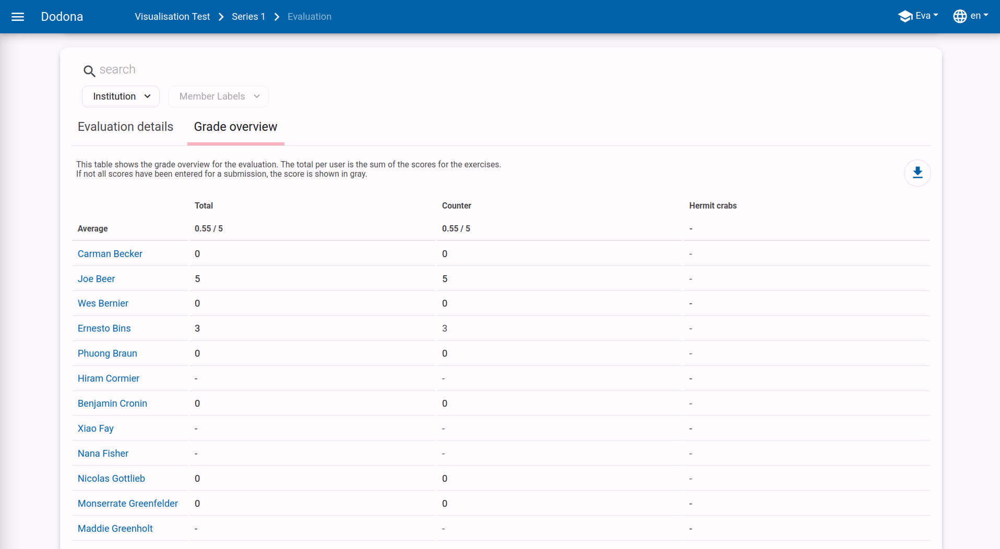
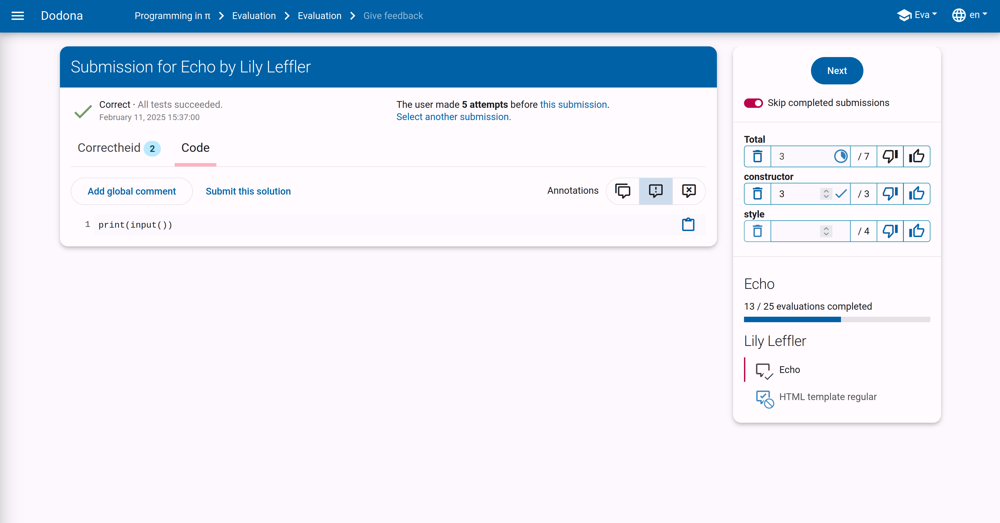

# Grading Assignments and Tests with Dodona

Dodona has a grading module, which is ideal for reviewing submitted solutions in a structured way and providing feedback and/or points.

## Evaluating a Series

Grading exercises is always done per series.
If you want to grade a task, test, or exam later, it's best to create a separate series for it.

At the bottom right of the series, you will find a button to create a new evaluation for that series.
Once created, you can find the evaluation again via the same button.

## Configuring Your Evaluation

Before you can start grading, you need to configure the evaluation.
For example, you need to select which students to include and whether you want to set a points distribution per exercise.
You will be guided through the different steps during creation.

### Choosing a Deadline

The first choice you need to make is which deadline to use.
For each student, the last submitted solution before the chosen time will be selected.

If a series had a set deadline, it will be automatically adopted, but you can adjust it here if necessary.

A deadline can only be in the past and cannot be changed after making your choice.

### Selecting Students

In a second step, choose which students should be included in the evaluation.
You can select students individually or use the default configurations:
all students enrolled in the course or all students who submitted at least one of the exercises.

Even if you used one of the default configurations, you can still manually adjust the student list.

The student list is easily filterable via the search box at the top of the list and also provides a concise overview of who submitted which exercises correctly.

### Adding Scores?

In the next step, decide whether you want to add a scoring scheme to your evaluation.
If you choose not to add scores, you can still go through the submitted solutions in a structured way during the evaluation and manually add feedback to their solutions.

### Creating a Scoring Scheme

If you chose to give points, you can configure the points distribution in the last step.
You can add one or more score components per exercise.
Based on the different partial points, a total per exercise and for the entire evaluation is automatically calculated.

By clicking on `Add score items`, a table editor opens.

This table editor works similar to a spreadsheet program, such as Excel.
You can easily copy and paste data, and you can insert or remove rows.

When adding a score item, you can set the following:
* **name**: the name of the score item, typically one word
* **description** (optional): a short description of the score item
* **maximum score**: how many points you want to assign to this item, accurate to a quarter point
* **visibility**: after completing the evaluation, you can release all feedback and points to the students. You have the option to hide certain partial points from them.

## The Evaluation Overview

Now that you have configured the evaluation, you will arrive at the evaluation overview page.
This page consists of several parts.

### Evaluation Progress

At the top, you will find an overview of the current state of the evaluation.
For each exercise, a bar indicates the percentage of solutions that have already been reviewed.
Click the `Evaluate` button to start grading the next unreviewed solution for that exercise.

Students who did not submit any solution for a particular exercise are automatically marked as completed.
Therefore, it may happen that the progress bars are already partially colored after creating the evaluation.

::: tip
Before you start grading, you might want to check for plagiarism.
Clicking on `Detect plagiarism` will open a new tab with our plagiarism detection tool [dolos](https://dolos.ugent.be/).
Here you can easily see if students have submitted suspiciously similar solutions for a given exercise.
:::

### Detailed Overview

Below the summary, you will find the detailed overview.
This table contains a box for each student for each exercise.
Each box contains an icon with a colored stripe.

The colored stripe indicates the Dodona status of the corresponding solution.
A green stripe means all tests passed, a red stripe means there was at least one error, and a gray stripe means nothing was submitted.

A light gray icon with a checkmark means that the corresponding solution has already been graded.
A dark gray speech bubble indicates that feedback or points need to be filled in here.

Each of the icons is clickable and takes you to the corresponding solution of that student for that exercise.

### Grade Overview

If you chose to give points, the grade overview will also be visible.
Similar to the detailed overview, a box is provided per student per exercise in this table.
Each box displays the score you gave to the corresponding solution.
If no points have been entered for a solution, you will see a dash.
Here too, each score is clickable and takes you to the corresponding solution.

The total score per student and the average for each exercise are automatically calculated.

In the upper right corner of the points overview, a download button is visible.
If you click here, a CSV file with the points will be downloaded.
You can easily open this file in, for example, Excel.

## Evaluating a Solution

On the evaluation page, you will always see the last submitted solution for the deadline of a student for a particular exercise.

On the left side, you will see the status of the tests and the submitted code.
Feedback can be added to a specific line of code by clicking on the line number.
For general feedback, click on `Add global comment`
More information about adding and reusing comments can be found in [this FAQ](/en/faq/annotations#how-can-i-comment-on-a-students-submission).

**Note**: The feedback you give here is not automatically visible to the students.
Feedback within an evaluation must always be released via the `Release Feedback` button on the evaluation overview.

On the right side of the page, you will find the navigation and scoring interface.
From top to bottom, you will see the following elements:
* **Next**: via this button, you quickly move to the next student for the same exercise.
* **Schoring scheme**: Here you will see all score items for this exercise. You can give a score for each of the components. Your points are automatically kept up to date as you enter them, and the total score is always up to date. If all partial scores have been entered, a checkmark will appear under **Total**. Via the thumbs up and down, you can quickly enter a 0 or the maximum score for a component.
* **Progress for this exercise**: This is the same progress indicator as on the overview page. The bar indicates how far you are in the grading process for this exercise.
* **Student Status**: Here you will see the status of the submitted solutions for all exercises within this series. These icons are clickable and quickly take you to the corresponding evaluation page.

::: tip Use anonymous mode for anonymous grading

To grade as objectively as possible, it is sometimes better not to see the name of the student in question.
On Dodona, you can enable anonymous mode for this by clicking on your name at the top right of the page.
This will anonymize the names of the students.

:::
