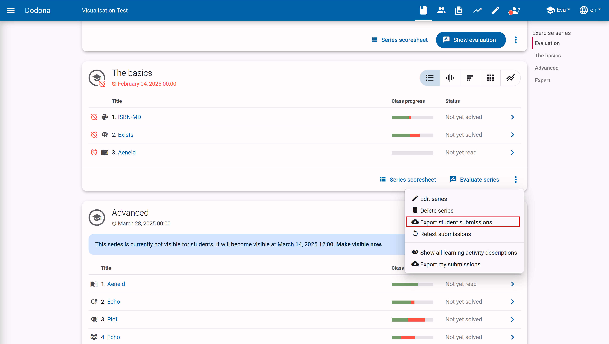
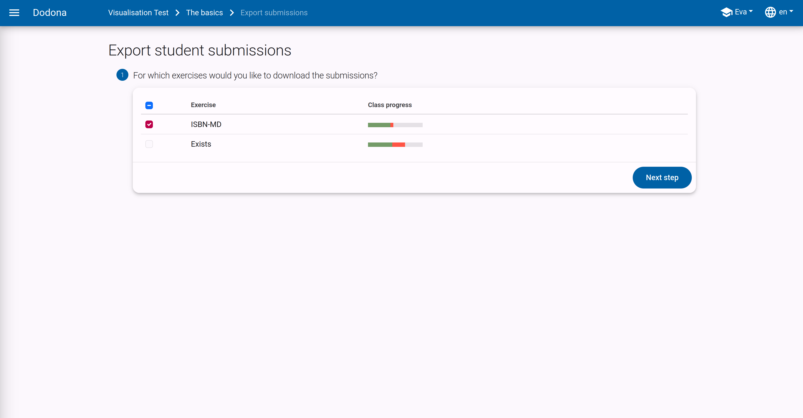
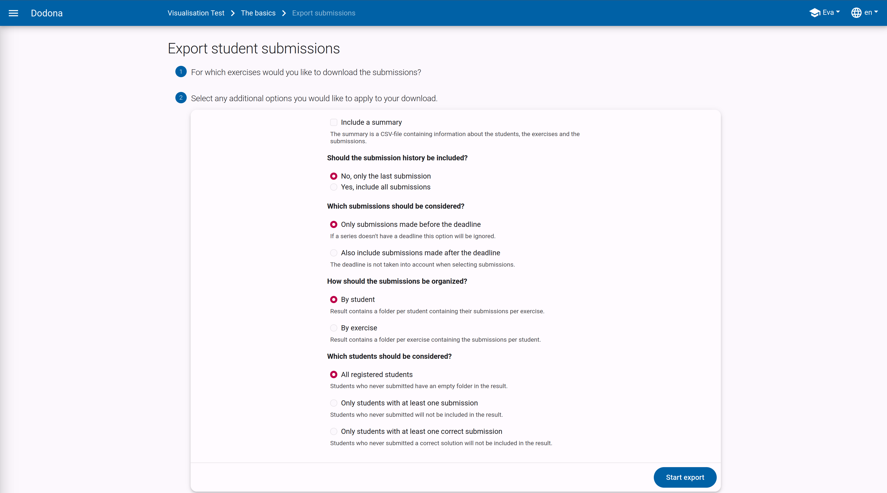
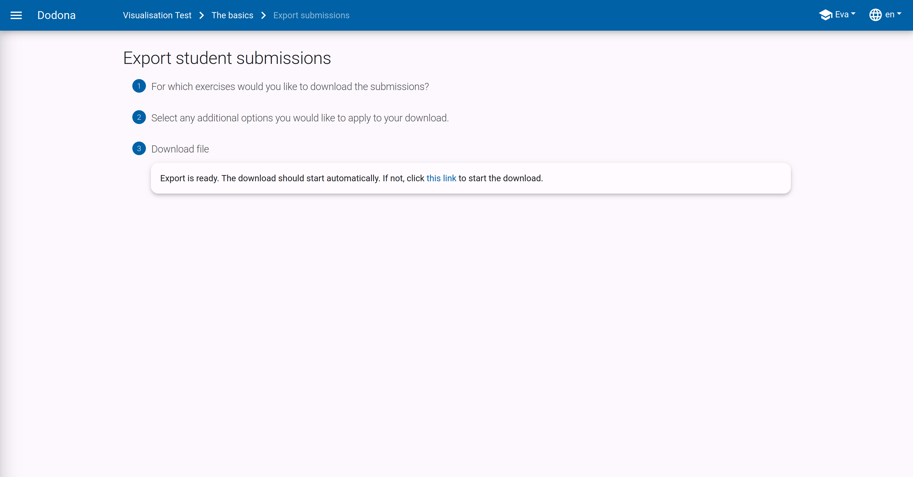
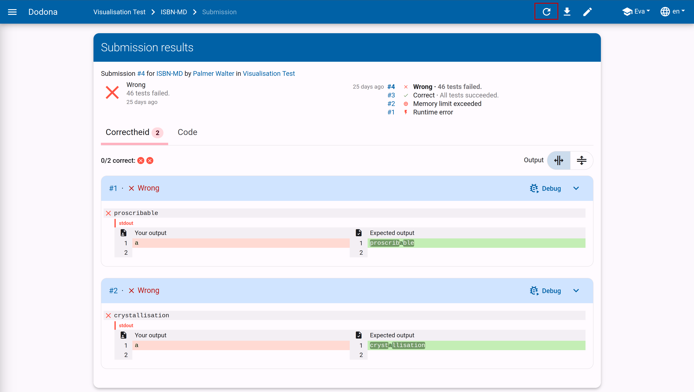

# Series export and retest

The [series menu](../exercise-series-management/#the-series-menu) contains two actions that operate on all submissions in a series: exporting them as a zip file and retesting them.
This page walks you through both.

## Export exercise series submissions

In the action menu of a series, you as a teacher can choose to export the submitted code of your students as a zip file.
This can be useful if you prefer to grade on paper and want to print the code.

This will take you to an export page where you will first be asked to select the exercises in the series for which you want to export the submissions.

If you want to download all of them, select the checkbox in the table header. Then click `Next step` to continue.

Next, you can check various options that affect the content of the export.
You can obtain a summary csv, choose whether you want all solutions or only the latest ones, whether the deadline should be considered,
whether the files should be grouped per student or per exercise, and which students should be included.

Click `Start export` to start the download.
At that moment, all submitted solutions will be zipped, which may take a moment. Then the download will start automatically.

## Retest submissions

The `Retest submissions` action in the series menu retests all solutions that course users have submitted for exercises in the exercise series.
This can be useful if, for example, you have added or modified a number of tests and want to retest the already submitted solutions.

When retesting a submission, all tests are rerun without the solution having to be resubmitted.
This way, the original submission time is preserved.
If the configuration of the exercise has been modified since the last evaluation of the solution, the status of the solution may change due to the re-evaluation.

You can also re-evaluate a single solution: click the repeat button in the top right corner of the feedback page of a user's submission.

::: tip Important

When re-evaluating, solutions receive a lower priority in the queue than newly submitted solutions.
This way, the evaluation of solutions that users submit experiences minimal delay, but re-evaluation may take longer.

Users do not receive a notification from the platform when their solutions are re-evaluated.
If you decide to re-evaluate solutions, it is important to inform users that there may be changes to the status of solutions they submitted earlier,
as well as their submission status for exercises in the exercise series of the course.
:::

## Scoresheet and evaluation

If you want an overview of the submission status of your students rather than their code, use the `Series scoresheet` action described in [the series menu](../exercise-series-management/#the-series-menu).

Correct test results are no guarantee of good code.
Therefore, Dodona also provides support to manually evaluate the solutions and provide them with feedback and grades.
More information about this can be found in the [grading guide](/en/guides/teachers/grading).
