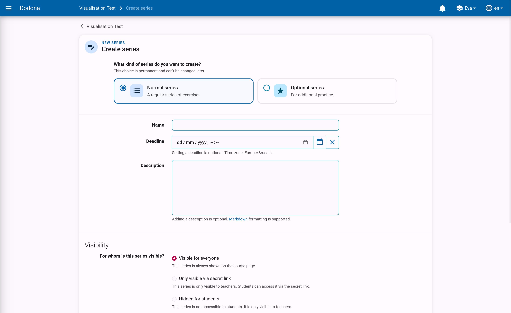
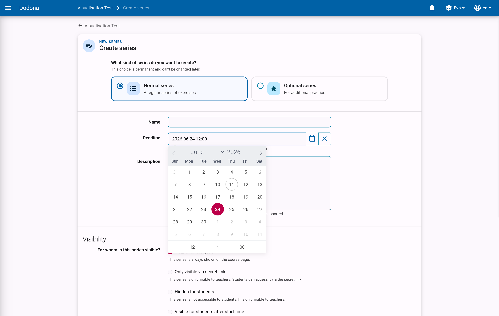
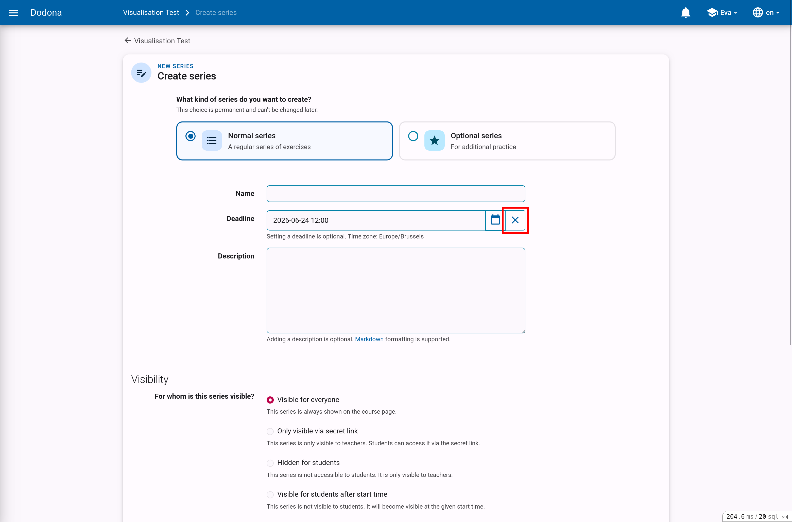
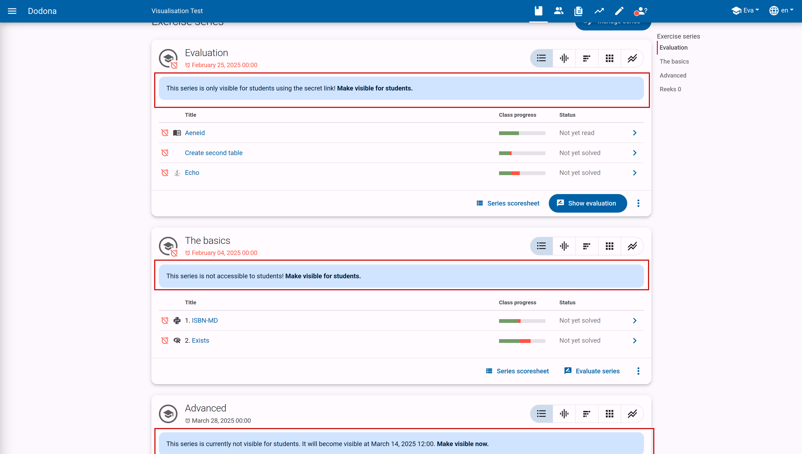
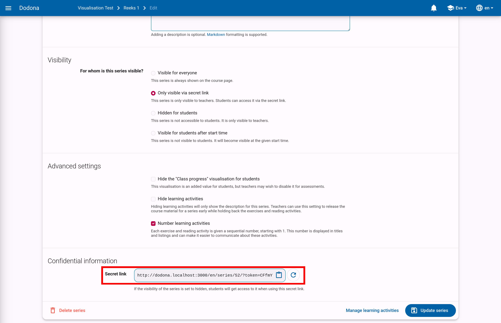
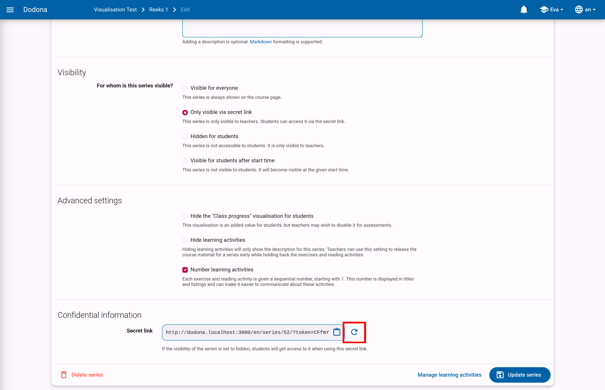

# Series settings

When you [create or copy an exercise series](../exercise-series-management/#create-an-exercise-series), you land on the series form.
You can return to this form at any time by choosing `Edit` in the series action menu or on the `Manage series` page.
This page describes all the properties you can set on that form.

## Name

The name of the exercise series.
Within a course, different exercise series can have the same name, but it is advisable to give each exercise series a unique name.

## Deadline

An optional deadline that indicates until when solutions submitted for exercises in this series will be considered.
Students can continue to submit solutions for exercises in the series after the deadline and will still receive feedback.
However, these submissions will not be considered in determining their submission status for the exercises in the series.
This cannot be set for an optional series.

::: tip Important

The submission status for students is always dynamically calculated based on the deadline.
If the deadline is adjusted, the submission status for a particular exercise may change.
Keep this in mind if you set the deadline to an earlier time.
:::

Click on the input field or the calendar button to set the date and time of the deadline.
Select the deadline in the time zone set in your user profile.
Other users will see the deadline in the time zone set in their user profile.

Click the delete button to remove a set deadline.

## Description

An optional description that users see when viewing the exercise series in the course.
You can use [Markdown](/en/references/exercise-description/#markdown) to format the description.

## Visibility

This determines whether users can see the exercise series. The following values can be set for this property:

* `Visible for everyone`: All users see the exercise series on the course page.

* `Only visible via secret link`: Only course administrators see the exercise series on the course page.
  There is a clear message indicating that other users cannot see the exercise series.
  You can give users access to this series by sending them the specific [secret link](#secret-link) of this series.

* `Hidden for students`: Only course administrators see the exercise series on the course page.
  There is a clear message indicating that other users cannot see the exercise series there.

* `Visible for students after start time`: The exercise series is not visible to students until the start time you specify.
  You can set the start time in the same way as the deadline.

## Secret link

When creating a series that is only visible via secret link, a secret link is automatically generated to provide access to this series.
Without this link, users cannot see this exercise series.

You can find the secret link for an exercise series at the bottom of the edit page for that series.

You can easily generate a new secret link by clicking the renew button.
This can be useful if you accidentally shared the link with someone who should not have it.
Note that the old link will no longer work once you generate a new one.

## Advanced settings

* `Hide the "Class progress" visualization for students`: For an exercise, the progress of all users in the course is shown.
  This visualization can be valuable for students, but you might want to disable it for exams.

* `Hide learning activities`: If the learning activities are hidden, only the description of this series will be shown.
  You can use this setting to, for example, make the course material of the series available in advance without releasing the exercises and reading activities.

* `Number learning activities`: If this setting is active, each exercise and reading activity is given a sequential number, starting with 1.
  This number is displayed in titles and listings and can make it easier to communicate about these activities.
