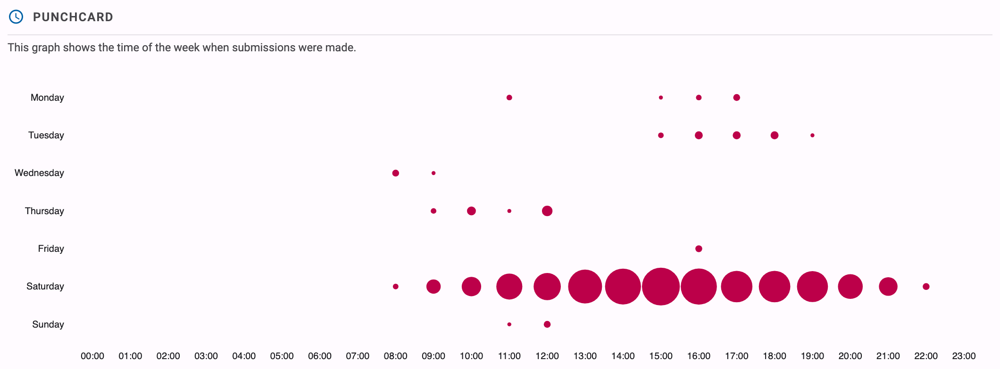
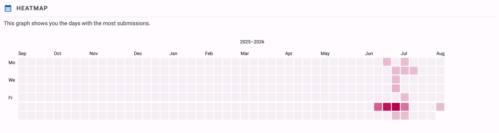
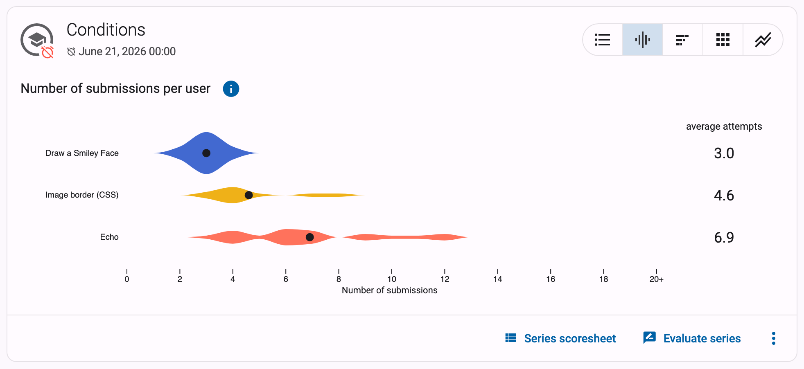
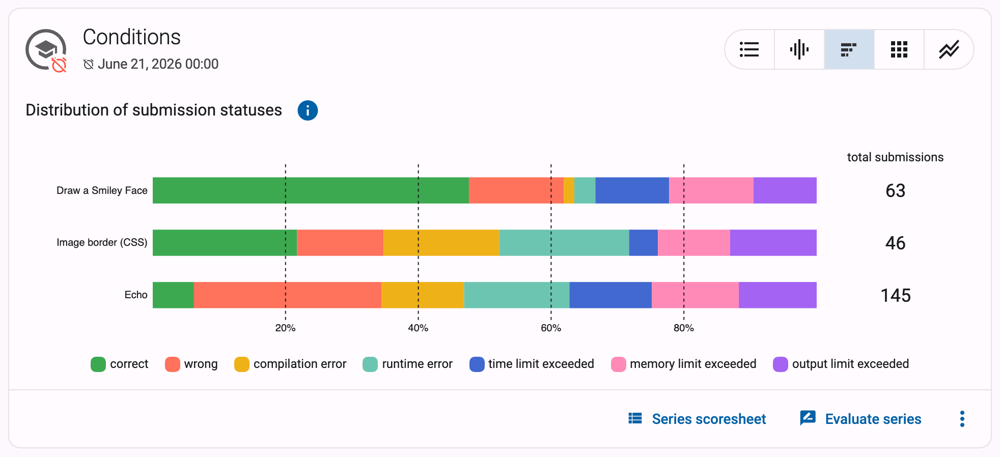
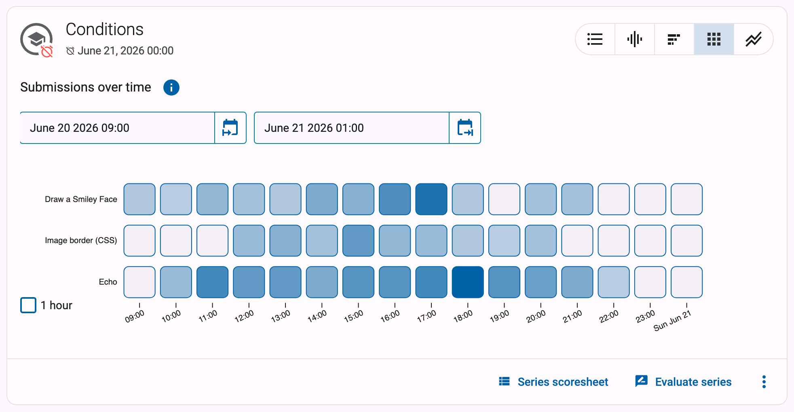
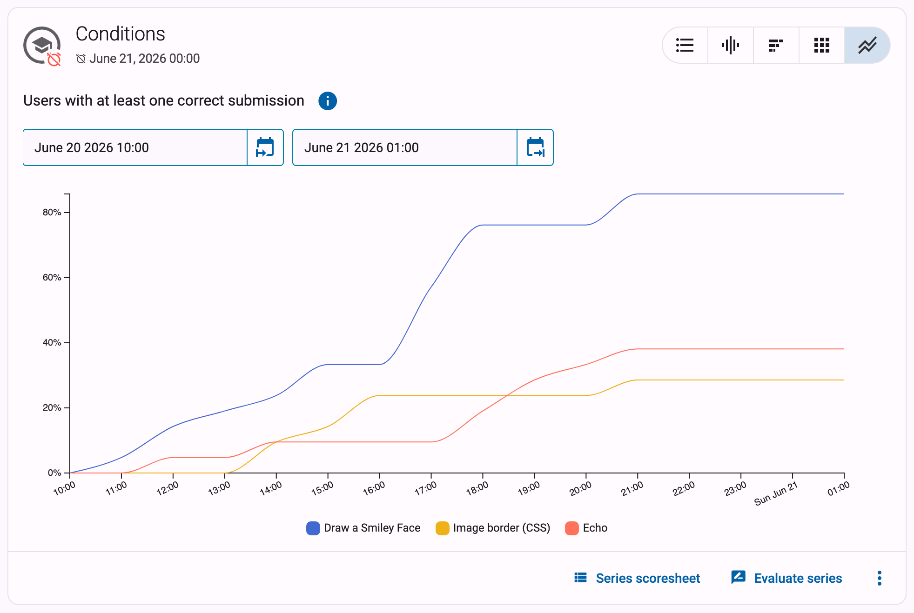
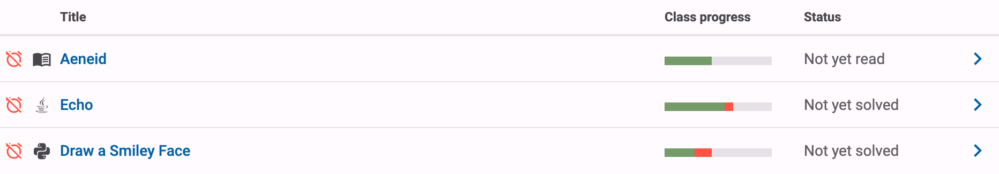

# Statistics and visualisations

Dodona keeps track of every submission in your course and turns that data into a set of graphs, so you can see when your students are working, which exercises they struggle with, and how far along the class is. As a course administrator you find these graphs in two places:

* the **course statistics page**, with graphs about all submissions in the course, and
* the **series graphs** on the course page, with four detailed graphs per exercise series.

These graphs are only visible to course administrators. The one exception is the `Class progress` bar shown next to each exercise, which students can see as well; it is covered [at the end of this guide](#class-progress).

::: tip Note
All these graphs are based on submissions, so a student who never submitted anything does not appear in them.
:::

## The course statistics page

At the top of the course page, course administrators see a row of counters summarising the course. Click `More statistics` on the right of that row to open the course statistics page. You can also reach it via the graph icon in the navigation bar at the top of the course page (`Statistics of this course`).

The statistics page repeats those counters — `Registered users`, `Exercises`, `Submitted solutions` and `Reading activities` — and adds counters for the [questions](../course-management/) asked by your students: `Total number of questions`, `Unanswered questions`, `Questions in progress` and `Answered questions`. Each counter links to the corresponding overview page.

Below the counters, two graphs show when the submissions in your course were made.

### Punchcard

The punchcard answers the question: *at which moments of the week do my students work?* It is a grid with a row for each day of the week (Monday to Sunday) and a column for each hour of the day. Every submission ever made in the course is counted in the cell matching its day and hour, and the size of the dot in a cell grows with the number of submissions. Times are shown in your own time zone.

**How to read it**: look for the biggest dots. For example, if you teach a programming lab on Tuesday morning, you will typically see large dots on Tuesday between 10:00 and 12:00, and a second cluster on Sunday evening if your deadlines are on Sunday at midnight. A punchcard where almost all activity sits in the hours right before a weekly deadline tells you students only work on the exercises at the last minute.

### Heatmap

The heatmap answers the question: *on which days was my course active?* It shows a calendar, grouped per academic year (starting on 1 September), with one square per day. The more submissions were made on a day, the darker its square.

**How to read it**: dark squares mark the busy days. A dark square just before each deadline and empty weeks in between means students start late; a heatmap that also colours the days in between shows a class that works steadily. The heatmap is also a quick way to spot the impact of a test or exam: those days usually stand out as the darkest of the year.

::: info Freshly computed
Dodona computes the data behind the punchcard and heatmap in the background. The very first time you open the statistics page of a course, the graphs may take a short while to appear while the numbers are being crunched. Afterwards the results are cached and kept up to date automatically.
:::

The punchcard and heatmap also exist for a single student: the [overview page of a student](../user-management/#tracking-students) shows the same two graphs, restricted to that student's submissions.

## Series graphs on the course page

For each series on the course page, course administrators see a group of four extra buttons on the right of the series header, next to the button for the regular `Series overview`. Each button replaces the list of exercises in the series with a graph about the submissions for that series. Click the information icon next to the graph title for a short in-app explanation, and use the first button to return to the list of exercises.

These graphs only count submissions from students (submissions by course administrators are ignored), and only submissions that have been fully processed. If a series does not have submissions yet, Dodona tells you `There is not enough data to create a graph.`

::: tip Note
The series graphs are not available for series with the "optional" kind, since those are not part of the official learning path of the course.
:::

### Number of submissions per user

This violin plot shows, for each exercise in the series, how many solutions students needed. Every exercise gets a horizontal shape: the horizontal axis is the `Number of submissions`, and the thicker the shape is at a given number, the more students submitted exactly that many solutions for the exercise. The axis is capped at 20; students with more than 20 submissions are counted in the `20+` bucket. The dot on each shape marks the average number of attempts, and becomes hollow when that average exceeds 20.

**How to read it**: an exercise where the shape bulges at 1 or 2 submissions was easy — most students solved it right away. An exercise whose shape stretches far to the right, with an average of 8 attempts while the other exercises in the series average 2, is where your students got stuck; it may deserve an extra example in class or a hint in the exercise description.

### Distribution of submission statuses

This stacked bar chart shows one bar per exercise, split by the status of the submissions: `Correct`, `Wrong`, `Compilation error`, `Runtime error`, `Timeout`, … Hover over a segment to see the percentage and the exact number of submissions with that status.

**How to read it**: the mix of statuses tells you *how* an exercise is hard. An exercise where half of the submissions are compilation errors points to students struggling with syntax, while a bar dominated by wrong submissions suggests the logic (or the assignment itself) is the problem. If one exercise has far more `Timeout` submissions than the rest of the series, its time limit or expected efficiency is worth a second look.

### Submissions over time

This graph shows when students worked on each exercise. Every exercise gets a row, time runs along the horizontal axis, and each square represents a time interval (the legend below the graph shows how long, for example one day). The darker a square, the more submissions were made for that exercise in that interval; hover over a square for a breakdown by status. If the series has a deadline, the timeline runs up to the deadline. Use the `Start date` and `End date` fields above the graph to zoom in on a shorter period, for instance a single lab session.

**How to read it**: this is the series-level version of the heatmap. A row that only darkens in the squares right before the deadline means that exercise was left until the last moment. You can also see whether students work through the series in order: if the top rows darken early in the period and the bottom rows later, they follow your intended path.

### Users with at least one correct submission

This graph shows one line per exercise with the percentage of students that had solved the exercise correctly by each point in time, based on each student's first correct submission. The percentage is relative to the number of registered students in the course. Click the vertical axis to toggle between a full 0–100% scale and a scale zoomed in on the data. If the series has a deadline, the timeline runs up to the deadline.

**How to read it**: each line should climb towards 100% as the deadline approaches. A line that plateaus at 60% tells you that 40% of your students never solved that exercise. Comparing the lines also reveals pacing: a line that only starts to rise in the final days, while the other exercises were solved early, marks the exercise students postponed — often the hardest one of the series.

## Class progress

Next to each exercise on the course page, the `Class progress` column shows a small bar with the fraction of registered course users that started the exercise (in grey) and the fraction that solved it correctly (in colour). Hover over the bar for the exact numbers. For reading activities, the bar shows how many users read the activity.

Unlike all the graphs above, students can see this visualisation too: it lets them gauge how they are doing compared to the rest of the class. If you would rather not show it to students — for instance during a test or exam — you can disable it per series with the `Hide the "Class progress" visualisation for students` setting, described in the [series settings](../series-settings/#advanced-settings). Course administrators keep seeing the column; an eye icon next to the column header then indicates that it is hidden for students.
