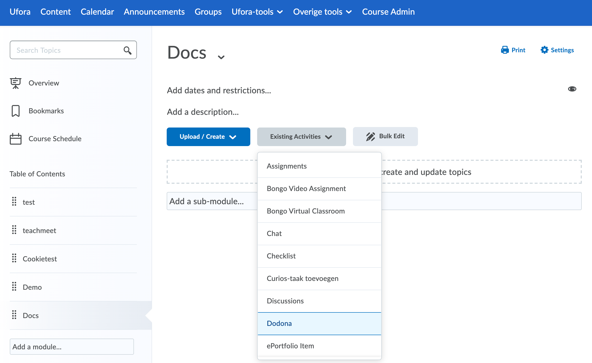
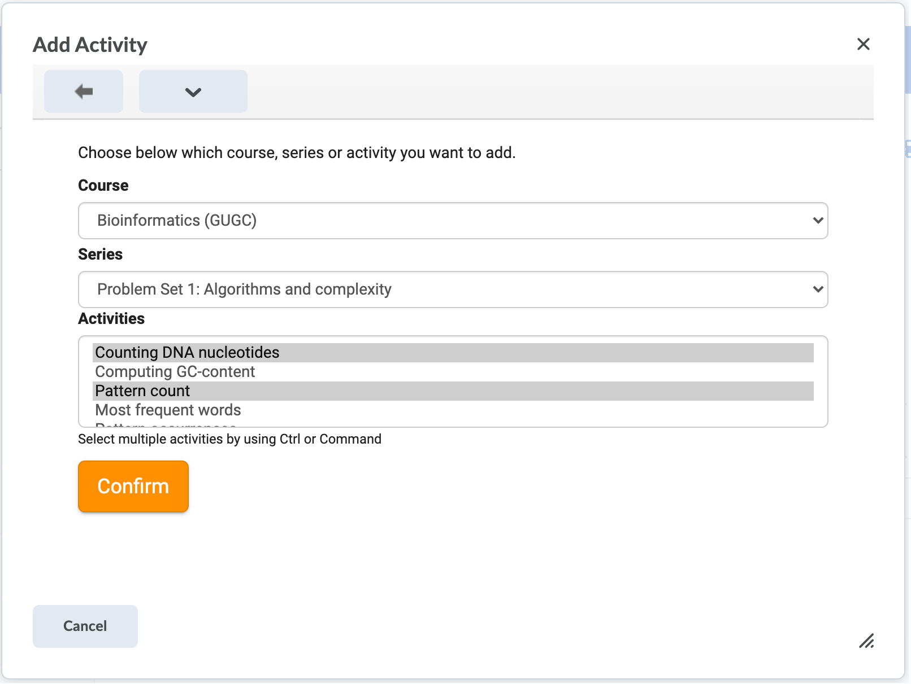
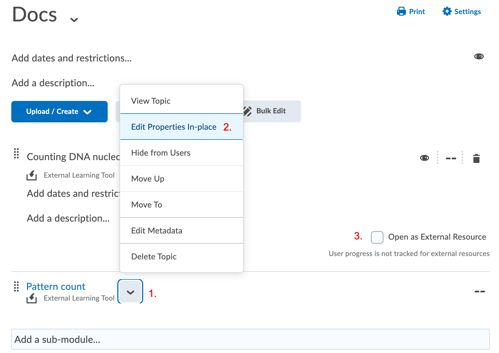

# Dodona and Ufora

::: warning UGent-only
This page is specifically about integrating Dodona with Ufora, the online learning environment of Ghent University.
:::

Since the academic year of 2020-2021, it is possible to add Dodona exercises and exercise series to the content tool of Ufora. Students who open such link are automatically signed in with their UGent account. In a later phase, we will integrate with the score module of Ufora. This will allow sending the result of a submitted solution to Ufora.

## 1. Open your Ufora course

Go to [ufora.ugent.be](https://ufora.ugent.be) and navigate to your course. Next, open the content tool and open a content module of choice.

## 2. Open the exercise picker

Click on the `Existing activities` menu and subsequently on the `Dodona` menu item. A dialog should appear where you can select exercises.

::: tip No Dodona?
The Dodona module is not enabled in all faculties by default. If you don't see a Dodona option in the menu, send us an email at dodona@ugent.be with your course code.
:::

The first time you use Dodona from Ufora, we need to link your Ufora profile with your UGent account. Therefore, we'll ask you to sign in with your UGent account. To do so, click on the big orange button to open a new window and go through the sign in procedure. Next, close the dialog on Ufora and start again from the beginning of step 2.

## 3. Select exercises

The dialog should display an overview of all courses you have access to. After picking a course, a list with all exercise series of that course should appear. If you select an exercise series, all exercises of that series appear.

Using the ctrl button (or command on a Mac) on your keyboard, you can select one or more exercises. Next, click on the `Confirm` button to add those exercises to Ufora. If you don't select exercises or an exercise series, you'll add a link to the series or course respectively.

## 4. Select 'Open as external resource'

After clicking on the `confirm` button, the dialog closes and the chosen exercises should appear on Ufora. **Watch out!** You're not done yet. By default, Ufora will open links to Dodona in a small inline window. You can easily fix this:
- Click on the arrow next to the exercise name
- Click on `Edit Properties In-place`
- Select the `Open as External Resource` checkbox
- Repeat for all added exercises

The exercise will now open in a new window when students click the link.

::: warning Don't forget the last step!
If you don't execute this last step, Dodona will potentially not work as expected. The students will also see a warning on every page they open this way.
:::

