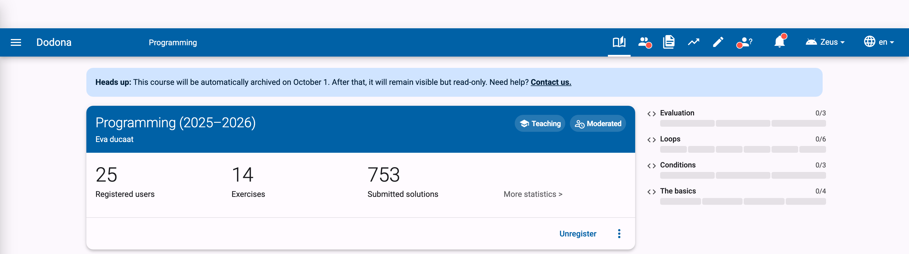
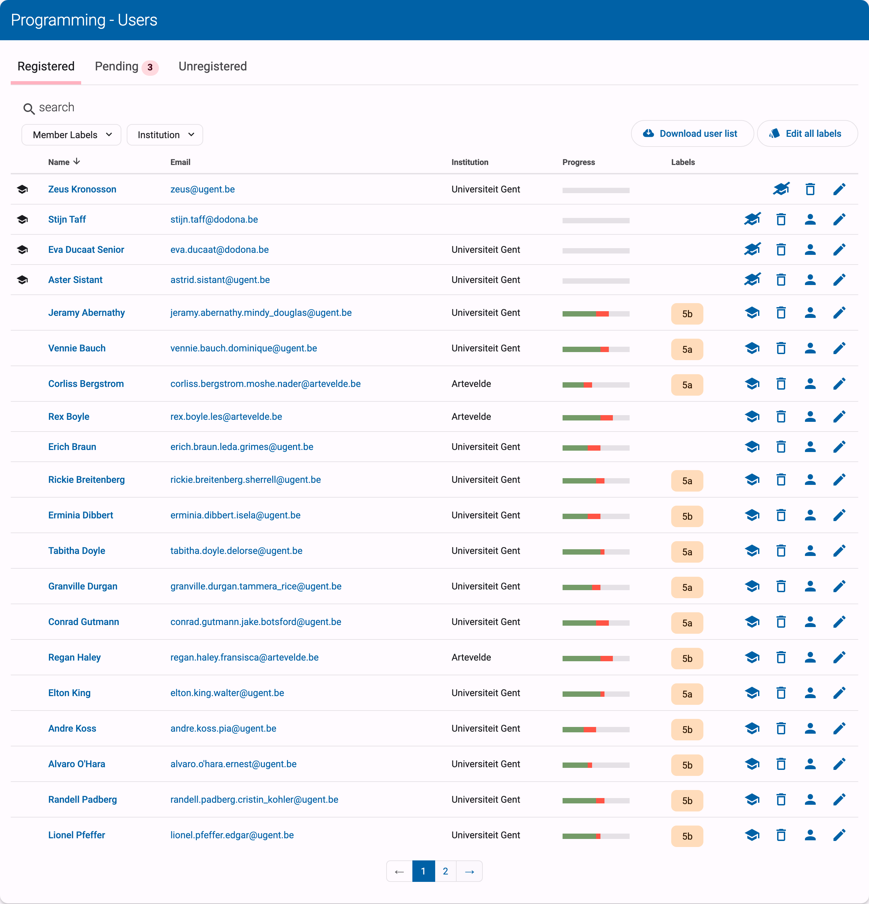
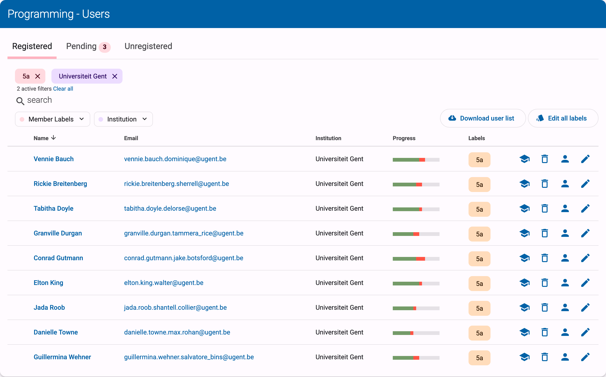
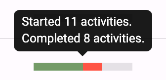
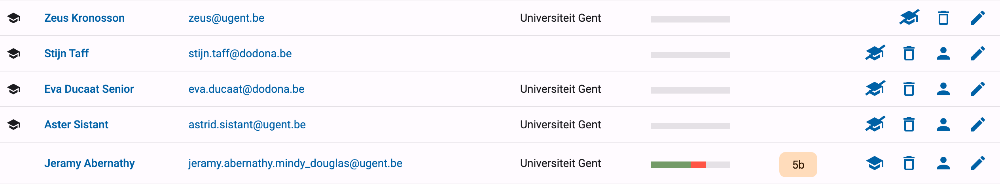
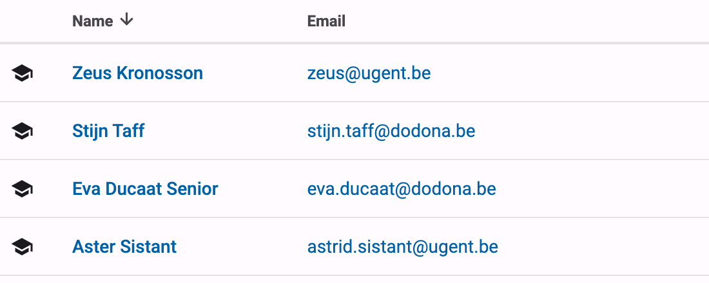
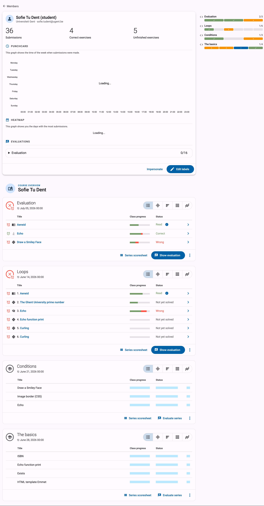

# User Management

On this page, you will find all the information about user management on Dodona.

As a course manager, you get access to the list of all registered users in your course.
You can access this overview by clicking on the user icon in the navigation bar at the top of the course page.
Here, you will see all users who have ever registered for the course or submitted a registration request.
You can view their course overview page, view their solutions, adjust their registration status, and change their management rights.
Management rights determine what a user can do within a course.
For more information, see the guide on [course management](../course-management/).

## User Overview

As a teacher, navigate to the user overview of your course by going to your course and then clicking on `Registered users` in the course description.
You can also click on the user icon in the navigation bar.

The user overview lists the name, email address, and institution of all course users, together with their [progress](#progress) and their [labels](#labels).
For each teacher and administrator, an icon corresponding to the management rights assigned to the user is displayed next to their name.
With the `Download user list` button above the table, you can download the user list as a CSV file.

### Search for Users

Use the search bar at the top of the user overview to search for specific users by username, name, or email address.
With the `Member Labels` and `Institution` dropdowns below the search bar, you can filter the list by user label or institution.
Multiple filters can be active simultaneously.

### Progress

The progress of a user is indicated by a progress bar.
The green part represents the proportion of exercises in the course for which the user has submitted a **correct** solution.
The red part represents the proportion of exercises for which the user has submitted solutions but has not yet solved **correctly**.
The gray part represents the exercises that the user has not yet **started**.

### Labels

You can assign labels to course users, for example to group them by class.
The labels of each user are shown in the `Labels` column of the user overview, and you can filter on them with the `Member Labels` dropdown.
To edit the labels of a single user, open their course overview page and click `Edit labels`.
To edit the labels of many users at once, click `Edit all labels` above the user overview: you download the user list as a CSV file, edit the labels column (multiple labels are separated by semicolons), and upload the modified file again.

### Designating Course Managers

Each course has at least 1 course manager.
As a course manager, you can promote other registered users to course manager.
You can do this by clicking the `Promote to course administrator` button (a graduation cap icon) next to that user.
Similarly, you can demote a course manager with the `Demote to student` button.

You can recognize the course managers by the icon in the left margin.

::: tip Important

A course manager who unsubscribes from a course loses their course manager status.
You can also always demote yourself to a student.

To ensure that a course always has at least one course manager, the last course manager cannot unsubscribe and cannot demote themselves to a student.

After creating a course, a teacher can unsubscribe if they have designated at least 1 other course manager.
They can also be demoted by other course managers to a course user without management rights for the course.
:::

### Handling Registration Requests

Depending on the set [registration procedure](../creating-a-course/#course-properties) of a course, you will see multiple tabs in the user list.
Each tab offers different actions to adjust the registration status of the corresponding user.

* `Registered`: all course users who are currently registered.
  By clicking the `Unregister` button (a garbage bin icon), you unsubscribe the user from the course.

* `Pending`: all course users for whom there is still an open registration request awaiting handling by a course manager.
  By clicking the `Accept` button (a checkmark icon), you approve the registration request. You can reject it with the `Decline` button (a garbage bin icon).
  With `Accept all` and `Decline all` above the table, you can handle all pending requests at once.
  This tab is only visible if the course uses moderated registration.

* `Unregistered`: all course users who were once registered but have since unsubscribed.
  You can re-register such a user for the course by clicking the `Reregister` button (an icon of a user with a plus sign).

## Tracking Students

To track the progress of an individual student, there is an overview page per student.
You can view this page by clicking on a student's name in the user overview of a course.
On this page, you will get an overview of a user's progress within the course.
In addition to some statistics, you can also view the status for each exercise and series within the course for this student.

