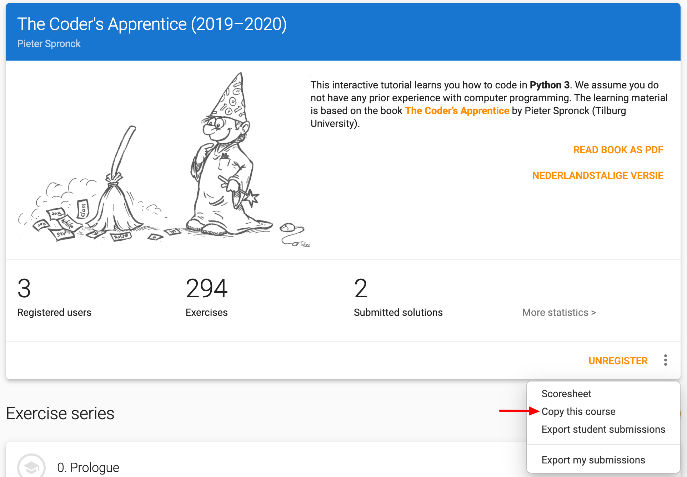

# The Coder's Apprentice

> Learn to code with Python 3

In [Dodona](/en/guides/teachers/getting-started) you'll find an **interactive edition** of the book [The Coder's Apprentice](http://www.spronck.net/pythonbook/dutchindex.xhtml) by Pieter Spronck (Tilburg University). The book aims to teach **secondary school** students how to code with **Python 3**. The course is available in both the [English](https://dodona.ugent.be/nl/courses/293/) and [Dutch](https://dodona.ugent.be/nl/courses/293/) edition.

## Learn to code with Python 3

It's a good idea to logon to Dodona first, before getting started with the interactive edition of the book. By registering for the course (which is free) you will be able to mark the sections you processed as read and to submit solutions for the programming assignments. Dodona immediately gives feedback on each submitted solution and you can use the [visual debugger](http://www.pythontutor.com/) to hunt for errors in your code. This way, you keep track of your own process while going through the learning material.

<iframe width="560" height="315" src="https://www.youtube.com/embed/eAp-ftrZQDE" allow="accelerometer; autoplay; encrypted-media; gyroscope; picture-in-picture" allowfullscreen></iframe>

## How do I use the course with the students of my class?

If you want to dive into the interactive course with a group of students, we recommend that you make your own copy of the existing course. This is easily done with the option *Copy this course* from the course menu.

Being the administrator of the copied course enables you to set it up according to the needs of your target audience:

- adjust the learning path of the course
  - rearrange, add, delete or temporarily hide chapters and sections and exercises
  - add your own programming assignments and share them with your colleagues
- set deadlines
- monitor the progress of students (individually or as a group)
- organize tests and exams
- review submitted solutions
- appoint colleagues as fellow course administrators

## Why can't I copy the course?

Creating your own courses (from scratch or starting from existing courses) or creating your own tutorials or programming exercises requires specific access rights on Dodona. These privileges are not granted by default, but teachers can send us a request by email (dodona@ugent.be) or via the [contact form](https://dodona.ugent.be/en/contact). Team Dodona will process any incoming request as soon as possible.

More information on getting started with Dodona can be found in [this guide](/en/guides/teachers/getting-started).
