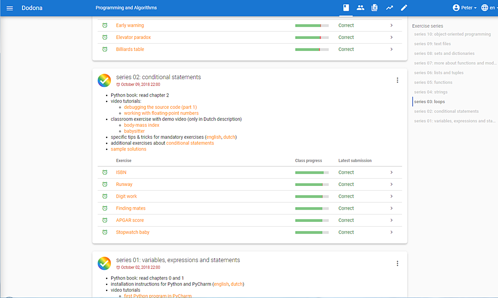

<NewsHeader :title="$frontmatter.title" :date="$frontmatter.date" lang="en" />

> Release 2.10 comes with a Dodona-specific privacy policy, introduces a series overview to course pages, and enables staff to copy existing courses.

## Privacy and personal data

Dodona handles personal data with great care and watches over your privacy. In our [data policy](https://dodona.ugent.be/data/) we explain in laymen's terms which data is kept and why this is done. Our [privacy statement](https://dodona.ugent.be/privacy/) contains a legally binding description of the same information. You can also find a reference to both documents in the Dodona footer. So rest assured: everything happens transparent, smooth and safe.

## Series navigation menu

The learning path of a course consists of multiple exercise series. A menu has been added in the right margin of the course page to support faster navigation to a specific series. This navigation menu contains an overview of all series in the course.

## Copying courses

When a teacher creates a new course, he now also has the option to start from the learning path of an existing course. The source course can be any accessible course on the platform, not only his own courses. Whoever creates a course automatically becomes a course manager of the new course, but when copying, additional course managers can also be taken over from the source course. After copying, thee learning path and course managers of the new course can be adjusted independently of the source course.

Copying can be started via the CREATE COURSE button on the course overview or via de main menu on the page of a source course. Of course, it still remains possible to create courses from scratch.  

## Full list of changes

For a full list of changes we refer to [our GitHub release](https://github.com/dodona-edu/dodona/releases/tag/2.10), but we list the most important things beneath.

*   add series navigation menu to course page
*   add help text to API token section on user profile edit page
*   display search bar more clearly in course overview
*   show alert on exercise page if linked series has upcoming deadline
*   add institution to course members table and allow searching by institution
*   allow course admins to hide visual representation of class progress from students (per series)
*   allow staff to copy courses
*   highlight JSON in email messages
*   lots of small fixes and enhancements
