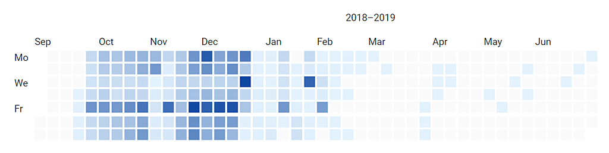

<NewsHeader :title="$frontmatter.title" :date="$frontmatter.date" lang="en" />

> Dodona 2.11 allows to log in with a Google for Education (G Suite) account, visualise the history of submitted solutions, activate dark mode, and have more fine-grained control over visibility and registration modalities of a course.

## Login with G Suite account

If your school uses [Google for Education](https://edu.google.com), you can now also log in to Dodona with a G Suite account. Note that your account must be linked to a G Suite organization. Logging in with a regular Google account will therefore not work. In addition, you can still continue to log in with an [Office 365](https://www.office.com/) or [Smartschool](https://www.smartschool.be/) account.

## Visualise submission history

The relative number of submitted solutions per day is visualised as a heatmap. This new visualisation is available on all course pages and all user profile pages.

## Dark mode

All users who keep on programming into the early hours can now set Dodona to **dark mode**. This renders the familiar user interface with a color scheme that is less stressful for the eyes: light-colored text, icons and graphical user interface elements on a dark background. Dark mode can be switched on and off via the user menu in the top right corner of the window.

# Course modalities for visibility and registration

Course admins are given even more fine-grained control over who can see their course and who can register for their course. These changes have also allowed us to make the registration process clearer, especially for invisible courses.  

There are three options to set the **visibility** of a course:  

*   visible for everyone
*   visible for users from the institute to which the course is linked
*   visible for nobody

Each course has a **secret link** that course admins can share with users who are allowed to see their course. Anyone who has the secret link can view the course, regardless of the visibility settings of the course.  

Analogously, there are also three options for **course registration**:  

*   registration open for everyone
*   registration open for users from the institute to which the course is linked
*   registration open for nobody

There is no **registration link** that allows to register for a course. The option to **moderate** course registrations can now be set separately. With a moderated course, a course admin must first give explicit permission before a user gets actually registered.  

## Full list of changes

For a full list of changes we refer to [our GitHub release](https://github.com/dodona-edu/dodona/releases/tag/2.11), but we list the most important things beneath.

*   add heatmap of submitted solutions
*   add dark mode
*   enable login with G Suite account
*   rework settings for course visibility and registration
*   fix pagination of submitted solutions on exercise page
*   fix address bar updates while searching
