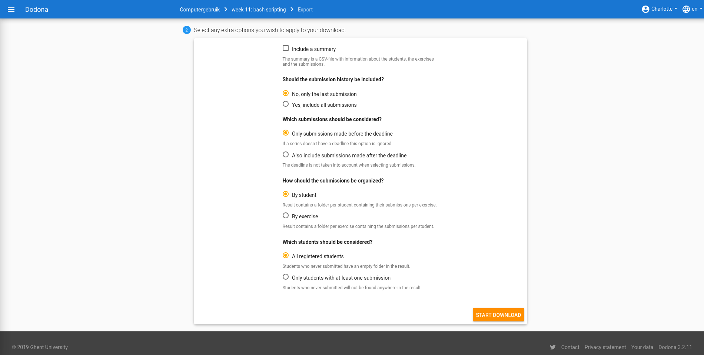
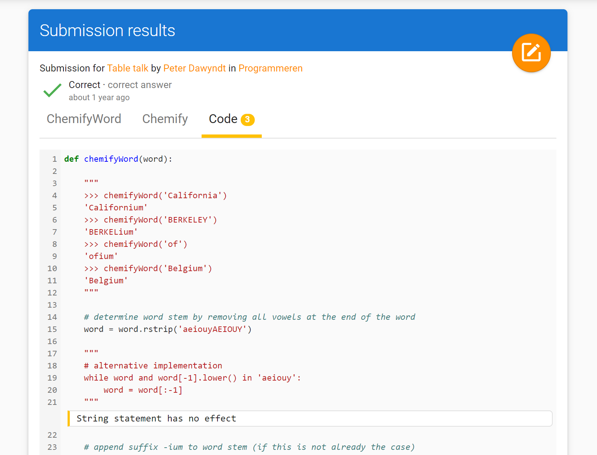

<NewsHeader :title="$frontmatter.title" :date="$frontmatter.date" lang="en" />

> Dodona 3.2 brings a handy navigation menu to the exercise page, provides a completely renewed way to download submissions and brings back the scoresheet for a course.

## Navigation for exercises

If you display an exercise from an exercise series, the right margin now contains a navigation menu that allows you to easily switch the other exercises in the series, without the need to turn back to the main course page.

## Export of submissions

The export of submitted solutions has been completely reworked. Using a wizard you can now easily download all your submissions in a course. As a course admin you can download all submissions of all course users. This new tools has a few options so that you can get started immediately with the archive you download.

## Course scoresheet

Previously, as a course admin, you could download a CSV file at the course level to view the status of all students within a course. To bring this functionality more in line with the scoresheet of a series, we now also provide a page within Dodona to view the course scoresheet. Of course, the former option to download the scoresheet has been brought back as well. We have also worked on faster generation of scoresheets and we have improved their overall usability.

## Inline annotations on submitted code

Annotations that a [linter](https://en.wikipedia.org/wiki/Lint_(software)) automatically adds to a submitted solution are now displayed inline in the source code on the feedback page. In order to do so, we no longer use the ACE editor to display the submitted solution on the feedback page. The color of the left margin determines the type of the annotations: error (red), warning (yellow) or information (blue).

## Full list of changes

Aside from these four bigger changes, we have also worked on a number of smaller issues. Please check [our GitHub release](https://github.com/dodona-edu/dodona/releases/tag/3.2) for a full list of changes, but below we already list the most important issues.

* add navigation menu for exercises
* add _Content Security Policy_
* add course scoresheet
* display submitted solution on feedback page without using the ACE editor
* fix some access problems for private exercises in moderated courses
