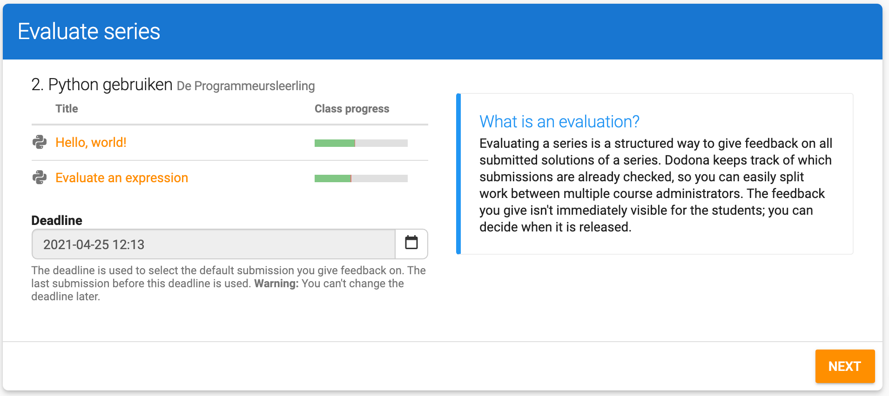
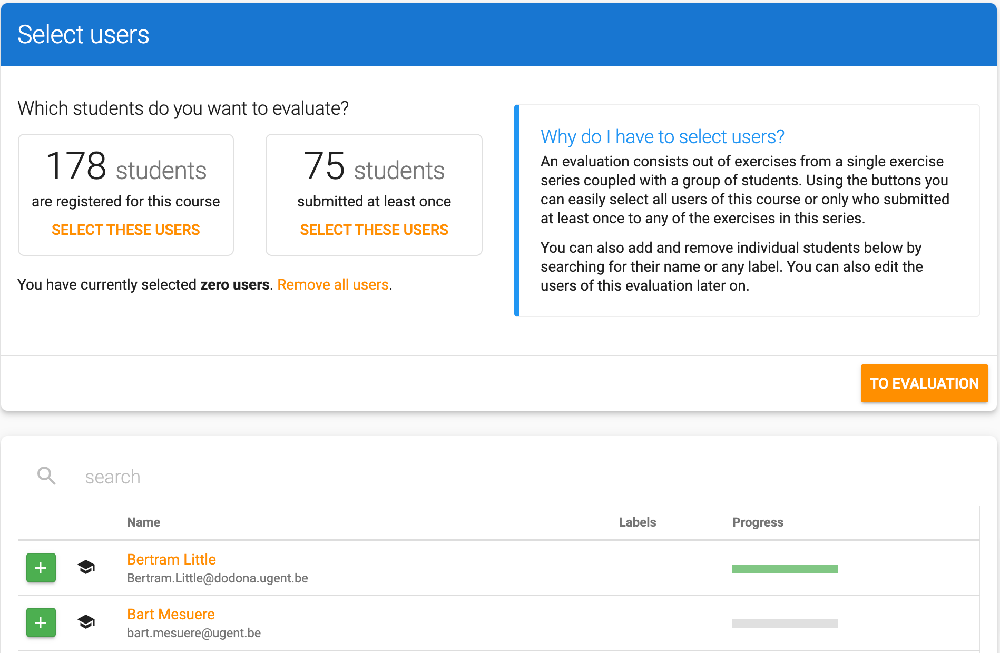
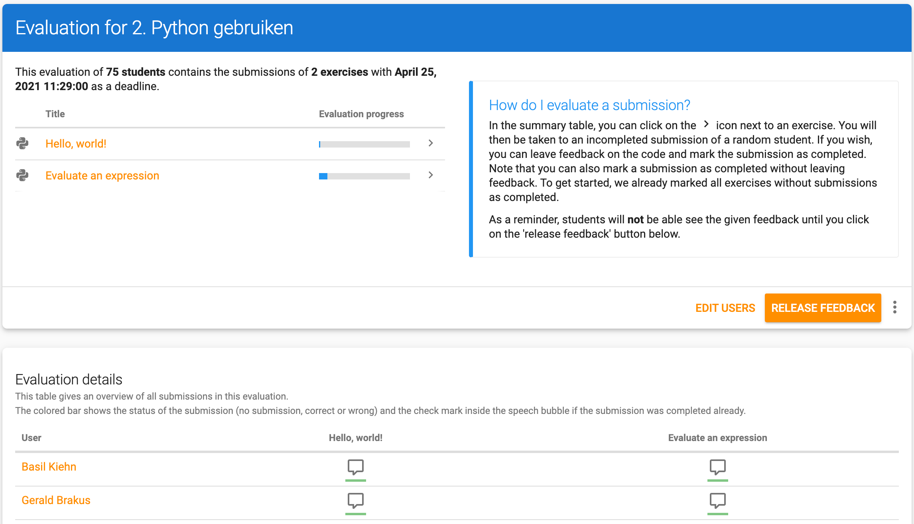
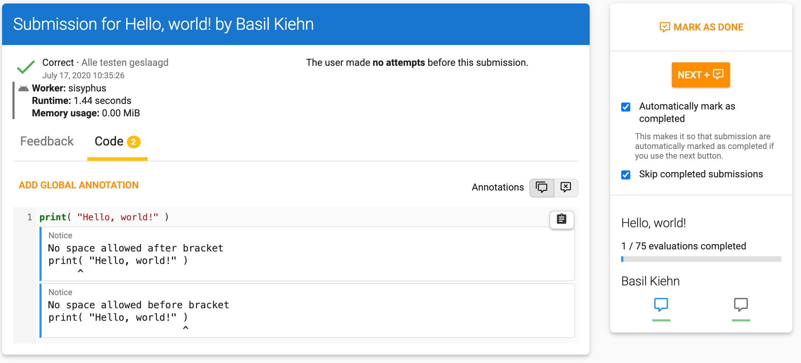

<NewsHeader :title="$frontmatter.title" :date="$frontmatter.date" lang="en" />

> Dodona 3.7 introduces a new way the evaluate you student's solutions in a structured way.

## Evaluating a series

After a test, you often want to go over the submitted solutions of your students in a structured way. This used to be quite cumbersome, or you had to export the submitted solutions. Luckily, Dodona 3.7 changes that! You can now choose "Evaluate series" from the series menu which starts the evaluation wizard.

### Pick a deadline
As a first step, you must pick a deadline. The last solution that was submitted before the deadline will be taken into account for each student. If your series already had a deadline, the existing deadline is automatically filled in, but you can easily change this if you wish.

### Select students
In the next step, you can select all students you want to include in you evaluation. You can easily pick all students in the course or all student who submitted at least one solution using the 2 buttons at the top. You can also include or remove individual students using the list below.

### Evaluation overview
After selecting your students, you land on the overview page. Here, you can see your evaluation progress for each of the exercises in the series. In addition, you see the evaluation status for each of your students and exercises. The color bar below each icon indicates if that exercise was solved correctly. By clicking on the icon, you go to the evaluation page for that solution on which you can then give feedback. Students can only see the added feedback after you click the "release feedback" button on the overview page.

### Evaluating a solution
If you evaluate a solution, you get to see the submitted code, the correctness of the solution and the individual tests. You can easily add feedback to a solution by adding a global comment or a comment at a specific line of code. Students can only see this feedback after you clicked the release feedback button on the overview page.

You can easily navigate to the next student using the sidebar on the right. Je can choose to manually mark a solution as done, or do this automatically by clicking on the next button.

## Full list of changes

Aside from this big change, we have also worked on a number of smaller issues. Please check [our GitHub release](https://github.com/dodona-edu/dodona/releases/tag/3.6) for a full list of changes.