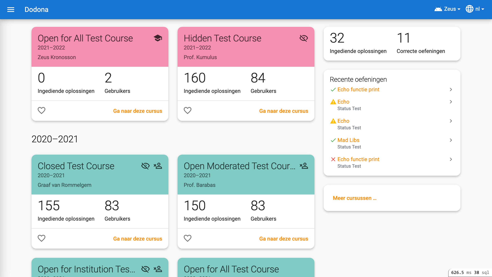
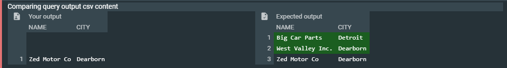
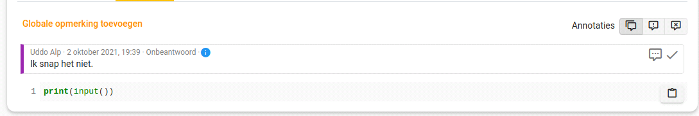
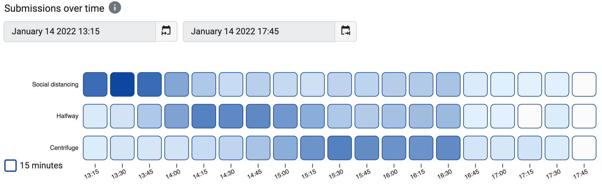
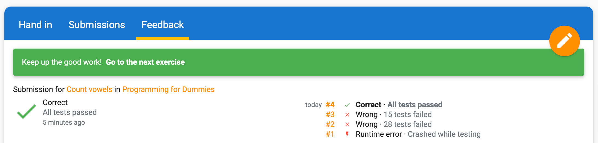

<NewsHeader :title="$frontmatter.title" :date="$frontmatter.date" lang="en" />

> Throughout the year, Dodona works with smaller releases. This post will be updated for all new releases in 2021-2022

## Dodona 5.0 - 2021-09-13

After the huge 4.8 release, Dodona 5.0 is even bigger with several major new features.

### Design refresh

The most visible change is a refresh of the home page design. The aim was to make the appearance more friendly and less formal. This was done by using softer colors, rounder borders.

### Grading is now publicly available

Our grading module that was already available as a preview is now publicly available. Compared to the preview, we improved the initial wizard to create an evaluation and made several smaller tweaks to improve the usability. More information can be found in [our manual](/en/guides/teachers/grading/).

### New learning analytics

Teachers can now better follow students' behaviour using the new graphs for each series.

### Add course deadlines to your personal calendar
It is now possible for students to add a course to your personal calendar application such as Google Calendar. This way, the series deadlines will show up as events.

All details about this Dodona version can be found in the [GitHub release discussion](https://github.com/dodona-edu/dodona/discussions/3102).

## Dodona 5.1 - 2021-10-11

Dodona 5.1 adds a new way to display table-based output in the feedback table. The diff will be calculated by taking into account the columnar properties of the csv format and the result is displayed as a table. The upcoming SQL judge will make great use of this new feature.

Students sometimes ask a question when they're stuck on an exercise, but then manage to find a solution on their own and forget to retract the question. To prevent teachers wasting time on answering such questions, we now display an info icon when the student submitted additional solutions after asking the question.

Finally, Dodona 5.1 lays the foundation for supporting identity providers using OpenID Connect.

All details about this Dodona version can be found in the [GitHub release discussion](https://github.com/dodona-edu/dodona/discussions/3155).

## Dodona 5.2 - 2021-10-25

Dodona 5.2 makes it possible for officials of the Flemish government to sign in. The sign in page was redesigned to allow for sign in buttons from non-educational institutions.

In addition, a programming language indicator icon was added next to the exercise name on all exercise pages.

All details about this Dodona version can be found in the [GitHub release discussion](https://github.com/dodona-edu/dodona/discussions/3186).

## Dodona 5.3 - 2022-02-04

It has been a while since our last release so the detailed list of updates is a bit longer than usual. The main new feature in Dodona 5.3 is the addition of a new graph type for series. A new heatmap option was added showing when submissions were made for each exercise.

The start and end time can be chosen by the user and the graph automatically picks the right bin size. The time selection and binning was also added to the existing line charts.

All details about this Dodona version can be found in the [GitHub release discussion](https://github.com/dodona-edu/dodona/discussions/3345).

## Dodona 5.4 - 2022-04-19

Dodona 5.4 adds support for signing in using SURF. This allows all school in the Netherlands to easily sign in using the account of their school. In addition, we added a list of all submissions to the results view of a submission. This also makes it easier to link to individual submissions.

All details about this Dodona version can be found in the [GitHub release discussion](https://github.com/dodona-edu/dodona/discussions/3545).
