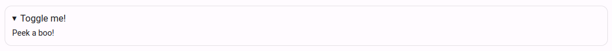

# Exercise descriptions

> Dodona supports exercise descriptions and reading activities in HTML and Markdown with several additional features such as support for mathematical formulas.

::: tip Kramdown <Badge type="warning" text="advanced" />
Dodona uses [kramdown](https://kramdown.gettalong.org) to render Markdown, which supports a lot of extensions to the standard Markdown. Advanced users can find in [this overview](https://kramdown.gettalong.org/quickref.html) more explanation on how this formatting works.
:::

These features are available for both exercises and reading activities. They are rendered in exactly the same way. The only difference is that exercises have a text editor at the bottom of the exercise description, where a reading activity has a `Mark as read` button.

## Markdown

For Dodona exercises and reading activities, we recommend using Markdown over HTML. Descriptions for courses and series can also be written in Markdown. Markdown is a markup language like HTML, but a lot simpler. Below, you can find more information about the basic formatting and a list of all syntax in this [Markdown Cheatsheet page](https://github.com/adam-p/markdown-here/wiki/Markdown-Cheatsheet). The rest of this page contains specific extensions (in both Markdown and HTML) that are available in exercise descriptions on Dodona.

### Headers

In Markdown, it is easy to use headers of different levels. For this, you simply put one or more hash symbols (`#`) in front of your title. Depending on the number of symbols used, a larger or smaller title will be shown.

```markdown
# Level 1
## Level 2
### Level 3
#### Level 4
##### Level 5
###### Level 6
```

### Text formatting

For simple text formatting, place tekst between stars (`*`). If one or more words are between single starts, the text will render in italics, if you use double stars, it wil render in bold. If you place words between double tilde signs (`~`), the text will be struck through. To format text as code, place the text between backticks (`` ` ``).

```markdown
This is an example with words in *italics*, **bold**, and ~~striked through~~ and with a variable `a` in function `returnSolution()`.
```

This example results in this formatting: This is an example with words in *italics*, **bold**, and ~~strikethrough~~ and with a variable `a` in function `returnSolution()`.

### Hyperlinks and images

Hyperlinks and images are a little more complex. They consist out of two parts of which you place the first part between square brackets (`[]`) and the second part between round brackets (`()`). The first part is used for the words that need to be linked or the image description, the second part is used for the URL of the page or image. To indicate you want to render an image, place an exclamation mark (`!`) in front of the first square bracket.

```markdown
In this sentence, [these words](https://google.com) link to Google.
Below you can see the Dodona logo.


```
This results in: In this sentence, [these words](https://google.com) link to Google.
Below you can see the Dodona logo.


### Lists

Lists are very simple in Markdown. Depending if you want a numbered or normal list, simply prepend your lines with `1. ` or `* `.

```markdown
1. item 1
2. item 2
3. item 3

* item 1
* item 2
* item 3
```

Which results in:

1. item 1
2. item 2
3. item 3

* item 1
* item 2
* item 3

## Images

To use images in your description, be sure to put the images in the `description/media/` [directory](/en/references/exercise-directory-structure) of your exercise.

### Set size

It is possible to set the size of the image using both HTML and kramdown.

```html

```

```markdown
{:width="25%"}
```

### Lightboxes

Dodona automatically adds [lightbox support](https://en.wikipedia.org/wiki/Lightbox_(JavaScript)) to all images in descriptions. If you click on an image, the image will open in a lightbox. It is possible to specify a caption for an image and to set an alternative (high-resolution) version for use in the lightbox.

You can also trigger a lightbox manually using a link by adding a `dodona-lightbox` class:
```html
<a href="image.jpg" class="dodona-lightbox">Show image</a>
```

```markdown
[Show image](image.jpg){: .dodona-lightbox}
```

#### Captions

You can specify a caption by using the `data-caption` attribute. If you don't provide such attribute, Dodona uses the value of the `alt` attribute.

##### HTML

A caption set using the `data-caption` attribute:

```html

```

A caption set using the `alt` attribute:

```html

```

##### Markdown

A caption set using the `data-caption` attribute using Markdown:

```markdown
{:data-caption="This is a longer caption of an image to be used in the lightbox"}
```

A caption set using the `alt` attribute using Markdown:

```markdown

```

#### Alternative version

You can use an alternative version of your image in the lightbox. You could, for example, specify a low-resolution version in the general description and only load the high-resolution version in the lightbox. You can use the `data-large` attribute to specify the path of this alternative image.

An alternative high-resolution version of an image, set using the `data-large` attribute in HTML:

```html

```

An alternative high-resolution version of an image, set using the `data-large` attribute in Markdown:

```markdown
{:data-large="large-image.jpg"}
```

### Centered groups

If you have multiple (small) images in an exercise description, you can display them inline next to each other in a centered group. This is done by wrapping all images with a `div` element with the `dodona-centered-group` class.

```html
<div class="dodona-centered-group">
  
  
  
</div>
```

You can also include tables or other elements in a centered group.

### Dark mode visibility

If you want to use separate images for light mode and dark mode (e.g. with a different background color) you can add the `light-only` or `dark-only` class to the image. The `light-only` class will only show the image when light mode is used while the `dark-only` class will only show the image when dark mode is used. These classes also work for other HTML elements.

```html


```

```markdown
[Show image](dark-image.jpg){: .dark-only}
[Show image](light-image.jpg){: .light-only}
```

## Tables

Both HTML and Markdown tables are supported. You can add the `table` class for prettier formatting.

##### HTML

```html
<table class="table">
  <thead>
    <tr>
      <th>...</th>
      <th>...</th>
    </tr>
  </thead>
  <tbody>
    <tr>
      <td>...</td>
      <td>...</td>
    </tr>
    ...
  </tbody>
</table>
```

##### Markdown

```markdown
|-----------------+------------+-----------------+----------------|
| Default aligned |Left aligned| Center aligned  | Right aligned  |
|-----------------|:-----------|:---------------:|---------------:|
| First body part |Second cell | Third cell      | fourth cell    |
| Second line     |foo         | **strong**      | baz            |
| Third line      |quux        | baz             | bar            |
|-----------------+------------+-----------------+----------------|
| Second body     |            |                 |                |
| 2 line          |            |                 |                |
|=================+============+=================+================|
| Footer row      |            |                 |                |
|-----------------+------------+-----------------+----------------|
{: .table}
```

## Math snippets

Dodona supports a LaTeX-style syntax to render mathematical formulas using the [MathJax project](https://www.mathjax.org).

### Inline formulas
To display mathematical symbols and formulas inline, wrap them with a double dollar symbol. This syntax is the same for both Markdown and HTML.

```markdown
Some text with symbol $$a$$ and a formula $$x^2$$.
```

### Standout formulas
Markdown and HTML use a different syntax to display formulas on their own line.

When using HTML, wrap the formula with `\[` and `\]`:

```html
The solution can be found with the following formula: \[a^2 = b^2 + c^2\]
```

When using Markdown, use the double dollar syntax but put everything a new line:

```html
The solution can be found with the following formula:
$$
a^2 = b^2 + c^2
$$
```

## Code snippets

You can easily render code fragments in a monospaced font with syntax highlighting on Dodona.

### Inline code

When using HTML, wrap your code with `<code>` and `</code>`:

```html
In your solution, you can use variable <code>some_variable</code>.
```

In Markdown, wrap your code with backticks (\`). You can even add the programming language's syntax highlighting with `{:.language-python}` for example.

```markdown
In your solution, use can use variable `some_variable`. Use the abbreviated notation `result += 1`{:.language-python}.
```

### Code blocks

If you want to use a multi-line code block using HTML, wrap your code with `<pre><code>` and `</code></pre>`:

```html
<pre><code>
let a = 5;
let b = 42;
</code></pre>
```

If you want to use a multi-line code block using Markdown, wrap your code with a triple backticks (```) and newlines:

    ```
    let a = 5;
    let b = 42;
    ```

### Syntax highlighting

#### HTML

Dodona doesn't support automatic syntax highlighting when using HTML. It can, however, correctly display HTML generated by [Pygments](http://pygments.org/) if you wrap it with the correct tags:

```html
<div class="highlighter-rouge">
  <pre class="highlight">
    <code>
    <span class="kd">let</span> <span class="nx">a</span> <span class="o">=</span> <span class="mi">2</span><span class="p">;</span>
    <span class="kd">let</span> <span class="nx">b</span> <span class="o">=</span> <span class="mi">42</span><span class="p">;</span>
    </code>
  </pre>
</div>
```

#### Markdown

Using Markdown, Dodona can automatically add syntax highlighting if you provide the programming language in which the code is written as follows:

    ```javascript
    let a = 5;
    let b = 42;
    ```
Python doctests aren't properly highlighted by default. As a workaround, you can set the language to `console?lang=python&prompt=>>>`:

    ```console?lang=python&prompt=>>>
    >>> echo("Hello world!")
    "Hello world!"
    >>> echo(5)
    5
    ```

## Callouts

To highlight something in your exercise description, you can use the callout style. This will result in an element like this:

::: tip Hello
This is an important success message.
:::

To use a callout, create a `div` element with the `callout` class, containing an optional `h4` tag and a paragraph.

```html
<div class="callout callout-success">
  <h4>Hello</h4>
  <p>This is an important success message.</p>
</div>
```

You can swap out `callout-success` for `callout-info`, `callout-warning`, or `callout-danger` to use blue, yellow, or red instead of green as highlight color.

In Markdown, you can emulate this style by using this syntax:

```markdown
{: .callout.callout-success}
> #### Hello
> This is an important message.
```

## Quotes

To style text as a quote, you can use a blockquote.

In HTML, wrap the quote with `<blockquote>` and `</blockquote>`:

```html
<blockquote>
  This is a quote.
</blockquote>
```

In Markdown, prefix each line with a `>`:

```markdown
> This is a quote.
```

## Spoilers

To hide a part of your exercise description, you can use a spoiler. This will result in an element like this:




To use a spoiler, create a `details` element, containing a `summary` element and some content.

```html
<details>
    <summary>Toggle me!</summary>
    Peek a boo!
</details>
```

Note that by default, you can't use Markdown inside an HTML tag. If you want to use Markdown inside a spoiler, you must add the `markdown="1"` attribute like this:

```html
<details markdown="1">
    <summary>Toggle me!</summary>
    Peek a **boo**!
</details>
```