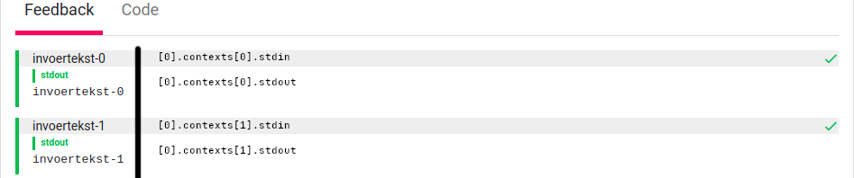
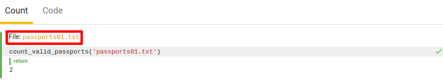

# Documentation TESTed DSL
A DSL-testplan for TESTed is written in YAML.
The structure of the DSL is very similar to the structure of the tests used in Dodona.
The following code fragment describes the structure of the DSL-testplans.
The use of square brackets indicates a list of objects.

```text
. # With top-level
├ namespace
├ config
│ ├ stdout
│ │ ├ ignoreWhitespace
│ │ ├ caseInsensitive
│ │ ├ tryFloatingPoint
│ │ ├ applyRounding
│ │ └ roundTo
│ └ stderr
│   └ ... # identical to stdout
├ disable_optimizations
└ tabs[]
  ├ config
  │ └ ... # identical to config at top-level
  ├ tab
  └ contexts[]
    ├ config
    │ └ ... # identical to config at top-level
    ├ files[]
    │ ├ name
    │ └ url
    ├ arguments
    ├ stdin
    ├ exception
    ├ exit_code
    ├ stderr
    ├ stdout
    └ testcases[] # Can be omitted when the context contains only one test case, so no context test case.
      ├ files[]
      │ └ ... # identical to files of context
      ├ statement
      ├ exception
      ├ return     # either 'return' either 'return-raw'
      ├ return-raw # either 'return' either 'return-raw'
      ├ stderr
      └ stdout
      
[] # Without top-level
└ ... # identical to tabs above
```

In the following sections will we describe the DSL with examples.

## Simple input-output
A first type of exercises are input-output exercises.
As an example, we use the "echo" exercise: solutions should read data from stdin and copy it to stdout.

```yaml
- tab: "Feedback"
  contexts:
  - stdin: "invoertekst-0"
    stdout: "invoertekst-0"
  - stdin: "invoertekst-1"
    stdout: "invoertekst-1"
```

The following figure shows how the feedback from the previous testplan is shown in Dodona.
The figure has been augmented with annotations of the form `[0].testcases[0].stdin`.
These annotations describe a path to an object in the testplan.
Interpretation: `[0]` the first tab, `contexts[0]` the first context, `stdin` the given input at standard input and `stdout` the expected output at standard output.



### Description

#### Objects
`yaml` make use of objects to describe data.
It uses indentation levels to create **nested** objects.
Objects consist of key-value pairs, where the **key** is a string without whitespace, and must be **terminated with a colon**.
The values could be other objects, but also strings, numbers, logical values and lists.

Examples:
```yaml
object0: 1
```
```yaml
root:
  child0:
    subchild0: "leaf"
    subchild1: "leaf"
  child1:
    subchild0: "leaf"
```

#### Lists
When you use lists in `yaml`, the **first key** of each object in the list must be **prepended** by a **dash** followed by a **space**.

Examples:
```yaml
- name: "Item 0"
- name: "Item 1"
- name: "Item 2"
- name: "Item 3"
```
```yaml
list:
- name: "Item 0"
  items: 5
- name: "Item 1"
- name: "Item 2"
  items: 3
- name: "Item 3"
```

#### Testplan
The structure of the testplans is a list at the highest level, which contains tab-objects.

#### Tab
The first required key of a tab is `tab`.
This one expects a string that contains the name of the tab, as displayed by Dodona.
The second key of a tab is `contexts`, this one expects a list of all contexts that must be executed.

#### Context
A context is an independent executed test-sequence.
At this moment we have only seen an example for input-output tests.

##### stdin
The keyword `stdin` is used to provide the standard input for a testcase.

##### stdout
The keyword `stdout` is used to specify the expect output at the standard output channel.
For this output, we recommend to use strings.
Numbers and boolean values are also supported, but they will be translated to strings.
We will be referring to these datatypes as textual datatypes.

## Multi-tab and multi-line
We will now extend the testplan with multi-line strings and multiple tabs.
We will use the exercise [Thoughts that count](https://dodona.ugent.be/en/courses/27/activities/1047652305/) for this example.

```yaml
- tab: "Kleiner dan"
  contexts:
  - stdin: "100\n53\n<\n"
    stdout: "2\n51\n49\n"
- tab: "Groter dan"
  contexts:
  - stdin: |
      34
      4
      >
    stdout: |
      2
      2
      32

```

Because of a display problem in Dodona, are the newlines in the description in the following figures replaced by spaces.
<p float="left">
  
  
</p>

### Description

#### Multi-line
As visible in the testplan from the codefragment, YAML has multiple ways to describe multi-line strings.
A first is the classic escape-string and a second notation uses ‘|’.
The class escape-string gives the most control over whitespace.

::: tip Hint
More information about multi-line in section [Known pitfalls](#known-pitfalls).
:::

#### Multi-tab
As is shown in the example, can you also use multiple tabs.

## Command line arguments, standard error and exit code
Now, we will add command line arguments, standarderror and exit code to the test plan.
As an example, we'll use a fictional exercise where the goal is a simple calculator with integers.

```yaml
- tab: "Sum"
  contexts:
  - arguments: [ "-a", "5", "20" ]
    stdout: "25"
  - arguments: [ "-a", "alpha", "beta" ]
    stderr: "'alpha' and 'beta' aren't integers"
    exit_code: 1
- tab: "Difference"
  contexts:
  - arguments: [ "-s", "5", "20" ]
    stdout: "-15"
  - arguments: [ "-s", "5", "20" ]
    stdin: "Random input"
    stderr: "There is no input expected at standard input"
    exit_code: 1
- tab: "Multiplication"
  contexts:
  - arguments: [ "-m", "25", "5" ]
    stdout: "125"
- tab: "Division"
  contexts:
  - arguments: [ "-d", "25", "5" ]
    stdout: "5"
  - arguments: [ "-d", "25", "0" ]
    stderr: "Integer division by zero"
    exit_code: 2
```

### Description

#### arguments
The arguments are a list of command line arguments that must be passed to the program for the testcase.

::: tip Hint
We recommend using strings for these arguments, however the textual types are also supported.
:::

#### stderr
This keyword defines the expected output for the testcase.  
This is analogous to `stdout`.

#### exit_code
Used to provide the expected exit code of the program for the testcase.
This must be an integer.

## Configuration options
The next step is adding configuration options for standard output and standarderror.
We will use the exercise [How smart are you?](https://dodona.ugent.be/en/courses/392/series/3920/activities/726249058/).

```yaml
namespace: "solution"
disable_optimizations: true
tabs:
- tab: "Hoe slim ben jij?"
  config:
    stdout:
      ignoreWhitespace: true
      tryFloatingPoint: true
  contexts:
  - stdin: "8809"
    stdout: "6"
  - config:
      stdout:
        caseInsensitive: false
    stdin: 7111
    stdout: 0
  - stdin: "2172"
    stdout:
      data: "0"
      config:
        applyRounding: true
        roundTo: 10
```

### Description

#### namespace
By default, TESTed will use `submission` as the namespace for an exercise.
How this namespace is used, depends on the programming language.
For example, in Java this must be the name of the class of the solution submitted by the students.
You might want to change this to something that makes sense for the exercise.
You should use `snake_case` for the submission. TESTed will automatically convert it to the conventions of each programming language. For example, the namespace `result_calculator` will require Java submissions to contain the class `ResultCalculator`.

#### disable_optimizations
By default, TESTed will use some optimization techniques to reduce the execution time.
However, these optimization techniques could cause the optimized code to lead to unwanted results.
Therefore can the user disable these optimizations for the entire testplan, should this be necessary.

The unwanted results are due to the shared program state between the different contexts in the test code.
Some potentially unwanted results are: the use of shared caches between different contexts,
which achieves a faster execution of tests (not necessarily a negative result);
back gates through which the students can share information between the different contexts.

#### tabs
When you want to provide `namespace`, `disable_optimizations` or global configuration options, you must use the keyword `tabs` the pass the list of tabs.

#### Textual types
The second testcase in the testplan for __How smart are you?__, illustrates that not only strings can be used for standard input, output or error.
In this case they are integers but also logical values and floating decimal numbers are possible (the textual types).

::: warning Remark
To avoid problems, we recommend using strings for standard input, output and error.
This is caused by the fact that the textual types will be converted to strings.
For more information about the translation of textual types, see paragraph [Known pitfalls](#known-pitfalls).
:::

#### Configuration
There are multiple configuration options to pass to the evaluator for standard output and error.
These options are:

- **ignoreWhitespace**:
  Ignore whitespace in prefix and suffix of the text by comparing the output.
- **caseInsensitive**:
Ignore the difference between uppercase and lowercase when comparing the output.
- **tryFloatingPoint**:
  Try to compare the output as floats.
- **applyRounding**:
  Apply rounding when comparing the output as floats.
- **roundTo**:
  The number of decimals after the point that you want to keep after rounding.
  This is mandatory when you want to apply rounding.
  
You can pass the configuration options at the global level, for each tab, context and/or specific for each output.
The configuration options must be accumulated, the option at to must specific level will be kept.

- **Global**:
  Globally the options must be passed for each output stream, in the object by the optional key `config`.
  This object has two keys `stdout` (options for standard output) and `stderr` (options for standarderror), where at least on key must be passed.
- **Tab**:
  Identical to __global__.
- **Context**:
  Identical to __global__.
- **Specific**:
  When you only want to pass a configuration for one test, you must pass an object instead of the value for that channel.
  An example of this is given in testcase 3 of the codefragment.
  This object has two mandatory keys:
  - **data**:
    The expected value, to compare with.
  - **config**:
    The object with the configuration params.

## Simple function calls
Now we will examine a testplan for simple function calls.
The testplan that we will examine is for the exercise [Rail fence cipher](https://dodona.ugent.be/en/courses/392/series/3922/activities/444829407/).

```yaml
- tab: "Encode"
  contexts:
  - expression: 'encode("And now for something completely different.", 4)'
    return: "Awsimlf.no  ohnopeyfetdnfrmtgclt irn oe ede"
  - expression: 'encode("Yesterday is history, tomorrow is a mystery, today is a gift of God, which is why we call it the present.", 1)'
    return-raw: '"Yesterday is history, tomorrow is a mystery, today is a gift of God, which is why we call it the present."'
- tab: "Decode"
  contexts:
  - expression: 'decode("Awsimlf.no  ohnopeyfetdnfrmtgclt irn oe ede", 4)'
    return: "And now for something completely different."
  - expression: 'decode("Yesterday is history, tomorrow is a mystery, today is a gift of God, which is why we call it the present.", 1)'
    return: "Yesterday is history, tomorrow is a mystery, today is a gift of God, which is why we call it the present."
```


### Description

#### Expression
With function call tests, the input is a statement or expression (both can use one of the following keywords: `expression` or `statement`) in a testcase for a context.

::: tip Hint
Statements and expressions are discussed in detail in the section [Statements, expressions and return-raw](#statements-expressions-and-return-raw).
:::

#### Return values
There are two ways to pass the expected return value of the expression in the DSL.
Either you use the `return` or you use` return-raw`.

- **return**:
  The expected value of the expression is noted using YAML objects.
  The YAML data types will be translated to the basic data types of TESTed.
- **return-raw**:
  The expected value of the expression is noted using the same grammar as for statements and expressions (see section [Statements, expressions and return-raw](#statements-expressions-and-return-raw)).

::: warning Remark
When you want to test a function that has no return value (not the value `null`, `void` in Java by example),
you may not specify `return` or` return-raw`.
:::
  
## Variable assignments
We will now look at a testplan where we also assign values to a variable.
For this we use the example exercise [Objects](https://github.com/dodona-edu/universal-judge/tree/master/exercise/objects) from TESTed.

```yaml
namespace: "equal_checker"
tabs:
- tab: "Feedback"
  contexts:
  - testcases:
    - statement: 'instance = new EqualChecker(5)'
    - expression: 'instance.check(25)'
      return: false
    - expression: 'instance.check(5)'
      return: true
```


### Description
In a context we can define multiple testcases, that can depend on an earlier testcase.
In this example we first create an object, after which we will call functions on this object.

This is the most important reason to differentiate between contexts and testcases.
The contexts could be executed independently, while testcases in a context could be dependent.

#### Testcases
To use multiple testcases in a context, you must use the keyword `testcases`.
This is a list of sequential testcases: you may depend on the order of the testcases.

If you want to evaluate one or more function call test(s) in addition to the code itself (or `main` method), you must also use the list of testcases.

## Error messages
A concept often used in programming languages are errors that can be raised.
You can specify the expected error messages in testplans, not to be confused with error types (which are programming language dependent).
For this we are looking at a testplan for the "division" function.

```yaml
- tab: "Division"
  contexts:
  - statement: 'division(9, 0)'
    exception: "Division by zero"
```

### Description

#### exception
This keyword expects the expected fault message (as textual type) for a testcase.

## File linking
In some programming exercises the students are expected to read input from files.
In the evaluation feedback you often want to allow the student to see the content of these files.
You can add a list of files that must be linked at the context and/or testcase level.

```yaml
- tab: "Count"
  contexts:
  - statement: 'count_valid_passports("passports01.txt")'
    return: 2
    files:
    - name: "passports01.txt"
      url: "media/workdir/passports01.txt"
```



### Description

#### files
At the level of a context and/or testcase you could be a list of the files to be linked.

#### name
Name of the file.

#### url
The relative path to the file that is located in the description folder of the exercise.

## Combination of function calls and input-output
We have already seen testplans for both input-output or function calls.
We will now combine these concepts in one testplan.
We will use the basic calculator example for this testplan.
YAML also support comments.
The line is preceded by a pound sign (#).

```yaml
# Testing sum of two numbers
- tab: "Sum"
  contexts:
  - arguments: [ "-a", "5", "20" ]
    stdout: "25"
    testcases:
    - statement: 'add(4, 16)'
      return: 20
# Testing difference of two numbers
- tab: "Difference"
  contexts:
  - arguments: [ "-s", "5", "20" ]
    stdout: "-15"
    testcases:
    - statement: 'sub(4, 16)'
      return: -12
# Testing multiplication of two numbers
- tab: "Multiplication"
  contexts:
  - arguments: [ "-m", "25", "5" ]
    stdout: "125"
    testcases:
    - statement: 'mul(4, 16)'
      return: 64
# Testing division of two numbers
- tab: "Division"
  contexts:
  - arguments: [ "-d", "25", "5" ]
    stdout: "5"
    testcases:
    - statement: 'div(32, 8)'
      return: 4
  - arguments: [ "-d", "25", "0" ]
    stderr: "Integer division by zero"
    exit_code: 1
    testcases:
    - statement: 'div(1, 0)'
      exception: "Integer division by zero"
```

## Statements, expressions and return-raw
In this section we will describe the grammar of the statements, expressions and return values.

### Namings
Constructor, function, and variable names can only consist of lowercase and uppercase letters of the alphabet (without accents), numbers and a hyphen, and cannot begin with a number.

### Datatypes
Our grammar offers support for all data types from tested, see table below.

| datatype | Description |
| -------- | ------ |
| nothing  | Datatype null values |
| boolean  | Datatype boolean values |
| text     | Default datatype text |
| char     | Datatype single character |
| integer  | Default datatype integers  |
| uint8    | Datatype 8 bit natural numbers |
| int8     | Datatype 8 bit integers |
| uint16   | Datatype 16 bit natural numbers |
| int16    | Datatype 16 bit integers |
| uint32   | Datatype 32 bit natural numbers |
| int32    | Datatype 32 bit integers |
| uint64   | Datatype 64 bit natural numbers |
| int64    | Datatype 64 bit integers |
| bigint   | Datatype larger integers (>64 bit) |
| rational | Default datatype rational numbers |
| single   | Datatype 32-bit floating point numbers |
| double   | Datatype 64-bit floating point numbers |
| extended | Datatype high precision floating points numbers |
| fixed    | Datatype rational numbers fixed precision |
| sequence | Default datatype sequences |
| list     | Datatype lists (sequence, dynamic length) |
| array    | Datatype arrays (sequence, fixed length) |
| tuple    | Datatype tuples |
| set      | Datatype sets |
| map      | Datatype dictionaires |

### Values
The grammar supports numbers, booleans, null-values and strings.

#### Numbers
Both integers and rational numbers are supported.
Integers always use a decimal format (ex: `2020`,` + 5`, `−2`).
Rational numbers can use either decimal (ex: `2.5`) or scientific notation (ex:` 27.15e2`, `−2e − 2`) format.

#### Booleans
The two boolean values are `true` and `false`.

#### Null-values
`null` and `undefined` represent both null-values.

#### Strings
Text or strings must be written between double quotes, where the special characters are escaped using a backslash.
The table below is an overview of these special characters.

| Description | Escape sequence |
| ------------ | ---------------- |
| Backslash | `\\` |
| Single quote | `\'` |
| Double quote | `\"` |
| ASCII Bell | `\a` |
| ASCII Backspace | `\b` |
| ASCII Formfeed | `\f` |
| ASCII Linefeed | `\n` |
| ASCII Carriage Return | `\r` |
| ASCII Horizontal tab | `\t` |
| ASCII Vertical tab | `\v` |
| Octal character value | `\ooo` |
| Hexadecimal character value | `\xhh` |
| 16-bit unicode character value | `\uhhhh` |
| 32-bit unicode character value | `\Uhhhhhhhh` |
| Named unicode character | `\N{name}` |

#### Collections
There are multiple data collections in TESTed: sequence, sets, tuples and dictionaires.
When you use collections in expressions and statements, the values in these collection can contain both values and expressions.
For **return values** these collections can only contain values and **no expressions**.
In addition, the values in these collections can be heterogeneous (different data types).

##### Sequences
An ordered dynamic collection of values.
These are denoted with the help of squared brackets and could be empty.
Some examples:
```javascript
[5, 7, 8]
[5, 7.5, true, "text", null]
[random()]
[]
```

##### Tuples
An ordered fixed collection of values.
These are denoted with the help of round brackets and could be empty.
Some examples:
```javascript
(5, 7, 8)
(5, 7.5, [true, "text"], null)
(random())
()
```

##### Sets
An unordered dynamic collection of unique immutable values.
These are denoted with the help of curly brackets.
Empty sets must be written in a specific way because dictionaries also written with curly brackets.
Some examples:
```javascript
{5, 7, 8}
{5, 7.5, (true, "text")}
{random()}
```

::: warning Remark
Not every programming language supports each datatype as set element.
::::

##### Dictionaries
An unordered dynamic collection of key-value pairs.
The keys must be immutable, the values could be both immutable and mutable.
Like sets, dictionaries are written with curly brackets, but dictionaries can be empty.
Sets could also be empty but must use [explicit typing](#explicit-typing).
Both the keys and values can be of any datatype.
Some examples:
```javascript
{}
{"first": 5}
{"size": 5, "precision": 0.75, "rounding active": true}
{0: random(), get_id(): get_username()}
```

::: warning Remark
Not every programming language supports each datatype as key.
:::

#### Explicit typing
Our grammar supports the ability to specify the "explicit type" of the values (not expressions).
Explicit typing is denoted with `<Value> :: <Datatype>`.
An empty set for example can be denoted with one of the following expressions:
```haskell
[] :: set
() :: set
{} :: set
```

### Functions
The arguments of a function call are written within parentheses.
A function call can be both be a global function, or an object function.
Some examples:
```javascript
add(5, 2)
object.get_name()
get_element(4, ["first", 2, 3.4])
```

### Constructor
Constructors are very similar to function calls, except that they are preceded with the keyword `new`.
Some examples:
```javascript
new Counter()
new object.Pair("Pair", 8.4e-5)
```

### Expression
Expressions are values, function calls, constructors or variables (and properties).

### Variable assignments
If we want to use variables, we need to assign values to these variables.
For constructors and values, the datatype can be derived and must not be specified.
For function calls, however, the data type must be specified explicitly.
Some examples:
```javascript
Counter counter = new Counter()
pair = new object.Pair("Paar", 8.4e-5)
text value = get_value(0, pair)
number = 5 :: int8
```

## Known pitfalls

### Keys
Forgetting a colon after the key names in YAML.
Example:

Wrong:
```yaml
- tab "Feedback"
```

Correct:
```yaml
- tab: "Feedback"
```

### Lists
Forgetting the hyphen and space in list elements.
Or using it to much, which leads to much more elements than expected.
Example:

Wrong:
```yaml
- tab: "Feedback"
- contexts:
  - stdin: "input-0"
    stdout: "output-0"
    stdin: "input-1"
    stdout: "output-1"
```

Correct:
```yaml
- tab: "Feedback"
  contexts:
  - stdin: "input-0"
    stdout: "output-0"
  - stdin: "input-1"
    stdout: "output-1"
```

### Text
There are multiple ways to denote strings in YAML.
The different notations handle whitespace in different ways.
::: tip Hint
To avoid confusion we recommend using the double quotes notation when you want to pass textual values.
Using this notation, you can escape special characters, for example newlines.
When you want to specify statements, expressions and raw return-values, we recommend using single quotes, because it doesn't escape special characters.
:::
Below you can find an overview of all YAML strings notations, if you want to use another.

#### Single quotes
By the single quotes, no character will be escaped.
Except for the single quote itself, which must be escaped by repeating the symbol.
Example YAML:
```yaml
single: 'data''\ndata'
```

JSON Translation (YAML rewritten as JSON):
```json
{"single": "data'\\ndata"}
```

#### Double quotes
Using double quotes, special characters need to be escaped.
Example YAML:
```yaml
double: "data\ndata"
```

JSON Translation:
```json
{"double": "data\ndata"}
```

#### Unquoted
When using unquoted strings, no character escaping is necessary.
Example YAML:
```yaml
unquoted: data \ data
```

JSON Translation:
```json
{"unquoted": "data \\ data"}
```

#### Multi-line unquoted
Using multi-line unquoted string, a single newline character will be replaced with a space and the whitespace around a line will be trimmed.
A completely empty line will be replaced with a newline character.
Example YAML:
```yaml
multi unquoted:
  line1
    line2
  line3

  line4


  line5
```

JSON Translation:
```json
{"multi unquoted": "line1 line2 line3\nline4\n\nline5"}
```

#### Multi-line single quotes
This is very similar to the multi-line unquoted strings.
Example YAML:
```yaml
multi single quoted: 'line1''\nline1a
    line2
  line3

  line4


  line5'
```

JSON Translation:
```json
{"multi single quoted": "line1'\\nline1a line2 line3\nline4\n\nline5"}
```

#### Multi-line double quotes
This is very similar to multi-line unquoted strings, but special characters must be escaped.
Example YAML:
```yaml
multi double quoted: "line1\nline1a
    line2
  line3

  line4


  line5"
```

JSON Translation:
```json
{"multi double quoted": "line1\nline1a line2 line3\nline4\n\nline5"}
```

#### literal block
YAML supports multiple block notations, where newlines are kept.
In this mode, indentation that deviates from the alignment not be trimmed.
There will be also no escaping.

##### Default (`|`)
Removes each empty line at the end of the string, but keeps one newline character at the end.
Example YAML:
```yaml
literal: |
  line1a\nline1b
    line2
  # not a comment
  end

# end of statement
```

JSON Translation:
```json
{"literal": "line1a\\nline1b\n  line2\n# not a comment\nend\n"}
```

##### Keep (`|+`)
Keeps all newlines at the end of the string.
Example YAML:
```yaml
literal: |+
  line1a\nline1b
    line2
  # not a comment
  end

# end of statement
```

JSON Translation:
```json
{"literal": "line1a\\nline1b\n  line2\n# not a comment\nend\n\n"}
```

##### Trim (`|-`)
Here each newline at the end will be removed and there will be no newline at the end of the string.
Example YAML:
```yaml
literal: |-
  line1a\nline1b
    line2
  # not a comment
  end

# end of statement
```

JSON Translation:
```json
{"literal": "line1a\\nline1b\n  line2\n# not a comment\nend"}
```

#### Folded block
YAML supports different block formats where a line break is replaced with a space when the next line respects the alignment.
Each empty line will be interpreted as a newline.
The indentation that deviates from the alignment is not trimmed away.
There will also be no escaping.

##### Default (`>`)
Removes each empty line at the end of the string, but keeps one newline character at the end.
Example YAML:
```yaml
literal: >
  line1a
  line1b
    line2

  line3

# end of statement
```

JSON Translation:
```json
{"literal": "line1a line1b\n  line2\n\nline3\n"}
```

##### Keep (`>+`)
Keeps all newlines at the end of the string.
Example YAML:
```yaml
literal: >+
  line1a
  line1b
    line2

  line3

# end of statement
```

JSON Translation:
```json
{"literal": "line1a line1b\n  line2\n\nline3\n\n"}
```

##### Trim (`>-`)
Removes each empty line at the end of the string and there will be no newline character at the end.
Example YAML:
```yaml
literal: >-
  line1a
  line1b
    line2

  line3

# end of statement
```

JSON Translation:
```json
{"literal": "line1a line1b\n  line2\n\nline3"}
```

### 'yes' and 'no'
`yes` and `no` are an extra notation for the booleans `true` and `false`.

### Translation to textual types
If no strings are used for `stdin`,` stdout` and `stderr`, but numbers and boolean values, the final textual data may deviate from what you intended.
Example:
```yaml
stdin: 077
```

Will be interpreted as an octal number: `7 * 8 + 7 = 63`.
```yaml
stdin: "63"
```

### Function names
The convention for function names in the DSL is `snake_case`.
When you deviate from this convention, it can't be guaranteed that the correct style convention for a specific programming languages will be used.

## Convert
The canonical format for TESTed testplans is the full JSON format. However, TESTed converts the DSL internally to the JSON format, so you can use the DSL directly.

However, it can be useful to view the full JSON format, especially if things go wrong. TESTed provides a Python script to do this translation. The script can be found in [TESTed's GitHub repository](https://github.com/dodona-edu/universal-judge).
The script can be executed with one of the following commands (and combinations) in the root directory of the GitHub repository:
```bash
# Standard input - standard output
$ python3 -m tested.translate_dsl < testplan.yaml > testplan.json
# Short options
$ python3 -m tested.translate_dsl -i testplan.yaml -o testplan.json
# Long option names
$ python3 -m tested.translate_dsl --dsl testplan.yaml --json testplan.json
# Positional arguments
$ python3 -m tested.translate_dsl testplan.yaml testplan.json
```
