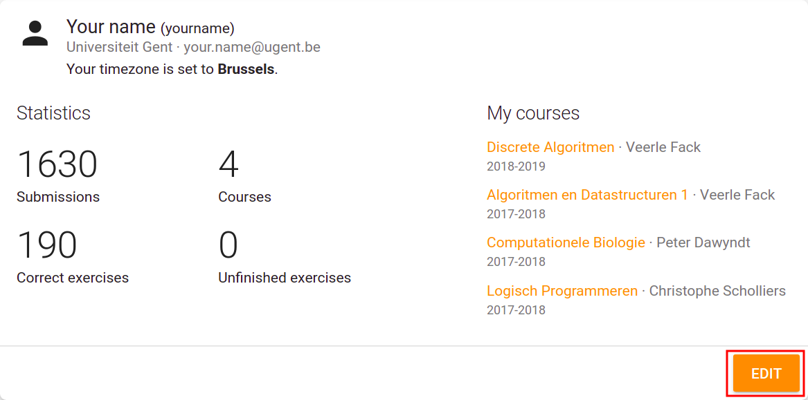

# Creating an API token

By creating an API token, you can authorize external applications, such as the [Dodona plugin for JetBrains IDEs](https://plugins.jetbrains.com/plugin/11166-dodona), to act on your behalf, without ever providing them with your password. To create an API token, simply follow these five steps:

## 1. Go to your profile page
First, go to your profile page by clicking the link in the dropdown menu.

## 2. Edit your profile
At your profile page, click the yellow `EDIT`-button at the bottom.

## 3. Create a token
Scroll to the bottom of the page and generate a new token by clicking the `+`-button. You can choose the description yourself.

## 4. Copy the token
Copy the newly generated token and paste it in the authentication dialog of the plugin. You can close your profile page now, but beware that you will not be able to see this token again; you will need to generate a new token if you need one.

