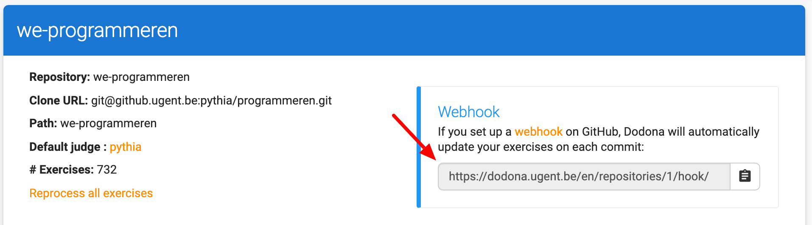

# Creating a new exercise repository

Dodona uses git repositories to manage exercises. A repository can contain multiple exercises and must adhere to a [predefined structure](/references/exercise-directory-structure) to be machine-readable by Dodona.

## 1. Create a GitHub repository

A first step is thus to create a git repository. You can easily do this on [github.com](https://github.com) or the [Ghent University GitHub instance](https://github.ugent.be). Once created, you can add your repository to Dodona.

## 2. Add the repository to Dodona

All staff on Dodona has a "Repositories" link in the sidebar of the Dodona website, which takes you to an overview of the repositories. To add a new repository, hit the big plus button on the top.

In the creation form, choose a (preferably unique) name for your repository on Dodona. Next, enter the clone URL found on the GitHub page of your repository. Be sure to use the SSH link from GitHub, and not the HTTPS version. Finally, choose the default judge for the exercises in your repository. For Python exercises, pick the "Pythia" judge.

Before clicking on the add button, make sure the Dodona server has both read and write access to your exercise repository. We need this access to be able to edit the exercises through the Dodona web-interface. On github.com, the easiest way to do this is by adding the user [dodona-server](https://github.com/dodona-server) to your repository. On github.ugent.be, add [SA-GitHubDodona](https://github.ugent.be/SA-GitHubDodona).

You can now click the add-button on Dodona to add your repository.

## 3. Set up the webhook

To keep your exercises up to date, Dodona must know when you made changes. We do this by using a webhook, a unique URL that triggers a repository update on Dodona. You should see this webhook URL on the page after creating the repository on Dodona.

The only thing left to do is adding this URL to GitHub. To do this, open your repository on GitHub, go to the repository settings and click "Webhooks" in the sidebar. Next, click the "Add webhook" button and enter the URL you received from Dodona. You can use the default settings and click "Add webhook".

## 4. Create exercises

You are now ready to add exercises to your repository. If all goes well, they should show up automatically on Dodona.
