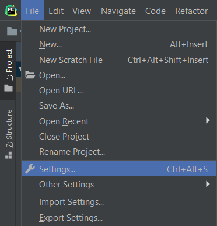
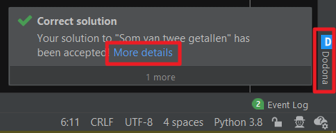

# FAQ: IDE plugins

[[toc]]

## Wat is een IDE-plugin?

Een IDE-plugin voor Dodona is een tool die de functies van Dodona integreert in de IDE van je voorkeur. Hoewel je met Dodona direct code kunt schrijven in de online editor, geven de meeste professionele programmeurs de voorkeur aan een IDE (Integrated Development Environment) om te coderen. IDE's bieden een robuuste set tools voor het schrijven, debuggen en uitvoeren van code die de productiviteit en kwaliteit van de code aanzienlijk kunnen verbeteren.

Met de Dodona IDE plugins kun je je code eenvoudig overzetten van je IDE naar Dodona. Dit betekent dat je je code kunt schrijven en testen in een omgeving waar je vertrouwd mee bent en deze vervolgens direct naar Dodona kunt sturen voor evaluatie en feedback. Op dit moment ondersteunt Dodona plugins voor populaire [JetBrains IDE's zoals PyCharm](#hoe-installeer-ik-de-pycharm-plugin) en ook voor [Visual Studio Code](#hoe-installeer-ik-de-vs-code-extensie).

Door deze plugins te gebruiken, kun je het beste van twee werelden combineren: de geavanceerde functies van je favoriete IDE en de leer- en evaluatiehulpmiddelen van Dodona.

## Hoe installeer ik de PyCharm plugin?

::: tip
Deze instructies gelden ook voor andere JetBrains IDE's zoals IntelliJ IDEA, WebStorm, PhpStorm, ...
:::

Volg de onderstaande stappen om de Dodona plugin voor PyCharm te installeren:

1. **Maak een API token**: Voordat je de plugin installeert, moet je een API token aanmaken op de Dodona website. Met dit token kan PyCharm namens jou oplossingen indienen zonder dat PyCharm je wachtwoord nodig heeft. Je kunt een API token aanmaken door de stappen te volgen die beschreven staan in [deze FAQ pagina](/nl/faq/api-tokens/#hoe-maak-ik-een-api-token-aan). Houd het aangemaakte token bij de hand omdat je het de eerste keer dat je de plugin gebruikt nodig hebt (zie volgende vraag).

2. **Installeer de plugin**: De Dodona plugin kan direct vanuit PyCharm worden geïnstalleerd. Open het menu 'Bestand' en klik op 'Settings...'.
  
  Selecteer in het menu 'Plugins' de tab 'Marketplace' en zoek naar Dodona. Klik ten slotte op 'Installeren' en 'Opnieuw opstarten'.
  
  Je kunt de plugin ook rechtstreeks vanaf de JetBrains website installeren. Ga gewoon naar https://plugins.jetbrains.com/plugin/11166-dodona en klik op de blauwe 'Get' knop.

## Hoe kan ik de PyCharm-plugin gebruiken?

Nadat je de Dodona-plugin voor PyCharm met succes hebt geïnstalleerd, kun je de volgende stappen volgen om deze te gebruiken:

1. **Start een nieuwe oefening**: Eerst moet PyCharm weten aan welke specifieke oefening je werkt. Klik hiervoor met de rechtermuisknop op een bestaand project of map in PyCharm. Selecteer in het 'New' menu de optie 'Dodona Exercise'.
  
  Wanneer je je eerste oefening maakt, vraagt PyCharm om je API-token. Voer het API-token in dat je eerder hebt gemaakt. Je ziet dan een lijst met je Dodona-cursussen. Selecteer de juiste cursus, serie en oefening. PyCharm maakt automatisch een nieuw bestand aan waarin je je oplossing kunt schrijven. De eerste regel van dit nieuwe bestand bevat de link naar de geselecteerde oefening als commentaar.
  
  Deze regel is cruciaal omdat PyCharm deze zal gebruiken om je oplossing naar de juiste oefening te sturen, dus verwijder deze niet.

2. **Stuur je oplossing in**: Nadat je de oefening hebt opgelost, kun je je oplossing direct vanuit PyCharm indienen. Zoek hiervoor een blauw vinkje in de rechterbovenhoek van de interface.
  
  Als je op deze knop klikt, wordt je code verzonden naar Dodona en automatisch gecontroleerd. Kort na het indienen zou je rechtsonder een popup moeten zien met het resultaat van je indiening.
  
  Als je meer details over het resultaat wilt zien, klik dan op de link 'more details' om het resultaat in een nieuwe browserversie te openen. Als je opnieuw wilt indienen, klik je gewoon weer op het blauwe vinkje. Onthoud dat je zo vaak kan indienen als je wil.

## Hoe installeer ik de VS Code-extensie?

Zo installeer je de Dodona-extensie voor Visual Studio Code:

1. **Maak een API token**: Voordat je de extensie kunt installeren, moet je een API token aanmaken op de Dodona website. Met dit token kan VS Code namens jou oplossingen indienen zonder dat je je wachtwoord nodig hebt. Als je hulp nodig hebt bij het maken van een API-token, lees dan [dit FAQ-artikel](/nl/faq/api-tokens/). Zorg ervoor dat je het token dat je aanmaakt bij de hand houdt, want je zult het snel nodig hebben.

2. **Installeer de extensie**: Je kunt de Dodona-extensie rechtstreeks vanuit VS Code installeren. Open het menu 'Extensions', zoek naar 'Dodona' en klik op het zoekresultaat. Klik ten slotte op 'Install'.
  
  Je kunt de extensie ook rechtstreeks vanuit de VS Code Marketplace installeren. Ga naar de [Dodona plugin pagina](https://marketplace.visualstudio.com/items?itemName=thepieterdc.dodona-plugin-vscode) en klik op de groene 'Install' knop.

3. **API token invoeren**: Na het installeren van de extensie moet je het API-token invoeren dat je eerder hebt aangemaakt. Klik hiervoor op het tandwielpictogram linksonder in VS Code en selecteer 'Settings' (of gebruik de sneltoets `Ctrl+,`). Klik vervolgens op 'Extensions' en selecteer 'Dodona'. Plak het API-token dat je hebt gemaakt in het tekstvak.
  

## Hoe kan ik de VS Code extensie gebruiken?

Volg deze stappen om de Dodona VS Code extensie te gebruiken:

1. **Start een nieuwe oefening:** Om VS Code te laten weten aan welke oefening je werkt, moet je de Dodona URL van de oefening toevoegen als eerste regel van je oplossingsbestand. Zorg ervoor dat je deze URL markeert als commentaar. In JavaScript zou het er bijvoorbeeld zo uitzien

    ```javascript
    // https://dodona.ugent.be/nl/activities/1545120484/

    function echo(i) {
        return i;
    }
    ```
   Verwijder deze regel niet, want VS Code gebruikt hem om je oplossing naar de juiste oefening te sturen. Als je op `ctrl` (of `cmd` op een Mac) drukt terwijl je op de URL klikt, wordt de beschrijving van de oefening in een nieuw browservenster geopend.

2. **Stuur je oplossing in:** Als je de oefening hebt opgelost, kun je je oplossing eenvoudig insturen met het 'Submit to Dodona' commando. Je kunt dit doen door het opdrachtenpalet te openen met `Ctrl-Shift-P`, (een deel van) `Submit to Dodona` in te typen en op `Enter` te drukken. Je kunt ook een snelkoppeling maken voor dit commando. Deze opdracht stuurt je code naar Dodona en activeert een automatische test.
  

3. **Controleer het resultaat:** Na een paar seconden zou er rechtsonder een popup moeten verschijnen met het resultaat van je oplossing. Als je op de knop 'View results' klikt, wordt het resultaat in een nieuw browservenster geopend. Je kunt je oplossing zo vaak als je wilt insturen door hetzelfde commando te herhalen.
  
