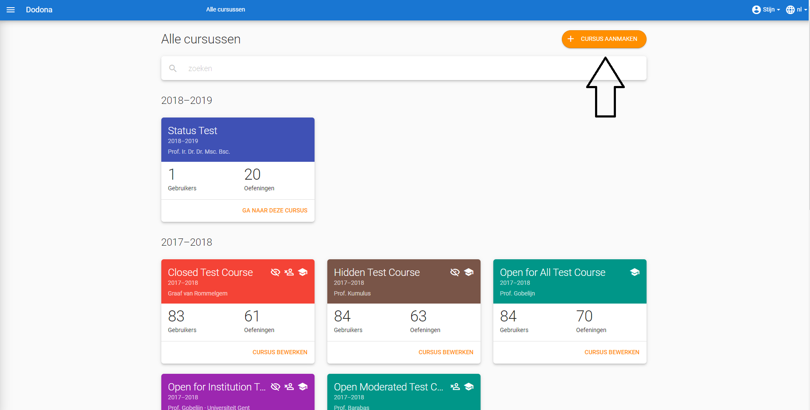
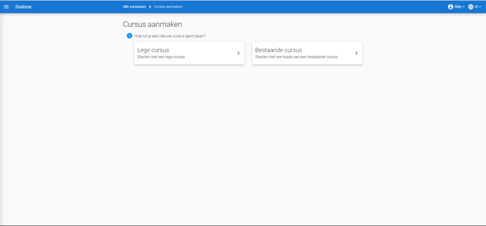
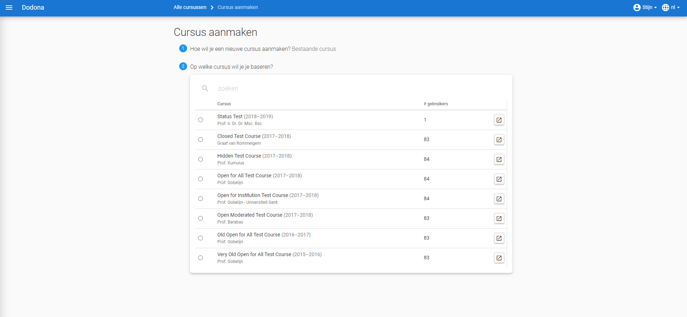
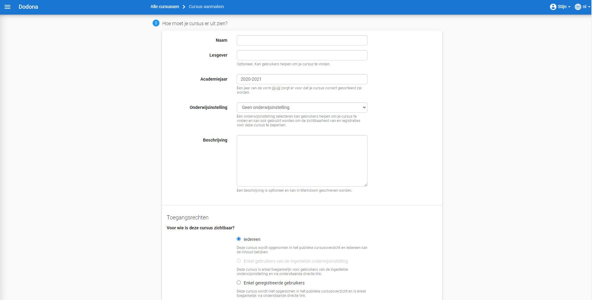
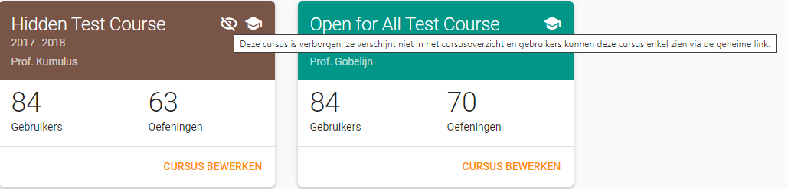

Een **cursus** wordt
[opgebouwd](#leerpad-uitstippelen) als een
[leerpad](#leerpad) met
[oefeningen](/nl/for-students#oefening) die gebundeld
worden in **oefeningenreeksen**. De opeenvolging van oefeningenreeksen impliceert een mogelijke volgorde waarin de oefeningen kunnen
[opgelost](/nl/for-students#solution) worden.

Een [lesgever](/nl/user-management#teacher) kan onbeperkt
[cursussen](#cursus)
[aanmaken](#cursus-aanmaken) en wordt
automatisch ook de eerste
[cursusbeheerder](#cursusbeheerder) van
die cursussen. Als cursusbeheerder kan hij andere
[cursusgebruikers](#cursusgebruikers)
[aanduiden](#cursusbeheerders-aanduiden)
om samen met hem de cursus te beheren. Hij kan echter geen cursussen
beheren waarvoor hij geen cursusbeheerder is.

Een [cursusbeheerder](#cursusbeheerder) [stippelt](#leerpad-uitstippelen) voor de [cursus](#cursus) een [leerpad](#leerpad) uit met [oefeningenreeksen](#oefeningenreeks) waaraan [oefeningen](/nl/for-students#oefening) [gekoppeld](#oefeningen-koppelen) worden. Voor elke oefeningenreeks kan hij een [deadline](#oefeningenreeks-deadline) [instellen](#oefeningenreeks-eigenschappen-instellen) die aangeeft tot wanneer er rekening gehouden wordt met [oplossingen](/nl/for-students#oplossing) die
[ingediend](/nl/for-students#oplossing-indienen) worden
voor de oefeningen uit de oefeningenreeks.
[Cursusgebruikers](#cursusgebruikers)
kunnen na de deadline echter onbeperkt oplossingen blijven indienen voor de oefeningen uit de oefeningenreeks en blijven daar nog steeds feedback voor ontvangen.

# Cursus aanmaken

Als [lesgever](/nl/user-management#lesgever) kan je een
nieuwe [cursus](#cursus) aanmaken door op
de knop CURSUS AANMAKEN te drukken
in de rechterbovenhoek van het
[cursusoverzicht](#cursusoverzicht).

Om een nieuwe [cursus](#cursus) aan te maken, zijn er twee opties. Ofwel vertrek je vanaf een reeds bestaande cursus, ofwel maak je een volledige nieuwe cursus aan.

Druk op Dodona in de
[navigatiebalk](/nl/for-students#navigatiebalk) om het
aanmaken van de [cursus](#cursus) te
annuleren.

Als je vertrekt vanaf een bestaande [cursus](#cursus), dan moet je deze selecteren in de tabel. Via de zoekbalk kan je filteren om snel de gewenste cursus te vinden. Klik het bolletje in de linkerkolom aan om je keuze te bevestigen.

Vervolgens moet je aangeven welke elementen van de [cursus](#cursus) je wil overnemen. De reeksstructuur wordt altijd gekopieerd. Je kan dan nog kiezen of je de oefeningen, de deadlines en de begeleiders wil overnemen. Ten slotte kan je ook andere instellingen kiezen.

Zet de gekopieerde reeksen op verborgen:  dit is zeer handig als je elke week een nieuwe reeks zichtbaar wil maken zonder ze eerst onzichtbaar te moeten maken.

## Cursuseigenschappen instellen
Bij beide keuzes moet je kiezen welke eigenschappen je cursus heeft. Deze worden vooraf ingevuld met de waarden van de gekopieerde [cursus](#cursus) indien deze optie gekozen werd. Volgende [eigenschappen](#cursuseigenschappen) kunnen ingesteld worden.

Naam

> Een naam voor de [cursus](#cursus).
> Verschillende curssen kunnen dezelfde naam hebben. Het is echter
> aangeraden om cursussen zoveel mogelijk een unieke naam te geven.

Lesgevers

> De namen van de lesgevers van de [cursus](#cursus). Gebruik een komma om namen te scheiden als er meerdere lesgevers zijn.

Academiejaar

> Het academiejaar waarin de [cursus](#cursus) wordt aangeboden. Gebruik het formaat `jjjj-jjjj` om
> ervoor te zorgen dat de cursus correct gesorteerd wordt op de
> [startpagina](/nl/for-students#startpagina) en in het
> [cursusoverzicht](#cursusoverzicht).

Zichtbaarheid

> De zichtbaarheid bepaalt of [niet-geregistreerde](/nl/for-students#cursus-registreren) gebruikers de [cursus](#cursus) kunnen zien. Voor deze eigenschap kunnen de volgende waarden ingesteld worden:
>
> 
> Zichtbaar
>
>
> > Alle gebruikers zien de [cursus](#cursus) in het
> > [cursusoverzicht](#cursusoverzicht).
> > Ze kunnen ook naar de
> > [cursuspagina](/nl/for-students#cursuspagina)
> > navigeren en zich daar eventueel voor de cursus
> > [registreren](/nl/for-students#cursus-registreren).
>
> Verborgen
>
> > Alleen [cursusbeheerders](#cursusbeheerder) zien de [cursus](#cursus) in het [cursusoverzicht](#cursusoverzicht) en op hun [startpagina](/nl/for-students#startpagina). Er staat een icoontje bij om hen er op te wijzen dat andere gebruikers de cursus daar niet kunnen zien. Dit icoontje is ook te vinden op de [cursuspagina](/nl/for-students#cursuspagina) zelf. Enkel geregistreerde gebruikers kunnen naar deze pagina navigeren. Andere gebruikers kunnen zich enkel voor de cursus registreren als ze de [registratielink](#registratielink) gebruiken.
> >
> > 

Registratieprocedure

> De registratieprocedure bepaalt of en hoe gebruikers zich voor de
> [cursus](#cursus) kunnen [registreren](/nl/for-students#cursus-registreren). Voor
> deze eigenschap kunnen de volgende waarden ingesteld worden:
>
> Open
>
> > Gebruikers kunnen zich voor de [cursus](#cursus) [registreren](/nl/for-students#cursus-registreren) zonder expliciete goedkeuring van een [cursusbeheerder](#cursusbeheerder).
>
> Gemodereerd
>
> > Gebruikers kunnen een
> > [registratieverzoek](/nl/for-students#registratieverzoek)
> > [indienen](/nl/for-students#registratieverzoek-indienen) voor de [cursus](#cursus)
> > maar zijn pas [geregistreerd](/nl/for-students#cursus-registreren) als een
> > [cursusbeheerder](#cursusbeheerder)
> > hun registratieverzoek heeft
> > [goedgekeurd](#registratieverzoek-goedkeuren).
>
> Gesloten
>
> > Gebruikers kunnen zich niet meer voor de
> > [cursus](#cursus) [registreren](/nl/for-students#cursus-registreren).
>
> ::: tip Belangrijk
>
> Als je de registratieprocedure aanpast dan blijven bestaande
> [registraties](/nl/for-students#cursus-registreren) voor
> de [cursus](#cursus) gelden en blijven
> [registratieverzoeken](/nl/for-students#registratieverzoek) voor de cursus openstaan. Je moet zelf de bestaande
> [registratiestatus](#registratiestatus) van [cursusgebruikers](#cursusgebruikers)
> [aanpassen](#registratiestatus-aanpassen).
> :::

Beschrijving

> Een optionele beschrijving die bovenaan de
> [cursuspagina](#<cursuspagina>) wordt
> weergegeven. Voor het opmaken van de beschrijving kan je gebruikmaken
> van [Markdown](#Markdown).
>
> ::: tip
>
> De beschrijving van eigenschappen die aangeduid worden met het
> Markdown-logo kan geschreven worden met behulp van
> [Markdown](https://en.wikipedia.org/wiki/Markdown). Dodona maakt voor
> de weergave van Markdown gebruik van
> [kramdown](https://kramdown.gettalong.org) waardoor heel wat
> uitbreidingen van de standaard Markdown ondersteund worden.
> :::

Registratielink

> Bij het [aanmaken](#cursus-aanmaken) van
> een [cursus](#cursus) wordt automatisch
> een **token** gegenereerd als afschermingsmechanisme van
> [verborgen](#cursus-verbergen)
> cursussen. Zonder dit token kunnen [niet-geregistreerde](/nl/for-students#cursus-registreren) gebruikers de
> [cursuspagina](#cursuspagina) van een
> verborgen cursus
> niet zien en zich daar dus ook niet registreren. Als ze toch naar de
> cursus proberen te navigeren, dan zien ze enkel een melding dat ze
> niet de geen toegangsrechten hebben voor de cursus.
>
> 
>
> ## Registratielink
> Gebruikers kunnen zich enkel
> [registreren](/nl/for-students#cursus-registreren) voor
> een [verborgen](#cursus-verbergen)
> [cursus](#cursus) als ze gebruikmaken
> van de **registratielink** voor de cursus. De registratielink bevat
> het [token](#cursus-token) dat hen
> toegang geeft tot de cursus. Bovendien navigeren [niet-geregistreerde](/nl/for-students#cursus-registreren)
> gebruikers niet rechtstreeks naar de
> [cursuspagina](#cursuspagina), maar
> worden ze verzocht om zich voor de cursus te registreren als de
> [registratieprocedure](#cursus-registratieprocedure) dat toelaat.
>
> 
>

> De [registratielink](#registratielink) heeft dus als voordeel dat gebruikers de
> [cursus](#cursus) niet zelf moeten
> [zoeken](/nl/for-students#cursus-navigeren) in het
> [cursusoverzicht](/nl/for-students#cursusoverzicht) en
> dat ze meteen een verzoek krijgen om zich voor de cursus te
> [registreren](/nl/for-students#cursus-registreren) als ze dat
> nog niet gedaan hadden. Als
> [cursusbeheerder](#cursusbeheerder)
> krijg je de verantwoordelijkheid om de registratielink enkel te delen
> met niet-geregistreerde gebruikers die zich voor een
> [verborgen](#cursus-verborgen) cursus
> mogen registreren. Druk op de kopieerknop naast de registratielink om
> de registratielink naar het klembord te kopiëren. 
>
> 
>
> 
>  
> Druk op de vernieuwknop naast de [registratielink](#registratielink) om de [cursus](#cursus)
> opnieuw te [verbergen](#cursus-verborgen) nadat de registratielink gedeeld werd. Daardoor wordt een
> nieuw [token](#cursus-token) gegenereerd
> en wordt het oude token onbruikbaar gemaakt. De registratielink wordt
> meteen ook aangepast aan het nieuwe token.
>
> 
>
> De [registratielink](#cursus-registratielink) wordt ook weergegeven op de
> [cursuspagina](#cursuspagina).
>
> 

Druk op de afwerkknop in de rechteronderhoek van de pagina
CURSUS AANMAKENs om het
[aanmaken](#cursus-aanmaken) van een
[cursus](#cursus) met de opgegeven
[eigenschappen](#cursus-eigenschappen)
effectief door te voeren.

Na het aanmaken van de nieuwe cursus navigeer je naar de
[cursuspagina](#cursuspagina), waar je
kunt vaststellen dat je automatisch
[geregistreerd](/nl/for-students#cursus-registreren) bent
als [cursusgebruiker](#cursusgebruiker) en
dat je [aangeduid](#cursusbeheerders-aanduiden) bent als
[cursusbeheerder](#cursusbeheerder).

# Cursus bewerken

Als [cursusbeheerder](#cursusbeheerder)
kan je de [eigenschappen](#cursuseigenschappen) van een [cursus](#cursus)
aanpassen door op het bewerken-icoontje te drukken bovenaan de
[cursuspagina](#cursuspagina).

Druk op de [cursus](#cursus) in de
[navigatiebalk](/nl/for-students#navigatiebalk) om het
aanpassen te annuleren.

Druk na het aanpassen op de afwerkknop in de rechterbovenhoek van het
paneel om de nieuwe
[cursuseigenschappen](#cursuseigenschappen) effectief in te stellen. 
Alternatief kan je ook op de AANPASSEN drukken onderaan het paneel.

Na het afwerken navigeer je terug naar de
[cursuspagina](#cursuspagina) waar de
nieuwe [cursuseigenschappen](#cursuseigenschappen) onmiddellijk van toepassing zijn.

# Leerpad uitstippelen
-------------------------------------------------------------

Als [cursusbeheerder](#cursusbeheerder)
kan je voor de [cursus](#cursus) een
**leerpad** uitstippelen. Het leerpad wordt op de
[cursuspagina](#cursuspagina) weergegeven
onder de hoofding Oefeningenreeksen.
 Aan het leerpad kan je
[oefeningenreeksen](#oefeningenreeks)
[toevoegen](#oefeningenreeks-toevoegen)
waaraan je [oefeningen](#oefening) kunt
[koppelen](#oefeningenreeks oefeningen koppelen).

# Oefeningenreeks toevoegen

Druk in het [leerpad](#leerpad) op de knop
REEKS AANMAKEN om een nieuwe
oefeningenreeks aan het leerpad toe te voegen.

In het paneel Nieuwe oefeningenreeks kan je de
[eigenschappen](#oefeningenreeks-eigenschappen) van de nieuwe
[oefeningenreeks](#oefeningenreeks)
instellen.

Druk op de [cursus](#cursus) in de
[navigatiebalk](/nl/for-students#navigatiebalk) om het
[toevoegen](#oefeningenreeks-toevoegen)
van de oefeningenreeks te annuleren.

Voor een [oefeningenreeks](#oefeningenreeks) kunnen de volgende eigenschappen ingesteld worden:

Naam

> Een naam voor de [oefeningenreeks](#oefeningenreeks).
> Binnen een [leerpad](#leerpad) kunnen verschillende oefeningenreeksen dezelfde naam
> hebben. Het is echter aangeraden om alle oefeningenreeksen van het
> leerpad een unieke naam te geven.

Deadline

> Een optionele deadline die aangeeft tot wanneer er rekening gehouden
> wordt met [oplossingen](/nl/for-students#oplossing) die
> [ingediend](/nl/for-students#oplossing-indienen) worden
> voor [oefeningen](/nl/for-students#oefening) uit de
> [oefeningenreeks](#oefeningenreeks).
> [Cursusgebruikers](#cursusgebruiker)
> kunnen na de deadline onbeperkt oplossingen blijven indienen voor
> oefeningen uit de oefeningenreeks en blijven daar nog steeds een
> beoordeling en feedback voor ontvangen. Er wordt met deze oplossingen
> echter geen rekening meer gehouden bij het bepalen van hun
> [indienstatus](/nl/for-students#oefeningenreeks-oefening-indienstatus) voor oefeningen uit de oefeningenreeks.
>
> Zonder deadline wordt er bij het bepalen van de
> [indienstatus](/nl/for-students#oefeningenreeks-oefening-indienstatus)
> van [cursusgebruikers](#cursusgebruiker) blijvend rekening gehouden met
> [oplossingen](/nl/for-students#oplossing) die ze
> [indienen](/nl/for-students#oplossing-indienen) voor
> [oefeningen](/nl/for-students#oefening) uit de
> [oefeningenreeks](#oefeningenreeks)
>
> ::: tip Belangrijk
>
> Als de [deadline](/nl/for-students#oefeningenreeks-deadline) aangepast wordt dan krijgen
> [cursusgebruikers](#cursusgebruiker)
> meteen ook een
> [indienstatus](/nl/for-students#oefeningenreeks-oefening-indienstatus) voor [oefeningen](#oefening)
> uit de [oefeningenreeks](#oefeningenreeks) die aangepast is aan de nieuwe deadline.
> :::
>
> Klik op het invulveld of druk op de kalenderknop om de datum en het
> tijdstip van de deadline in te stellen. Selecteer de deadline in de
> [tijdzone](/nl/for-students#gebruikersprofiel-tijdzone)
> die je hebt
> [ingesteld](/nl/for-students#persoonlijke-voorkeuren-instellen) in je
> [gebruikersprofiel](/nl/for-students#gebruikersprofiel).
> Andere gebruikers krijgen de deadline te zien in de tijdzone die ze in
> hun gebruikersprofiel hebben ingesteld.
>
> 
>
> Druk op de verwijderknop om een ingestelde deadline te wissen.
>
> 

Zichtbaarheid

> De zichtbaarheid bepaalt of gebruikers de
> [oefeningenreeks](#oefeningenreeks)
> kunnen zien. Voor deze eigenschap kunnen de volgende waarden ingesteld
> worden:
>
>Open
>
> > Alle gebruikers zien de oefeningenreeks in het
> > [leerpad](#leerpad).
>
>Verborgen
>
> > Alleen [cursusbeheerders](#cursusbeheerder) zien de
> > [oefeningenreeks](#oefeningenreeks) in
> > het [leerpad](#leerpad). Er staat een
> > duidelijke mededeling bij om hen er op te wijzen dat andere
> > gebruikers de oefeningenreeks enkel kunnen zien als ze de
> > [geheime link](#oefeningenreeks-geheime-link) gebruiken.
> >
> > 
>
>Gesloten
>
> > Alleen [cursusbeheerders](#cursusbeheerder) zien de
> > [oefeningenreeks](#oefeningenreeks) in
> > het [leerpad](#leerpad). Er staat een
> > duidelijke mededeling bij om hen er op te wijzen dat andere
> > gebruikers de oefeningenreeks daar niet kunnen zien.
> >
> > 

Geheime link

> Bij het [toevoegen](#oefeningenreeks-toevoegen) van een
> [oefeningenreeks](#oefeningenreeks)
> wordt automatisch een **token** gegenereerd als afschermingsmechanisme
> van [verborgen](#oefeningenreeks-verborgen) oefeningenreeksen. Zonder dit token kunnen gebruikers een
> [verborgen](#oefeningenreeks verborgen)
> oefeningenreeks niet zien in het leerpad. Als ze rechtstreeks naar de
> oefeningenreeks proberen te navigeren, dan zien ze enkel een melding
> dat ze geen toegangsrechten hebben voor de oefeningenreeks.
>
> 
>
> Gebruikers kunnen een
> [verborgen](#oefeningenreeks verborgen)
> [oefeningenreeks](#oefeningenreeks)
> enkel zien als ze gebruikmaken van de **geheime link** voor de cursus.
> De geheime link bevat het
> [token](#oefeningenreeks-geheime-link) waarmee
> ze de oefeningenreeks ook te zien krijgen als die verborgen werd.
>
> 
>
> Als [cursusbeheerder](#cursusbeheerder)
> krijg je de verantwoordelijkheid om de
> [geheime link](#oefeningenreeks-geheime-link) enkel te delen met andere gebruikers die de
> [oefeningenreeks](#oefeningenreeks)
> mogen zien. Druk op de kopieerknop naast de geheime link om de geheime
> link naar het klembord te kopiëren.
>
> 
>
> 
> Druk op de vernieuwknop naast de
> [geheime link](#oefeningenreeks geheime link) om de
> [oefeningenreeks](#oefeningenreeks)
> opnieuw te [verbergen](#oefeningenreeks-verborgen) nadat de geheime link gedeeld werd. Daardoor wordt een
> nieuw [token](#oefeningenreeks-geheime-link)
> gegenereerd en wordt het oude token onbruikbaar gemaakt. De geheime
> link wordt meteen ook aangepast aan het nieuwe token.
>
> 

Beschrijving

> Een optionele beschrijving die gebruikers te zien krijgen bij de
> weergave van de oefeningenreeks in het
> [leerpad](#leerpad). Voor het opmaken
> van de beschrijving kan je gebruikmaken van
> [Markdown](#beschrijving markdown).

Druk op de afwerkknop in de rechterbovenhoek van het paneel
Nieuwe oefeningenreeks om de nieuwe
[oefeningenreeks](#oefeningenreeks)
effectief aan het [leerpad](#leerpad)
[toe te voegen](#oefeningenreeks-toevoegen).

Na het afwerken navigeer je naar de
[weergave](#oefeningenreeks-weergeven) van
de [oefeningenreeks](#oefeningenreeks) in
het [leerpad](#leerpad). Daarbij zie je
dat de nieuwe oefeningenreeks aan de bovenkant van het leerpad
toegevoegd werd. Op die manier worden de oefeningenreeksen van het
leerpad in omgekeerde chronologische volgorde (eerste oefeningenreeks
onderaan) weergegeven op de
[cursuspagina](#cursuspagina).

### Oefening aan reeks toevoegen

Je ziet nu een uitgebreide versie van het paneel waarin je naast het
[instellen](#oefeningenreeks-eigenschappen-instellen) van
[eigenschappen](#oefeningenreeks-eigenschappen) ook oefeningen kunt koppelen aan de
[oefeningenreeks](#oefeningenreeks). Onder
de hoofding Oefeningen toevoegen
staat een overzicht van alle beschikbare oefeningen en onder de hoofding
Oefeningen in deze reeks staat een
overzicht van alle oefeningen die aan de oefeningenreeks gekoppeld
werden.

::: tip Belangrijk

We veronderstellen hier dat de [oefeningen](#oefening) die aan de
[oefeningenreeks](#oefeningenreeks) moeten
gekoppeld worden reeds beschikbaar zijn in Dodona. Het opstellen,
publiceren en delen van [oefeningen](#oefening) wordt besproken in [oefeningen beheren](/nl/exercise-management).
:::

# Oefeningenoverzicht

Onder de hoofding Oefeningen toevoegen
 kan je de zoekbalk gebruiken om te zoeken naar
specifieke [oefeningen](/nl/for-students#oefening) op
basis van een naam, een padnaam, programmeertaal, labels of vertalingen.
:::

Druk op de toevoegknop aan de rechterkant van een
[oefening](#oefening) om de oefening aan
de [oefeningenreeks](#oefeningenreeks) toe
te voegen.

Onder de hoofding Oefeningen in deze reeks kan je aan de rechterkant van een
[oefening](/nl/for-students#oefening) op de verwijderknop
drukken om de oefening uit de
[oefeningenreeks](#oefeningenreeks) te
verwijderen.

Versleep de verplaatsknop aan de linkerkant van de
[oefeningen](#oefening) om de volgorde van
de oefeningen aan te passen. De volgorde waarin de oefeningen onder de
hoofding Oefeningen in deze reeks
gerangschikt worden, is immers ook de volgorde waarin de oefeningen
[weergegeven](#oefeningenreeks-weergeven)
worden in de oefeningenreeks.

Druk op de afwerkknop in de rechterbovenhoek van het paneel om de
koppeling van [oefeningen](/nl/for-students#oefening) aan
de [oefeningenreeks](#oefeningenreeks) af
te werken.

Na het afwerken navigeer je terug naar de
[oefeningenreeks](#oefeningenreeks) in het
[leerpad](#leerpad), waar je kunt
vaststellen dat de nieuwe koppeling van de
[oefeningen](/nl/for-students#oefening) meteen van
toepassing is.

### Oefeningenreeks beheren

In het [menu](/nl/for-students#oefeningenreeks-menu) van
een [oefeningenreeks](#oefeningenreeks)
staan enkele bijkomende opties die corresponderen met acties die
voorbehouden zijn voor
[cursusbeheerders](#cursusbeheerder).

#### Oefeningenreeks bewerken
Reeks bewerken

> Toont een pagina waarop de
> [eigenschappen](#oefeningenreeks-eigenschappen) en de
> [koppeling](#oefeningenreeks-oefeningen-koppelen) van [oefeningen](/nl/for-students#oefening)
> kunnen aangepast worden.
>
> 
>
> Druk op de [oefeningenreeks](#oefeningenreeks) in de [navigatiebalk](/nl/for-students#navigatiebalk) om het aanpassen te annuleren.
>
> 
>
> Druk na het aanpassen op de afwerkknop in de rechterbovenhoek van het
> paneel om de nieuwe
> [eigenschappen](#oefeningenreeks-eigenschappen) effectief in te stellen.
>
> 
>
> Na het
> [aanpassen](#oefeningenreeks-eigenschappen-aanpassen) navigeer je terug naar de
> [oefeningenreeks](#oefeningenreeks) in
> het [leerpad](#leerpad), waar de nieuwe
> [eigenschappen](#oefeningenreeks-eigenschappen) onmiddellijk van toepassing zijn.

Reeks verwijderen

> Verwijdert de [oefeningenreeks](#oefeningenreeks) uit het [leerpad](#leerpad).

Geheime link

> Gebruikt de
> [geheime link](#oefeningenreeks geheime link) om naar de
> [oefeningenreeks](#oefeningenreeks) te
> [navigeren](#oefeningenreeks geheime link gebruiken).

Statusoverzicht

> Toont een overzicht met de
> [indienstatus](#oefeningenreeks-oefening-indienstatus) van alle
> [cursusgebruikers](#cursusgebruiker)
> voor alle [oefeningen](/nl/for-students#oefening) uit de
> [oefeningenreeks](#oefeningenreeks). De
> indienstatus wordt in het overzicht weergegeven met de gebruikelijke
> [icoontjes](/nl/for-students#oefeningenreeks-oefening-indienstatus-icoontje).
>
> 
>
> Druk op de naam van een
> [cursusgebruiker](#cursusgebruiker) om
> naar de [profielpagina](/nl/for-students#profielpagina)
> van de gebruiker te navigeren.
>
> 
>
> Druk op het
> [icoontje](/nl/for-students#oefeningenreeks-oefening-indienstatus-icoontje) van een
> [indienstatus](#/nl/for-studentsoefeningenreeks-oefening-indienstatus) om naar de [oplossing](/nl/for-students#oplossing) te navigeren die gebruikt werd om de
> [indienstatus](#/nl/for-studentsoefeningenreeks oefening indienstatus) te bepalen (als de cursusgebruiker effectief een oplossing
> heeft [ingediend](/nl/for-students#oplossing indienen)
> op basis waarvan de indienstatus kon bepaald worden).
>
> 

Oplossingen herevalueren

> [Herevalueert](#oplossing-herevalueren)
> alle [oplossingen](/nl/for-students#oplossing) die
> [cursusgebruikers](#cursusgebruiker)
> [ingediend](/nl/for-students#oplossing indienen) hebben
> voor [oefeningen](/nl/for-students#oefening) van de
> [oefeningenreeks](#oefeningenreeks).

# Cursusgebruikers beheren}

Als [cursusbeheerder](#cursusbeheerder)
krijg je toegang tot alle **cursusgebruikers**. Dit zijn de gebruikers
die ooit voor de cursus
`geregistreerd <cursus registreren>`{.interpreted-text role="ref"}
geweest zijn of die ooit een
`registratieverzoek <registratieverzoek>`{.interpreted-text role="ref"}
voor de cursus ingediend hebben. Je kunt hun
`gebruikersprofiel <gebruikersprofiel>`{.interpreted-text role="ref"}
`bekijken <cursusgebruikers navigeren>`{.interpreted-text role="ref"},
hun `gebruikersaccount <gebruikersaccount>`{.interpreted-text
role="ref"} `overnemen <gebruikersaccount overnemen>`{.interpreted-text
role="ref"}, hun
`registratiestatus <cursusgebruiker registratiestatus>`{.interpreted-text
role="ref"}
`aanpassen <cursusgebruiker registratiestatus aanpassen>`{.interpreted-text
role="ref"} en `cursusbeheerders <cursusbeheerder>`{.interpreted-text
role="ref"} `aanduiden <cursusbeheerders aanduiden>`{.interpreted-text
role="ref"}.

### Navigeren naar cursusgebruikers

Aan de onderkant van de `cursuspagina <cursuspagina>`{.interpreted-text
role="ref"} zie je onder de hoofding `Gebruikers`{.interpreted-text
role="guilabel"} een overzicht waarin alle
`cursusgebruikers <cursusgebruiker>`{.interpreted-text role="ref"}
opgelijst worden met hun gebruikersnaam, naam, emailadres en
`voortgangsstatistieken <cursusgebruiker voortgangsstatistieken>`{.interpreted-text
role="ref"}.

::: {#cursus beheersrechten icoontje}
::: {#cursusgebruiker voortgangsstatistieken}
:::
:::

Het `zoeken <gebruiker zoeken>`{.interpreted-text role="ref"},
`selecteren <gebruiker selecteren>`{.interpreted-text role="ref"} en
`bewerken <gebruikersprofiel bewerken>`{.interpreted-text role="ref"}
van `cursusgebruikers <cursusgebruiker>`{.interpreted-text role="ref"}
verloopt op dezelfde manier als in het
`gebruikersoverzicht <gebruikersoverzicht>`{.interpreted-text
role="ref"}.

### Registratiestatus aanpassen

In het `overzicht <cursusgebruikersoverzicht>`{.interpreted-text
role="ref"} van alle
`cursusgebruikers <cursusgebruiker>`{.interpreted-text role="ref"}
worden de cursusgebruikers in tabs gegroepeerd volgens hun
**registratiestatus** voor de `cursus <cursus>`{.interpreted-text
role="ref"}.

`Geregistreerd`{.interpreted-text role="guilabel"}

> Alle `cursusgebruikers <cursusgebruiker>`{.interpreted-text
> role="ref"} die momenteel
> `geregistreerd <cursus registreren>`{.interpreted-text role="ref"}
> zijn.

`Uitgeschreven`{.interpreted-text role="guilabel"}

> Alle `cursusgebruikers <cursusgebruiker>`{.interpreted-text
> role="ref"} die ooit
> `geregistreerd <cursus registreren>`{.interpreted-text role="ref"}
> waren, maar die ondertussen
> `uitgeschreven <cursus uitschrijven>`{.interpreted-text role="ref"}
> zijn.

`Op de wachtlijst`{.interpreted-text role="guilabel"}

> Alle `cursusgebruikers <cursusgebruiker>`{.interpreted-text
> role="ref"} waarvoor er nog een
> `registratieverzoek <registratieverzoek>`{.interpreted-text
> role="ref"} openstaat dat wacht op
> `afhandeling <registratieverzoeken afhandelen>`{.interpreted-text
> role="ref"} van een
> `cursusbeheerder <cursusbeheerder>`{.interpreted-text role="ref"}.

::: {#registratieverzoek afkeuren}
::: {#registratieverzoek goedkeuren}
::: {#registratieverzoeken afhandelen}
Elke tab heeft eigen actieknoppen aan de rechterkant van de
cursusgebruikers waarmee je hun
`registratiestatus <cursusgebruiker registratiestatus>`{.interpreted-text
role="ref"} kunt aanpassen.
:::
:::
:::

  tab                                                         knop                                                       actie
  ----------------------------------------------------------- ---------------------------------------------------------- --------------------------------------------------------------------------------------------------------------------------------------------------------------------------------------------------------------------------------------------------------------------------------------------------------------
  `Geregistreerd`{.interpreted-text role="guilabel"}             cursusgebruiker uitschrijven uit de cursus
  `Uitgeschreven`{.interpreted-text role="guilabel"}               cursusgebruiker terug registreren voor de cursus
  `Registratieverzoeken`{.interpreted-text role="guilabel"}         goedkeuren van het `registratieverzoek <registratieverzoek>`{.interpreted-text role="ref"} dat door de gebruiker werd `ingediend <registratieverzoek indienen>`{.interpreted-text role="ref"}, waardoor de gebruiker `geregistreerd <cursus registreren>`{.interpreted-text role="ref"} wordt voor de cursus
  `Registratieverzoeken`{.interpreted-text role="guilabel"}         afkeuren van het `registratieverzoek <registratieverzoek>`{.interpreted-text role="ref"} dat door de gebruiker werd `ingediend <registratieverzoek indienen>`{.interpreted-text role="ref"}, waardoor de gebruiker `uitgeschreven <cursus uitschrijven>`{.interpreted-text role="ref"} wordt uit de cursus

### Aanduiden van cursusbeheerders {#cursusbeheerders aanduiden}

::: {#cursusbeheerder}
Een **cursusbeheerder** is een
`geregistreerde <cursus registreren>`{.interpreted-text role="ref"}
`cursusgebruiker <cursusgebruiker>`{.interpreted-text role="ref"} met
beheersrechten voor de `cursus <cursus>`{.interpreted-text role="ref"}.
Een `lesgever <lesgever>`{.interpreted-text role="ref"} die een nieuwe
cursus aanmaakt wordt er automatisch voor geregistreerd en wordt er
meteen ook de eerste cursusbeheerder van. Lesgever hebben voor het
beheren van cursussen echter geen bijkomende rechten ten opzichte van
andere `cursusbeheerders`{.interpreted-text role="ref"} en kunnen ook
geen cursussen beheren waarvoor ze geen cursusbeheerder zijn.
:::

::: {#cursusbeheerder icoontje}
In de tab `Geregistreerd`{.interpreted-text role="guilabel"} van het
`overzicht <cursusgebruikersoverzicht>`{.interpreted-text role="ref"}
met alle `cursusgebruikers <cursusgebruiker>`{.interpreted-text
role="ref"} kan je de cursusbeheerders herkennen aan het icoontje in de
linkermarge.
:::

In de tab kan je de volgende actieknoppen gebruiken om cursusbeheerders
aan te duiden:

  knop                                                              actie
  ----------------------------------------------------------------- -------------------------------------------------------------------------------------
     cursusgebruiker zonder beheersrechten voor de cursus promoveren tot cursusbeheerder
          cursusbeheerder degraderen tot cursusgebruiker zonder beheersrechten voor de cursus

::: {.important}
::: {.admonition-title}
Important
:::

Een `cursusbeheerder <cursusbeheerder>`{.interpreted-text role="ref"}
die zich `uitschrijft <cursus uitschrijven>`{.interpreted-text
role="ref"} uit een `cursus <cursus>`{.interpreted-text role="ref"}
verliest zijn status van cursusbeheerder.

Om ervoor te zorgen dat een cursus altijd minstens één cursusbeheerder
heeft, kan de laatste cursusbeheerder zich niet uitschrijven en kan hij
zichzelf ook niet degraderen tot cursusgebruiker zonder beheersrechten
voor de cursus.

Na het aanmaken van een cursus kan een lesgever zich uitschrijven als
hij andere cursusbeheerders aangeduid heeft. Hij kan door andere
cursusbeheerders ook gedegradeerd worden tot cursusgebruiker zonder
beheersrechten voor de cursus.
:::

Beheren van oplossingen {#oplossingen beheren}
-----------------------

Als `cursusbeheerder <cursusbeheerder>`{.interpreted-text role="ref"}
krijg je toegang tot alle `oplossingen <oplossing>`{.interpreted-text
role="ref"} die de
`cursusgebruikers <cursusgebruiker>`{.interpreted-text role="ref"}
`ingediend <oplossing indienen>`{.interpreted-text role="ref"} hebben in
de `cursus <cursus>`{.interpreted-text role="ref"}. Je kunt de
oplossingen `herevalueren <oplossing herevalueren>`{.interpreted-text
role="ref"} en er zijn verschillende plaatsen op de
`cursuspagina <cursuspagina>`{.interpreted-text role="ref"} waar je een
overzicht kunt krijgen van (een deel van) de oplossingen.

### Herevalueren van een oplossing {#oplossing herevalueren}

Bij het herevalueren van een oplossing wordt het
`beoordelingsproces <oplossing beoordelingsproces>`{.interpreted-text
role="ref"} opnieuw uitgevoerd zonder dat de oplossing opnieuw moet
`ingediend <oplossing indienen>`{.interpreted-text role="ref"} worden.
Op die manier blijft het originele
`tijdstip <oplossing tijdstip>`{.interpreted-text role="ref"} van
indienen behouden. Als de configuratie van de
`oefening <oefening>`{.interpreted-text role="ref"} aangepast werd sinds
de vorige beoordeling van de oplossing, dan kan de
`status <oplossing status>`{.interpreted-text role="ref"} van de
oplossing wijzigen door het herevalueren.

::: {.important}
::: {.admonition-title}
Important
:::

Bij het `herevalueren <oplossing herevalueren>`{.interpreted-text
role="ref"} krijgen `oplossingen <oplossing>`{.interpreted-text
role="ref"} een lagere prioriteit in de
`wachtrij <oplossing wachtrij>`{.interpreted-text role="ref"} dan
oplossingen die nieuw `ingediend <oplossing indienen>`{.interpreted-text
role="ref"} worden. Op die manier ondervindt het beoordelen van
oplossingen die gebruikers indienen minimale vertaging, maar kan het
herevalueren wel langer duren.
:::

::: {.important}
::: {.admonition-title}
Important
:::

Gebruikers krijgen geen melding van het platform als hun
`oplossingen <oplossing>`{.interpreted-text role="ref"}
`geherevalueerd <oplossing herevalueren>`{.interpreted-text role="ref"}
worden. Als je beslist om oplossingen te herevalueren, is het belangrijk
om gebruikers te informeren dat er zowel wijzigingen kunnen zijn van de
`status <oplossing status>`{.interpreted-text role="ref"} van
`oplossingen <oplossing>`{.interpreted-text role="ref"} die ze vroeger
`ingediend <oplossing indienen>`{.interpreted-text role="ref"} hebben
als van hun
`indienstatus <oefeningenreeks oefening indienstatus>`{.interpreted-text
role="ref"} voor `oefeningen <oefening>`{.interpreted-text role="ref"}
in de `oefeningenreeksen <oefeningenreeks>`{.interpreted-text
role="ref"} van de cursus.
:::

Druk op de herhaalknop in de rechterbovenhoek van de
`feedbackpagina <feedbackpagina>`{.interpreted-text role="ref"} om een
`oplossing <oplossing>`{.interpreted-text role="ref"} te
`herevalueren <oplossing herevalueren>`{.interpreted-text role="ref"}.

### Navigeren naar oplossingen {#cursusbeheerder oplossingen navigeren}

Elk overzicht met `oplossingen <oplossing>`{.interpreted-text
role="ref"} die in de `cursus <cursus>`{.interpreted-text role="ref"}
ingediend werden, bevat voor
`cursusbeheerders <cursusbeheerder>`{.interpreted-text role="ref"} de
oplossingen van alle
`cursusgebruikers <cursusgebruiker>`{.interpreted-text role="ref"}.
Daarom heeft het overzicht een extra kolom met de naam van de gebruiker
die de `oplossing <oplossing>`{.interpreted-text role="ref"} heeft
`ingediend <oplossing indienen>`{.interpreted-text role="ref"}. Druk op
de naam van de gebruiker om naar het
`gebruikersprofiel <gebruikersprofiel>`{.interpreted-text role="ref"} te
navigeren.

Als je zoekt naar specifieke `oplossingen <oplossing>`{.interpreted-text
role="ref"} met de zoekbalk aan de bovenkant van het
`overzicht <cursusbeheerder oplossingen overzicht>`{.interpreted-text
role="ref"}, dan wordt ook gezocht op de
`naam <persoonsgegevens>`{.interpreted-text role="ref"} van gebruikers.

::: {#cursusbeheerder oplossingen overzicht menu}
Het overzicht heeft voor
`cursusbeheerders <cursusbeheerder>`{.interpreted-text role="ref"} ook
een `menu <oefeningenreeks menu>`{.interpreted-text role="ref"} met
filters en acties die voor hen voorbehouden zijn:
:::

::: {#cursusbeheerder oplossingen overzicht filter recentste correcte}
`Meest recente correcte oplossing per gebruiker`{.interpreted-text
role="guilabel"} (filter)
:::

> Beperkt het overzicht tot de meest recente correcte oplossing per
> gebruiker.

::: {#cursusbeheerder oplossingen herevalueren}
`Oplossingen herevalueren`{.interpreted-text role="guilabel"} (actie)
:::

> Herevalueert alle `oplossingen <oplossing>`{.interpreted-text
> role="ref"} uit het overzicht.
