Een **cursus** wordt
opgebouwd als een
[leerpad](#leerpad) met
[oefeningen](/nl/for-students#oefening) die gebundeld
worden in **oefeningenreeksen**. De opeenvolging van oefeningenreeksen impliceert een mogelijke volgorde waarin de oefeningen kunnen
[opgelost](/nl/for-students#solution) worden.

Een [lesgever](/nl/user-management#teacher) kan onbeperkt
[cursussen](#cursus)
[aanmaken](#cursus-aanmaken) en wordt
automatisch ook de eerste
[cursusbeheerder](#cursusbeheerder) van
die cursussen. Als cursusbeheerder kan hij andere
[cursusgebruikers](#cursusgebruikers)
[aanduiden](#cursusbeheerders-aanduiden)
om samen met hem de cursus te beheren. Hij kan echter geen cursussen
beheren waarvoor hij geen cursusbeheerder is.

Een [cursusbeheerder](#cursusbeheerder) stippelt voor de [cursus](#cursus) een [leerpad](#leerpad) uit met [oefeningenreeksen](#oefeningenreeks) waaraan [oefeningen](/nl/for-students#oefening) [gekoppeld](#oefeningen-koppelen) worden. Voor elke oefeningenreeks kan hij een [deadline](#oefeningenreeks-deadline) [instellen](#oefeningenreeks-eigenschappen-instellen) die aangeeft tot wanneer er rekening gehouden wordt met [oplossingen](/nl/for-students#oplossing) die
[ingediend](/nl/for-students#oplossing-indienen) worden
voor de oefeningen uit de oefeningenreeks.
[Cursusgebruikers](#cursusgebruikers)
kunnen na de deadline echter onbeperkt oplossingen blijven indienen voor de oefeningen uit de oefeningenreeks en blijven daar nog steeds feedback voor ontvangen.

## Cursus aanmaken

Als [lesgever](/nl/user-management#lesgever) kan je een
nieuwe [cursus](#cursus) aanmaken door op
de knop CURSUS AANMAKEN te drukken
in de rechterbovenhoek van het
[cursusoverzicht](#cursusoverzicht).

Om een nieuwe [cursus](#cursus) aan te maken, zijn er twee opties. Ofwel vertrek je vanaf een reeds bestaande cursus, ofwel maak je een volledige nieuwe cursus aan.

Druk op Dodona in de
[navigatiebalk](/nl/for-students#navigatiebalk) om het
aanmaken van de [cursus](#cursus) te
annuleren.

Als je vertrekt vanaf een bestaande [cursus](#cursus), dan moet je deze selecteren in de tabel. Via de zoekbalk kan je filteren om snel de gewenste cursus te vinden. Klik het bolletje in de linkerkolom aan om je keuze te bevestigen.

Vervolgens moet je aangeven welke elementen van de [cursus](#cursus) je wil overnemen. De reeksstructuur wordt altijd gekopieerd. Je kan dan nog kiezen of je de oefeningen, de deadlines en de begeleiders wil overnemen. Ten slotte kan je ook andere instellingen kiezen.

Zet de gekopieerde reeksen op verborgen:  dit is zeer handig als je elke week een nieuwe reeks zichtbaar wil maken zonder ze eerst onzichtbaar te moeten maken.

## Cursuseigenschappen instellen
Bij beide keuzes moet je kiezen welke eigenschappen je cursus heeft. Deze worden vooraf ingevuld met de waarden van de gekopieerde [cursus](#cursus) indien deze optie gekozen werd. Volgende [eigenschappen](#cursuseigenschappen) kunnen ingesteld worden.

Naam

> Een naam voor de [cursus](#cursus).
> Verschillende curssen kunnen dezelfde naam hebben. Het is echter
> aangeraden om cursussen zoveel mogelijk een unieke naam te geven.

Lesgevers

> De namen van de lesgevers van de [cursus](#cursus). Gebruik een komma om namen te scheiden als er meerdere lesgevers zijn.

Academiejaar

> Het academiejaar waarin de [cursus](#cursus) wordt aangeboden. Gebruik het formaat `jjjj-jjjj` om
> ervoor te zorgen dat de cursus correct gesorteerd wordt op de
> [startpagina](/nl/for-students#startpagina) en in het
> [cursusoverzicht](#cursusoverzicht).

Zichtbaarheid

> De zichtbaarheid bepaalt of [niet-geregistreerde](/nl/for-students#cursus-registreren) gebruikers de [cursus](#cursus) kunnen zien. Voor deze eigenschap kunnen de volgende waarden ingesteld worden:
>
> 
> Zichtbaar
>
>
> > Alle gebruikers zien de [cursus](#cursus) in het
> > [cursusoverzicht](#cursusoverzicht).
> > Ze kunnen ook naar de
> > [cursuspagina](/nl/for-students#cursuspagina)
> > navigeren en zich daar eventueel voor de cursus
> > [registreren](/nl/for-students#cursus-registreren).
>
> Verborgen
>
> > Alleen [cursusbeheerders](#cursusbeheerder) zien de [cursus](#cursus) in het [cursusoverzicht](#cursusoverzicht) en op hun [startpagina](/nl/for-students#startpagina). Er staat een icoontje bij om hen er op te wijzen dat andere gebruikers de cursus daar niet kunnen zien. Dit icoontje is ook te vinden op de [cursuspagina](/nl/for-students#cursuspagina) zelf. Enkel geregistreerde gebruikers kunnen naar deze pagina navigeren. Andere gebruikers kunnen zich enkel voor de cursus registreren als ze de [registratielink](#registratielink) gebruiken.
> >
> > 

Registratieprocedure

> De registratieprocedure bepaalt of en hoe gebruikers zich voor de
> [cursus](#cursus) kunnen [registreren](/nl/for-students#cursus-registreren). Voor
> deze eigenschap kunnen de volgende waarden ingesteld worden:
>
> Open
>
> > Gebruikers kunnen zich voor de [cursus](#cursus) [registreren](/nl/for-students#cursus-registreren) zonder expliciete goedkeuring van een [cursusbeheerder](#cursusbeheerder).
>
> Gemodereerd
>
> > Gebruikers kunnen een
> > [registratieverzoek](/nl/for-students#registratieverzoek)
> > [indienen](/nl/for-students#registratieverzoek-indienen) voor de [cursus](#cursus)
> > maar zijn pas [geregistreerd](/nl/for-students#cursus-registreren) als een
> > [cursusbeheerder](#cursusbeheerder)
> > hun registratieverzoek heeft
> > [goedgekeurd](#registratieverzoek-goedkeuren).
>
> Gesloten
>
> > Gebruikers kunnen zich niet meer voor de
> > [cursus](#cursus) [registreren](/nl/for-students#cursus-registreren).
>
> ::: tip Belangrijk
>
> Als je de registratieprocedure aanpast dan blijven bestaande
> [registraties](/nl/for-students#cursus-registreren) voor
> de [cursus](#cursus) gelden en blijven
> [registratieverzoeken](/nl/for-students#registratieverzoek) voor de cursus openstaan. Je moet zelf de bestaande
> [registratiestatus](#registratiestatus) van [cursusgebruikers](#cursusgebruikers)
> [aanpassen](#registratiestatus-aanpassen).
> :::

Beschrijving

> Een optionele beschrijving die bovenaan de
> [cursuspagina](#<cursuspagina>) wordt
> weergegeven. Voor het opmaken van de beschrijving kan je gebruikmaken van Markdown.

>
> ::: tip
> <h1 id="beschrijving-markdown"></h1>

> De beschrijving van eigenschappen die aangeduid worden met het
> Markdown-logo kan geschreven worden met behulp van
> [Markdown](https://en.wikipedia.org/wiki/Markdown). Dodona maakt voor
> de weergave van Markdown gebruik van
> [kramdown](https://kramdown.gettalong.org) waardoor heel wat
> uitbreidingen van de standaard Markdown ondersteund worden.
> :::

Registratielink

> Bij het [aanmaken](#cursus-aanmaken) van
> een [cursus](#cursus) wordt automatisch
> een **token** gegenereerd als afschermingsmechanisme van
> [verborgen](#cursus-verbergen)
> cursussen. Zonder dit token kunnen [niet-geregistreerde](/nl/for-students#cursus-registreren) gebruikers de
> [cursuspagina](#cursuspagina) van een verborgen cursus
> niet zien en zich daar dus ook niet registreren. Als ze toch naar de
> cursus proberen te navigeren, dan zien ze enkel een melding dat ze
> niet de geen toegangsrechten hebben voor de cursus.
>
> 
>
> Als lesgever ben je verantwoordelijk om de registratielink te delen met je studenten. Zij kunnen zich dan registreren op de cursuspagina waar ze terecht komen via de link. Deze link bevat immers het geheime token dat hen toegang verleent.
>
> 
>

<h1 id="cursus-registratielink-kopiëren"></h1>

> De [registratielink](#registratielink) heeft dus als voordeel dat gebruikers de
> [cursus](#cursus) niet zelf moeten
> [zoeken](/nl/for-students#cursus-navigeren) in het
> [cursusoverzicht](/nl/for-students#cursusoverzicht) en
> dat ze meteen een verzoek krijgen om zich voor de cursus te
> [registreren](/nl/for-students#cursus-registreren) als ze dat
> nog niet gedaan hadden. Als
> [cursusbeheerder](#cursusbeheerder)
> krijg je de verantwoordelijkheid om de registratielink enkel te delen
> met niet-geregistreerde gebruikers die zich voor een
> [verborgen](#cursus-verborgen) cursus
> mogen registreren. Druk op de kopieerknop naast de registratielink om
> de registratielink naar het klembord te kopiëren. 
>
> 
>
> Druk op de vernieuwknop naast de [registratielink](#registratielink) om de [cursus](#cursus)
> opnieuw te [verbergen](#cursus-verborgen) nadat de registratielink gedeeld werd. Daardoor wordt een
> nieuw [token](#cursus-token) gegenereerd en wordt het oude token onbruikbaar gemaakt. De registratielink wordt
> meteen ook aangepast aan het nieuwe token.
>
> 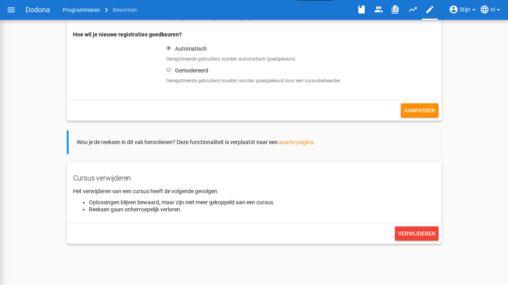
>
> De [registratielink](#cursus-registratielink) wordt ook weergegeven op de
> cursus-bewerkenpagina.
>
> 

Druk op de afwerkknop in de rechteronderhoek van de pagina
CURSUS AANMAKENs om het
[aanmaken](#cursus-aanmaken) van een
[cursus](#cursus) met de opgegeven
[eigenschappen](#cursus-eigenschappen)
effectief door te voeren.

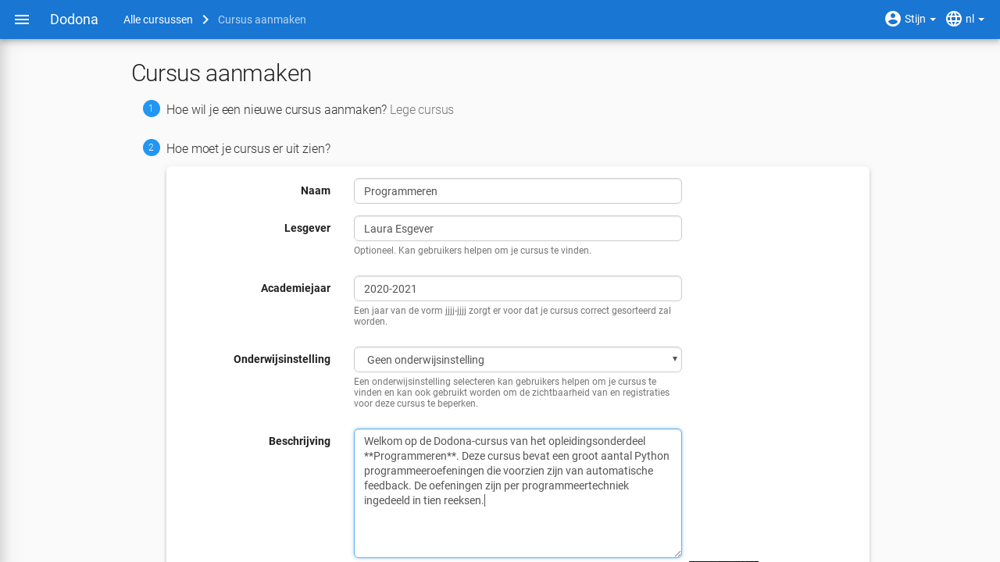

Na het aanmaken van de nieuwe cursus navigeer je naar de
[cursuspagina](#cursuspagina), waar je
kunt vaststellen dat je automatisch
[geregistreerd](/nl/for-students#cursus-registreren) bent
als [cursusgebruiker](#cursusgebruiker) en
dat je [aangeduid](#cursusbeheerders-aanduiden) bent als
[cursusbeheerder](#cursusbeheerder).

# Cursus navigeren

Je kan de [cursuspagina](#cursuspagina) van een [cursus](#cursus) bereiken op verschillende manieren. Vanaf de landingspagina kan je cursussen zoeken door te klikken op Meer cursussen. Vanop eender welke pagina kan je via het hamburgermenu in de linkerbovenhoek snelkoppelingen vinden naar jouw cursusssen onder het tabblad Cursussen en de cursus-zoekenpagina via het gelijknamige knopje on het tabblad Admin. Op de zoeken-pagina kan je filteren op naam van de cursus en op het instituut waartoe de cursus behoort. Ten slotte dien je enkel nog de gewenste cursus aan te klikken om op de cursuspagina terecht te komen.

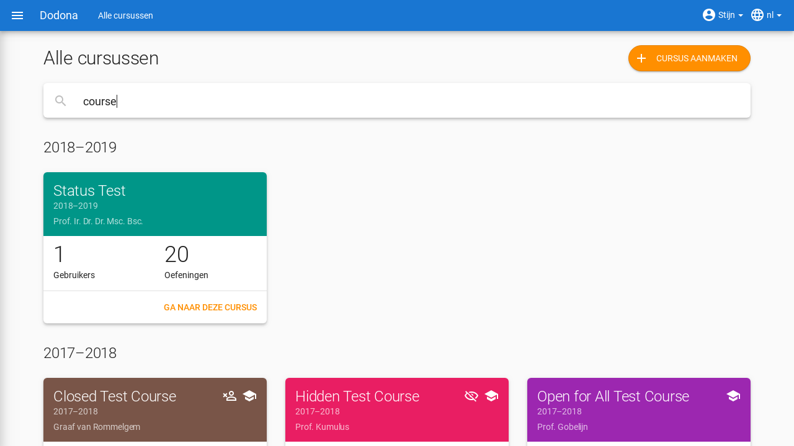

# Cursus bewerken

Als [cursusbeheerder](#cursusbeheerder)
kan je de [eigenschappen](#cursuseigenschappen) van een [cursus](#cursus)
aanpassen door op het bewerken-icoontje te drukken bovenaan de
[cursuspagina](#cursuspagina).

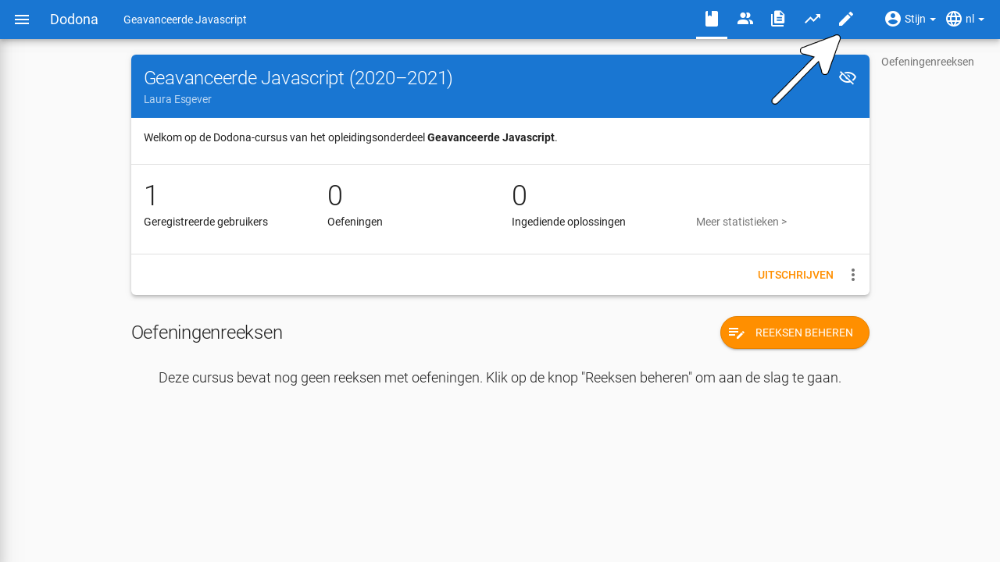

Druk op de [cursus](#cursus) in de
[navigatiebalk](/nl/for-students#navigatiebalk) om het
aanpassen te annuleren.

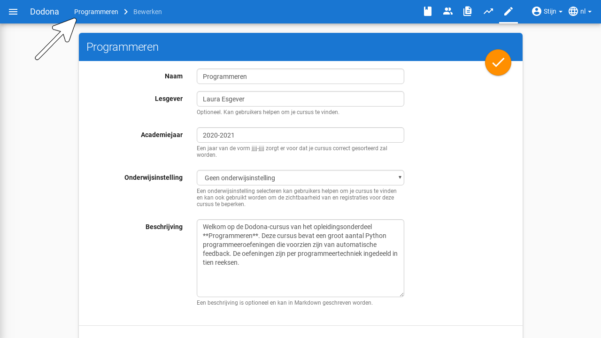

Druk na het aanpassen op de afwerkknop in de rechterbovenhoek van het
paneel om de nieuwe
[cursuseigenschappen](#cursuseigenschappen) effectief in te stellen. 
Alternatief kan je ook op de AANPASSEN drukken onderaan het paneel.

Na het afwerken navigeer je terug naar de
[cursuspagina](#cursuspagina) waar de
nieuwe [cursuseigenschappen](#cursuseigenschappen) onmiddellijk van toepassing zijn.

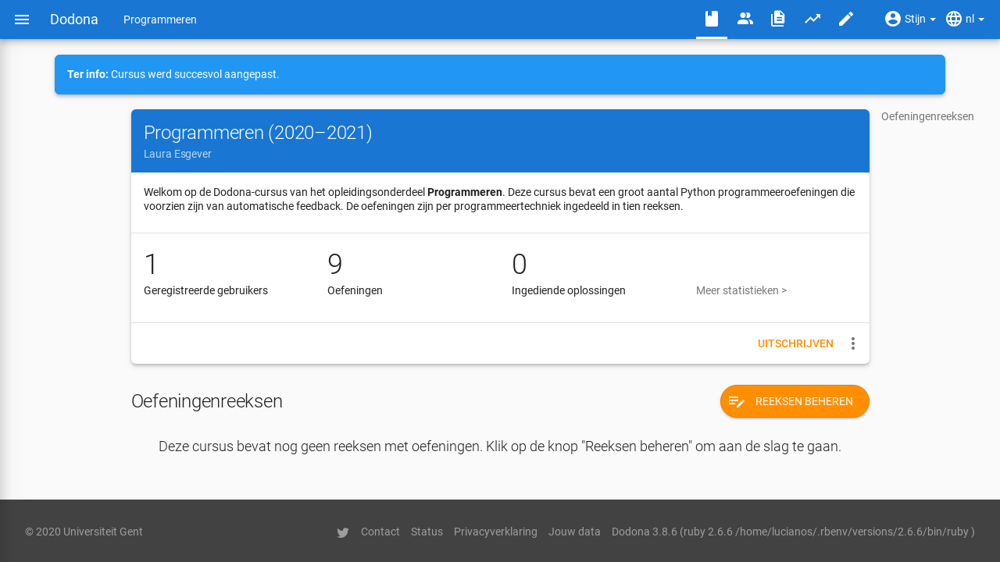

# Leerpad
Als [cursusbeheerder](#cursusbeheerder)
kan je voor de [cursus](#cursus) een
**leerpad** uitstippelen. Het leerpad wordt op de
[cursuspagina](#cursuspagina) weergegeven
onder de hoofding Oefeningenreeksen.
 Aan het leerpad kan je [oefeningenreeksen](/nl/exercise-series-management#oefeningenreeks)
[toevoegen](/nl/exercise-series-mangement#oefeningenreeks-toevoegen)
waaraan je [oefeningen](#oefening) kunt koppelen.

# Oefeningenreeks toevoegen

Druk in het [leerpad](#leerpad) op de knop
Reeksen beheren om een nieuwe oefeningenreeks aan het leerpad toe te voegen. Voor meer details, zie [oefeningenreeksen beheren](/nl/exercise-series-management).

## Cursusgebruikers beheren

Als [cursusbeheerder](#cursusbeheerder)
krijg je toegang tot alle **cursusgebruikers**. Dit zijn de gebruikers
die ooit voor de cursus
[geregistreerd](/nl/for-students#cursus-registreren)
geweest zijn of die ooit een
[registratieverzoek](/nl/for-students#registratieverzoek)
voor de cursus ingediend hebben. Je kunt hun
[gebruikersprofiel](/nl/for-students#gebruikersprofiel)
[bekijken](#cursusgebruikers navigeren), hun
[registratiestatus](#cursusgebruiker-registratiestatus)
[aanpassen](#cursusgebruiker-registratiestatus-aanpassen) en [cursusbeheerders](#cursusbeheerder) [aanduiden](#cursusbeheerders aanduiden).

### Navigeren naar cursusgebruikers

Aan de onderkant van de [cursuspagina](#cursuspagina) zie je onder de hoofding Gebruikers een overzicht waarin alle
[cursusgebruikers](#cursusgebruiker)
opgelijst worden met hun gebruikersnaam, naam, emailadres en
[voortgangsstatistieken](/nl/user-management#voortgangsstatistieken).

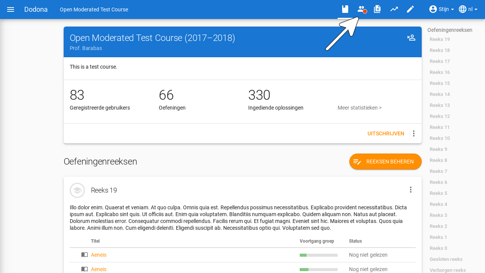

Het [zoeken](/nl/user-management#gebruiker-zoeken) en
[selecteren](/nl/user-management#gebruiker-selecteren)
van [cursusgebruikers](#cursusgebruiker)
verloopt op dezelfde manier als in het
[gebruikersoverzicht](/nl/user-management#gebruikersoverzicht).

### Registratiestatus aanpassen

In het [overzicht](#cursusgebruikersoverzicht) van alle
[cursusgebruikers](#cursusgebruiker)
worden de cursusgebruikers in tabs gegroepeerd volgens hun
**registratiestatus** voor de [cursus](#cursus).

Geregistreerd

> Alle [cursusgebruikers](#cursusgebruiker) die momenteel
> [geregistreerd](/nl/for-students#cursus-registreren) zijn.

Uitgeschreven

> Alle [cursusgebruikers](#cursusgebruiker) die ooit
> [geregistreerd](/nl/for-students#cursus-registreren)
> waren, maar die ondertussen
> [uitgeschreven](/nl/for-students#cursus-uitschrijven) zijn.

Op de wachtlijst

> Alle [cursusgebruikers](#cursusgebruiker) waarvoor er nog een
> [registratieverzoek](/nl/for-students#registratieverzoek) openstaat dat wacht op
> [afhandeling](#registratieverzoeken-afhandelen) van een
> [cursusbeheerder](#cursusbeheerder).

### Registratieverzoeken afhandelen

Elke tab heeft eigen actieknoppen aan de rechterkant van de
cursusgebruikers waarmee je hun
[registratiestatus](#cursusgebruiker-registratiestatus) kunt aanpassen.

|tab                                                 |knop                    |actie |
-----------------------------------------------------|------------------------|------| 
Geregistreerd|          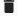 |  cursusgebruiker uitschrijven uit de cursus|
Uitgeschreven|          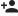|     cursusgebruiker terug registreren voor de cursus|
Registratieverzoeken|   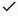|     goedkeuren van het [registratieverzoek](#registratieverzoek) dat door de gebruiker werd [ingediend](/nl/for-students#registratieverzoek-indienen), waardoor de gebruiker [geregistreerd](/nl/for-students#cursus-registreren) wordt voor de cursus|
Registratieverzoeken|   |      afkeuren van het [registratieverzoek](#registratieverzoek) dat door de gebruiker werd [ingediend](/nl/for-students#registratieverzoek-indienen), waardoor de gebruiker [uitgeschreven](/nl/for-students#cursus-uitschrijven) wordt uit de cursus|

### Cursusbeheerders aanduiden

<h1 id="cursusbeheerder"></h1>

Een **cursusbeheerder** is een
[geregistreerde](/nl/for-students#cursus-registreren)
[cursusgebruiker](#cursusgebruiker) met
beheersrechten voor de [cursus](#cursus).
Een [lesgever](/nl/user-management#lesgever) die een nieuwe
cursus aanmaakt wordt er automatisch voor geregistreerd en wordt er
meteen ook de eerste cursusbeheerder van. Lesgever hebben voor het
beheren van cursussen echter geen bijkomende rechten ten opzichte van
andere cursusbeheerders en kunnen ook
geen cursussen beheren waarvoor ze geen cursusbeheerder zijn.

In de tab Geregistreerd van het [overzicht](#cursusgebruikersoverzicht)
met alle [cursusgebruikers](#cursusgebruiker) kan je de cursusbeheerders herkennen aan het icoontje in de
linkermarge.

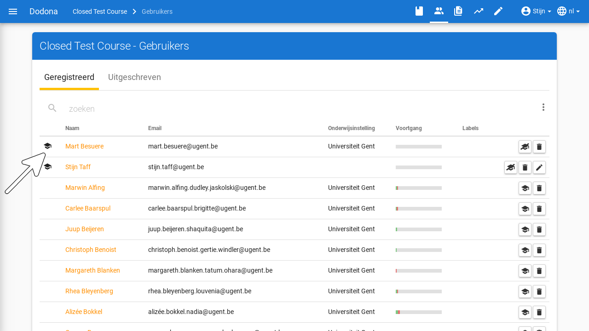

In de tab kan je de volgende actieknoppen gebruiken om cursusbeheerders
aan te duiden:

|knop                                                              |actie                                                                                |
|------------------------------------------------------------------|-------------------------------------------------------------------------------------|
    |cursusgebruiker zonder beheersrechten voor de cursus promoveren tot cursusbeheerder  |
         |cursusbeheerder degraderen tot cursusgebruiker zonder beheersrechten voor de cursus  |

::: tip Belangrijk

Een [cursusbeheerder](#cursusbeheerder)
die zich [uitschrijft](/nl/for-students#cursus-uitschrijven) uit een [cursus](#cursus)
verliest zijn status van cursusbeheerder.

Om ervoor te zorgen dat een cursus altijd minstens één cursusbeheerder
heeft, kan de laatste cursusbeheerder zich niet uitschrijven en kan hij
zichzelf ook niet degraderen tot cursusgebruiker zonder beheersrechten
voor de cursus.

Na het aanmaken van een cursus kan een lesgever zich uitschrijven als
hij andere cursusbeheerders aangeduid heeft. Hij kan door andere
cursusbeheerders ook gedegradeerd worden tot cursusgebruiker zonder
beheersrechten voor de cursus.
:::

## Navigeren naar oplossingen

Als cursusbeheerder kan je een overzicht met [oplossingen](/nl/for-students#oplossing) die in de [cursus](#cursus)
ingediend werden, verkrijgen door te drukken op Ingediende oplossingen in de navigatiebalk.
.
Het overzicht bevat alle benodige informatie per inzending, zoals de naam van de gebruiker en de naam van de oefening, inclusief filters voor deze waarden. Ook de status, het tijdstip en een link naar de inzending zijn aanwezig.
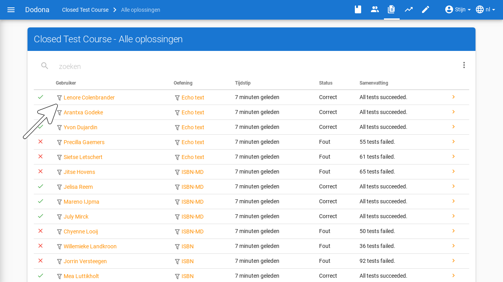

<h1 id="cursusbeheerder-oplossingen-overzicht-menu"></h1>

Het overzicht heeft voor
[cursusbeheerders](#cursusbeheerder) ook
een [menu](/nl/for-students#oefeningenreeks-menu) met
filters en acties die voor hen voorbehouden zijn:

Meest recente correcte oplossing per gebruiker
 (filter)

> Beperkt het overzicht tot de meest recente correcte oplossing per
> gebruiker.

Oplossingen herevalueren
(actie)

> [Herevalueert](/nl/exercise-series-management#oplossing-herevalueren) alle [oplossingen](/nl/for-students#oplossing) uit het overzicht.
