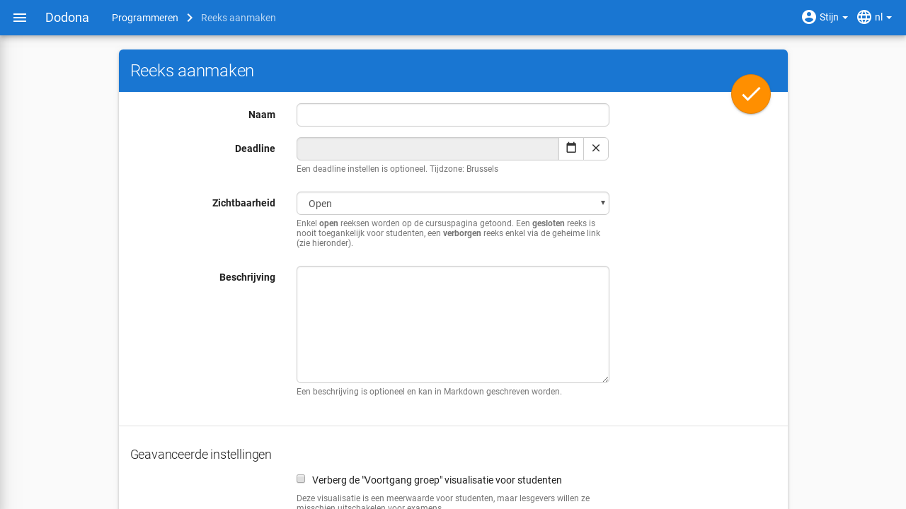
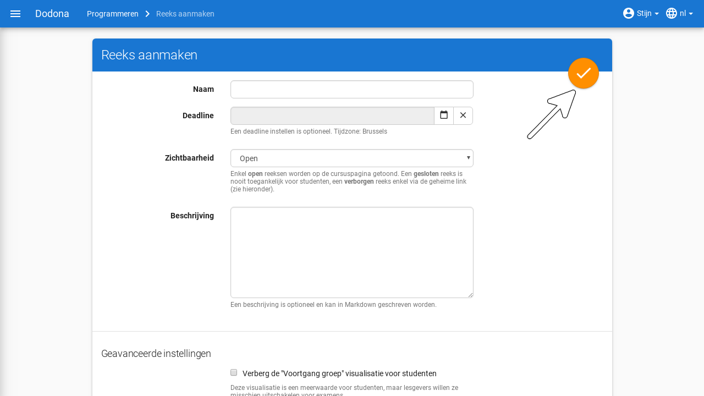
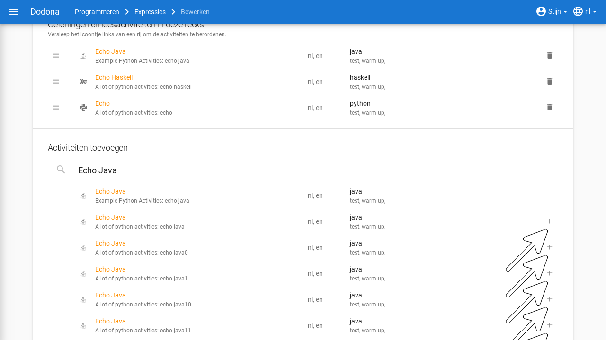
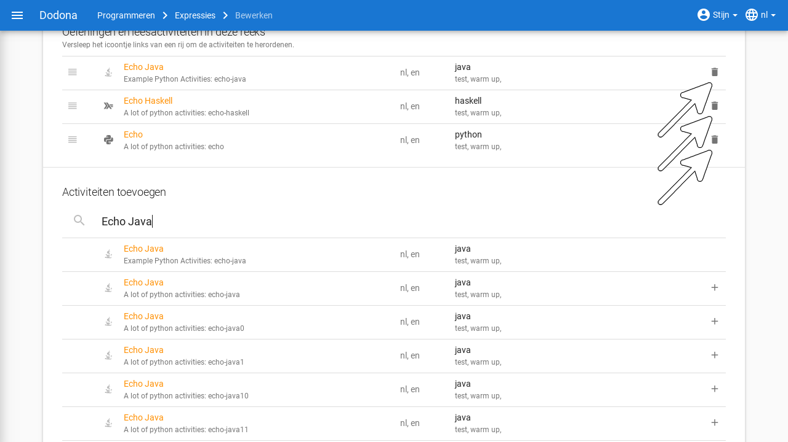
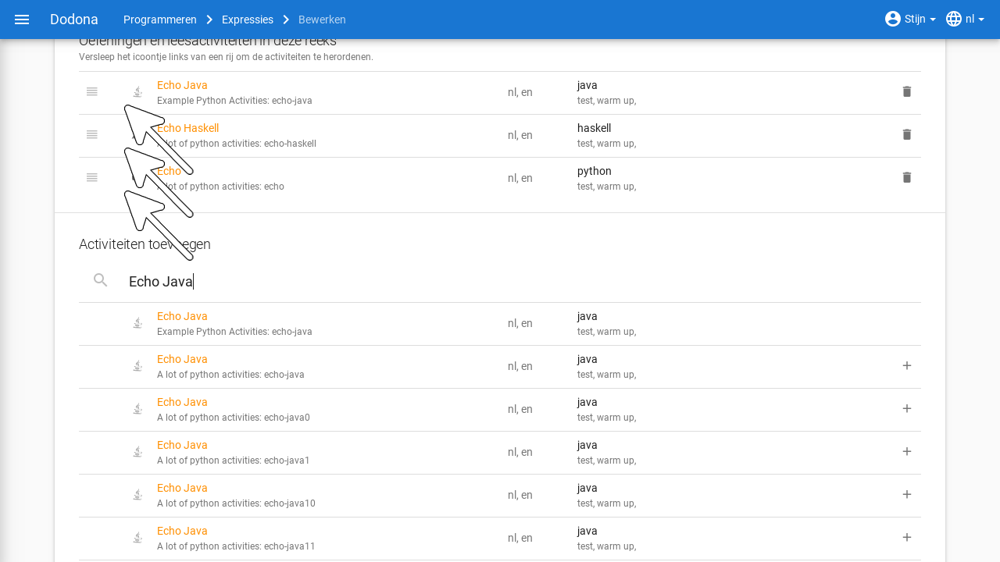
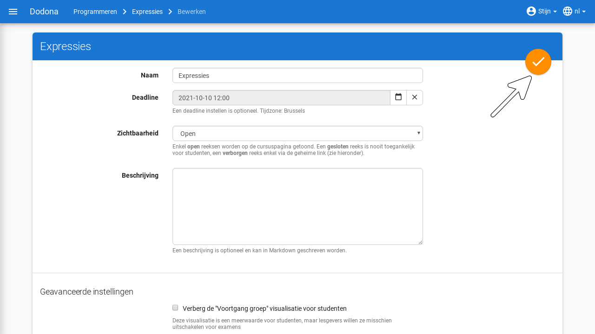
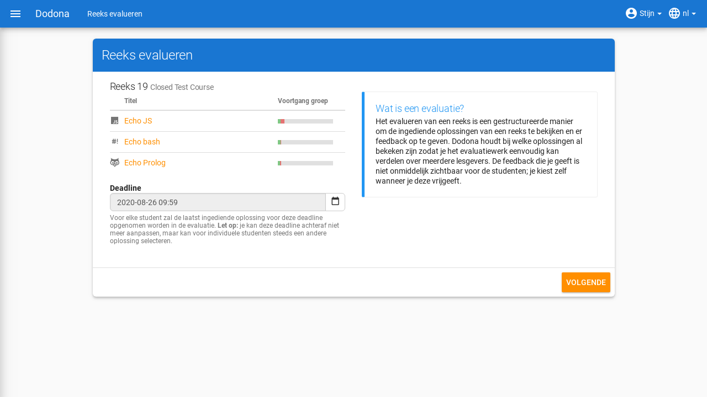
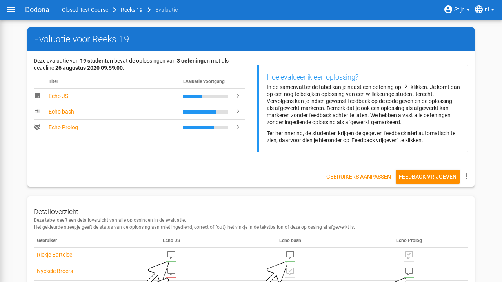
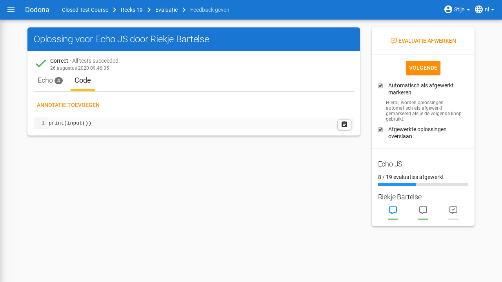
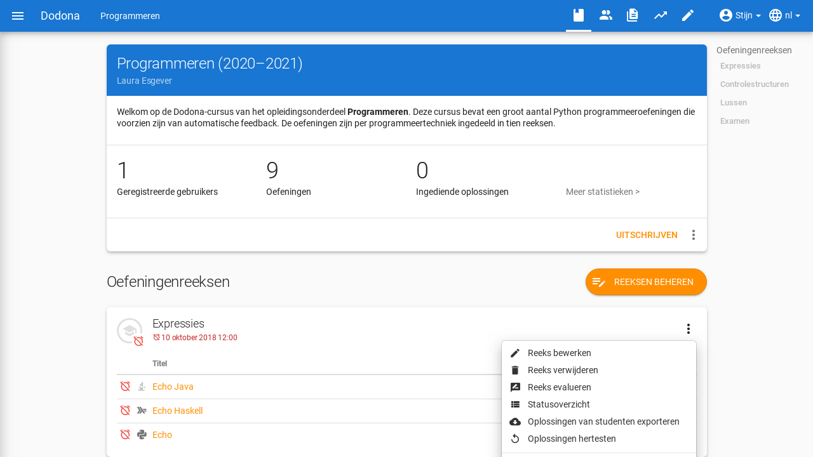

# Oefeningenreeksenbeheer

**Inhoudsopgave**
[[toc]]

Het [leerpad](/nl/course-manangement#leerpad) van een cursus bestaat uit verschillende [oefeningenreeksen](#oefeningenreeks) die elk opnieuw bestaan uit verschillenden oefeningen. Cursusbeheerders kunnen deze reeksen aanmaken, bewerken, verwijderen en herordenen. 

## Oefeningenreeks aanmaken

Een cursusbeheerder kan onbeperkt oefeningenreeksen binnen je cursus aanmaken. Je doet dit door eerst naar de cursuspagina van de cursus te navigeren en vervolgens `Reeksen beheren` aan te klikken.

Op deze pagina vind je rechtsboven de knop `Reeks aanmaken`.

Je komt op een formulier terecht waarin je de volgende eigenschappen van de reeks kan instellen:

* `Naam`: een naam om naar de reeks te verwijzen. Binnen een [leerpad](../course-management#leerpad) kunnen verschillende oefeningenreeksen dezelfde naam hebben. Het is echter aangeraden om alle oefeningenreeksen van het leerpad een unieke naam te geven.

* `Deadline`: Een optionele deadline die aangeeft tot wanneer er rekening gehouden wordt met oplossingen die ingediend worden voor oefeningen uit de oefeningenreeks. Cursusgebruikers kunnen na de deadline onbeperkt oplossingen blijven indienen voor oefeningen uit de oefeningenreeks en blijven daar nog steeds een beoordeling en feedback voor ontvangen. Er wordt met deze oplossingen echter geen rekening meer gehouden bij het bepalen van hun [indienstatus](../for-students#oefeningenreeks-oefening-indienstatus) voor oefeningen uit de oefeningenreeks. Anders gebeurt dit wel.

  ::: tip Belangrijk

  De indienstatus voor studenten wordt steeds dynamisch berekend op basis van de deadline. Als de deadline wordt aangepast, dan kan het dus zijn dat de indienstatus voor een bepaalde oefening wordt aangepast. Hou hier dus rekening mee als je de deadline instelt op een vroeger tijdstip.
  :::

  Klik op het invulveld of klik op de kalenderknop om de datum en het tijdstip van de deadline in te stellen. Selecteer de deadline in de [tijdzone](../for-students#gebruikersprofiel-tijdzone) die je hebt ingesteld in je gebruikersprofiel. Andere gebruikers krijgen de deadline te zien in de tijdzone die ze in hun gebruikersprofiel hebben ingesteld.

  

  Klik op de verwijderknop om een ingestelde deadline te wissen.

  

* `Zichtbaarheid`: dit bepaalt of gebruikers de oefeningenreeks kunnen zien. Voor deze eigenschap kunnen de volgende waarden ingesteld worden:

  * `Open`: alle gebruikers zien de oefeningenreeks op de cursuspagina.

  * `Verborgen`: alleen cursusbeheerders zien de oefeningenreeks op de cursuspagina. Er staat een duidelijke mededeling bij om hen er op te wijzen dat andere gebruikers de oefeningenreeks niet kunnen zien. Je kan gebruikers toegang geven tot deze reeks door hun de specifieke [geheime link](#oefeningenreeks-geheime-link) van deze reeks door te sturen.

  * `Gesloten`: alleen cursusbeheerders zien de oefeningenreeks op de cursuspagina. Er staat een duidelijke mededeling bij om hen er op te wijzen dat andere gebruikers de oefeningenreeks daar niet kunnen zien.

  

* `Geheime link`: bij het aanmaken van een verborgen oefeningenreeks wordt automatisch een geheime link gegenereerd om toegang te geven tot deze reeks. Zonder deze link kunnen gebruikers een verborgen oefeningenreeks niet zien op de cursuspagina.

  De geheime link voor een oefeningenreeks kan je onderaan de bewerk-pagina voor die reeks vinden.
  

  Je kan eenvoudig een nieuwe geheime link genereren door op de vernieuwknop te klikken. Dit kan je bijvoorbeeld doen als je per ongeluk de link kenbaar hebt gemaakt aan iemand die ze niet zou mogen zijn. Hou er wel rekening mee dat de oude link niet meer zal werken van zodra je een nieuwe genereert.
  

* `Beschrijving`: een optionele beschrijving die gebruikers te zien krijgen bij de weergave van de oefeningenreeks in het leerpad. Voor het opmaken van de beschrijving kan je gebruikmaken van [Markdown](../course-management#Markdown).

* `Geavanceerde instellingen`

  * `Verberg de "Voortgang groep" visualisatie voor studenten`

  Bij een oefening wordt de voortgang van alle gebruikers in de cursus getoond, analoog aan de [gebruikersvoortgangsstatistieken](../user-management/#gebruiker-voortgangsstatistieken). Hierin kan je zien hoeveel studenten een oefening reeds hebben begonnen of afgewerkt. Deze visualisatie is een meerwaarde voor studenten, maar je wil ze misschien uitschakelen voor examens.

  * `Verberg leeractiviteiten`

  Als de leeractiviteiten verborgen zijn, dan zal enkel de beschrijving van deze reeks getoond worden. Je kan deze instelling gebruiken om bijvoorbeeld de leerstof van de reeks vooraf beschikbaar te stellen, zonder de oefeningen en leesactiviteiten al vrij te geven.

Om de reeks aan te maken klik je op de afwerkknop in de rechterbovenhoek van het paneel `Nieuwe oefeningenreeks`. De nieuwe oefeningenreeks wordt zo aan je cursus toegevoegd.

Na het aanmaken van de reeks kom je op de bewerkingspagina terecht. Je kunt nu oefeningen aan de reeks toevoegen.

## Oefeningenreeks bewerken

Op de bewerkingspagina van een oefeningenreeks zie je een uitgebreide versie van het reeks-aanmakenpaneel waarin je naast het
instellen van eigenschappen ook oefeningen kunt koppelen aan de oefeningenreeks. Je kan deze pagina bereiken op 3 manieren: automatisch na het aanmaken van een nieuwe reeks, door op het bewerken-icoontje te klikken van de reeks in het Reeksen beheren-paneel of door `Reeks bewerken` te kiezen in het reeks-actiesmenu.

Onderaan de pagina vind je de activiteiten die reeds tot deze reeks behoren en mogelijke activiteiten om eraan toe te voegen. Klik op de toevoegknop aan de rechterkant van een oefening om de oefening aan de oefeningenreeks toe te voegen.

Via de zoekbalk kan je bestaande oefeningen filteren op naam, beschikbare vertalingen, programmeertaal, labels, repository of type.

Onder de hoofding `Oefeningen in deze reeks` kan je aan de rechterkant van een oefening op de verwijderknop klikken om de oefening uit de oefeningenreeks te verwijderen.

Versleep de verplaatsknop aan de linkerkant van de oefeningen om de volgorde van de oefeningen aan te passen. De volgorde waarin de oefeningen onder de hoofding `Oefeningen in deze reeks` gerangschikt worden, is immers ook de volgorde waarin de oefeningen weergegeven worden in de oefeningenreeks.

::: tip Belangrijk

We veronderstellen hier dat de oefeningen die aan de oefeningenreeks moeten gekoppeld worden reeds beschikbaar zijn in Dodona. Het opstellen, publiceren en delen van oefeningen wordt [hier](/nl/new-exercise-repo) besproken.

:::

Klik op de afwerkknop in de rechterbovenhoek van het paneel om de bewerkingen te bewaren. Dit is enkel van toepassing op de reeks-eigenschappen. Bewerkingen op de oefeningen binnenin die reeks worden meteen automatisch opgeslagen.

## Oefeningenreeks beheren

Uiteraard is het mogelijk om een reeks te verwijderen uit een cursus. De actie vind je analoog aan het bewerken in het reeksen-beheren menu of in het reeks-actiesmenu.

Het kan handig zijn om reeksen in een cursus een bepaalde volgorde te geven, om ze bijvoorbeeld te sorteren volgens moeilijkheidsgraad. Standaard zullen ze gesorteerd worden in omgekeerd chronologische volgorde op basis van wanneer je ze toevoegt. Zo moeten studenten minder scrollen als ze een reeks willen maken. In het [reeksen-beherenpaneel](#oefeningenreeks-aanmaken) kan je in de tabel van de reeds toegevoegde reeksen ze verslepen via het icoontje aan de linkerkant.

## Het reeks-menu

Dit menu bevat een aantal handige acties die cursusbeheerders kunnen uitvoeren op een reeks. Je kan dit menu openen door te klikken op de drie bolletjes in de rechterbovenhoek van een reeks. Naast bewerken en verwijderen zijn er nog enkele mogelijkheden:

* `Reeks evalueren`: deze actie stelt je in staat om op een gestructureerde manier door de ingediende oplossingen van deze reeks te bladeren, bijvoorbeeld om ze te [evalueren](#oefeningenreeks-evalueren) of verbeteren.

* `Statusoverzicht`: toont een overzicht met de indienstatus van alle cursusgebruikers voor alle oefeningen uit de oefeningenreeks. De indienstatus wordt in het overzicht weergegeven met de gebruikelijke [icoontjes](../for-students#oefeningenreeks-oefening-indienstatus-icoontje).

 

  Klik op de naam van een cursusgebruiker om naar de [cursusoverzichtspagina](../user-management#cursusoverzichtspagina) van de gebruiker te navigeren.

  Klik op het icoontje van een indienstatus om naar de oplossing te navigeren die gebruikt werd om de indienstatus te bepalen (als de cursusgebruiker effectief een oplossing  heeft ingediend op basis waarvan de indienstatus kon bepaald worden). Je kan in dit overzicht ook filteren op studenten die aan minstens één activiteit begonnen zijn en zoeken op naam.

* `Oplossingen van studenten exporteren`: deze actie stelt je in staat om de ingezonden oplossingen van studenten voor de oefeningen in de reeks te [exporteren](#oefeningenreeks-oplossingen-exporteren) als zip-bestand.

* `Oplossingen hertesten`: deze actie hertest alle oplossingen die cursusgebruikers ingediend hebben voor oefeningen van de oefeningenreeks. Dit kan nuttig zijn als je bijvoorbeeld een aantal testen hebt toegevoegd of aangepast en je de al ingediende oplossingen opnieuw wil testen. In de volgende sectie wordt uitgelegd hoe je een enkele oplossing kan herevalueren.

## Oplossing hertesten

Bij het herevalueren van een oplossing wordt het [beoordelingsproces](../for-students#oplossing-beoordelingsproces) opnieuw uitgevoerd zonder dat de oplossing opnieuw moet ingediend worden. Op die manier blijft het originele tijdstip van indienen behouden. Als de configuratie van de oefening aangepast werd sinds de vorige beoordeling van de oplossing, dan kan de status van de oplossing wijzigen door het herevalueren. Klik op de herhaalknop in de rechterbovenhoek van de  [feedbackpagina](../for-students#feedbackpagina) van een oplossing van een gebruiker om die oplossing te herevalueren.

::: tip Belangrijk

Bij het herevalueren krijgen oplossingen een lagere prioriteit in de [wachtrij](../for-students#oplossing-wachtrij) dan oplossingen die nieuw ingediend worden. Op die manier ondervindt het beoordelen van oplossingen die gebruikers indienen minimale vertaging, maar kan het herevalueren wel langer duren.

Gebruikers krijgen geen melding van het platform als hun oplossingen geherevalueerd worden. Als je beslist om oplossingen te herevalueren, is het belangrijk om gebruikers te informeren dat er zowel wijzigingen kunnen zijn van de status van oplossingen die ze vroeger ingediend hebben als van hun indienstatus voor oefeningen in de oefeningenreeksen van de cursus.

:::

## Oefeningenreeks evalueren

Correcte testresultaten zijn geen garantie voor goede code. Daarom biedt Dodona ook ondersteuning om de oplossingen te evalueren en hen van feedback te voorzien. Om een evaluatie te starten, open je als lesgever het [oefeningenreeks-actiesmenu](#het-reeks-menu) door te klikken op de drie bolletjes in de rechterbovenhoek van de reeks.

Vervolgens selecteer je `Reeks evalueren`.

Je wordt naar de volgende pagina gebracht waar je gebruikers kan selecteren om te evalueren.  Er zijn ook handige knoppen om snel een bepaalde categorie gebruikers te selecteren. Uiteraard kan je ook via de zoekbalk filteren op gebruikers via hun naam, labels, ... .

Na de nodige gebruikers gekozen te hebben, kan je de evaluate starten. 

Je wordt nu automatisch door de evaluatie geleid, waarbij Dodona bijhoudt welke gebruikers je reeds geëvalueerd hebt. Je kan de ingediende code van annotaties voorzien: opmerkingen over de code, wat goed is en wat beter kan. Deze feedback wordt niet automatisch vrijgegeven, dit kan je op het einde van de evaluatie voor alle gebruikers tegelijkertijd doen via de knop `Feedback vrijgeven`. De studenten krijgen hier een melding van. Je kan deze feedback ook weer verbergen via dezelfde knop.

In het detailoverzicht zie je de status van de gekozen gebruikers voor de oefeningen in de reeks. Het icoontje bestaat uit twee delen. De tekstballon geeft aan dat je deze oplossing reeds geëvalueerd hebt als het een vinkje bevat. Het balkje eronder gebruikt een kleurencode voor de status van de oefening: rood voor fout, groen voor correct en grijs voor niet ingediend.

Je kan klikken op deze icoontjes om de bijhorende indiening te evalueren.

Je komt op een evalueerpagina terecht van de gebruiker waar je dus de code zelf van feedback kan voorzien. Dit kan op een lijn-per-lijnbasis. De gebruiker zal na het vrijgeven een melding krijgen, waarna hij de feedback kan bekijken.

In de rechterbovenhoek vind je navigatie-opties om efficiënt de indieningen te overlopen. De knop `Volgende` brengt je naar een volgende niet-afgewerkte indiening. Daar staan ook opties om het evalueerproces te versnellen en vereenvoudigen. Zo kan je reeds afgewerkte oplossingen overslaan en de huidige oefening automatisch als afgewerkt markeren als je op `Volgende` klikt. 

Eronder vind je je voortgang voor de huidige oefening en kan je ook navigeren naar de oplossingen van de huidige gebruiker voor andere oefeningen die in de reeks zitten.

Via de navigatiebalk bovenaan kan je makkelijk terugkeren naar de evaluatiepagina.

Je kan een reeks slechts één keer evalueren. Dit hoef je echter niet in één stuk te doen, je kan later terugkeren naar de evaluatie via het reeks-actiesmenu, waar nu `Evaluatie bekijken` staat.

Je kan een bestaande evaluatie ook verwijderen. De gegeven feedback zal ook verdwijnen.

## Oefeningenreeks oplossingen exporteren

In het actiesmenu van een reeks kan je als lesgever ook kiezen om de ingezonden code van je studenten te exporteren als een zip-bestand. Dit is bijvoorbeeld handig als je liever op papier verbetert en de code wil afdrukken.

Dit brengt je naar een exporteerpagina waar je eerst gevraagd wordt om de oefeningen in de reeks te selecteren waarvan je de inzendingen wenst. 

Als je ze allemaal wenst te downloaden, dan kies je het bovenste selectievakje. Daarna klik je op `Volgende stap` om verder te gaan.

Vervolgens kan je verschillende opties aanvinken die de inhoud van de export beïnvloeden. Je kan een samenvattende csv verkrijgen, kiezen of je alle oplossingen of enkel de laatste wil, of er rekening gehouden moet worden met de deadline, of de bestanden per student of per reeks gegroepeerd moeten worden en welke studenten meegerekend moeten worden. 

Klik op `Start export` om de download te starten. Je komt op de exportpagina die je zal verwittigen als je export klaar is, want dit kan even duren.

