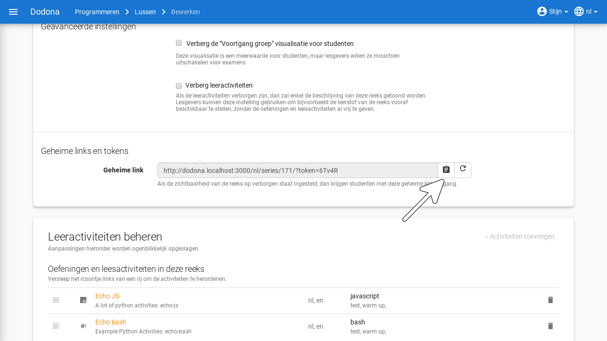
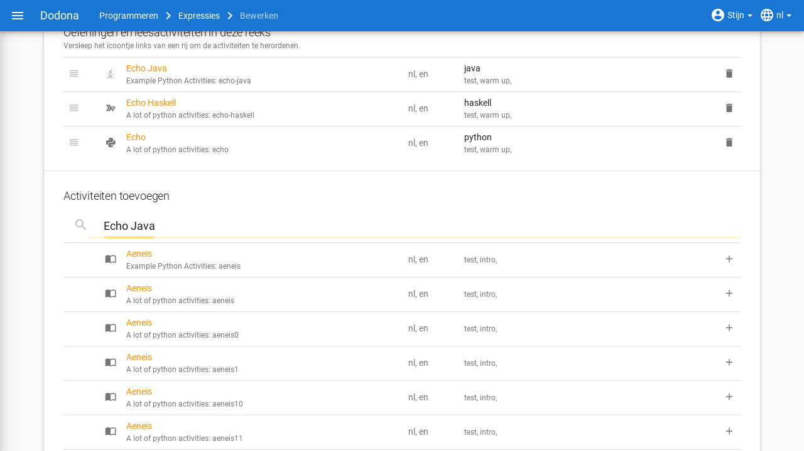
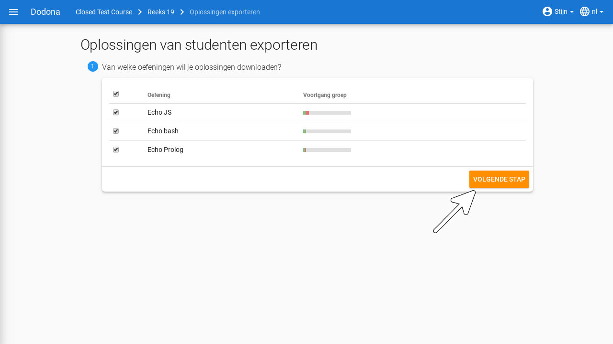

# Oefeningenreeksenbeheer

Het [leerpad](/nl/course-manangement#leerpad) van een [cursus](/nl/course-management#cursus) bestaat uit verschillende [oefeningenreeksen](#oefeningenreeks) die elk opnieuw bestaan uit verschillenden [oefeningen](/nl/for-students#oefening). [Cursusbeheerders](/nl/course-management#cursusbeheerder) kunnen deze reeksen [aanmaken](#reeks-aanmaken), [bewerken](#reeks-bewerken), [verwijderen](#reeks-verwijderen) en [herordenen](#reeks-herordenen). 

::: tip 
Al deze acties kunnen ook uitgevoerd worden op de oefeningen in een reeks. Deze kan je terugvinden in het [reeks-bewerken](#reeks-bewerken) menu.
:::

## Oefeningenreeks aanmaken

Een cursusbeheerder kan onbeperkt oefeningenreeksen aanmaken. Als cursusbeheerder kan je doen door naar de cursuspagina van de [cursus](/nl/course-management#cursus) te [navigeren](/nl/course-management#cursus-navigeren). Op deze pagina dien je `Reeksen beheren` aan te klikken.

Op deze pagina vind je rechtsboven de knop `Reeks aanmaken`.

Druk op de naam van de [cursus](/nl/course-management#cursus) in de
[navigatiebalk](/nl/for-students#navigatiebalk) om het
[aanmaken](#oefeningenreeks-aanmaken)
van de oefeningenreeks te annuleren.

Je komt op een formulier terecht waarin je de volgende eigenschappen van de reeks kan instellen:

<h1 id="oefeningenreeks-eigenschappen"></h1>

`Naam`

> Een naam om naar de reeks te verwijzen.
> Binnen een [leerpad](/nl/course-management#leerpad) kunnen verschillende oefeningenreeksen dezelfde naam
> hebben. Het is echter aangeraden om alle oefeningenreeksen van het
> leerpad een unieke naam te geven.

`Deadline`

> Een optionele deadline die aangeeft tot wanneer er rekening gehouden
> wordt met [oplossingen](/nl/for-students#oplossing) die
> [ingediend](/nl/for-students#oplossing-indienen) worden
> voor [oefeningen](/nl/for-students#oefening) uit de
> oefeningenreeks.
> Cursusgebruikers kunnen na de deadline onbeperkt oplossingen blijven indienen voor oefeningen uit de oefeningenreeks en blijven daar nog steeds een beoordeling en feedback voor ontvangen. Er wordt met deze oplossingen echter geen rekening meer gehouden bij het bepalen van hun [indienstatus](/nl/for-students#oefeningenreeks-oefening-indienstatus) voor oefeningen uit de oefeningenreeks.
>
> Zonder deadline wordt er bij het bepalen van de [indienstatus](/nl/for-students#oefeningenreeks-oefening-indienstatus) van cursusgebruikers blijvend rekening gehouden met
> [oplossingen](/nl/for-students#oplossing) die ze
> [indienen](/nl/for-students#oplossing-indienen) voor
> [oefeningen](/nl/for-students#oefening) uit de
> [oefeningenreeks](#oefeningenreeks)
>
> ::: tip Belangrijk
>
> Als de [deadline](/nl/for-students#oefeningenreeks-deadline) aangepast wordt dan krijgen
> [cursusgebruikers](/nl/course-management#cursusgebruiker)
> meteen ook een
> [indienstatus](/nl/for-students#oefeningenreeks-oefening-indienstatus) voor [oefeningen](#oefening) uit de [oefeningenreeks](#oefeningenreeks) die aangepast is aan de nieuwe deadline.
> :::
>
> Klik op het invulveld of druk op de kalenderknop om de datum en het
> tijdstip van de deadline in te stellen. Selecteer de deadline in de
> [tijdzone](/nl/for-students#gebruikersprofiel-tijdzone)
> die je hebt
> [ingesteld](/nl/for-students#persoonlijke-voorkeuren-instellen) in je
> [gebruikersprofiel](/nl/for-students#gebruikersprofiel).
> Andere gebruikers krijgen de deadline te zien in de tijdzone die ze in hun gebruikersprofiel hebben ingesteld.
>
> 
>
> Druk op de verwijderknop om een ingestelde deadline te wissen.
>
> 

`Zichtbaarheid`

> De zichtbaarheid bepaalt of gebruikers de
> [oefeningenreeks](#oefeningenreeks)
> kunnen zien. Voor deze eigenschap kunnen de volgende waarden ingesteld worden:
>
>`Open`
>
> > Alle gebruikers zien de oefeningenreeks in het
> > [leerpad](/nl/course-management#leerpad).
>
>`Verborgen`
>
> > Alleen [cursusbeheerders](/nl/course-management#cursusbeheerder) zien de
> > [oefeningenreeks](#oefeningenreeks) in
> > het [leerpad](/nl/course-management#leerpad). Er staat een
> > duidelijke mededeling bij om hen er op te wijzen dat andere
> > gebruikers de oefeningenreeks enkel kunnen zien als ze de
> > [geheime link](#oefeningenreeks-geheime-link) gebruiken. Er is ook een link aanwezig om deze instelling snel te veranderen.
> >
> 
>
>`Gesloten`
>
> > Alleen [cursusbeheerders](#cursusbeheerder) zien de
> > [oefeningenreeks](#oefeningenreeks) in
> > het [leerpad](#leerpad). Er staat een
> > duidelijke mededeling bij om hen er op te wijzen dat andere
> > gebruikers de oefeningenreeks daar niet kunnen zien. Er is ook een link aanwezig om deze instelling snel te veranderen.
> >
> 

`Geheime link`

> Bij het [aanmaken](#oefeningenreeks-aanmaken) van een
> [oefeningenreeks](#oefeningenreeks)
> wordt automatisch een **token** gegenereerd als afschermingsmechanisme van [verborgen](#oefeningenreeks-verborgen) oefeningenreeksen. Zonder dit token kunnen gebruikers een
> verborgen oefeningenreeks niet zien in het leerpad. Als ze rechtstreeks naar de oefeningenreeks proberen te navigeren, dan zien ze enkel een melding dat ze geen toegangsrechten hebben voor de oefeningenreeks.
>
> 
>
> Gebruikers kunnen een
> [verborgen](#oefeningenreeks-verborgen)
> [oefeningenreeks](#oefeningenreeks)
> enkel zien als ze gebruikmaken van de **geheime link** voor de cursus.
> De geheime link bevat het [token](#oefeningenreeks-geheime-link) waarmee ze de oefeningenreeks ook te zien krijgen als die verborgen werd.
>
> 
>
> Als [cursusbeheerder](#cursusbeheerder) krijg je de verantwoordelijkheid om de [geheime link](#oefeningenreeks-geheime-link) enkel te delen met andere gebruikers die de [oefeningenreeks](#oefeningenreeks) mogen zien. Druk op de kopieerknop naast de geheime link om de geheime link naar het klembord te kopiëren.
>
> 
>
> <h1 id="oefeningenreeks-geheime-link-vernieuwen"></h1>

> Druk op de vernieuwknop naast de
> [geheime link](#oefeningenreeks geheime link) om de
> [oefeningenreeks](#oefeningenreeks)
> opnieuw te [verbergen](#oefeningenreeks-verborgen) nadat de geheime link gedeeld werd. Daardoor wordt een
> nieuw [token](#oefeningenreeks-geheime-link)
> gegenereerd en wordt het oude token onbruikbaar gemaakt. De geheime
> link wordt meteen ook aangepast aan het nieuwe token.
>
> 

`Beschrijving`

> Een optionele beschrijving die gebruikers te zien krijgen bij de
> weergave van de oefeningenreeks in het
> [leerpad](/nl/course-management#leerpad). Voor het opmaken
> van de beschrijving kan je gebruikmaken van
> [Markdown](/nl/course-management#beschrijving-markdown).

Druk op de afwerkknop in de rechterbovenhoek van het paneel
`Nieuwe oefeningenreeks` om de nieuwe
[oefeningenreeks](#oefeningenreeks)
effectief aan het [leerpad](/nl/course-management#leerpad)
[toe te voegen](#oefeningenreeks-toevoegen).

Na het afwerken navigeer je naar de
[bewerkingspagina](#oefeningenreeks-bewerken) van
de [oefeningenreeks](#oefeningenreeks). Daarbij zie je
bovenaan een melding dat de nieuwe oefeningenreeks
toegevoegd werd. In het [leerpad](/nl/course-management#leerpad) wordt deze reeks bovenaan toegevoegd. Op die manier worden de oefeningenreeksen van het leerpad in omgekeerde chronologische volgorde (eerste oefeningenreeks onderaan) weergegeven op de [cursuspagina](/nl/course-management#cursuspagina).

# Oefeningenreeks bewerken

Op de bewerkenpagina van een [oefeningenreeks](#oefeningenreeks) zie je een uitgebreide versie van het [reeks-aanmakenpaneel](#oefeningenreeks-aanmaken) waarin je naast het
instellen van [eigenschappen](#oefeningenreeks-eigenschappen) ook oefeningen kunt koppelen aan de oefeningenreeks. Onder
de hoofding `Oefeningen toevoegen`
staat een overzicht van alle beschikbare oefeningen en onder de hoofding `Oefeningen in deze reeks` staat een overzicht van alle oefeningen die aan de oefeningenreeks gekoppeld werden.
Je kan deze pagina bereiken op 3 manieren: automatisch na het aanmaken van een nieuwe reeks, door op het bewerken-icoontje te drukken van de reeks in het Reeksen beheren-paneel of door `Reeks bewerken` te kiezen in het reeks-actiesmenu.

Druk op de [oefeningenreeks](#oefeningenreeks) in de [navigatiebalk](/nl/for-students#navigatiebalk) om het aanpassen te annuleren.

<h1 id="oefeningenreeks-oefeningen-toevoegen"></h1>

Onderaan de pagina vind je de activiteiten die reeds tot deze reeks behoren en mogelijke activiteiten om eraan toe te voegen. Druk op de toevoegknop aan de rechterkant van een
[oefening](#oefening) om de oefening aan
de [oefeningenreeks](#oefeningenreeks) toe
te voegen.

<h1 id="oefeningenreeks-oefeningen-verwijderen"></h1>

Onder de hoofding Oefeningen in deze reeks kan je aan de rechterkant van een
[oefening](/nl/for-students#oefening) op de verwijderknop
drukken om de oefening uit de
[oefeningenreeks](#oefeningenreeks) te
verwijderen.

<h1 id="oefeningenreeks-oefeningen-herschikken"></h1>

Versleep de verplaatsknop aan de linkerkant van de
[oefeningen](#oefening) om de volgorde van
de oefeningen aan te passen. De volgorde waarin de oefeningen onder de
hoofding `Oefeningen in deze reeks`
gerangschikt worden, is immers ook de volgorde waarin de oefeningen
[weergegeven](#oefeningenreeks-weergeven)
worden in de oefeningenreeks.

<h1 id="oefeningenreeks-oefeningen-zoeken"></h1>

Via de zoekbalk kan je bestaande oefeningen filteren op naam, beschikbare vertalingen, programmeertaal, labels, repository of type.

::: tip Belangrijk

We veronderstellen hier dat de [oefeningen](/nl/for-students#oefening) die aan de
[oefeningenreeks](#oefeningenreeks) moeten
gekoppeld worden reeds beschikbaar zijn in Dodona. Het opstellen,
publiceren en delen van [oefeningen](#oefening) wordt besproken in [oefeningen beheren](/nl/exercise-series-management).

:::

<h1 id="oefeningenreeks-oefeningen-afwerken"></h1>

Druk op de afwerkknop in de rechterbovenhoek van het paneel om de bewerkingen te bewaren. Dit is enkel van toepassing op de [reeks-eigenschappen](#oefeningenreeks-eigenschappen). Bewerkingen op de oefeningen binnenin die reeks worden meteen automatisch opgeslagen.

Na het afwerken navigeer je terug naar de
[oefeningenreeks](#oefeningenreeks) in het
[leerpad](#leerpad), waar je kunt
vaststellen dat de nieuwe eigenschappen van de reeks meteen van
toepassing zijn.

# Oefeningenreeks verwijderen

Uiteraard is het mogelijk om een reeks te verwijderen uit een cursus. De actie vind je analoog aan het [bewerken](#oefeningenreeks-bewerken) in het reeksen-beheren menu of in het reeks-actiesmenu.

# Oefeningenreeks herordenen

Het kan handig zijn om reeksen in een cursus een bepaalde volgorde te geven, om ze bijvoorbeeld te sorteren volgens moeilijkheidsgraad. Standaard zullen ze gesorteerd worden in omgekeerd chronologische volgorde op basis van wanneer je ze toevoegt. Zo moeten studenten minder scrollen als ze een reeks willen maken. In het [reeksen-beheren](#oefeningenreeksen-beheren)-paneel kan je in de tabel van de reeds toegevoegde reeksen ze verslepen via het icoontje aan de linkerkant.

# Oefeningenreeks beheren
<h1 id="reeks-actiesmenu"></h1>

Dit menu bevat een aantal handige acties die [cursusbeheerders](/nl/course-management#cursusbeheerder) kunnen uitvoeren op een reeks. Naast [bewerken](#oefeningenreeks-bewerken) en [verwijderen](#oefeningenreeks-verwijderen) zijn er nog enkele mogelijkheden:

`Reeks evalueren`

> Deze actie stelt je in staat om op een gestructureerde manier de oplossingen van studenten voor de reeks te [evalueren](#oefeningenreeks-evalueren).

`Statusoverzicht`

> Toont een overzicht met de
> [indienstatus](#oefeningenreeks-oefening-indienstatus) van alle
> [cursusgebruikers](#cursusgebruiker)
> voor alle [oefeningen](/nl/for-students#oefening) uit de
> [oefeningenreeks](#oefeningenreeks). De
> indienstatus wordt in het overzicht weergegeven met de gebruikelijke
> [icoontjes](/nl/for-students#oefeningenreeks-oefening-indienstatus-icoontje).
>
> 
>
> Druk op de naam van een
> [cursusgebruiker](#cursusgebruiker) om
> naar de [cursusoverzichtspagina](/nl/user-management#cursusoverzichtspagina) van de gebruiker te navigeren.
>
> 
>
> Druk op het
> [icoontje](/nl/for-students#oefeningenreeks-oefening-indienstatus-icoontje) van een
> [indienstatus](#/nl/for-studentsoefeningenreeks-oefening-indienstatus) om naar de [oplossing](/nl/for-students#oplossing) te navigeren die gebruikt werd om de
> [indienstatus](#/nl/for-studentsoefeningenreeks#oefening-indienstatus) te bepalen (als de cursusgebruiker effectief een oplossing  heeft [ingediend](/nl/for-students#oplossing-indienen) op basis waarvan de indienstatus kon bepaald worden). Je kan in dit overzicht ook filteren op studenten die aan minstens één activiteit begonnen zijn en zoeken op naam.
>
> 

`Oplossingen van studenten exporteren`

> Deze acties stelt je in staat om de ingezonden oplossingen van studenten voor de oefeningen in de reeks te [exporteren](#oefeningenreeks-oplossingen-exporteren).

`Oplossingen hertesten`

> [Herevalueert](#oplossing-herevalueren)
> alle [oplossingen](/nl/for-students#oplossing) die
> [cursusgebruikers](#cursusgebruiker)
> [ingediend](/nl/for-students#oplossing-indienen) hebben
> voor [oefeningen](/nl/for-students#oefening) van de
> [oefeningenreeks](#oefeningenreeks). Dit kan nuttig zijn als een fout opgemerkt wordt in de automatische tests en de oplossingen opnieuw gecontroleerd moeten worden.

# Oplossing herevalueren
Bij het herevalueren van een oplossing wordt het
[beoordelingsproces](/nl/for-students#oplossing-beoordelingsproces) opnieuw uitgevoerd zonder dat de oplossing opnieuw moet
[ingediend](/nl/for-students#oplossing-indienen) worden.
Op die manier blijft het originele
[tijdstip](/nl/for-students#oplossing-tijdstip) van
indienen behouden. Als de configuratie van de
[oefening](/nl/for-students#oefening) aangepast werd sinds
de vorige beoordeling van de oplossing, dan kan de
[status](/nl/for-students#oplossing-status) van de
oplossing wijzigen door het herevalueren.

::: tip Belangrijk

Bij het [herevalueren](#oplossing-herevalueren) krijgen [oplossingen](/nl/for-students#oplossing) een lagere prioriteit in de
[wachtrij](/nl/for-students#oplossing-wachtrij) dan
oplossingen die nieuw [ingediend](/nl/for-students#oplossing-indienen) worden. Op die manier ondervindt het beoordelen van oplossingen die gebruikers indienen minimale vertaging, maar kan het herevalueren wel langer duren.
:::

::: tip Belangrijk

Gebruikers krijgen geen melding van het platform als hun
[oplossingen](/nl/for-students#oplossing)
[geherevalueerd](#oplossing-herevalueren)
worden. Als je beslist om oplossingen te herevalueren, is het belangrijk om gebruikers te informeren dat er zowel wijzigingen kunnen zijn van de [status](/nl/for-students#oplossing-status) van
[oplossingen](/nl/for-students#oplossing) die ze vroeger
[ingediend](/nl/for-students#oplossing-indienen) hebben
als van hun [indienstatus](#oefeningenreeks-oefening-indienstatus) voor [oefeningen](/nl/for-students#oefening)
in de [oefeningenreeksen](#oefeningenreeks) van de cursus.
:::

Druk op de herhaalknop in de rechterbovenhoek van de
[feedbackpagina](/nl/for-students#feedbackpagina) om een
[oplossing](/nl/for-students#oplossing) te
[herevalueren](#oplossing herevalueren).

# Oefeningenreeks evalueren

Correcte testresultaten zijn geen garantie voor goede code. Daarom biedt Dodona ook ondersteuning om de [oplossingen](/nl/for-students#oplossing) te evalueren en hen van feedback te voorzien. Om een evaluatie te starten, open je als lesgever het oefeningenreeks-actiesmenu.

Vervolgens selecteer je `Reeks evalueren`.

Je wordt gebracht naar de volgende pagina waar je gebruikers kan selecteren om te evalueren.  Er zijn ook handige knoppen om snel een bepaalde categorie gebruikers te selecteren. Uiteraard kan je ook via de zoekbalk filteren op gebruikers via hun naam, labels, ... .

Na de nodige gebruikers gekozen te hebben, kan je de evaluate starten. 

Je wordt nu automatisch door de evaluatie geleid, waarbij Dodona bijhoudt welke gebruikers je reeds geëvalueerd hebt. Je kan de ingediende code van annotaties voorzien: opmerkingen over de code, wat goed is en wat beter kan. Deze feedback wordt niet automatisch vrijgegeven, dit kan je op het einde van de evaluatie voor alle gebruikers tegelijkertijd doen via de knop `Feedback vrijgeven`. Je kan deze feedback ook weer verbergen via dezelfde knop.

In het detailoverzicht zie je de status van de gekozen gebruikers voor de oefeningen in de reeks. Het icoontje bestaat uit twee delen. De tekstballon geeft aan dat je deze oplossing reeds geëvalueerd hebt als het een vinkje bevat. Het balkje eronder gebruikt een kleurencode voor de status van de oefening: rood voor fout, groen voor correct en grijs voor niet ingediend.

Je kan klikken op deze icoontjes om de bijhorende indiening te evalueren.

Je komt op een evalueerpagina terecht van de gebruiker waar je dus de code zelf van feedback kan voorzien. Dit kan op een lijn-per-lijnbasis. De gebruiker zal na het vrijgeven een melding krijgen, waarna hij de feedback kan bekijken.

In de rechterbovenhoek vind je navigatie-opties om efficiënt de indieningen te overlopen. De knop `Volgende` brengt je naar een volgende niet-afgewerkte indiening. Daar staan ook opties om het evalueerproces te versnellen en vereenvoudigen. Zo kan je reeds afgewerkte oplossingen overslaan en de huidige oefening automatisch als afgewerkt markeren als je op `Volgende` drukt. 

Eronder vind je je voortgang voor de huidige oefening en kan je ook navigeren naar de oplossingen van de huidige gebruiker voor andere oefeningen die in de reeks zitten.

Via de navigatiebalk bovenaan kan je makkelijk terugkeren naar de evaluatiepagina.

Je kan een reeks slechts één keer evalueren. Dit hoef je echter niet in één stuk te doen, je kan later terugkeren naar de evaluatie via het reeks-actiesmenu, waar nu `Evaluatie bekijken` staat.

Je kan een bestaande evaluatie ook verwijderen. De gegeven feedback zal ook verdwijnen.

# Oefeningenreeks oplossingen exporteren

In het actiesmenu van een reeks kan je als lesgever ook kiezen om de ingezonden code van je studenten te exporteren. Dit is handig als je liever op papier verbetert.

Dit brengt je naar een exporteerpagina waar je eerst gevraagd wordt om de oefeningen in de reeks te selecteren waarvan je de inzendingen wenst. 

Als je ze allemaal wenst te downloaden, dan kies je het bovenste selectievakje. Daarna klik je op `Volgende stap` om verder te gaan.

Vervolgens kan je verschillende opties aanvinken die de inhoud van de export beïnvloeden. Je kan een samenvattende csv verkrijgen, kiezen of je alle oplossingen of enkel de laatste wil, of er rekening gehouden moet worden met de deadline, of de bestanden per student of per reeks gegroepeerd moeten worden en welke studenten meegerekend moeten worden. 

Klik op `Start export` om de download te starten.

Je komt op de exportpagina die je zal verwittigen als je export klaar is, want dit kan even duren.

