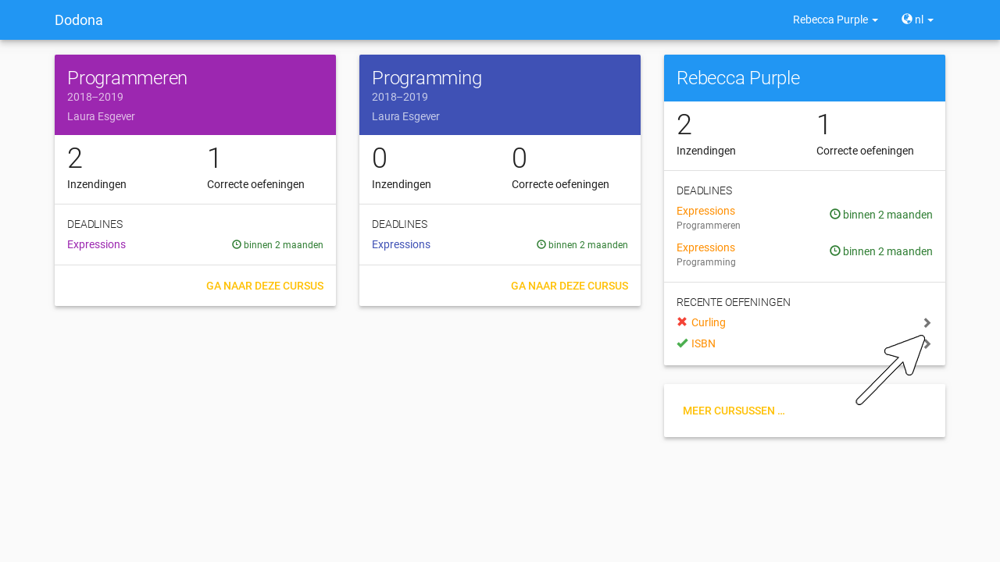
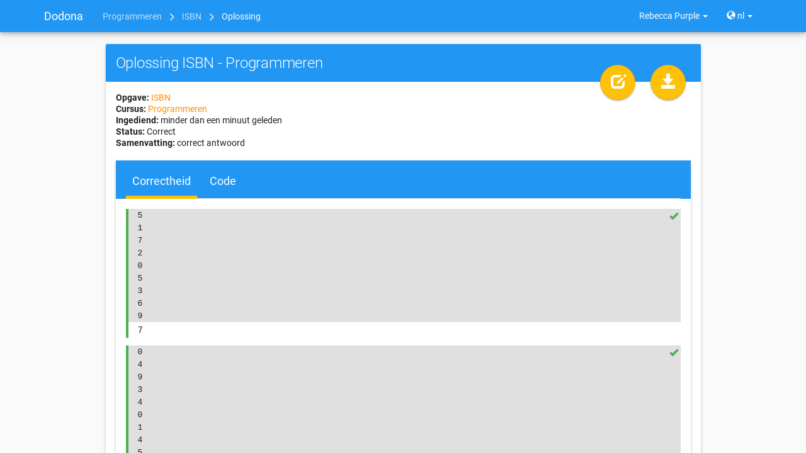
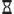
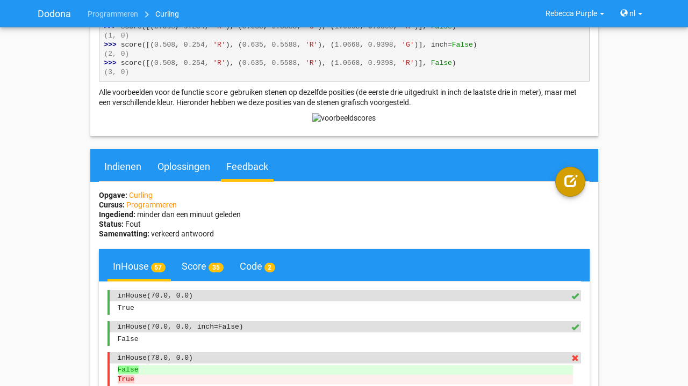

## Navigeren naar een oefening

Lesgevers kunnen **oefeningen** opstellen waarvoor je [oplossingen](#navigeren-naar-een-oplossing) kunt [indienen](#indienen-van-een-oplossing). Cursusbeheerders kunnen deze oefeningen aan hun [cursussen]() toevoegen. Daardoor zijn er verschillende plaatsen waar je een oefening kunt selecteren:

-   Op een [cursuspagina]() kan je een [oefening]() selecteren uit een [oefeningenreeks]() door op de naam van de oefening te drukken.

    

-   Het bovenste paneel in de rechterkolom van je [startpagina]() bevat een lijst RECENTE OEFENINGEN met maximaal vijf [oefeningen](#navigeren-naar-een-oefening) waar je het laatst [oplossingen](#navigeren-naar-een-oplossing) voor [ingediend]() hebt over alle cursussen heen. In de lijst zie je vóór elke oefening ook een [icoontje]() dat correspondeert met je [indienstatus]() voor de oefening. Selecteer een oefening uit de lijst door op de naam van de oefening te drukken. Op die manier kan je snel oefeningen selecteren waaraan je recent gewerkt hebt.

    

Na [selectie]() van een [oefening]() navigeer je naar de **oefeningpagina**. Bovenaan staat een paneel met de naam en de beschrijving van de oefening. De weergave van deze componenten is afhankelijk van de geselecteerde [taal](#selecteren-van-de-taal). Als bij het opstellen van de oefening een vertaling voorzien werd van de naam en de beschrijving in de geselecteerde taal, dan zullen deze componenten van de oefening ook in die taal weergegeven worden.

 oefening op Dodona.](./student.exercise_start.nl.png)

::: tip

Als je een actie aan het uitvoeren bent op een [oefening]() dan verschijnt de naam van de oefening naast Dodona aan de linkerkant van de [navigatiebalk](#selecteren-van-de-taal), eventueel voorafgegaan door de naam van de [cursus]() en de naam van de [oefeningenreeks]() waaruit je de oefening [geselecteerd]() hebt. Door in de navigatiebalk op de naam van de oefening te drukken, navigeer je naar de [oefeningpagina](). Door in de navigatiebalk op de naam van de oefeningenreeks te drukken, navigeer je naar de oefeningenreeks op de [cursuspagina](). Door in de navigatiebalk op de naam van de cursus te drukken, navigeer je naar de cursuspagina.

:::

::: tip

Dodona voorziet een verzorgde opmaak bij het afdrukken van een [oefeningpagina](). Daarbij worden sommige componenten die je in een browser te zien krijgt automatisch verborgen bij het afdrukken. Enkel de naam en de beschrijving van de [oefening]() worden afgedrukt.

Bovendien is het mogelijk dat bij het opstellen van de [oefening]() bepaalde componenten uit de beschrijving expliciet werden verboren in de afdrukbare versie (bijvoorbeeld interactieve componenten zoals afspeelbare videofragmenten) of dat er extra componenten aan de beschrijving werden toegevoegd die enkel zichtbaar zijn in de afdrukbare versie (bijvoorbeeld een statische afbeelding als alternatief voor een videofragment).
:::

## Indienen van een oplossing

Op een [oefeningpagina]() staat onder het paneel met de beschrijving van de [oefening]() een tweede paneel waarmee je een [oplossing]() kunt indienen voor de oefening. Druk hiervoor op de tab Indienen als deze tab niet geselecteerd was en plaats de broncode van je oplossing in de **code editor**. Druk daarna op de indienknop in de rechterbovenhoek van het paneel om je oplossing in te dienen.

::: tip

Voor het schrijven van software maken programmeurs gebruik van een geavanceerde ontwikkelingsomgeving: een zogenaamde [Integrated Development Environment](https://nl.wikipedia.org/wiki/Integrated_development_environment) (IDE). Voorbeelden hiervan zijn [PyCharm](https://www.jetbrains.com/pycharm/specials/pycharm/pycharm.html) voor [Python](https://www.python.org/) of [IntelliJ IDEA](https://www.jetbrains.com/idea/) voor [Java](https://java.com/). Let wel, het schrijven van programma\'s in dergelijke omgevingen moet evenwel nog altijd door een programmeur gebeuren. Alleen zijn er heel wat extra hulpmiddelen om het schrijven van broncode te ondersteunen en om administratie bij te houden die grote softwareprojecten met zich meebrengen.

Om een aantal belangrijke redenen **raden we ten stelligste af om rechtstreeks broncode te schrijven in de code editor van Dodona**. In plaats daarvan adviseren we om een IDE te gebruiken voor het schrijven, uitvoeren, testen en debuggen van broncode. Voer je broncode eerst uit op een aantal testgevallen om na te gaan dat ze geen grammaticale en logische fouten meer bevat. Gebruik daarvoor bijvoorbeeld de testgevallen die in de beschrijving van de oefening gegeven werden. Aangezien zelfs de meest doorgewinterde programmeur bijna nooit broncode schrijft die meteen kan uitgevoerd worden zonder fouten te produceren, bieden IDEs heel wat ondersteuning voor het debuggen van broncode. Leer werken met de debugger van je IDE om daarmee logische fouten in je broncode op te sporen en daaraan te remediëren.

Dien je broncode pas in op Dodona als je ervan overtuigd bent dat ze geen fouten meer bevat en als je ze wilt uittesten op een groter aantal testgevallen. Selecteer hiervoor de broncode in de code editor van je IDE, kopiëren ze naar het klembord en plak ze daarna in de code editor van Dodona. Op die manier leer je je programmeervaardigheden generiek in te zetten om andere programmeeropdrachten aan te pakken dan enkel de oefeningen uit Dodona.
:::

Na het [indienen](#indienen-van-een-oplossing) van een [oplossing]() wordt automatisch de tab Oplossingen geselecteerd. Deze tab bevat een overzicht van alle oplossingen die je in de [cursus]() hebt ingediend voor de [oefening](). Deze oplossingen worden in het overzicht opgelijst in omgekeerde chronologische volgorde (meest recente bovenaan), waardoor de oplossing die je net hebt ingediend helemaal bovenaan staat. Het overzicht bevat voor elke oplossing het [tijdstip]() van indienen, de [status]() en een korte [samenvatting]() van de [feedback](#interpreteren-van-feedback). In het overzicht zie je vóór elke oplossing ook een [icoontje]() dat correspondeert met de status van de oplossing.

Om overbelasting van het platform tegen te gaan, worden [oplossingen](#navigeren-naar-een-oplossing) niet onmiddellijk beoordeeld na het [indienen](#indienen-van-een-oplossing) maar worden ze eerst in een **wachtrij** geplaatst. Zolang een oplossing in de wachtrij staat heeft ze de [status]() In de wachtrij.... Van zodra het platform klaar is om een oplossing te beoordelen, wordt de eerst ingediende oplossing uit de wachtrij (*first-in-first-out*) geselecteerd en [beoordeeld]() door een [judge](#interpreteren-van-feedback). Tijdens het beoordelen heeft een oplossing de status Aan het uitvoeren....

::: details Notitie

Je kunt het [beoordelingsproces]() van een [oplossing]() niet annuleren. Terwijl een oplossing in de [wachtrij]() staat en terwijl de [judge](#interpreteren-van-feedback) bezig is om de oplossing te beoordelen, wordt de indienknop op de [oefeningpagina]() buiten werking gesteld en kan je geen nieuwe oplossing [indienen](#indienen-van-een-oplossing). Ook dit is een maatregel om overbelasting van het platform tegen te gaan. Nog een reden dus om te wachten met indienen tot je jezelf ervan vergewist hebt dat je oplossing geen fouten meer bevat.
:::

Zodra de [judge](#interpreteren-van-feedback) klaar is met het beoordelen van je [oplossing]() krijgt ze haar finale [status]() en wordt de [feedbackpagina]() met gedetailleerde [feedback](#interpreteren-van-feedback) over de oplossing automatisch weergegeven in een nieuwe tab Feedback.

::: tip

Er zit geen beperking op het aantal keer dat je een [oplossing]() kan [indienen](#indienen-van-een-oplossing) voor een [oefening](). Gebruik de [feedback](#interpreteren-van-feedback) die de [judge](#interpreteren-van-feedback) heeft aangeleverd om je oplossing te corrigeren of verder te verfijnen.
:::

## Navigeren naar een oplossing

Binnen een [cursus]() kun je **oplossingen** [indienen](#indienen-van-een-oplossing) voor de [oefeningen](#navigeren-naar-een-oefening) uit de cursus. Er zijn verschillende plaatsen waar je een **overzicht** kunt krijgen van je oplossingen:

-   Kies Mijn oplossingen in het [gebruikersmenu]() aan de rechterkant van de [navigatiebalk](#selecteren-van-de-taal) of druk op de statistiek Inzendingen in het paneel in de rechterkolom van je [startpagina]() voor een overzicht van al je [oplossingen](#navigeren-naar-een-oplossing).

    

-   Druk op de statistiek Inzendingen in het kaartje van een cursus op je [startpagina]() of op de [cursuspagina]() voor een overzicht van alle [oplossingen](#navigeren-naar-een-oplossing) die je binnen de [cursus]() hebt [ingediend]().

    

-   Selecteer de tab Oplossingen op een [oefeningpagina]() voor een overzicht van alle [oplossingen](#navigeren-naar-een-oplossing) die je hebt [ingediend]() voor de [oefening](). Als je de oefening [geselecteerd]() hebt binnen een [cursus](), dan is het overzicht bijkomend beperkt tot alle oplossingen die je binnen de cursus hebt ingediend.

    

-   Druk in een [oefeningenreeks]() op het groter dan symbool aan de rechterkant van een [oefening]() voor een overzicht van alle [oplossingen](#navigeren-naar-een-oplossing) die je binnen de [cursus]() hebt [ingediend]() voor de oefening.

    

Een [oplossingenoverzicht]() bevat voor elke [oplossing]() het [tijdstip]() van [indienen](#indienen-van-een-oplossing), de [status]() en een korte [samenvatting]() van de [feedback](#interpreteren-van-feedback). Vóór elke oplossing staat ook nog een [icoontje]() dat correspondeert met de [status]() van de oplossing. In het overzicht worden je oplossingen altijd opgelijst in omgekeerde chronologische volgorde (meest recente bovenaan).

Je kunt een [oplossing]() selecteren door in een [oplossingenoverzicht]() op het groter dan symbool te drukken aan rechterkant van de oplossing. Hierdoor navigeer je naar de **feedbackpagina** met de gedetailleerde [feedback](#interpreteren-van-feedback) over de oplossing.

## Interpreteren van feedback

Op de [feedbackpagina]() staat gedetailleerde **feedback** over een [oplossing]() die je [ingediend]() hebt voor een [oefening](). Zo snel mogelijk na het indienen wordt de oplossing automatisch beoordeeld door een **judge** die aan de oefening gekoppeld is. Als motivatie van zijn beoordeling voorziet de judge gedetailleerde feedback over de oplossing.

Aan de bovenkant van de [feedbackpagina]() staan de volgende gegevens over de [oplossing]():

Opgave

> De naam van de [oefening]() waarvoor de [oplossing]() werd [ingediend](). Druk op de naam om naar de [oefeningpagina]() te navigeren.

Cursus

De naam van de [cursus]() waarbinnen de [oplossing]() werd [ingediend](). Druk op de naam om naar de [cursuspagina]() te navigeren.

::: details Notitie
Dit informatieveld ontbreekt als de [oplossing]() niet binnen de context van een [cursus]() werd [ingediend]().
:::

Ingediend

Het **tijdstip** waarop de [oplossing]() werd [ingediend](). Dit tijdstip wordt op een gebruiksvriendelijke manier weergegeven, bijvoorbeeld ongeveer 2 uur geleden. Als je de muiswijzer boven het tijdstip plaatst dan krijg je de gedetailleerde weergave van het tijdstip te zien.

Status

De **status** die Dodona of de [judge](#interpreteren-van-feedback) aan de [oplossing]() heeft toegekend. Met elke status correspondeert een **icoontje** dat in elke oplijsting van de [oplossing]() wordt weergegeven. Statussen met zwarte of gele icoontjes worden door Dodona toegekend. Statussen met groene of rode icoontjes worden door de judge toegekend. Betekenis van de mogelijke statussen die aan de oplossing kunnen toegekend worden:

| status               | icoontje             | betekenis            |
|----------------------|----------------------|----------------------|
| In de wachtrij… |  | [oplossing]() staat in  de [wachtrij]() |
| Aan het uitvoeren... |  | [oplossing]() wordt momenteel beoordeeld door de [judge]() |
| Correct |  | [oplossing]() wordt momenteel beoordeeld door de [judge]() |
| Fout |  | logische fout opgeworpen tijdens het uitvoeren van minstens één test |
| Uitvoeringsfout |  | onverwachte fout opgeworpen tijdens het uitvoeren van minstens één test |
| Timeout |  | tijdslimiet vastgelegd voor de oefening werd overschreden tijdens het testen; kan wijzen op slechte performantie of een oneindige lus. |
| Geheugenfout |  | geheugenlimiet vastgelegd voor de [oefening]() werd overschreden tijdens het uitvoeren van minstens één test |
| Compilatiefout |  | [oplossing]() bevat grammaticale fouten |
| Interne fout |  | [judge]() is gecrashed tijdens het beoordelen van de [oplossing](); oorzaak van fout ligt dus niet bij de oplossing maar bij het falen van de judge |

Hoe lager de [status]() in bovenstaande tabel wordt opgelijst, hoe zwaarder het soort fout dat ermee correspondeert. Als de [judge](#interpreteren-van-feedback) bij het beoordelen van de [oplossing]() verschillende soorten fouten tegenkomt, dan staat het hem vrij te beslissen welke status hij aan de oplossing toekent. Raadpleeg de documentatie van de judge voor meer details over de specifieke procedure die hij gebruikt om de status van de oplossing te bepalen.

Samenvatting

> Korte motivering van de [judge](#interpreteren-van-feedback) bij de [status]() die hij aan de [oplossing]() heeft toegekend.

Daaronder staat meer gedetailleerde [feedback](#interpreteren-van-feedback) die de [judge](#interpreteren-van-feedback) kan uitgesplitst hebben over meerdere **tabs**. Naast de naam van een tab kan aan de rechterkant een **badge** staan met daarin een getal. Het getal geeft aan hoeveel fouten de judge gevonden heeft bij het uitvoeren van de testen waarover hij rapporteert onder de tab. Het staat de judge vrij om te beslissen of en op welke manier deze fouten geteld worden. Raadpleeg de documentatie van de judge voor meer details over de specifieke procedure die hij gebruikt om de waarde voor de badge te bepalen.

De laatste [tab]() heeft altijd de naam Code en bevat de broncode van de [oplossing](). Op bepaalde plaatsen in de broncode kan de [judge](#interpreteren-van-feedback) opmerkingen toegevoegd hebben (bijvoorbeeld over de programmeerstijl) die ook kunnen motiveren waarom hij een bepaalde [status]() aan de oplossing toegekend heeft.

::: tip

In de tab Code op de [feedbackpagina]() kan je de broncode van de [oplossing]() niet wijzigen. Als je op de broncode drukt dan wordt die volledig geselecteerd. Kopieer de broncode naar het klembord en plak die in je IDE. Als alternatief kan je op de downloadknop drukken in de rechterbovenhoek van de [feedbackpagina](). Daarmee download je een bestand met de broncode dat je dan kan openen in je IDE. In je IDE kan je de broncode bewerken en daarna eventueel opnieuw [indienen](#indienen-van-een-oplossing).

Als alternatief kan je ook op de bewerkknop drukken in de rechterbovenhoek van de [feedbackpagina]() om te navigeren naar de [oefening]() waarvoor de [oplossing]() werd [ingediend](). De broncode van de oplossing werd daarbij ingevoegd in de [code]() aan de onderkant van de [oefeningpagina](). Daar kan je de broncode bewerken en daarna eventueel opnieuw indienen.
:::

Onder een [tab]() rapporteert de [judge](#interpreteren-van-feedback) over individuele **testen** waaraan hij de broncode onderworpen heeft. Daarbij worden gerelateerde testen gegroepeerd in een **testgeval** en worden testgevallen die van elkaar afhankelijk zijn gegroepeerd in een **context**.

Visueel worden alle [testgevallen]() van een [context]() met elkaar verbonden via een dunne vertikale lijn aan de linkerkant. De kleur van die lijn geeft aan of de [judge](#interpreteren-van-feedback) de volledige context beoordeelt als geslaagd (groene lijn) of als niet geslaagd (rode lijn).

Aan de rechterkant van de dunne vertikale lijn worden de [testgevallen]() van de [context]() onder elkaar weergegeven. De beschrijving van een testgeval wordt weergegeven binnen een rechthoek met lichtgrijze achtergrondkleur die over de volledige breedte loopt. In de rechterbovenhoek van die rechthoek staat een gekleurd symbool dat aangeeft of de [judge](#interpreteren-van-feedback) het volledige testgeval beoordeelt als geslaagd (groen vinkje) of als niet geslaagd (rood kruisje).

Als de [judge](#interpreteren-van-feedback) binnen een [testgeval]() rapporteert over individuele [testen](), dan worden die opgelijst onder de rechthoek met lichtgrijze achtergrond waarin de beschrijving van het testgeval staat. Om visueel onderscheid te maken met de weergave van het testgeval, wordt elke test weergegeven met een kleine marge links en rechts. De weergave van een test bestaat zelf uit de volgende optionele componenten die onder elkaar worden weergegeven:

-   Een beschrijving van de uitgevoerde [test](). Deze beschrijving wordt weergegeven binnen een rechthoek met dezelfde lichtgrijze achtergrondkleur als bij de beschrijving van een testgeval.

-   Een tekstuele vergelijking tussen een verwachte waarde en een waarde die gegenereerd werd aan de hand van de oplossing. Als minstens één van beide waarden uit meerdere regels bestaat, dan worden de overeenkomstige regels tegenover elkaar uitgelijnd. Identieke overeenkomstige regels worden weergegeven met een transparante achtergrondkleur. Als overeenkomstige regels van elkaar verschillen dan worden ze weergegeven met een lichtgekleurde achtergrondkleur (groen voor de verwachte waarde en rood voor de gegenereerde waarde). Individuele karakters die verschillen binnen overeenkomstige regels worden weergegeven met een donkerder achtergrondkleur (groen voor de verwachte waarde en rood voor de gegenereerde waarde).

- Algemene feedback over de uitgevoerde [test](). Voor deze feedback heeft de [judge](#interpreteren-van-feedback) alle vrijheid wat betreft de vormgeving, waardoor hij zowel tekstuele als grafische feedback kan aanleveren.

De [judge](#interpreteren-van-feedback) kan niet enkel algemene [feedback](#interpreteren-van-feedback) geven over individuele [testen](), maar ook over individuele [testgevallen](), individuele [contexten]() en de volledige [oplossing](). De algemene feedback over de volledige oplossing staat aan de bovenkant van de [feedbackpagina](), tussen de gegevens van de oplossing en de tabs. De algemene feedback over een tab staat boven de weergave van de contexten onder de tab. De algemene feedback over een context staat onder de weergave van de testgevallen van de context. De algemene feedback over een testgeval staat onder de weergave van de testen van het testgeval.
